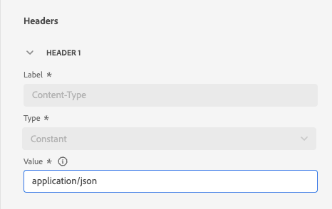
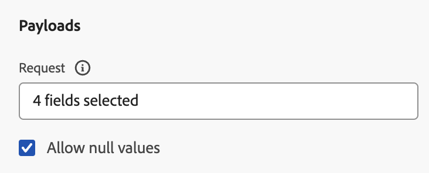

# 사용자 정의 액션 구성 {#configure-a-custom-action}

>[!CONTEXTUALHELP]
>id="ajo_journey_action_custom_configuration"
>title="사용자 정의 액션"
>abstract="서드파티 시스템을 사용하여 메시지를 보내거나 서드파티 시스템으로 API 호출을 보내려는 경우, 사용자 정의 액션을 사용하여 여정에 대한 연결을 구성합니다. 예를 들어 사용자 정의 액션으로 Epsilon, Slack, [Adobe Developer](https://developer.adobe.com), Firebase 등의 시스템에 연결할 수 있습니다."

서드파티 시스템을 사용하여 메시지를 보내거나 서드파티 시스템으로 API 호출을 보내려는 경우, 사용자 정의 액션을 사용하여 여정에 대한 연결을 구성합니다. 예를 들어 사용자 지정 작업으로 Epsilon, Slack, [Adobe Developer](https://developer.adobe.com){target="_blank"}, Firebase 등의 시스템에 연결할 수 있습니다.

사용자 지정 작업은 기술 사용자가 정의하고 마케터가 사용할 수 있는 추가 작업입니다. 구성하고 나면 여정 왼쪽 팔레트의 **[!UICONTROL Action]** 카테고리에 표시됩니다. [이 페이지](../building-journeys/about-journey-activities.md#action-activities)에서 자세히 알아보십시오.

## 제한 사항{#custom-actions-limitations}

사용자 지정 작업에는 [이 페이지](../start/guardrails.md)에 나열된 몇 가지 제한 사항이 있습니다.

사용자 지정 작업 매개 변수에서 간단한 컬렉션과 개체 컬렉션을 전달할 수 있습니다. [이 페이지](../building-journeys/collections.md#limitations)의 컬렉션 제한에 대해 자세히 알아보세요.

또한 사용자 지정 작업 매개 변수에는 예상 형식(예: 문자열, 십진수 등)이 있습니다. 이러한 예상 형식을 준수하도록 주의해야 합니다. 이 [사용 사례](../building-journeys/collections.md)에서 자세히 알아보세요.

사용자 지정 작업은 [요청](../action/about-custom-action-configuration.md#define-the-message-parameters) 또는 [응답 페이로드](../action/action-response.md)를 사용하는 경우에만 JSON 형식을 지원합니다.

## 모범 사례{#custom-action-enhancements-best-practices}

사용자 정의 작업을 사용하여 타깃팅할 엔드포인트를 선택할 때 다음을 확인하십시오.

* 이 엔트포인트는 제한하는 [Throttling API](../configuration/throttling.md) 또는 [Capping API](../configuration/capping.md)의 구성을 사용하여 여정의 처리량을 지원할 수 있습니다. 스로틀링 구성은 200TPS 미만일 수 없습니다. 타겟팅된 모든 엔드포인트는 최소 200개의 TPS를 지원해야 합니다.
* 이 엔드포인트는 가능한 한 낮은 응답 시간을 가져야 합니다. 예상 처리량에 따라 응답 시간이 길면 실제 처리량에 영향을 줄 수 있습니다.

모든 사용자 지정 작업에 대해 1분 동안 30만 번의 최대 호출 제한이 정의됩니다. 또한 기본 캡핑은 호스트 및 샌드박스 별로 수행됩니다. 예를 들어 한 샌드박스에서 동일한 호스트를 사용하는 두 개의 엔드포인트가 있는 경우(예: `https://www.adobe.com/endpoint1` 및 `https://www.adobe.com/endpoint2`) 상한 설정은 adobe.com 호스트 아래의 모든 엔드포인트에 대해 적용됩니다. &quot;endpoint1&quot;과 &quot;endpoint2&quot;는 동일한 최대 가용량 구성을 공유하며 한 끝점이 한도에 도달하면 다른 끝점에 영향을 줍니다.

이 제한은 사용자 정의 작업으로 타깃팅된 외부 끝점을 보호하기 위해 고객 사용량을 기준으로 설정되었습니다. 대상자 기반 여정에서 이를 고려하여 적절한 읽기 속도(사용자 정의 작업 사용 시 프로필 5,000개/초)를 정의해야 합니다. 필요한 경우 Capping/Throttling API를 통해 상한 설정 또는 스로틀링 제한을 보다 크게 정의하는 방법으로 이 설정을 재정의할 수 있습니다. [이 페이지](../configuration/external-systems.md)를 참조하십시오.

다음과 같은 다양한 이유로 사용자 지정 작업으로 공개 끝점을 타깃팅해서는 안 됩니다.

* 적절한 제한 또는 제한이 없으면 이러한 볼륨을 지원하지 않을 수 있는 공개 끝점에 너무 많은 호출을 보낼 위험이 있습니다.
* 프로필 데이터는 사용자 지정 작업을 통해 전송될 수 있으므로 공개 엔드포인트를 타겟팅하면 의도치 않게 외부적으로 개인 정보를 공유할 수 있습니다.
* 공개 끝점에서 반환되는 데이터에 대해 제어할 수 없습니다. 엔드포인트가 API를 변경하거나 잘못된 정보를 보내기 시작하는 경우 전송된 통신에서 사용할 수 있게 되고 부정적인 영향이 발생할 수 있습니다.

## 동의 및 데이터 거버넌스 {#privacy}

Journey Optimizer에서는 데이터 거버넌스 및 동의 정책을 사용자 지정 작업에 적용하여 특정 필드가 서드파티 시스템으로 내보내지지 않도록 하거나 이메일, 푸시 또는 SMS 통신 수신에 동의하지 않은 고객을 제외할 수 있습니다. 자세한 내용은 다음 페이지를 참조하십시오.

* [데이터 거버넌스](../action/action-privacy.md)
* [동의](../action/action-privacy.md).

## 구성 단계 {#configuration-steps}

사용자 지정 작업을 구성하는 데 필요한 주요 단계는 다음과 같습니다.

1. 관리 메뉴 섹션에서 **[!UICONTROL 구성]**&#x200B;을 선택합니다. **[!UICONTROL 작업]** 섹션에서 **[!UICONTROL 관리]**&#x200B;를 클릭합니다. 새 작업을 만들려면 **[!UICONTROL 작업 만들기]**&#x200B;를 클릭하십시오. 작업 구성 창이 화면 오른쪽에 열립니다.

   

1. 작업 이름을 입력합니다.

   >[!NOTE]
   >
   >영숫자와 밑줄만 허용됩니다. 최대 길이는 30자입니다.

1. 작업에 설명을 추가합니다. 데이터 소스에 이벤트에 설명을 추가합니다.
1. 이 작업을 사용하는 여정 수는 **[!UICONTROL 다음 항목에서 사용됨]** 필드에 표시됩니다. **[!UICONTROL 여정 보기]** 단추를 클릭하여 이 동작을 사용하여 여정 목록을 표시할 수 있습니다.
1. 다른 **[!UICONTROL URL 구성]** 매개 변수를 정의하십시오. [이 페이지](../action/about-custom-action-configuration.md#url-configuration)를 참조하십시오.
1. **[!UICONTROL 인증]** 섹션을 구성합니다. 이 구성은 데이터 소스의 경우와 동일합니다.  [이 섹션](../datasource/external-data-sources.md#custom-authentication-mode)을 참조하십시오.
1. **[!UICONTROL 작업 매개 변수]**&#x200B;을(를) 정의합니다. [이 페이지](../action/about-custom-action-configuration.md#define-the-message-parameters)를 참조하십시오.
1. **[!UICONTROL 저장]**&#x200B;을 클릭합니다.

   이제 사용자 지정 작업이 구성되었으며 여정에서 사용할 준비가 되었습니다. [이 페이지](../building-journeys/about-journey-activities.md#action-activities)를 참조하십시오.

   >[!NOTE]
   >
   >여정에서 사용자 지정 작업을 사용하는 경우 대부분의 매개 변수는 읽기 전용입니다. **[!UICONTROL 이름]**, **[!UICONTROL 설명]**, **[!UICONTROL URL]** 필드 및 **[!UICONTROL 인증]** 섹션만 수정할 수 있습니다.

## 끝점 구성 {#url-configuration}

사용자 지정 작업을 구성할 때 다음 **[!UICONTROL 끝점 구성]** 매개 변수를 정의해야 합니다.

{width="70%" align="left"}

1. **[!UICONTROL URL]** 필드에 외부 서비스의 URL을 지정하십시오.

   * URL이 정적인 경우 이 필드에 URL을 입력합니다.

   * URL에 동적 경로가 포함된 경우 URL의 정적 부분, 즉 체계, 호스트, 포트 및 경로의 정적 부분(선택 사항)만 입력합니다.

     예: `https://xxx.yyy.com/somethingstatic/`

     사용자 지정 작업을 여정에 추가할 때 URL의 동적 경로를 지정합니다. [자세히 알아보기](../building-journeys/using-custom-actions.md).

   >[!NOTE]
   >
   >보안상의 이유로 URL에 HTTPS 스키마를 사용하는 것이 좋습니다. 공개되지 않은 Adobe 주소 및 IP 주소의 사용은 허용되지 않습니다.
   >
   >사용자 지정 작업을 정의할 때 기본 포트만 허용됩니다. http의 경우 80, https의 경우 443.

1. 호출 **[!UICONTROL 메서드]**&#x200B;을(를) 선택하십시오. **[!UICONTROL POST]**, **[!UICONTROL GET]** 또는 **[!UICONTROL PUT]**&#x200B;일 수 있습니다.

   >[!NOTE]
   >
   > **DELETE** 메서드가 지원되지 않습니다. 기존 리소스를 업데이트하려면 **PUT** 메서드를 선택하십시오.

1. 헤더 및 쿼리 매개 변수를 정의합니다.

   * **[!UICONTROL 헤더]** 섹션에서 **[!UICONTROL 헤더 필드 추가]**&#x200B;를 클릭하여 외부 서비스로 보낼 요청 메시지의 HTTP 헤더를 정의합니다. **[!UICONTROL Content-Type]** 및 **[!UICONTROL Charset]** 헤더 필드는 기본적으로 설정됩니다. 이러한 필드는 삭제할 수 없습니다. **[!UICONTROL 콘텐츠 형식]** 헤더만 수정할 수 있습니다. 해당 값은 JSON 형식을 준수해야 합니다. 기본값은 다음과 같습니다.

   

   * **[!UICONTROL 쿼리 매개 변수]** 섹션에서 **[!UICONTROL 쿼리 매개 변수 필드 추가]**&#x200B;를 클릭하여 URL에 추가할 매개 변수를 정의합니다.

   

1. 필드의 레이블 또는 이름을 입력합니다.

1. **[!UICONTROL 상수]** 또는 **[!UICONTROL 변수]** 형식을 선택하십시오. **[!UICONTROL 상수]**&#x200B;를 선택한 경우 **[!UICONTROL 값]** 필드에 상수 값을 입력하십시오. **[!UICONTROL 변수]**&#x200B;을(를) 선택한 경우 여정에 사용자 지정 작업을 추가할 때 이 변수를 지정합니다. [자세히 알아보기](../building-journeys/using-custom-actions.md).

   

   >[!NOTE]
   >
   >여정에 사용자 지정 작업을 추가한 후에도 여정이 초안 상태인 경우 헤더 또는 쿼리 매개 변수 필드를 추가할 수 있습니다. 여정이 구성 변경의 영향을 받지 않도록 하려면 사용자 지정 작업을 복제하고 필드를 새 사용자 지정 작업에 추가합니다.
   >
   >헤더는 필드 구문 분석 규칙에 따라 유효성이 검사됩니다. 자세한 내용은 [이 설명서](https://tools.ietf.org/html/rfc7230#section-3.2.4){_blank}를 참조하세요.

## mTLS 프로토콜 지원 {#mtls-protocol-support}

mTLS(상호 전송 계층 보안)를 사용하여 Adobe Journey Optimizer 사용자 지정 작업에 대한 아웃바운드 연결에서 보안을 강화할 수 있습니다. mTLS는 상호 인증을 위한 종단간 보안 방법으로, 정보를 공유하는 양 당사자가 데이터를 공유하기 전에 자신이 주장하는 사람임을 보장합니다. mTLS에는 TLS와 비교하여 추가 단계가 포함되어 있으며, 이 단계에서 서버는 클라이언트의 인증서를 요청하고 마지막에 검증한다.

사용자 지정 작업에서 상호 TLS(mTLS) 인증이 지원됩니다. mTLS를 활성화하기 위해 사용자 정의 작업 또는 여정에 구성을 추가할 필요는 없습니다. mTLS 활성화 엔드포인트가 감지되면 자동으로 활성화됩니다. [자세히 알아보기](https://experienceleague.adobe.com/en/docs/experience-platform/landing/governance-privacy-security/encryption#mtls-protocol-support).

## 페이로드 매개 변수 정의 {#define-the-message-parameters}

다음과 같이 페이로드 매개 변수를 정의할 수 있습니다.

1. **[!UICONTROL 요청]** 섹션에 외부 서비스로 전송할 JSON 페이로드의 예제를 붙여 넣으십시오. 이 필드는 선택 사항이며 POST 및 PUT 호출 메서드에만 사용할 수 있습니다.

   외부 호출에서 Null 값을 유지하려면 **[!UICONTROL NULL 값 허용]** 옵션을 활성화하십시오. int, string 등의 배열을 전송하는 것을 참고하십시오. 내의 Null 값이 있는 은(는) 완전히 지원되지 않습니다. 예를 들어, 다음 정수 배열 `[1, null, 2, 3]`은(는) 이 옵션이 선택된 경우에도 `[1, 2, 3]`(으)로 전송됩니다. 또한 이러한 배열이 null이면 빈 배열로 전송됩니다.

   {width="70%" align="left"}

1. **[!UICONTROL 응답]** 섹션에 호출에서 반환된 페이로드의 예제를 붙여 넣습니다. 이 필드는 선택 사항이며 모든 호출 방법에서 사용할 수 있습니다. 사용자 지정 작업에서 API 호출 응답을 활용하는 방법에 대한 자세한 내용은 [이 페이지](../action/action-response.md)를 참조하세요.

>[!NOTE]
>
>페이로드의 필드 이름은 점 `.`자를 포함할 수 없으며 `$`자로 시작할 수도 없습니다.
>

필드 구성에서 다음을 수행해야 합니다.

* 매개 변수 유형(예: string, integer 등)을 선택합니다.

* 상수 또는 변수 매개 변수를 정의합니다.

   * **상수**&#x200B;는 매개 변수의 값이 기술적 성향에 따라 작업 구성 창에 정의되어 있음을 의미합니다. 값은 여정 간에 항상 동일합니다. 여정에서 사용자 지정 작업을 사용할 때 변경되지 않고 마케터가 볼 수 없습니다. 예를 들어 서드파티 시스템에서 예상하는 ID일 수 있습니다. 이 경우 상수 값은 상수/변수 토글 오른쪽에 있는 필드로 설정됩니다.

   * **변수**&#x200B;은(는) 매개 변수의 값이 달라질 수 있음을 의미합니다. 여정에서 이 사용자 지정 작업을 사용하는 마케터는 원하는 값을 전달하거나 이 매개 변수에 대한 값을 검색할 위치를 지정할 수 있습니다(예: 이벤트에서, Adobe Experience Platform에서 등). 이 경우 전환 상수/변수 오른쪽의 필드는 마케터가 여정에서 이 매개 변수의 이름을 지정하는 레이블입니다.

  선택적 매개 변수의 경우 줄 끝에 **[!UICONTROL Is optional]** 옵션을 사용하도록 설정하십시오. 이 옵션을 선택하면 매개 변수를 필수가 아닌 것으로 표시하고 여정 관리자가 여정에서 해당 사용자 지정 작업을 작성할 때 해당 매개 변수를 채우거나 채우지 않도록 선택할 수 있습니다.

>[!NOTE]
>
>Null 값을 허용하면서 선택적 매개 변수를 구성하면 여정 실무자가 입력하지 않은 매개 변수가 Null로 전송됩니다.
>