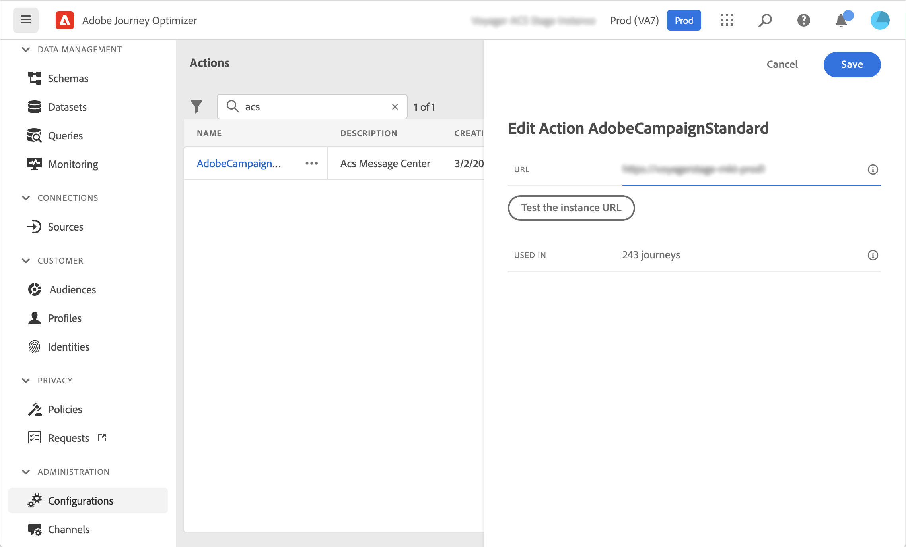
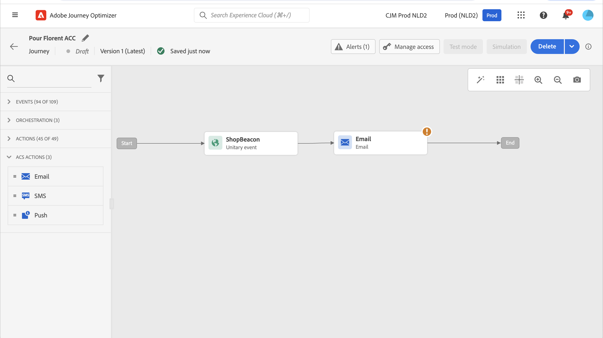

# Adobe Campaign Standard 통합 {#using_adobe_campaign_standard}

Adobe Campaign Standard의 트랜잭션 메시지 기능을 사용하여 이메일, 푸시 알림 및 SMS를 전송할 수 있습니다.

Adobe Campaign Standard이 있는 경우 Adobe Campaign Standard에 연결할 수 있는 기본 제공 작업을 사용할 수 있습니다.

Journey Optimizer에서 사용하려면 Campaign Standard 트랜잭션 메시지와 관련 이벤트를 게시해야 합니다. 이벤트가 게시되었지만 메시지는 게시되지 않은 경우 Journey Optimizer 인터페이스에 표시되지 않습니다. 메시지가 게시되었지만 연결된 이벤트가 게시되지 않은 경우 Journey Optimizer 인터페이스에 표시되지만 사용할 수 없습니다.

## 중요 정보 {#important-notes}

* Adobe Campaign Standard 작업에 대해 5분당 4000회의 최대 가용량 규칙이 자동으로 정의됩니다. 이는 Adobe Campaign Standard 트랜잭션 메시지의 공식 규모에 해당합니다. 트랜잭션 메시지 SLA에 대해 자세히 알아보기 [Adobe Campaign Standard 제품 설명](https://helpx.adobe.com/kr/legal/product-descriptions/campaign-standard.html).

* Adobe Campaign Standard 통합은 작업 목록에서 전용 기본 제공 작업을 통해 설정됩니다. 각 샌드박스에 대해 구성해야 합니다.

* 대상 자격 또는 대상 읽기 활동에는 Campaign Standard 작업을 사용할 수 없습니다.

* 여정은 메시지와 Campaign Standard 작업을 모두 사용할 수 없습니다.

## 작업 구성 {#configure-action}

이를 구성하는 단계는 다음과 같습니다.

1. 선택 **[!UICONTROL 구성]** 관리 메뉴 섹션에 있는 마지막 항목이 될 필요가 없습니다. 다음에서  **[!UICONTROL 작업]** 섹션, 클릭 **[!UICONTROL 관리]**. 작업 목록이 표시됩니다.

1. 기본 제공 선택 **[!UICONTROL AdobeCampaignStandard]** 작업. 작업 구성 창이 화면 오른쪽에 열립니다.

   

1. Adobe Campaign Standard 인스턴스 URL을 복사하여 **[!UICONTROL URL]** 필드.

1. 다음을 클릭합니다. **[!UICONTROL 인스턴스 URL 테스트]** 인스턴스의 유효성을 테스트합니다.

   >[!NOTE]
   >
   >이 테스트는 다음을 확인합니다.
   >
   >호스트는 &quot;.campaign.adobe.com&quot;, &quot;.campaign-sandbox.adobe.com&quot;, &quot;.campaign-demo.adobe.com&quot;, &quot;.ats.adobe.com&quot; 또는 &quot;.adls.adobe.com&quot;입니다.
   >
   >URL은 https로 시작합니다.
   >
   >이 Adobe Campaign Standard의 인스턴스와 연결된 조직이 Journey Optimizer 조직과 동일합니다.

여정을 디자인할 때에서 세 가지 작업을 사용할 수 있습니다. **[!UICONTROL 작업]** 범주: **[!UICONTROL 이메일]**, **[!UICONTROL 푸시]**, **[!UICONTROL SMS]** (참조 [Adobe Campaign 작업 사용](../building-journeys/using-adobe-campaign-standard.md)).

다음을 사용할 수 있습니다. **반응** 동일한 여정 내에서 전송된 Campaign Standard 메시지와 관련된 추적 데이터에 반응할 이벤트입니다. 푸시 알림의 경우 클릭, 전송 또는 실패한 메시지에 반응할 수 있습니다. SMS 메시지의 경우, 전송 또는 실패한 메시지에 반응할 수 있습니다. 이메일의 경우 클릭, 전송, 열림 또는 실패한 메시지에 반응할 수 있습니다. 다음을 참조하십시오 [반응 이벤트](../building-journeys/reaction-events.md).

서드파티 시스템을 사용하여 메시지를 전송하는 경우 사용자 지정 작업을 추가하고 구성해야 합니다. 다음을 참조하십시오 [사용자 지정 작업 구성 정보](../action/about-custom-action-configuration.md).