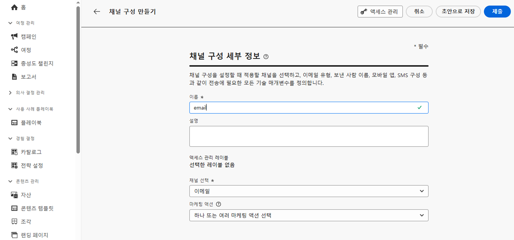

# 데이터 거버넌스 {#restrict-fields}

>[!CONTEXTUALHELP]
>id="ajo_data_governance_policy_violation"
>title="데이터 거버넌스 정책 위반"
>abstract="시스템이 여정/캠페인 또는 사용자 정의 작업에서 제한된 필드를 식별하면 이를 게시하지 못하게 하는 오류가 표시됩니다. 이 대화 상자의 데이터 계보 다이어그램을 사용하면 여정 또는 캠페인을 활성화하기 전에 수행해야 하는 다른 구성 변경 작업이 무엇인지 파악할 수 있습니다."

## 데이터 거버넌스 정책 시작 {#gs}

Adobe Experience Platform은 [DULE(데이터 사용 레이블 및 적용) 거버넌스](https://experienceleague.adobe.com/docs/experience-platform/data-governance/home.html?lang=ko){target="_blank"} 프레임워크를 사용하여 **필드에 레이블을 지정하고** 각 채널에 대해 **마케팅 작업**&#x200B;을 만들어 채널 전반에서 데이터 거버넌스 정책을 관리하고 적용할 수 있습니다.

레이블 및 마케팅 액션이 정의되면 이 두 요소를 연결하는 **데이터 거버넌스 정책**&#x200B;을 만들 수 있습니다. 예를 들어 &#39;ePHI&#39; 레이블을 &#39;이메일 타기팅&#39; 마케팅 액션과 연결하여 &#39;ePHI&#39;로 레이블이 지정된 필드가 이메일 메시지를 개인화하는 데 사용되지 않도록 하는 정책을 설정할 수 있습니다. [데이터 거버넌스 정책을 만드는 방법 알아보기](#governance-policies)

거버넌스 정책을 만든 후에는 마케팅 액션을 여정/캠페인 및 여정 사용자 정의 액션에 적용할 수 있습니다.
[Journey Optimizer에서 마케팅 액션을 적용하는 방법 알아보기](#apply-marketing-actions)

여정 또는 캠페인을 작성할 때 채널 구성을 선택하거나 사용자 정의 액션을 추가한 후 시스템은 메시지 채널 구성 내의 마케팅 액션 또는 사용자 정의 액션이 데이터 거버넌스 정책의 일부인지 확인합니다. 그럴 경우 시스템은 타기팅된 대상자 또는 메시지 개인화의 모든 필드 중 정책에 의해 레이블이 지정되고 제한되는 것이 있는지 여부를 확인합니다. 이런 레이블이 감지되면 여정 또는 캠페인 게시가 차단됩니다. [데이터 거버넌스 정책 위반을 감지하는 방법 알아보기](#violation)

## 레이블 및 마케팅 액션 만들기 {#labels-marketing-actions}

데이터 거버넌스 정책을 적용하는 첫 번째 단계는 레이블을 만들어 사용을 제한할 필드에 부착하고, 각 채널별 마케팅 액션을 만드는 것입니다.

1. 왼쪽 메뉴에서 **개인 정보 보호** 아래의 **정책**&#x200B;을 클릭합니다.

1. **레이블** 탭을 선택하고 **레이블 만들기**&#x200B;를 클릭합니다. 

1. 레이블의 이름과 친숙한 이름을 정합니다. 예를 들어 _ePHI1_&#x200B;입니다.

1. 왼쪽 메뉴에서 **데이터 관리** 아래의 **스키마 작업**&#x200B;을 클릭하고, **액세스 및 데이터 거버넌스 레이블 적용** 버튼을 클릭합니다. 스키마와 필드(예: ‘혈액형’)를 선택하고 이전에 만든 레이블을 선택합니다. 이 예제에서는 _ePHI1_&#x200B;입니다.

   

1. **정책** 메뉴로 돌아가서, **마케팅 액션** 탭을 선택하고 **마케팅 액션 만들기**&#x200B;를 클릭합니다. 마케팅 액션을 여정에 사용되는 각 채널마다, 각 서드파티 사용자 정의 액션마다 하나씩 만드는 것이 좋습니다. 예를 들어 Slack 사용자 지정 액션에 사용될 _Slack 마케팅 액션_&#x200B;을 만들어 보겠습니다.

   

## 데이터 거버넌스 정책 만들기 {#policy}

이제 레이블 및 마케팅 액션을 만들었으므로 데이터 거버넌스 정책에 연결할 수 있습니다. 이렇게 하려면 **찾아보기** 탭을 선택하고 **정책 만들기**&#x200B;를 클릭한 뒤 **데이터 거버넌스 정책**&#x200B;을 선택합니다. 레이블(_ePHI1_) 및 마케팅 작업(_Slack 마케팅 작업_)을 선택합니다.

여정에서 _Slack 마케팅 작업_&#x200B;으로 구성된 Slack 사용자 지정 작업을 사용할 때는 관련 정책이 활용됩니다.

## Journey Optimizer에서 마케팅 액션 적용 {#apply-marketing-actions}

Journey Optimizer에서 데이터 거버넌스 정책을 적용하려면 여정, 캠페인 또는 사용자 정의 액션에 마케팅 액션을 적용해야 합니다.

### 여정 및 캠페인에 마케팅 액션 적용 {#journeys-campaigns}

거버넌스 정책을 만든 후에는 Journey Optimizer **채널 구성** 내에서 관련 마케팅 액션을 적용해야 합니다. 이렇게 하려면 다음 단계를 수행합니다.

1. **[!UICONTROL 채널]** > **[!UICONTROL 일반 설정]** > **[!UICONTROL 채널 구성]** 메뉴에 액세스합니다.

1. 기존 채널 구성을 열거나 새 채널 구성을 만듭니다.

1. **[!UICONTROL 마케팅 액션]** 필드에서 이 구성을 사용하여 여정/캠페인에 연결할 마케팅 액션을 선택합니다. 마케팅 액션과 연결된 모든 동의 및 데이터 거버넌스 정책을 활용하여 고객이 선택한 동의 설정과 중요한 필드에 대해 설정된 제한 사항을 준수합니다. [자세히 알아보기](../action/consent.md#surface-marketing-actions)

   

1. 채널 구성 설정을 완료한 다음 저장합니다. [채널 구성을 설정하는 방법을 알아봅니다](../configuration/channel-surfaces.md).

1. 여정 또는 캠페인에서 메시지를 만들 때 관련 채널 구성을 선택합니다. 여정 또는 캠페인의 구성을 완료하고 저장합니다.

여정 또는 캠페인을 활성화하기 전에 시스템은 선택한 채널 구성의 마케팅 액션이 데이터 거버넌스 정책의 일부인지 확인합니다. 그럴 경우 시스템은 타기팅된 대상자 또는 메시지 개인화의 모든 필드 중 정책에 의해 레이블이 지정되고 제한되는 것이 있는지 여부를 확인합니다.

시스템이 제한 대상 필드를 확인하면 여정 또는 캠페인을 게시할 수 없도록 오류가 표시됩니다. [거버넌스 정책 위반을 감지하는 방법 알아보기](#violation)

{zoomable="yes"}

*여정 및 캠페인에 대한 정책 위반 분석 단계*

### 사용자 정의 액션에 마케팅 액션 적용 {#custom-actions}

>[!NOTE]
>
>Campaign v7/v8 및 Campaign Standard 여정 액션은 지원되지 않습니다.

사용자 정의 액션을 사용하여 서드파티로 내보내는 것을 제한해야 하는 혈액형 필드의 예를 살펴보겠습니다. 이렇게 하려면 마케팅 액션을 사용자 정의 액션에 적용한 다음 여정을 작성하고 그 안에 사용자 정의 액션을 추가해야 합니다.

1. 왼쪽 메뉴의 **관리** 아래에서 **구성**&#x200B;을 클릭하고 **액션**&#x200B;을 선택합니다.

1. Slack 사용자 지정 작업을 엽니다. 사용자 지정 작업을 구성할 때 데이터 거버넌스에 두 개의 필드를 사용할 수 있습니다.

   

   * **채널** 필드에서는 이 사용자 정의 액션과 관련된 채널을 선택할 수 있습니다. 그렇게 하면 **필수 마케팅 액션** 필드에 선택한 채널에 대한 기본 마케팅 액션을 미리 채웁니다. **기타**&#x200B;를 선택하는 경우 기본적으로 마케팅 작업이 정의되지 않습니다. 이 예제에서는 **기타** 채널을 선택합니다.

   * **필수 마케팅 작업**&#x200B;으로 사용자 지정 작업과 관련된 마케팅 작업을 정의할 수 있습니다. 예를 들어 해당 사용자 지정 작업을 사용하여 서드파티를 사용한 이메일을 보내는 경우 **이메일 타겟팅**&#x200B;을 선택할 수 있습니다. 이 예제에서는 _Slack 마케팅 작업_&#x200B;을 선택합니다. 해당 마케팅 작업과 관련된 거버넌스 정책이 검색 및 활용됩니다.

   사용자 지정 작업을 구성하는 다른 단계는 [이 섹션](../action/about-custom-action-configuration.md#consent-management)에 자세히 설명되어 있습니다.

1. 왼쪽 메뉴에서 **여정 관리** 아래의 **여정**&#x200B;을 클릭합니다.

1. 여정을 만들고 사용자 정의 액션을 추가합니다. 여정에서 사용자 지정 작업을 추가할 때 데이터 거버넌스를 관리할 수 있는 몇 가지 옵션을 제공합니다. **읽기 전용 필드 표시**&#x200B;를 눌러 모든 매개 변수를 표시합니다.

   

   * 사용자 지정 작업을 구성할 때 정의된 **채널** 및 **필수 마케팅 작업**&#x200B;이 화면 맨 위에 표시됩니다. 이러한 필드는 수정할 수 없습니다.

   * 사용자 지정 작업의 유형을 설정하여 **추가 마케팅 작업**&#x200B;을 정의할 수 있습니다. 이를 통해 이 여정에서 사용자 지정 작업의 목적을 정의할 수 있습니다. 일반적으로 채널에만 해당되는 필수 마케팅 작업 외에도 이 특정 여정에서 사용자 지정 작업에 해당하는 추가 마케팅 작업을 정의할 수 있습니다. 예를 들어 운동 관련 커뮤니케이션, 뉴스레터, 피트니스 커뮤니케이션 등이 있습니다. 필수 마케팅 액션과 추가 마케팅 액션이 모두 적용됩니다. 이 예제에서는 추가 마케팅 액션을 사용하지 않습니다.

필드 중 하나인 _ePHI1_(이 예제의 혈액형 필드)이 액션 매개 변수에서 감지되어 오류가 표시되므로 여정을 게시할 수 없습니다. [거버넌스 정책 위반을 감지하는 방법 알아보기](#violation)

{zoomable="yes"}

*여정 사용자 정의 액션에 대한 정책 위반 분석 단계*

## 정책 위반 감지 {#violation}

시스템이 여정/캠페인 또는 사용자 정의 액션에서 제한된 필드를 확인하면 이를 게시하지 못하게 하는 오류가 표시됩니다.

오류는 **[!UICONTROL 경고]** 버튼에서 확인할 수 있습니다. 발생한 데이터 거버넌스 정책 위반에 대한 자세한 정보를 표시하려면 오류를 클릭합니다.

이 대화 상자에는 현재 여정/캠페인 구성이 기존 데이터 거버넌스 정책을 위반한다는 메시지가 표시됩니다. 데이터 계보 다이어그램을 사용하여 여정이나 캠페인을 활성화하기 전에 어떤 다른 구성을 변경해야 하는지 이해할 수 있습니다.

자세한 내용은 [데이터 사용 정책 위반 설명서](https://experienceleague.adobe.com/ko/docs/experience-platform/data-governance/enforcement/auto-enforcement#data-usage-violation){_blank}에서 확인할 수 있습니다.
