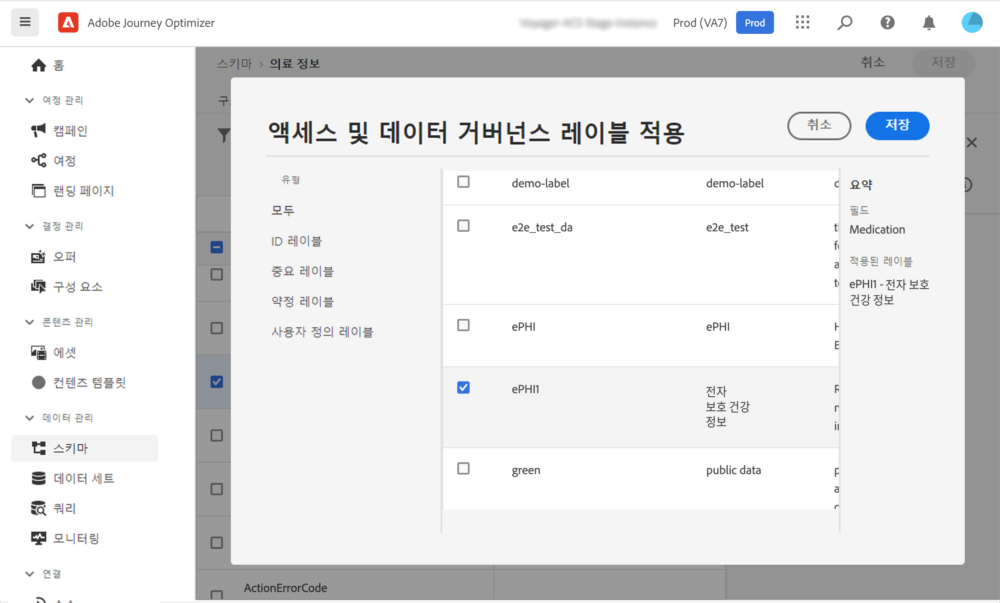
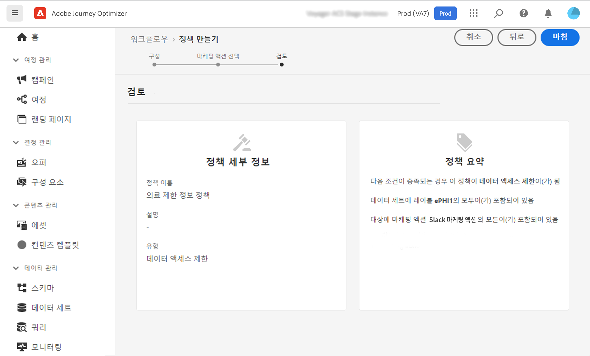

# 데이터 거버넌스 {#restrict-fields}

>[!IMPORTANT]
>
>DULE(Data Usage Labeling and Enforcement) 사용은 현재 선택한 고객에게만 제한되며, 향후 릴리스의 모든 환경에 배포됩니다.

DULE(Data Usage Labeling and Enforcement) 거버넌스 프레임워크를 사용하면 이제 Journey Optimizer를 Adobe Experience Platform 거버넌스 정책을 활용하여 사용자 지정 작업을 통해 중요한 필드를 타사 시스템으로 내보낼 수 있습니다. 시스템이 사용자 지정 작업 매개 변수에서 제한된 필드를 식별하면 오류가 표시되므로 여정을 게시할 수 없습니다.

Adobe Experience Platform을 사용하면 필드에 레이블을 지정하고 각 채널에 대한 마케팅 작업을 만들 수 있습니다. 그런 다음 레이블 및 마케팅 작업에 연결된 거버넌스 정책을 정의합니다.

Journey Optimizer에서 사용자 지정 작업에 이러한 정책을 적용하여 특정 필드를 타사 시스템으로 내보낼 수 있습니다.

Data Governance 프레임워크 및 레이블 및 정책 사용 방법에 대한 자세한 내용은 Adobe Experience Platform 설명서를 참조하십시오.

* [데이터 거버넌스 서비스 개요](https://experienceleague.adobe.com/docs/experience-platform/data-governance/home.html)
* [데이터 사용 레이블 개요](https://experienceleague.adobe.com/docs/experience-platform/data-governance/labels/overview.html?lang=en)
* [데이터 사용 정책](https://experienceleague.adobe.com/docs/experience-platform/data-governance/policies/overview.html)

## 중요 정보 {#important-notes}

* 데이터 거버넌스는 여정의 사용자 지정 작업에만 적용됩니다. Campaign Classic 및 Campaign Standard 작업은 지원되지 않습니다.
* 거버넌스 정책은 마케팅 작업(필수 또는 추가)이 사용자 지정 작업 수준에서 설정된 경우에만 적용됩니다.
* 기본 결합 스키마를 사용하는 필드 그룹에 속하는 속성은 지원되지 않습니다. 이러한 속성은 인터페이스에서 숨겨집니다. 다른 스키마를 사용하여 다른 필드 그룹을 만들어야 합니다.

## 거버넌스 정책 정의 {#governance-policies}

기존 레이블, 마케팅 작업 및 정책을 사용할 수 있습니다. 새 구성 단계를 만드는 주요 구성 단계는 다음과 같습니다.

* 레이블을 추가하고 제3자 시스템으로 내보내지 않으려는 특정 필드(예: 사람의 혈액 유형)에 적용합니다.
* 여정에서 사용되는 각 타사 사용자 지정 작업에 대한 마케팅 작업을 정의합니다.
* 거버넌스 정책을 만들고 레이블 및 마케팅 작업에 연결합니다.

정책 관리 방법에 대한 자세한 내용은 다음을 참조하십시오 [설명서](https://experienceleague.adobe.com/docs/experience-platform/data-governance/policies/user-guide.html?lang=en#consent-policy)

중요한 것으로 레이블을 지정하고 제3자로 내보낼 수 없도록 제한해야 하는 혈액 유형 필드의 예를 살펴보겠습니다. 다음은 여러 단계입니다.

1. 왼쪽 메뉴에서 **개인 정보 보호**&#x200B;를 클릭합니다. **정책**.
   
1. 을(를) 선택합니다 **레이블** 탭을 클릭하고 **레이블 만들기**.
   
1. 이 레이블의 이름과 친숙한 이름을 정의합니다. 예, _ePHI1_.
   
1. 왼쪽 메뉴에서 **데이터 관리**&#x200B;를 클릭합니다. **스키마**&#x200B;를 클릭하고 를 클릭한 다음 **액세스 및 데이터 거버넌스 레이블 적용** 버튼을 클릭합니다. 스키마와 필드(혈액 유형)를 선택하고 이전에 만든 레이블을 선택합니다. _ePHI1_ 이 예제에서는 입니다.
   
1. 로 돌아갑니다. **정책** 메뉴에서 **마케팅 작업** 탭을 클릭하고 **마케팅 작업 만들기**. 여정에 사용되는 각 타사 사용자 지정 작업에 대해 하나의 마케팅 작업을 만드는 것이 좋습니다. 예를 들어 _Slack 마케팅 작업_ Slack 사용자 지정 작업에 사용됩니다.
   
1. 을(를) 선택합니다 **찾아보기** 탭, **정책 만들기** 을(를) 선택합니다. **데이터 거버넌스 정책**. 레이블을 선택합니다(_ePHI1_) 및 마케팅 작업( )_Slack 마케팅 작업_).
   

여정에서 을 사용할 때는 _Slack 마케팅 작업_&#x200B;를 지정하면 관련 정책이 활용됩니다.

## 사용자 지정 작업 구성 {#consent-custom-action}

왼쪽 메뉴에서 **관리**&#x200B;를 클릭합니다. **구성** 을(를) 선택합니다. **작업**. Slack 사용자 지정 작업을 엽니다. 사용자 지정 작업을 구성할 때 데이터 거버넌스에 두 개의 필드를 사용할 수 있습니다.

* 다음 **채널** 필드에서는 이 사용자 지정 작업과 관련된 채널을 선택할 수 있습니다. **이메일**, **SMS**, 또는 **푸시 알림**. 이 파일은 **필수 마케팅 작업** 선택한 채널에 대한 기본 마케팅 작업이 있는 필드입니다. 선택하는 경우 **기타**&#x200B;기본적으로 마케팅 작업이 정의되지 않습니다. 이 예제에서는 채널을 선택합니다 **기타**.

* 다음 **필수 마케팅 작업** 사용자 지정 작업과 관련된 마케팅 작업을 정의할 수 있습니다. 예를 들어 해당 사용자 지정 작업을 사용하여 타사를 사용하여 이메일을 보내는 경우 **이메일 타겟팅**. 이 예제에서는 을(를) 선택합니다 _Slack 마케팅 작업_. 해당 마케팅 작업과 관련된 거버넌스 정책이 검색 및 활용됩니다.

사용자 지정 작업을 구성하는 다른 단계는 [이 섹션](../action/about-custom-action-configuration.md#consent-management).

## 여정 구축 {#consent-journey}

왼쪽 메뉴에서 **여정 관리**&#x200B;를 클릭합니다. **여정**. 여정을 만들고 사용자 지정 작업을 추가합니다.  여정에서 사용자 지정 작업을 추가할 때 데이터 거버넌스를 관리할 수 있는 몇 가지 옵션을 제공합니다. 을(를) 클릭합니다. **읽기 전용 필드 표시** 를 눌러 모든 매개 변수를 표시합니다.

다음 **채널** 및 **필수 마케팅 작업**&#x200B;사용자 지정 작업을 구성할 때 정의된 가 화면 맨 위에 표시됩니다. 이러한 필드는 수정할 수 없습니다.

을(를) 정의할 수 있습니다 **추가 마케팅 작업** 를 클릭하여 사용자 지정 작업의 유형을 설정합니다. 이를 통해 이 여정에서 사용자 지정 작업의 목적을 정의할 수 있습니다. 일반적으로 채널에만 해당되는 필수 마케팅 작업 외에도 이 특정 여정의 사용자 지정 작업에 해당하는 추가 마케팅 작업을 정의할 수 있습니다. 예: 운동 통신, 뉴스레터, 피트니스 커뮤니케이션 등 필요한 마케팅 작업과 추가 마케팅 작업이 모두 적용됩니다.

이 예제에서는 추가 마케팅 작업을 사용하지 않습니다.

필드 중 하나에서 _ePHI1_ (이 예제의 혈액형 필드)가 작업 매개 변수에서 검색되고 오류가 표시되므로 여정을 게시할 수 없습니다.

여정에서 사용자 지정 작업을 구성하는 다른 단계는 [이 섹션](../building-journeys/using-custom-actions.md).
