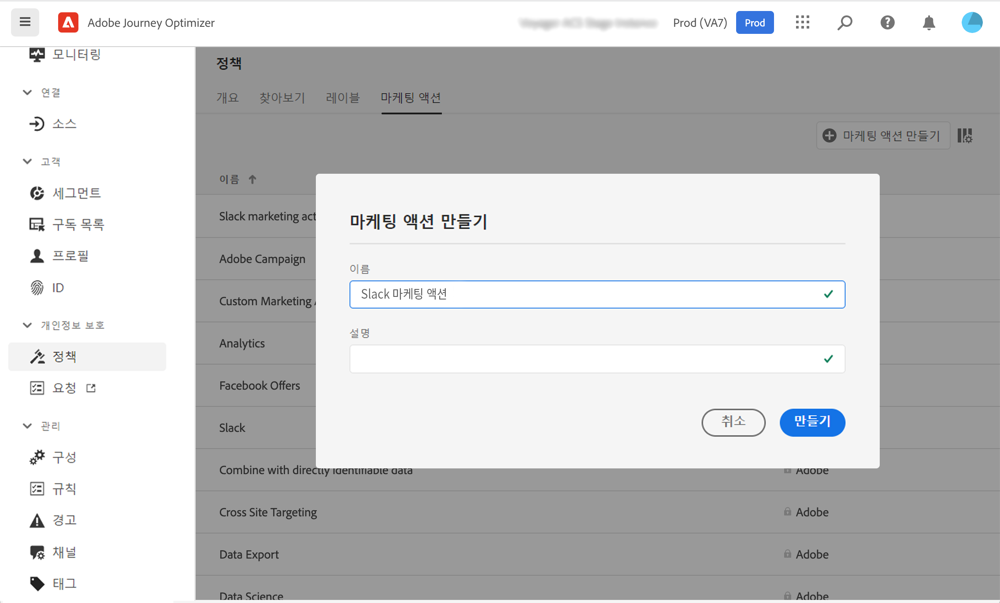
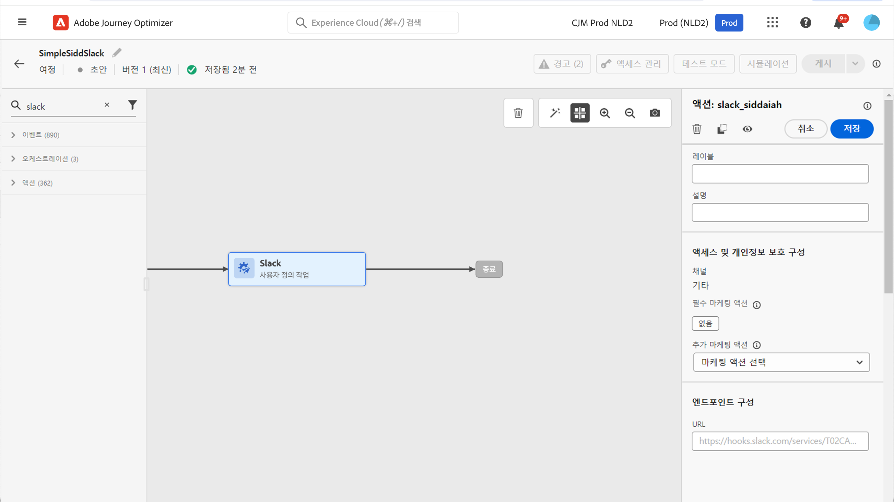

# 데이터 거버넌스 {#restrict-fields}

>[!IMPORTANT]
>
>DULE(데이터 사용 레이블 및 적용) 사용은 현재 선택한 고객으로 제한되며, 향후 릴리스의 모든 환경에 배포될 예정입니다.

DULE(데이터 사용 레이블 및 적용) 거버넌스 프레임워크를 사용하여 Journey Optimizer는 이제 Adobe Experience Platform 거버넌스 정책을 활용하여 사용자 지정 작업을 통해 중요한 필드를 타사 시스템으로 내보내지는 것을 방지할 수 있습니다. 시스템이 사용자 지정 작업 매개 변수에서 제한된 필드를 식별하면 여정을 게시하지 못하게 하는 오류가 표시됩니다.

Adobe Experience Platform을 사용하면 필드에 레이블을 지정하고 각 채널에 대한 마케팅 작업을 만들 수 있습니다. 그런 다음 레이블 및 마케팅 작업에 연결된 거버넌스 정책을 정의합니다.

Journey Optimizer에서 이러한 정책을 사용자 지정 작업에 적용하여 특정 필드가 서드파티 시스템으로 유출되는 것을 막을 수 있습니다.

데이터 거버넌스 프레임워크, 그리고 레이블 및 정책으로 작동하는 방법에 대한 자세한 내용은 Adobe Experience Platform 설명서를 참조하십시오.

* [데이터 거버넌스 서비스 개요](https://experienceleague.adobe.com/docs/experience-platform/data-governance/home.html?lang=ko)
* [데이터 사용 레이블 개요](https://experienceleague.adobe.com/docs/experience-platform/data-governance/labels/overview.html?lang=ko)
* [데이터 사용 정책](https://experienceleague.adobe.com/docs/experience-platform/data-governance/policies/overview.html?lang=ko)

## 중요 정보 {#important-notes}

* 데이터 거버넌스는 여정의 사용자 지정 작업에만 적용됩니다. Campaign v7/v8 및 Campaign Standard 액션은 지원되지 않습니다.
* 거버넌스 정책은 마케팅 작업(필수 또는 추가)이 사용자 지정 작업 수준에서 설정된 경우에만 적용됩니다.

## 거버넌스 정책 정의 {#governance-policies}

기존 레이블, 마케팅 작업 및 정책을 사용할 수 있습니다. 새 구성 단계를 만드는 주요 구성 단계는 다음과 같습니다.

* 레이블을 추가하고 서드파티 시스템으로 내보내지 않으려는 특정 필드(예: 사람의 혈액 유형)에 적용합니다.
* 여정에 사용되는 각 서드파티 사용자 지정 작업에 대한 마케팅 작업을 정의합니다.
* 거버넌스 정책을 만들고 레이블 및 마케팅 작업에 연결합니다.

정책을 관리하는 방법에 대한 자세한 내용은 이 [설명서](https://experienceleague.adobe.com/docs/experience-platform/data-governance/policies/user-guide.html?lang=ko#consent-policy)를 참조하십시오

민감한 데이터로 레이블을 지정하고 서드파티에 유출되지 않도록 제한해야 하는 혈액형 필드의 예를 살펴보겠습니다. 다른 단계는 다음과 같습니다.

1. 왼쪽 메뉴에서 **개인 정보 보호** 아래의 **정책**&#x200B;을 클릭합니다.
1. **레이블** 탭을 선택하고 **레이블 만들기**를 클릭합니다. 
   
1. 이 레이블의 이름과 친숙한 이름을 정의합니다. 예를 들어 _ePHI1_&#x200B;입니다.
1. 왼쪽 메뉴에서 **데이터 관리** 아래의 **스키마 작업**&#x200B;을 클릭하고, **액세스 및 데이터 거버넌스 레이블 적용** 버튼을 클릭합니다. 스키마와 필드(혈액형)를 선택하고 이전에 만든 레이블을 선택합니다. 이 예제에서는 _ePHI1_입니다.
   
1. **정책** 메뉴로 돌아가서, **마케팅 작업** 탭을 선택하고 **마케팅 작업 만들기**&#x200B;를 클릭합니다. 여정에 사용되는 각 서드파티 사용자 지정 작업에 대해 하나의 마케팅 작업을 만드는 것이 좋습니다. 예를 들어 Slack 사용자 지정 작업에 사용될 _Slack 마케팅 작업_을 만들어 보겠습니다.
   
1. **찾아보기** 탭을 선택하고 **정책 만들기**&#x200B;를 클릭, **데이터 거버넌스 정책**&#x200B;을 선택합니다. 레이블(_ePHI1_) 및 마케팅 작업(_Slack 마케팅 작업_)을 선택합니다.
   

여정에서 _Slack 마케팅 작업_&#x200B;으로 구성된 Slack 사용자 지정 작업을 사용할 때는 관련 정책이 활용됩니다.

## 사용자 지정 작업 구성 {#consent-custom-action}

왼쪽 메뉴에서 **관리** 아래의 **구성**&#x200B;을 클릭하고 **작업**&#x200B;을 선택합니다. Slack 사용자 지정 작업을 엽니다. 사용자 지정 작업을 구성할 때 데이터 거버넌스에 두 개의 필드를 사용할 수 있습니다.

* **채널** 필드에서는 다음 사용자 지정 작업과 관련된 채널 즉, **이메일**, **SMS**, 또는 **푸시 알림**&#x200B;을 선택할 수 있습니다. **필수 마케팅 작업** 필드에 선택한 채널에 대한 기본 마케팅 작업을 미리 채웁니다. **기타**&#x200B;를 선택하는 경우 기본적으로 마케팅 작업이 정의되지 않습니다. 이 예제에서는 **기타** 채널을 선택합니다.

* **필수 마케팅 작업**&#x200B;으로 사용자 지정 작업과 관련된 마케팅 작업을 정의할 수 있습니다. 예를 들어 해당 사용자 지정 작업을 사용하여 서드파티를 사용한 이메일을 보내는 경우 **이메일 타겟팅**&#x200B;을 선택할 수 있습니다. 이 예제에서는 _Slack 마케팅 작업_&#x200B;을 선택합니다. 해당 마케팅 작업과 관련된 거버넌스 정책이 검색 및 활용됩니다.

사용자 지정 작업을 구성하는 다른 단계는 [이 섹션](../action/about-custom-action-configuration.md#consent-management)에 자세히 설명되어 있습니다.

## 여정 만들기 {#consent-journey}

왼쪽 메뉴에서 **여정 관리** 아래의 **여정**&#x200B;을 클릭합니다. 여정을 만들고 사용자 지정 작업을 추가합니다.  여정에서 사용자 지정 작업을 추가할 때 데이터 거버넌스를 관리할 수 있는 몇 가지 옵션을 제공합니다. **읽기 전용 필드 표시**&#x200B;를 눌러 모든 매개 변수를 표시합니다.

사용자 지정 작업을 구성할 때 정의된 **채널** 및 **필수 마케팅 작업**&#x200B;이 화면 맨 위에 표시됩니다. 이러한 필드는 수정할 수 없습니다.

사용자 지정 작업의 유형을 설정하여 **추가 마케팅 작업**&#x200B;을 정의할 수 있습니다. 이를 통해 이 여정에서 사용자 지정 작업의 목적을 정의할 수 있습니다. 일반적으로 채널에만 해당되는 필수 마케팅 작업 외에도 이 특정 여정에서 사용자 지정 작업에 해당하는 추가 마케팅 작업을 정의할 수 있습니다. 예를 들어 운동 관련 커뮤니케이션, 뉴스레터, 피트니스 커뮤니케이션 등이 있습니다. 필수 마케팅 작업과 추가 마케팅 작업이 모두 적용됩니다.

이 예제에서는 추가 마케팅 작업을 사용하지 않습니다.

필드 중 하나에서 _ePHI1_(이 예제의 혈액 유형 필드)은 작업 매개 변수에서 검색되고 오류가 표시되므로 여정을 게시할 수 없습니다.

여정에서 사용자 지정 작업을 구성하는 다른 단계는 [이 섹션](../building-journeys/using-custom-actions.md)에 자세히 설명되어 있습니다.