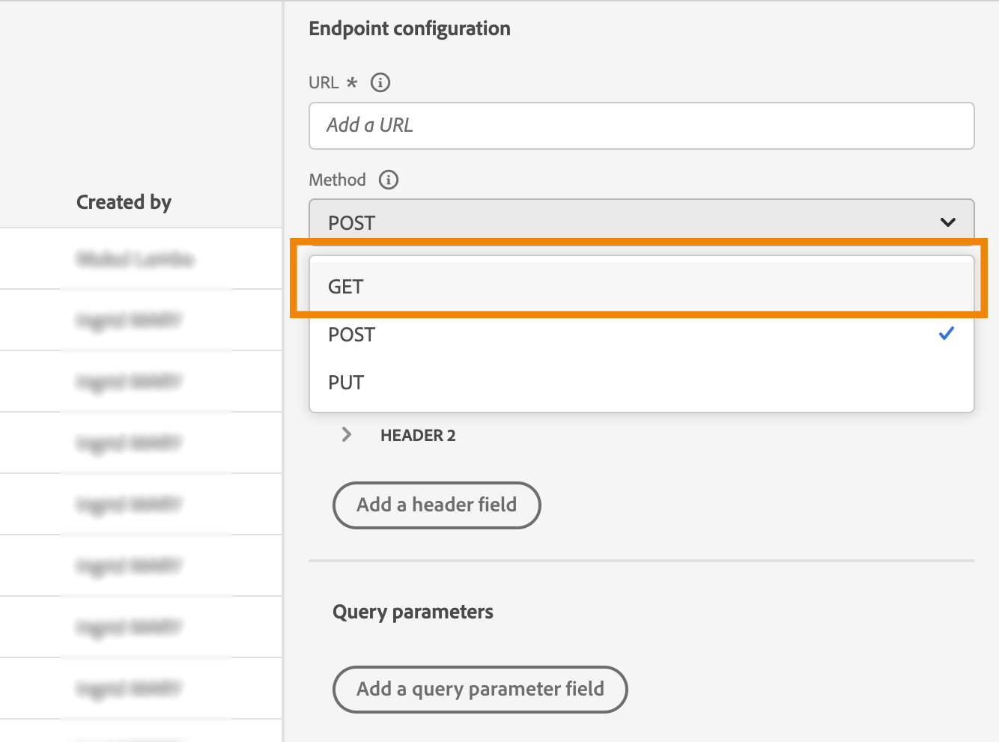

# 사용자 지정 작업 개선 사항

이제 사용자 지정 작업에서 API 호출 응답을 활용하고, 이러한 응답을 기반으로 여정을 오케스트레이션할 수 있습니다.

이 기능은 데이터 소스를 사용할 때만 사용할 수 있습니다. 이제 사용자 지정 작업에 사용할 수 있습니다.

>[!AVAILABILITY]
>
>이 기능은 현재 개인 베타로 사용할 수 있습니다.

## 사용자 지정 작업 정의

사용자 지정 작업을 정의할 때 GET 메서드 및 새 페이로드 응답 필드의 추가와 같이 두 가지 향상된 기능을 사용할 수 있습니다. 다른 옵션과 매개 변수는 변경되지 않습니다. [이 페이지](../action/about-custom-action-configuration.md)를 참조하십시오.

### 끝점 구성

다음 **URL 구성** 섹션의 이름이 변경되었습니다. **끝점 구성**.

다음에서 **방법** 드롭다운에서 이제 다음을 선택할 수 있습니다. **GET**.

{width="70%" align="left"}

### 페이로드

다음 **작업 매개 변수** 섹션의 이름이 변경되었습니다. **페이로드**. 두 가지 필드를 사용할 수 있습니다.

* 다음 **요청** 필드: 이 필드는 POST 및 PUT 호출 메서드에만 사용할 수 있습니다.
* 다음 **응답** 필드: 새로운 기능입니다. 이 필드는 모든 호출 메서드에 사용할 수 있습니다.

>[!NOTE]
> 
>이 두 필드는 모두 선택 사항입니다.

{width="70%" align="left"}

1. 내부를 클릭합니다. **응답** 필드.

   {width="80%" align="left"}

1. 호출에서 반환된 페이로드의 예제를 붙여넣습니다. 필드 유형(문자열, 정수 등)이 올바른지 확인합니다.

   {width="80%" align="left"}

1. **저장**&#x200B;을 클릭합니다.

API를 호출할 때마다 시스템은 페이로드 예제에 포함된 모든 필드를 검색합니다. 을(를) 클릭할 수 있습니다 **새 페이로드 붙여넣기** 현재 전달된 페이로드를 변경하려는 경우.

다음은 날씨 API 서비스 호출 동안 캡처된 응답 페이로드의 예입니다.

```
{
    "coord": {
        "lon": 2.3488,
        "lat": 48.8534
    },
    "weather": [
        {
            "id": 800,
            "main": "Clear",
            "description": "clear sky",
            "icon": "01d"
        }
    ],
    "base": "stations",
    "main": {
        "temp": 29.78,
        "feels_like": 29.78,
        "temp_min": 29.92,
        "temp_max": 30.43,
        "pressure": 1016,
        "humidity": 31
    },
    "visibility": 10000,
    "wind": {
        "speed": 5.66,
        "deg": 70
    },
    "clouds": {
        "all": 0
    },
    "dt": 1686066467,
    "sys": {
        "type": 1,
        "id": 6550,
        "country": "FR",
        "sunrise": 1686023350,
        "sunset": 1686080973
    },
    "timezone": 7200,
    "id": 2988507,
    "name": "Paris",
    "cod": 200
}
```

## 여정에서 응답 활용

여정에 사용자 지정 작업을 추가하기만 하면 됩니다. 그런 다음 조건, 기타 작업 및 메시지 개인화의 응답 페이로드 필드를 활용할 수 있습니다.

### 조건 및 작업

예를 들어 풍속을 확인하는 조건을 추가할 수 있다. 서핑 숍에 들어갈 때 날씨가 너무 바람이 많이 불면 푸시를 보낼 수 있습니다.


조건에서 고급 편집기를 사용하여 아래 작업 응답 필드를 활용해야 합니다 **컨텍스트** 노드.


다음을 활용할 수도 있습니다. **jo_status** 오류 발생 시 새 경로를 만드는 코드.


>[!WARNING]
>
>새로 만든 사용자 지정 작업에만 이 필드가 기본적으로 포함됩니다. 기존 사용자 지정 작업에 사용하려면 작업을 업데이트해야 합니다. 예를 들어 설명을 업데이트하고 저장할 수 있습니다.

다음은 이 필드에 사용할 수 있는 값입니다.

* http 상태 코드: 예 **http_200** 또는 **http_400**
* 시간 초과 오류: **시간 초과**
* 최대 가용량 오류: **제한됨**
* 내부 오류: **internalError**

여정 활동에 대한 자세한 내용은 [이 섹션](../building-journeys/about-journey-activities.md).

### 메시지 개인화

응답 필드를 사용하여 메시지를 개인화할 수 있습니다. 이 예제에서 푸시 알림은 속도 값을 사용하여 콘텐츠를 개인화합니다.


>[!NOTE]
>
>호출은 주어진 여정에서 프로필당 한 번만 수행됩니다. 동일한 프로필에 대한 여러 메시지가 새 호출을 트리거하지 않습니다.

메시지 개인화에 대한 자세한 내용은 [이 섹션](../personalization/personalize.md).

## 표현식 구문

구문은 다음과 같습니다.

```json
#@action{myAction.myField} 
```

다음은 몇 가지 예입니다.

```json
// action response field
@action{<action name>.<path to the field>}
@action{OpenWeatherMap.main.temp}
```

```json
// action response field
@action{<action name>.<path to the field>, defaultValue: <default value expression>}
@action{OpenWeatherMap.main.temp, defaultValue: 273.15}
@action{OpenWeatherMap.main.temp, defaultValue: @{myEvent.temperature}} 
```

필드 참조에 대한 자세한 내용은 [이 섹션](../building-journeys/expression/field-references.md).
