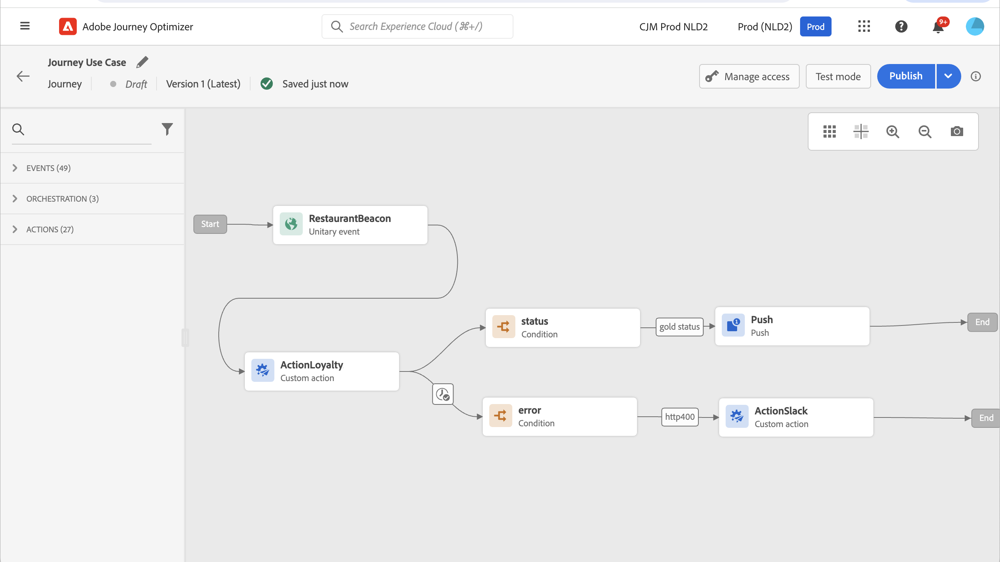

# 사용자 지정 작업 개선 사항 {#custom-action-enhancements}

이제 사용자 지정 작업에서 API 호출 응답을 활용하고, 이러한 응답을 기반으로 여정을 오케스트레이션할 수 있습니다.

이 기능은 이전에는 데이터 소스를 사용할 때만 사용할 수 있었습니다. 이제 사용자 지정 작업에 사용할 수 있습니다.

>[!AVAILABILITY]
>
>이 기능은 현재 개인 베타로 사용할 수 있습니다.

>[!WARNING]
>
>사용자 지정 작업은 전용 또는 내부 끝점에서만 사용해야 하며 적절한 제한 또는 제한 제한과 함께 사용해야 합니다. [이 페이지](../configuration/external-systems.md)를 참조하십시오.

## 사용자 지정 작업 정의 {#define-custom-action}

사용자 지정 작업을 정의할 때 GET 메서드 및 새 페이로드 응답 필드의 추가와 같이 두 가지 향상된 기능을 사용할 수 있습니다. 다른 옵션과 매개 변수는 변경되지 않습니다. [이 페이지](../action/about-custom-action-configuration.md)를 참조하십시오.

### 끝점 구성 {#endpoint-configuration}

다음 **URL 구성** 섹션의 이름이 변경되었습니다. **끝점 구성**.

다음에서 **방법** 드롭다운에서 이제 다음을 선택할 수 있습니다. **GET**.

{width="70%" align="left"}

### 페이로드 {#payloads-new}

다음 **작업 매개 변수** 섹션의 이름이 변경되었습니다. **페이로드**. 두 가지 필드를 사용할 수 있습니다.

* 다음 **요청** 필드: 이 필드는 POST 및 PUT 호출 메서드에만 사용할 수 있습니다.
* 다음 **응답** 필드: 새로운 기능입니다. 이 필드는 모든 호출 메서드에 사용할 수 있습니다.

>[!NOTE]
> 
>이 두 필드는 모두 선택 사항입니다.

{width="70%" align="left"}

1. 내부를 클릭합니다. **응답** 필드.

   {width="80%" align="left"}

1. 호출에서 반환된 페이로드의 예제를 붙여넣습니다. 필드 유형(문자열, 정수 등)이 올바른지 확인합니다. 다음은 호출 동안 캡처된 응답 페이로드의 예입니다. 로컬 엔드포인트는 충성도 포인트 수 및 프로필 상태를 전송합니다.

   ```
   {
   "customerID" : "xY12hye",    
   "status":"gold",
   "points": 1290 }
   ```

   {width="80%" align="left"}

   API를 호출할 때마다 시스템은 페이로드 예제에 포함된 모든 필드를 검색합니다.

1. customerID를 쿼리 매개 변수로도 추가하겠습니다.

   {width="80%" align="left"}

1. **저장**&#x200B;을 클릭합니다.

## 여정에서 응답 활용 {#response-in-journey}

여정에 사용자 지정 작업을 추가하기만 하면 됩니다. 그런 다음 조건, 기타 작업 및 메시지 개인화의 응답 페이로드 필드를 활용할 수 있습니다.

예를 들어 충성도 포인트의 수를 확인하는 조건을 추가할 수 있습니다. 사용자가 레스토랑에 들어오면 로컬 종단점이 프로필의 충성도 정보와 함께 호출을 보냅니다. 프로필이 Gold 고객인 경우 푸시를 보낼 수 있습니다. 또한 호출에서 오류가 감지되면 시스템 관리자에게 알리는 사용자 지정 작업을 보내십시오.


1. 이전에 만든 이벤트와 충성도 사용자 지정 작업을 추가합니다.

1. 충성도 사용자 지정 작업에서 고객 ID 쿼리 매개 변수를 프로필 ID에 매핑합니다. 옵션을 선택합니다. **시간 초과 또는 오류 발생 시 대체 경로 추가**.

   

1. 첫 번째 분기에서 조건을 추가하고 고급 편집기를 사용하여 아래의 작업 응답 필드를 활용합니다. **컨텍스트** 노드.

   

1. 그런 다음 푸시를 추가하고 응답 필드를 사용하여 메시지를 개인화합니다. 이 예제에서는 충성도 포인트 수와 고객 상태를 사용하여 콘텐츠를 개인화합니다. 작업 응답 필드는 다음에서 사용할 수 있습니다. **컨텍스트 속성** > **Journey Orchestration** > **작업**.

   

   >[!NOTE]
   >
   >사용자 지정 작업을 입력하는 각 프로필은 호출을 트리거합니다. 응답이 항상 동일하더라도 여정은 프로필당 한 번의 호출을 수행합니다.

1. 시간 제한 및 오류 분기에 조건을 추가하고 기본 제공 기능을 활용합니다 **jo_status_code** 필드. 이 예제에서는
   **http_400** 오류 유형. [이 섹션](#error-status)을 참조하십시오.

   ```
   @action{ActionLoyalty.jo_status_code} == "http_400"
   ```

   

1. 조직에 전송할 사용자 지정 작업을 추가합니다.

   

## 오류 상태 {#error-status}

다음 **jo_status_code** 응답 페이로드가 정의되지 않은 경우에도 필드는 항상 사용할 수 있습니다.

다음은 이 필드에 사용할 수 있는 값입니다.

* http 상태 코드: http_`<HTTP API call returned code>`예: http_200 또는 http_400
* 시간 초과 오류: **시간 초과**
* 최대 가용량 오류: **제한됨**
* 내부 오류: **internalError**

반환된 http 코드가 2xx보다 크거나 오류가 발생하면 작업 호출이 오류로 간주됩니다. 이러한 경우 여정은 전용 시간 초과 또는 오류 분기로 이동합니다.

>[!WARNING]
>
>새로 생성된 사용자 지정 작업에만 다음이 포함됩니다. **jo_status_code** 기본 제공 필드. 기존 사용자 지정 작업에 사용하려면 작업을 업데이트해야 합니다. 예를 들어 설명을 업데이트하고 저장할 수 있습니다.

## 표현식 구문 {#exp-syntax}

구문은 다음과 같습니다.

```json
#@action{myAction.myField} 
```

다음은 몇 가지 예입니다.

```json
 // action response field
 @action{<action name>.<path to the field>}
 @action{ActionLoyalty.status}
```

```json
 // action response field
 @action{<action name>.<path to the field>, defaultValue: <default value expression>}
 @action{ActionLoyalty.points, defaultValue: 0}
 @action{ActionLoyalty.points, defaultValue: @{myEvent.newPoints}}
```

필드 참조에 대한 자세한 내용은 [이 섹션](../building-journeys/expression/field-references.md).

