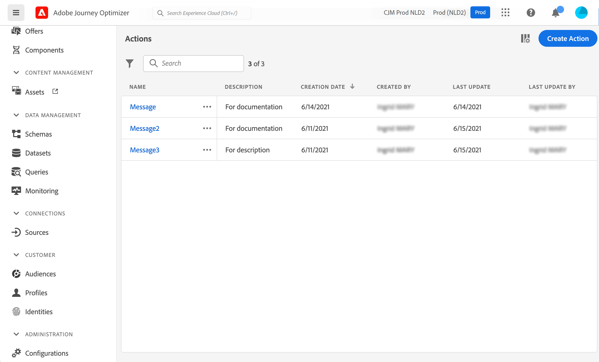

# 작업 정보 {#about_actions}

>[!CONTEXTUALHELP]
>id="ajo_journey_action_list"
>title="작업 정보"
>abstract="여기서 메시지를 보낼 시스템에 대한 연결을 정의합니다. 그러면 여기서 정의한 작업을 여정 왼쪽 팔레트의 [작업] 범주에서 사용할 수 있습니다."

작업은 푸시 알림, 이메일 또는 비즈니스에서 사용하는 기타 디지털 참여 방법 등 개인화된 실시간 경험을 고객에게 제공하는 데 사용되는 연결입니다.

➡️ [비디오에서 이 기능 살펴보기](#video)

[!DNL Journey Optimizer] 에는 내장 메시지 기능이 함께 제공됩니다.

Adobe Campaign v7 또는 v8이 있는 경우 요청 시 통합을 사용할 수 있습니다. 을(를) 참조하십시오 [이 페이지](../action/acc-action.md).

Epsilon, Facebook과 같은 메시지를 보내는 데 서드파티 시스템을 사용하는 경우 [Adobe Developer](https://developer.adobe.com){target="_blank"}, Firebase 등 사용자 지정 작업을 추가하고 구성해야 합니다. 을(를) 참조하십시오 [이 페이지](../action/about-custom-action-configuration.md).

사용자 지정 작업을 사용하면 메시지 또는 API 호출을 전송할 서드파티 시스템의 연결을 구성할 수 있습니다. JSON 형식의 페이로드가 있는 REST API를 통해 호출할 수 있는 모든 공급자의 서비스로 작업을 구성할 수 있습니다.

>[!CAUTION]
>
>사용자 지정 작업의 구성은 **기술 사용자**.

작업은 여정 왼쪽 팔레트의 **[!UICONTROL 작업]** 범주. [이 페이지](../building-journeys/about-journey-activities.md#action-activities)를 참조하십시오.

작업 목록을 보거나 새 작업을 구성하려면 **[!UICONTROL 구성]** 관리 메뉴 섹션에 있는 마지막 항목이 될 필요가 없습니다. 다음에서  **[!UICONTROL 작업]** 섹션, 클릭 **[!UICONTROL 관리]**. 작업 목록이 표시됩니다. 다음을 참조하십시오 [이 페이지](../start/user-interface.md) 를 참조하십시오.

## 방법 비디오 {#video}

사용자 지정 작업을 구성하는 방법을 알아봅니다.

>[!VIDEO](https://video.tv.adobe.com/v/3428396?quality=12)
