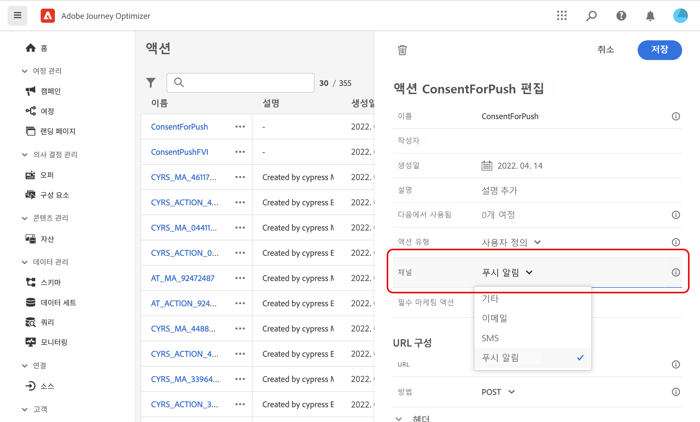
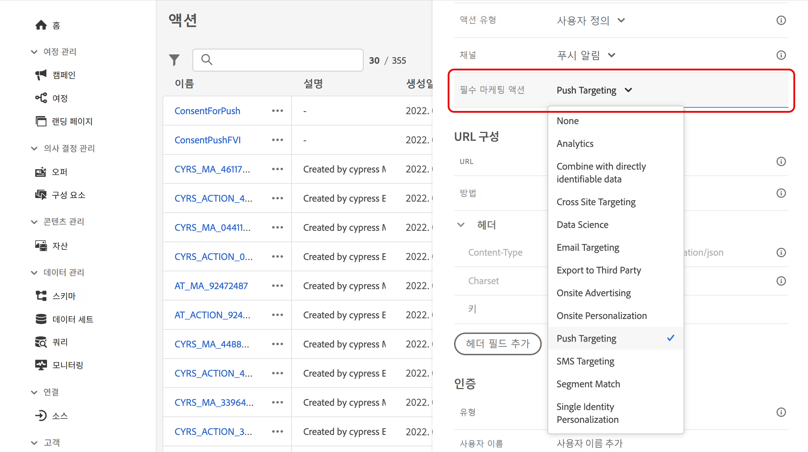
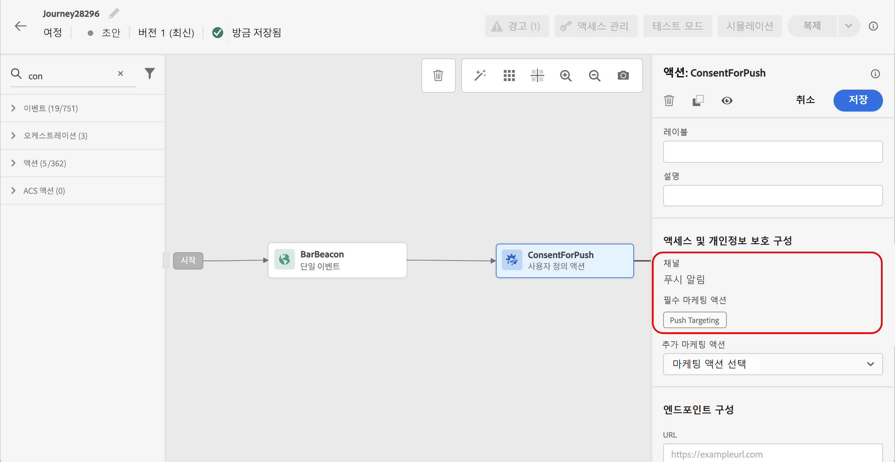
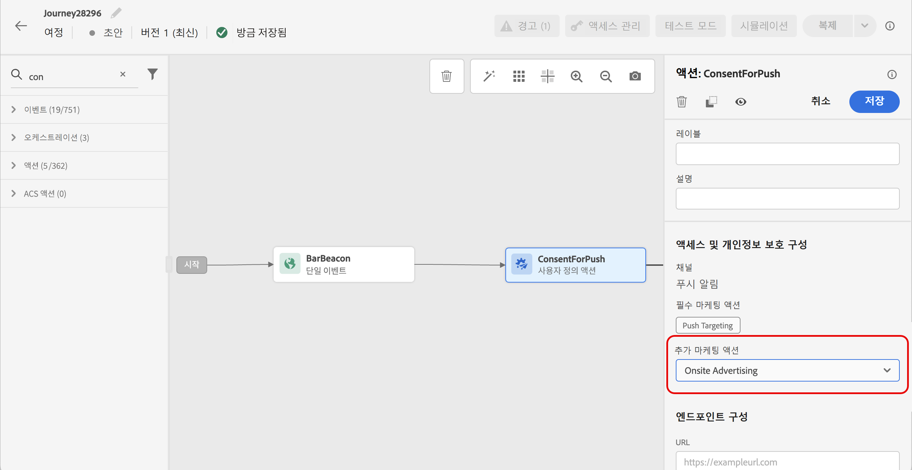
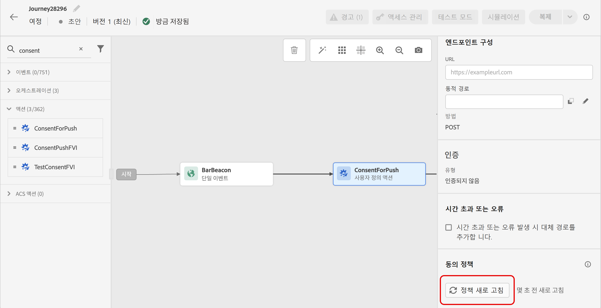

# 동의 정책 사용 {#consent-management}

사용자의 데이터에는 조직 규정이나 법적 규정에 따른 사용 제한이 적용될 수 있습니다. 따라서 Journey Optimizer 내 데이터 작업 시에는 [데이터 사용 정책](https://experienceleague.adobe.com/docs/experience-platform/data-governance/policies/overview.html?lang=ko){target="_blank"}을 준수해야 합니다. 정책은 데이터에 대해 수행할 수 있는 [마케팅 액션](https://experienceleague.adobe.com/docs/experience-platform/data-governance/policies/overview.html?lang=ko#marketing-actions){target="_blank"}을 정의하는 Adobe Experience Platform의 규칙입니다.

활용 가능한 데이터 사용 정책 유형 중 하나는 **동의 정책**&#x200B;입니다. 이 정책을 통해 쉽게 고객의 동의 설정을 지키는 마케팅 정책을 채택하고 적용할 수 있습니다. [정책 집행에 대해 자세히 알아보기](https://experienceleague.adobe.com/docs/experience-platform/data-governance/enforcement/auto-enforcement.html?lang=ko){target="_blank"}

>[!IMPORTANT]
>
>동의 정책 기능은 현재 **Healthcare Shield** 또는 **Privacy and Security Shield** 추가 기능 서비스를 구매한 조직에만 제공됩니다.

예를 들어 Experience Platform에서 이메일, 푸시 또는 SMS 커뮤니케이션에 동의하지 않은 고객을 제외하는 [동의 정책을 만들](https://experienceleague.adobe.com/docs/experience-platform/data-governance/policies/user-guide.html?lang=ko#consent-policy){target="_blank"} 수 있습니다.

* 기본 아웃바운드 채널(이메일, 푸시, SMS, DM)의 경우 로직은 다음과 같습니다.

   * 기본적으로 프로필이 사용자로부터의 커뮤니케이션 수신을 옵트아웃한 경우 해당 프로필은 후속 전송에서 제외됩니다.

   * Adobe **Healthcare Shield** 또는 **Privacy and Security Shield**&#x200B;가 있다면 기본 로직을 재정의하는 사용자 정의 동의 정책을 만들 수 있습니다. 예를 들어, 선택한 모든 개인에게만 이메일 메시지를 보내도록 정책을 정의할 수 있습니다. 사용자 정의 정책이 없으면 기본 정책이 적용됩니다.

  사용자 정의 정책을 적용하려면 해당 정책에서 마케팅 액션을 정의하고 이를 채널 구성에 연결해야 합니다. [자세히 알아보기](#surface-marketing-actions)

여정 수준에서 동의 정책을 사용자 정의 액션에 적용할 수 있습니다.

* **사용자 정의 액션을 구성**&#x200B;할 때 채널 및 마케팅 액션을 정의할 수 있습니다. [자세히 알아보기](#consent-custom-action)
* **여정에 사용자 정의 액션**&#x200B;을 추가할 때 추가적인 마케팅 액션을 정의할 수 있습니다. [자세히 알아보기](#consent-journey)

## 채널 구성을 통한 동의 정책 활용 {#surface-marketing-actions}

[!DNL Journey Optimizer]에서 동의는 Experience Platform [동의 스키마](https://experienceleague.adobe.com/docs/experience-platform/xdm/field-groups/profile/consents.html?lang=ko){target="_blank"}가 처리합니다. 기본적으로 동의 필드의 값은 비어 있으며 커뮤니케이션을 수신하기 위한 동의로 처리됩니다. 온보딩하는 동안 [여기](https://experienceleague.adobe.com/docs/experience-platform/xdm/data-types/consents.html?lang=ko#choice-values){target="_blank"} 나열된 가능한 값 중 하나로 이 기본값을 수정할 수 있습니다.

동의 필드 값을 수정하면 마케팅 액션과 해당 액션이 수행되는 조건을 정의하는 사용자 정의 동의 정책을 생성할 수 있습니다. [마케팅 액션에 대해 자세히 알아보기](https://experienceleague.adobe.com/docs/experience-platform/data-governance/policies/overview.html?lang=ko#marketing-actions){target="_blank"}

예를 들어 이메일 커뮤니케이션 수신에 동의한 프로필만 대상으로 하는 동의 정책을 만들려면 아래 단계를 따르십시오.

1. 회사에서 Adobe **Healthcare Shield** 또는 **Privacy and Security Shield** 추가 기능을 구입했는지 확인하십시오. [자세히 알아보기](https://experienceleague.adobe.com/docs/events/customer-data-management-voices-recordings/governance/healthcare-shield.html?lang=ko){target="_blank"}

1. Adobe Experience Platform에서 사용자 정의 정책(**[!UICONTROL 개인 정보]** > **[!UICONTROL 정책]** 메뉴)을 생성합니다. [방법 알아보기](https://experienceleague.adobe.com/docs/experience-platform/data-governance/policies/user-guide.html?lang=ko#create-policy){target="_blank"}

   <!---->

1. **[!UICONTROL 동의 정책]**&#x200B;을 선택하고 다음과 같이 조건을 입력하고 구성합니다. [동의 정책 구성 방법 알아보기](https://experienceleague.adobe.com/docs/experience-platform/data-governance/policies/user-guide.html?lang=ko#consent-policy){target="_blank"}

   1. **[!UICONTROL If]** 섹션에서 **[!UICONTROL 이메일 타겟팅]** 기본 마케팅 액션을 선택합니다.

      <!---->

      >[!NOTE]
      >
      >Adobe에서 기본적으로 제공하는 핵심 마케팅 액션은 [이 테이블](https://experienceleague.adobe.com/docs/experience-platform/data-governance/policies/overview.html?lang=ko#core-actions){target="_blank"}에서 확인할 수 있습니다. 사용자 정의 마케팅 액션을 만드는 단계의 목록은 [이 섹션](https://experienceleague.adobe.com/docs/experience-platform/data-governance/policies/user-guide.html?lang=ko#create-marketing-action){target="_blank"}에서 확인할 수 있습니다.

   1. 마케팅 액션이 적용될 때 실행할 작업을 선택합니다. 이 예제에서는 **[!UICONTROL 이메일 마케팅 동의]**&#x200B;를 선택합니다.

   

1. 이 정책을 저장하고 [활성화](https://experienceleague.adobe.com/docs/experience-platform/data-governance/policies/user-guide.html?lang=ko#enable){target="_blank"}합니다.

1. Journey Optimizer에서 이메일 표면을 생성합니다. [방법 알아보기](../configuration/channel-surfaces.md#create-channel-surface)

1. 이메일 구성 세부 정보에서 **[!UICONTROL 이메일 타기팅]** 마케팅 액션을 선택합니다.

   

해당 마케팅 액션과 관련된 모든 동의 정책은 고객의 환경 설정을 존중하기 위해 자동으로 활용됩니다.

따라서 이 예제의 경우 캠페인 또는 여정에서 해당 구성을 사용하는 모든 [이메일](../email/create-email.md)은 사용자의 이메일을 받겠다고 동의한 프로필에만 전송됩니다. 이메일 수신에 동의하지 않은 프로필은 제외됩니다.

## 사용자 정의 액션을 통한 동의 정책 활용 {#journey-custom-actions}

### 중요 정보 {#important-notes}

Journey Optimizer에서는 사용자 정의 작업에도 동의를 활용할 수 있습니다. 기본 제공 메시지 기능에 동의를 사용하려면 조건 활동을 사용하여 여정에서 고객을 필터링해야 합니다.

동의 관리에서는 두 가지 여정 활동을 분석합니다.

* 대상자 읽기: 검색된 대상자를 고려합니다.
* 사용자 정의 작업: 동의 관리는 사용하는 속성([작업 매개 변수](../action/about-custom-action-configuration.md#define-the-message-parameters))뿐 아니라 정의한 마케팅 작업(필수 마케팅 작업 및 추가 마케팅 작업)도 고려합니다.
* 기본 결합 스키마를 사용하는 필드 그룹에 속하는 속성은 지원되지 않습니다. 이러한 속성은 인터페이스에서 숨겨집니다. 다른 스키마를 사용하여 다른 필드 그룹을 만들어야 합니다.
* 동의 정책은 사용자 정의 작업 수준에서 마케팅 작업(필수 또는 추가)을 설정한 경우에만 적용됩니다.

여정에서 사용하는 다른 모든 활동은 고려하지 않습니다. 여정을 대상자 자격 조건으로 시작하는 경우 해당 대상자는 고려하지 않습니다.

여정에서 사용자 정의 작업의 동의 정책에 의해 프로필을 제외하는 경우 해당 프로필의 사용자에게 메시지를 보내지는 않지만 해당 사용자는 여정을 계속합니다. 조건을 사용할 때는 프로필이 시간 초과 및 오류 경로로 이동하지 않습니다.

여정에 배치한 사용자 정의 작업에 있는 정책을 새로 고치기 전에 여정에 오류가 없는지 확인해야 합니다.

<!--
There are two types of latency regarding the use of consent policies:

* **User latency**: the delay from the time a profile changes a consent settings to the moment it is applied in Experience Platform. This can take up to 48h. 
* **Consent policy latency**: the delay from the time a consent policy is created or updated to the moment it is applied. This can take up to 6 hours
-->

### 사용자 정의 작업 구성하기 {#consent-custom-action}

>[!CONTEXTUALHELP]
>id="ajo_consent_required_marketing_action"
>title="필요한 마케팅 액션 정의하기"
>abstract="필수 마케팅 액션으로 사용자 정의 액션과 관련된 마케팅 액션을 정의할 수 있습니다. 예를 들어 해당 사용자 정의 액션을 사용하여 이메일을 보내는 경우 이메일 타겟팅을 선택할 수 있습니다. 마케팅 액션을 여정에서 사용하면 해당 마케팅 액션과 연결된 동의 정책을 모두 검색 및 활용합니다. 이는 캔버스에서 수정할 수 없습니다."

사용자 정의 액션을 구성할 때는 동의 관리에 두 필드를 사용할 수 있습니다.

**채널** 필드에서는 다음 사용자 지정 작업과 관련된 채널 즉, **이메일**, **SMS**, 또는 **푸시 알림**&#x200B;을 선택할 수 있습니다. 그렇게 하면 **필수 마케팅 액션** 필드에 선택한 채널에 대한 기본 마케팅 작업을 미리 채웁니다. **기타**&#x200B;를 선택하는 경우 마케팅 액션이 기본적으로 정의되지 않습니다.

**필수 마케팅 작업**&#x200B;으로 사용자 지정 작업과 관련된 마케팅 작업을 정의할 수 있습니다. 예를 들어 해당 사용자 정의 작업을 사용하여 이메일을 보내는 경우 **이메일 타겟팅**&#x200B;을 선택할 수 있습니다. 마케팅 액션을 여정에서 사용하면 해당 마케팅 액션과 연결된 동의 정책을 모두 검색 및 활용합니다. 기본 마케팅 작업이 선택되지만 아래쪽 화살표를 클릭하여 목록에서 사용 가능한 마케팅 작업 중 원하는 것을 선택할 수 있습니다.

특정 유형의 중요한 통신(예: 클라이언트의 암호를 재설정하기 위해 보내는 트랜잭션 메시지)의 경우, 동의 정책을 적용하지 않는 편이 좋을 수도 있습니다. 그 다음 **필수 마케팅 작업** 필드에서 **없음**&#x200B;을 선택합니다.

사용자 지정 작업을 구성하는 다른 단계는 [이 섹션](../action/about-custom-action-configuration.md#consent-management)에 자세히 설명되어 있습니다.

### 여정 구축 {#consent-journey}

>[!CONTEXTUALHELP]
>id="ajo_consent_required_marketing_action_canvas"
>title="필수 마케팅 작업"
>abstract="필수 마케팅 작업은 사용자 정의 작업을 만들 때 정의하게 됩니다. 이 필수 마케팅 작업은 작업에서 제거하거나 수정할 수 없습니다."

>[!CONTEXTUALHELP]
>id="ajo_consent_additional_marketing_action_canvas"
>title="추가 마케팅 작업"
>abstract="필수 작업에 더해 다른 마케팅 작업을 추가합니다. 두 마케팅 작업과 관련된 동의 정책이 적용됩니다."

>[!CONTEXTUALHELP]
>id="ajo_consent_refresh_policies_canvas"
>title="런타임 시 적용되는 동의 정책 시각화"
>abstract="마케팅 작업은 작업 매개 변수와 개별 프로필 동의 값을 결합하여 사용자를 필터링하는 동의 정책을 가져옵니다. 새로 고치려면 버튼을 클릭하여 이 정책에 대한 최신 정의를 가져옵니다."

여정에 사용자 정의 작업을 추가할 때 동의를 관리할 수 있는 몇 가지 옵션이 있습니다. **읽기 전용 필드 표시**&#x200B;를 눌러 모든 매개 변수를 표시합니다.

사용자 지정 작업을 구성할 때 정의된 **채널** 및 **필수 마케팅 작업**&#x200B;이 화면 맨 위에 표시됩니다. 이러한 필드는 수정할 수 없습니다.

사용자 지정 작업의 유형을 설정하여 **추가 마케팅 작업**&#x200B;을 정의할 수 있습니다. 이를 통해 이 여정에서 사용자 지정 작업의 목적을 정의할 수 있습니다. 일반적으로 특정 채널에 적용되는 필수 마케팅 액션 외에도 이 특정 여정의 사용자 정의 액션에 적용할 추가 마케팅 액션을 정의할 수 있습니다. 예를 들어 운동 관련 커뮤니케이션, 뉴스레터, 피트니스 커뮤니케이션 등이 있습니다. 필수 마케팅 액션과 추가 마케팅 액션이 모두 적용됩니다.

화면 아래쪽에 있는 **정책 새로 고침** 버튼을 클릭하여 이 사용자 정의 작업에서 고려할 정책 목록을 업데이트하고 확인합니다. 이는 여정을 작성할 때 참고할 정보로만 사용할 수 있습니다. 실시간 여정의 경우 6시간마다 동의 정책을 자동으로 검색하여 업데이트합니다.

<!--
The following data is taken into account for consent:

* marketing actions and additional marketing actions defined in the custom action
* action parameters defined in the custom action, see this [section](../action/about-custom-action-configuration.md#define-the-message-parameters) 
* attributes used as criteria in a segment when the journey starts with a Read segment, see this [section](../building-journeys/read-audience.md) 

>[!NOTE]
>
>Please note that there can be a latency when updating the list of policies applied, refer to this [this section](../action/consent.md#important-notes).
-->

여정에서 사용자 지정 작업을 구성하는 다른 단계는 [이 섹션](../building-journeys/using-custom-actions.md)에 자세히 설명되어 있습니다.

## 방법 비디오 {#video}

Journey Optimizer 채널에서 데이터 사용 레이블 지정이 적용되는 방법을 알아봅니다.

>[!VIDEO](https://video.tv.adobe.com/v/3434901/?learn=on)