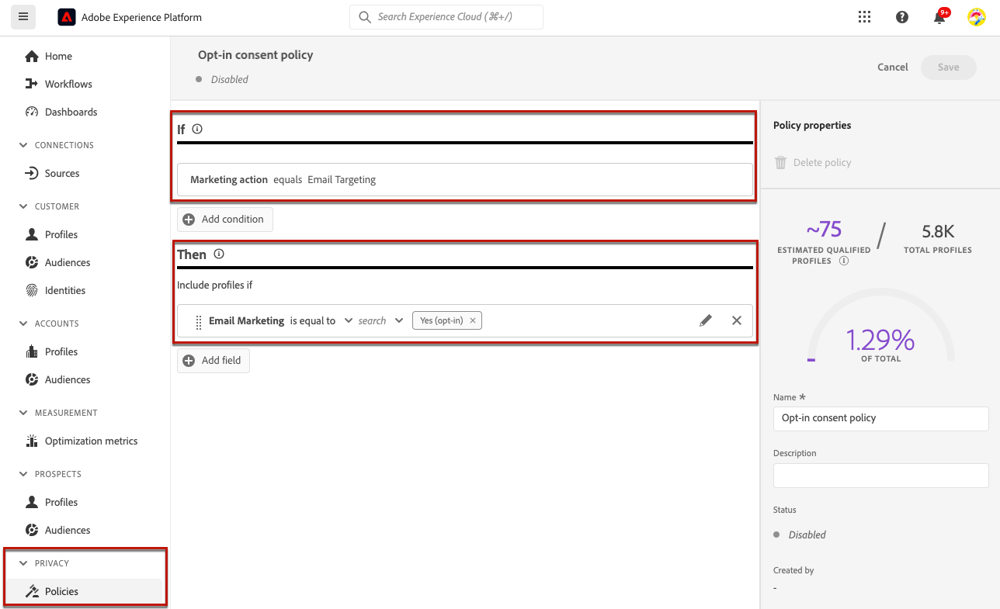
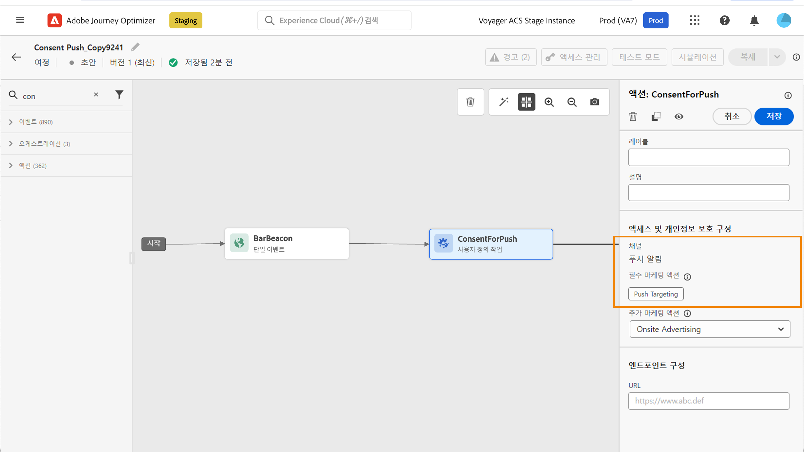
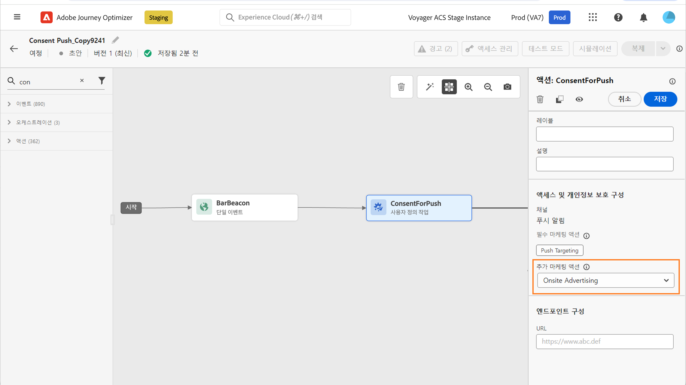
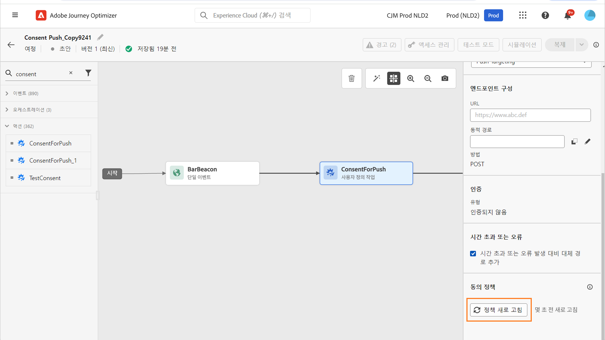

# 동의 정책 사용 {#consent-management}

사용자의 데이터에는 조직 규정이나 법적 규정에 따른 사용 제한이 적용될 수 있습니다. 따라서 Journey Optimizer 내의 데이터 작업이 사용자가 데이터에 대해 수행할 수 있는 [데이터 사용 정책](https://experienceleague.adobe.com/docs/experience-platform/data-governance/policies/overview.html?lang=ko){target="_blank"}. These policies are Adobe Experience Platform rules defining which [marketing actions](https://experienceleague.adobe.com/docs/experience-platform/data-governance/policies/overview.html?lang=ko#marketing-actions){target="_blank"}을 준수하는지 확인하는 것이 중요합니다

활용 가능한 데이터 사용 정책 유형 중 하나는 **동의 정책**&#x200B;입니다. 이 정책을 통해 쉽게 고객의 동의 설정을 지키는 마케팅 정책을 채택하고 적용할 수 있습니다. [정책 집행에 대해 자세히 알아보기](https://experienceleague.adobe.com/docs/experience-platform/data-governance/enforcement/auto-enforcement.html?lang=ko){target="_blank"}

>[!IMPORTANT]
>
>동의 정책 기능은 현재 **Healthcare Shield** 또는 **Privacy and Security Shield** 추가 기능 서비스를 구매한 조직에만 제공됩니다.

예를 들어 Experience Platform에서 이메일, 푸시 또는 SMS 커뮤니케이션에 동의하지 않은 고객을 제외하는 [동의 정책을 만들](https://experienceleague.adobe.com/docs/experience-platform/data-governance/policies/user-guide.html?lang=ko#consent-policy){target="_blank"} 수 있습니다.

<!--* For the native outbound channels (Email, Push, SMS, Direct mail), the logic is as follows:

    * By default, if a profile has opted out from receiving communications from you, the corresponding profile is excluded from subsequent deliveries.

    * If you have the Adobe **Healthcare Shield** or **Privacy and Security Shield**, you can create a custom consent policy that overrides the default logic. For example, you can define a policy to only send email messages to all individuals who have opted in. In the absence of a custom policy, the default policy applies.
    
    To apply a custom policy, you need to define a marketing action in that policy and associate it to a channel surface. [Learn more](#marketing-actions)-->

여정 수준에서 동의 정책을 사용자 정의 액션에 적용할 수 있습니다.

* **사용자 정의 액션을 구성**&#x200B;할 때 채널 및 마케팅 액션을 정의할 수 있습니다. [자세히 알아보기](#consent-custom-action)
* **여정에 사용자 정의 액션**&#x200B;을 추가할 때 추가적인 마케팅 액션을 정의할 수 있습니다. [자세히 알아보기](#consent-journey)

<!--

## Leverage consent policies through channel surfaces {#marketing-actions}

In [!DNL Journey Optimizer], consent is handled by the Experience Platform [Consent schema](https://experienceleague.adobe.com/docs/experience-platform/xdm/field-groups/profile/consents.html){target="_blank"}. By default, the value for the consent field is empty and treated as consent to receive your communications. You can modify this default value while onboarding to one of the possible values listed [here](https://experienceleague.adobe.com/docs/experience-platform/xdm/data-types/consents.html#choice-values){target="_blank"}.

To modify the consent field value, you can create a custom consent policy in which you define a marketing action and the conditions under which that action is performed. [Learn more on marketing actions](https://experienceleague.adobe.com/docs/experience-platform/data-governance/policies/overview.html#marketing-actions){target="_blank"}

For example, if you want to create a consent policy to target only profiles who have consented to receive email communications, follow the steps below.

1. Make sure your organization has purchased the Adobe **Healthcare Shield** or **Privacy and Security Shield** add-on offerings. [Learn more](https://experienceleague.adobe.com/docs/events/customer-data-management-voices-recordings/governance/healthcare-shield.html){target="_blank"}

1. In Adobe Experience Platform, create a custom policy (from the **[!UICONTROL Privacy]** > **[!UICONTROL Policies]** menu). [Learn how](https://experienceleague.adobe.com/docs/experience-platform/data-governance/policies/user-guide.html#create-policy){target="_blank"}

    

1. Choose the **[!UICONTROL Consent policy]** type and configure a condition as follows. [Learn how to configure consent policies](https://experienceleague-review.corp.adobe.com/docs/experience-platform/data-governance/policies/user-guide.html#consent-policy){target="_blank"}

    1. Under the **[!UICONTROL If]** section, select the **[!UICONTROL Email Targeting]** default marketing action.

        

        >[!NOTE]
        >
        >The core marketing actions provided out-of-the-box by Adobe are listed in [this table](https://experienceleague.adobe.com/docs/experience-platform/data-governance/policies/overview.html?lang=en#core-actions){target="_blank"}. The steps to create a custom marketing action are listed in [this section](https://experienceleague.adobe.com/docs/experience-platform/data-governance/policies/user-guide.html#create-marketing-action){target="_blank"}.

    1. Select what happens when the marketing action applies. In this example, select **[!UICONTROL Email Marketing Consent]**.

    

1. Save and [enable](https://experienceleague.adobe.com/docs/experience-platform/data-governance/policies/user-guide.html#enable){target="_blank"} this policy.

1. In Journey Optimizer, create an email surface. [Learn how](../configuration/channel-surfaces.md#create-channel-surface)

1. In the email surface details, select the **[!UICONTROL Email Targeting]** marketing action.

    

All consent policies associated with that marketing action are automatically leveraged in order to respect the preferences of your customers.

Therefore, in this example, any [email](../email/create-email.md) using that surface in a campaign or a journey is only sent to the profiles who have consented to receive emails from you. Profiles who have not consented to receive email communications are excluded.-->

## 사용자 정의 액션을 통한 동의 정책 활용 {#journey-custom-actions}

### 중요 정보 {#important-notes}

Journey Optimizer에서는 사용자 정의 <!--also -->액션에 동의를 활용할 수 있습니다. 기본 제공 메시지 기능에 동의를 사용하려면 조건 활동을 사용하여 여정에서 고객을 필터링해야 합니다.

동의 관리에서는 두 가지 여정 활동을 분석합니다.

* 대상자 읽기: 검색된 대상자를 고려합니다.
* 사용자 정의 작업: 동의 관리는 사용하는 속성([작업 매개 변수](../action/about-custom-action-configuration.md#define-the-message-parameters))뿐 아니라 정의한 마케팅 작업(필수 마케팅 작업 및 추가 마케팅 작업)도 고려합니다.
* 기본 결합 스키마를 사용하는 필드 그룹에 속하는 속성은 지원되지 않습니다. 이러한 속성은 인터페이스에서 숨겨집니다. 다른 스키마를 사용하여 다른 필드 그룹을 만들어야 합니다.
* 동의 정책은 사용자 정의 작업 수준에서 마케팅 작업(필수 또는 추가)을 설정한 경우에만 적용됩니다.

여정에서 사용하는 다른 모든 활동은 고려하지 않습니다. 여정을 대상자 자격 조건으로 시작하는 경우 해당 대상자는 고려하지 않습니다.

여정에서 사용자 정의 작업의 동의 정책에 의해 프로필을 제외하는 경우 해당 프로필의 사용자에게 메시지를 보내지는 않지만 해당 사용자는 여정을 계속합니다. 조건을 사용할 때는 프로필이 시간 초과 및 오류 경로로 이동하지 않습니다.

여정에 배치한 사용자 정의 작업에 있는 정책을 새로 고치기 전에 여정에 오류가 없는지 확인해야 합니다.

<!--
There are two types of latency regarding the use of consent policies:

* **User latency**: the delay from the time a profile changes a consent settings to the moment it is applied in Experience Platform. This can take up to 48h. 
* **Consent policy latency**: the delay from the time a consent policy is created or updated to the moment it is applied. This can take up to 6 hours
-->

### 사용자 정의 작업 구성하기 {#consent-custom-action}

>[!CONTEXTUALHELP]
>id="ajo_consent_required_marketing_action"
>title="필요한 마케팅 액션 정의하기"
>abstract="필수 마케팅 액션으로 사용자 정의 액션과 관련된 마케팅 액션을 정의할 수 있습니다. 예를 들어 해당 사용자 정의 액션을 사용하여 이메일을 보내는 경우 이메일 타겟팅을 선택할 수 있습니다. 마케팅 액션을 여정에서 사용하면 해당 마케팅 액션과 연결된 동의 정책을 모두 검색 및 활용합니다. 이는 캔버스에서 수정할 수 없습니다."

사용자 정의 액션을 구성할 때는 동의 관리에 두 필드를 사용할 수 있습니다.

**채널** 필드에서는 다음 사용자 지정 작업과 관련된 채널 즉, **이메일**, **SMS**, 또는 **푸시 알림**&#x200B;을 선택할 수 있습니다. 그렇게 하면 **필수 마케팅 액션** 필드에 선택한 채널에 대한 기본 마케팅 작업을 미리 채웁니다. **기타**&#x200B;를 선택하는 경우 마케팅 액션이 기본적으로 정의되지 않습니다.

**필수 마케팅 작업**&#x200B;으로 사용자 지정 작업과 관련된 마케팅 작업을 정의할 수 있습니다. 예를 들어 해당 사용자 정의 작업을 사용하여 이메일을 보내는 경우 **이메일 타겟팅**&#x200B;을 선택할 수 있습니다. 마케팅 액션을 여정에서 사용하면 해당 마케팅 액션과 연결된 동의 정책을 모두 검색 및 활용합니다. 기본 마케팅 작업이 선택되지만 아래쪽 화살표를 클릭하여 목록에서 사용 가능한 마케팅 작업 중 원하는 것을 선택할 수 있습니다.

특정 유형의 중요한 통신(예: 클라이언트의 암호를 재설정하기 위해 보내는 트랜잭션 메시지)의 경우, 동의 정책을 적용하지 않는 편이 좋을 수도 있습니다. 그 다음 **필수 마케팅 작업** 필드에서 **없음**&#x200B;을 선택합니다.

사용자 지정 작업을 구성하는 다른 단계는 [이 섹션](../action/about-custom-action-configuration.md#consent-management)에 자세히 설명되어 있습니다.

### 여정 구축 {#consent-journey}

>[!CONTEXTUALHELP]
>id="ajo_consent_required_marketing_action_canvas"
>title="필수 마케팅 작업"
>abstract="필수 마케팅 작업은 사용자 정의 작업을 만들 때 정의하게 됩니다. 이 필수 마케팅 작업은 작업에서 제거하거나 수정할 수 없습니다."

>[!CONTEXTUALHELP]
>id="ajo_consent_additional_marketing_action_canvas"
>title="추가 마케팅 작업"
>abstract="필수 작업에 더해 다른 마케팅 작업을 추가합니다. 두 마케팅 작업과 관련된 동의 정책이 적용됩니다."

>[!CONTEXTUALHELP]
>id="ajo_consent_refresh_policies_canvas"
>title="런타임 시 적용되는 동의 정책 시각화"
>abstract="마케팅 작업은 작업 매개 변수와 개별 프로필 동의 값을 결합하여 사용자를 필터링하는 동의 정책을 가져옵니다. 새로 고치려면 버튼을 클릭하여 이 정책에 대한 최신 정의를 가져옵니다."

여정에 사용자 정의 작업을 추가할 때 동의를 관리할 수 있는 몇 가지 옵션이 있습니다. **읽기 전용 필드 표시**&#x200B;를 눌러 모든 매개 변수를 표시합니다.

사용자 지정 작업을 구성할 때 정의된 **채널** 및 **필수 마케팅 작업**&#x200B;이 화면 맨 위에 표시됩니다. 이러한 필드는 수정할 수 없습니다.

사용자 지정 작업의 유형을 설정하여 **추가 마케팅 작업**&#x200B;을 정의할 수 있습니다. 이를 통해 이 여정에서 사용자 지정 작업의 목적을 정의할 수 있습니다. 일반적으로 특정 채널에 적용되는 필수 마케팅 액션 외에도 이 특정 여정의 사용자 정의 액션에 적용할 추가 마케팅 액션을 정의할 수 있습니다. 예를 들어 운동 관련 커뮤니케이션, 뉴스레터, 피트니스 커뮤니케이션 등이 있습니다. 필수 마케팅 액션과 추가 마케팅 액션이 모두 적용됩니다.

화면 아래쪽에 있는 **정책 새로 고침** 버튼을 클릭하여 이 사용자 정의 작업에서 고려할 정책 목록을 업데이트하고 확인합니다. 이는 여정을 작성할 때 참고할 정보로만 사용할 수 있습니다. 실시간 여정의 경우 6시간마다 동의 정책을 자동으로 검색하여 업데이트합니다.

<!--
The following data is taken into account for consent:

* marketing actions and additional marketing actions defined in the custom action
* action parameters defined in the custom action, see this [section](../action/about-custom-action-configuration.md#define-the-message-parameters) 
* attributes used as criteria in a segment when the journey starts with a Read segment, see this [section](../building-journeys/read-audience.md) 

>[!NOTE]
>
>Please note that there can be a latency when updating the list of policies applied, refer to this [this section](../action/consent.md#important-notes).
-->

여정에서 사용자 지정 작업을 구성하는 다른 단계는 [이 섹션](../building-journeys/using-custom-actions.md)에 자세히 설명되어 있습니다.
