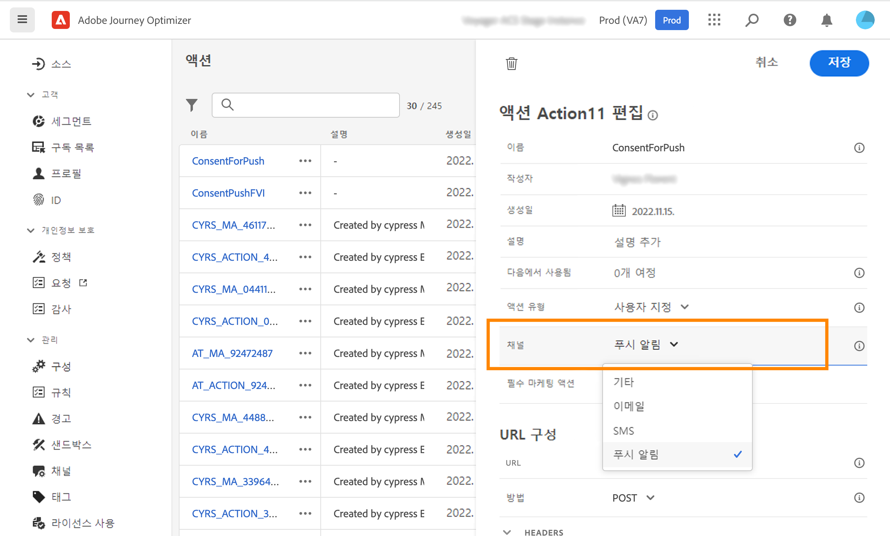
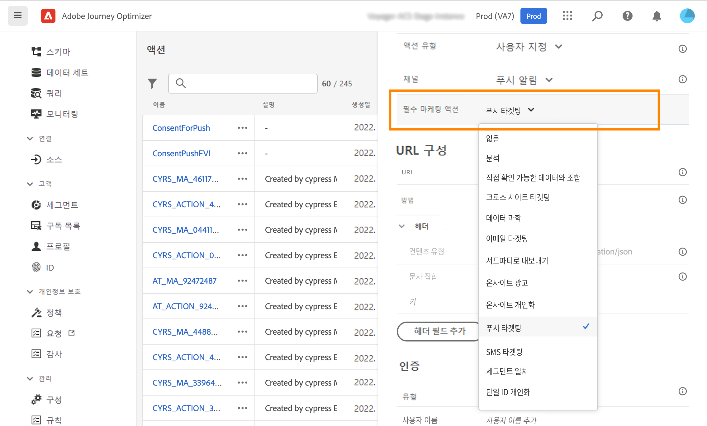

# 동의 정책 사용 {#consent-management}

Adobe Experience Platform을 사용하면 고객의 동의 환경 설정을 준수하도록 마케팅 정책을 쉽게 채택하고 적용할 수 있습니다. 동의 정책은 Adobe Experience Platform에서 정의됩니다. 을(를) 참조하십시오. [이 설명서](https://experienceleague.adobe.com/docs/experience-platform/data-governance/policies/user-guide.html?lang=en#consent-policy).

Journey Optimizer에서 이러한 동의 정책을 사용자 지정 작업에 적용할 수 있습니다. 예를 들어 이메일, 푸시 또는 SMS 커뮤니케이션에 동의하지 않은 고객을 제외하는 동의 정책을 정의할 수 있습니다.

>[!NOTE]
>
>동의 정책은 현재 Healthcare Shield 추가 기능 서비스를 구입한 조직에만 사용할 수 있습니다.

Journey Optimizer에서 동의가 몇 가지 수준에서 정의됩니다.

* when **사용자 지정 작업 구성**&#x200B;로 지정하는 경우 채널 및 마케팅 작업을 정의할 수 있습니다. 다음 보기 [섹션](../action/consent.md#consent-custom-action).
* 추가할 때 **여정의 사용자 지정 작업**&#x200B;를 사용하여 추가적인 마케팅 작업을 정의할 수 있습니다. 다음 보기 [섹션](../action/consent.md#consent-journey).

## 중요 정보 {#important-notes}

Journey Optimizer에서 동의를 사용자 지정 작업에서 활용할 수 있습니다. 기본 제공 메시지 기능과 함께 사용하려면 조건 활동을 사용하여 여정에서 고객을 필터링해야 합니다.

동의 관리를 통해 두 개의 여정 활동을 분석합니다.

* 세그먼트 읽기: 검색된 세그먼트가 고려됩니다.
* 사용자 지정 작업: 동의 관리는 사용되는 속성([작업 매개 변수](../action/about-custom-action-configuration.md#define-the-message-parameters))뿐만 아니라 정의된 마케팅 작업(필수 마케팅 작업 및 추가 마케팅 작업)도 포함합니다.
* 기본 결합 스키마를 사용하는 필드 그룹에 속하는 속성은 지원되지 않습니다. 이러한 속성은 인터페이스에서 숨겨집니다. 다른 스키마를 사용하여 다른 필드 그룹을 만들어야 합니다.
* 동의 정책은 마케팅 작업(필수 또는 추가)이 사용자 지정 작업 수준에서 설정된 경우에만 적용됩니다.

여정에서 사용되는 다른 모든 활동은 고려되지 않습니다. 세그먼트 자격을 사용하여 여정을 시작하는 경우 세그먼트가 고려되지 않습니다.

여정에서 사용자 지정 동작의 동의 정책에 의해 프로필이 제외되는 경우, 메시지가 그에게 전송되지 않고 여정을 계속합니다. 조건을 사용할 때 프로필이 시간 제한 및 오류 경로로 이동하지 않습니다.

여정에 위치한 사용자 지정 작업에서 정책을 새로 고치기 전에 여정에 오류가 없는지 확인하십시오.

<!--
There are two types of latency regarding the use of consent policies:

* **User latency**: the delay from the time a profile changes a consent settings to the moment it is applied in Experience Platform. This can take up to 48h. 
* **Consent policy latency**: the delay from the time a consent policy is created or updated to the moment it is applied. This can take up to 6 hours
-->

## 사용자 지정 작업 구성 {#consent-custom-action}

>[!CONTEXTUALHELP]
>id="ajo_consent_required_marketing_action_admin"
>title="필요한 마케팅 작업 정의"
>abstract="필요한 마케팅 작업을 사용하면 사용자 지정 작업과 관련된 마케팅 작업을 정의할 수 있습니다. 예를 들어 해당 사용자 지정 작업을 사용하여 이메일을 보내는 경우 이메일 타겟팅을 선택할 수 있습니다. 여정에서 사용하는 경우 해당 마케팅 작업과 관련된 모든 동의 정책이 검색 및 활용됩니다. 캔버스에서 수정할 수 없습니다."

사용자 지정 작업을 구성할 때 동의 관리에 두 개의 필드를 사용할 수 있습니다.

다음 **채널** 필드에서는 이 사용자 지정 작업과 관련된 채널을 선택할 수 있습니다. **이메일**, **SMS**, 또는 **푸시 알림**. 이 파일은 **필수 마케팅 작업** 선택한 채널에 대한 기본 마케팅 작업이 있는 필드입니다. 선택하는 경우 **기타**&#x200B;기본적으로 마케팅 작업이 정의되지 않습니다.

다음 **필수 마케팅 작업** 사용자 지정 작업과 관련된 마케팅 작업을 정의할 수 있습니다. 예를 들어 해당 사용자 지정 작업을 사용하여 이메일을 보내는 경우 **이메일 타겟팅**. 여정에서 사용하는 경우 해당 마케팅 작업과 관련된 모든 동의 정책이 검색 및 활용됩니다. 기본 마케팅 작업이 선택되지만 아래쪽 화살표를 클릭하여 목록에서 사용 가능한 마케팅 작업을 선택할 수 있습니다.

특정 유형의 중요한 통신(예: 클라이언트의 암호를 재설정하기 위해 보낸 트랜잭션 메시지)의 경우, 동의 정책을 적용하지 않을 수 있습니다. 그런 다음 을(를) 선택합니다 **없음** 에서 **필수 마케팅 작업** 필드.

사용자 지정 작업을 구성하는 다른 단계는 [이 섹션](../action/about-custom-action-configuration.md#consent-management).

### 여정 구축 {#consent-journey}

>[!CONTEXTUALHELP]
>id="ajo_consent_required_marketing_action_canvas"
>title="필수 마케팅 작업"
>abstract="사용자 지정 작업을 만드는 동안 필요한 마케팅 작업이 정의됩니다. 이러한 필수 마케팅 작업은 작업에서 제거하거나 수정할 수 없습니다."

>[!CONTEXTUALHELP]
>id="ajo_consent_additional_marketing_action_canvas"
>title="추가 마케팅 작업"
>abstract="필요한 작업 외에 다른 마케팅 작업을 추가합니다. 두 마케팅 작업과 관련된 동의 정책이 적용됩니다."

>[!CONTEXTUALHELP]
>id="ajo_consent_refresh_policies_canvas"
>title="런타임 시 적용되는 동의 정책 시각화"
>abstract="마케팅 작업은 작업 매개 변수와 개별 프로필 동의 값을 결합하여 사용자를 필터링하는 동의 정책을 가져옵니다. 새로 고치려면 버튼을 클릭하여 이러한 정책에 대한 최신 정의를 가져옵니다."

여정에서 사용자 지정 작업을 추가할 때 몇 가지 옵션을 사용하여 동의를 관리할 수 있습니다. 을(를) 클릭합니다. **읽기 전용 필드 표시** 를 눌러 모든 매개 변수를 표시합니다.

다음 **채널** 및 **필수 마케팅 작업**&#x200B;사용자 지정 작업을 구성할 때 정의된 가 화면 맨 위에 표시됩니다. 이러한 필드는 수정할 수 없습니다.

을(를) 정의할 수 있습니다 **추가 마케팅 작업** 를 클릭하여 사용자 지정 작업의 유형을 설정합니다. 이를 통해 이 여정에서 사용자 지정 작업의 목적을 정의할 수 있습니다. 일반적으로 채널에만 해당되는 필수 마케팅 작업 외에도 이 특정 여정의 사용자 지정 작업에 해당하는 추가 마케팅 작업을 정의할 수 있습니다. 예: 운동 통신, 뉴스레터, 피트니스 커뮤니케이션 등 필요한 마케팅 작업과 추가 마케팅 작업이 모두 적용됩니다.

을(를) 클릭합니다. **정책 새로 고침** 버튼을 클릭하여 이 사용자 지정 작업에 고려 중인 정책 목록을 업데이트하고 확인합니다. 여정을 구축하는 동안 정보 용도로만 사용됩니다. 라이브 여정을 통해 동의 정책은 6시간마다 자동으로 검색되고 업데이트됩니다.

<!--
The following data is taken into account for consent:

* marketing actions and additional marketing actions defined in the custom action
* action parameters defined in the custom action, see this [section](../action/about-custom-action-configuration.md#define-the-message-parameters) 
* attributes used as criteria in a segment when the journey starts with a Read segment, see this [section](../building-journeys/read-segment.md) 

>[!NOTE]
>
>Please note that there can be a latency when updating the list of policies applied, refer to this [this section](../action/consent.md#important-notes).
-->

여정에서 사용자 지정 작업을 구성하는 다른 단계는 [이 섹션](../building-journeys/using-custom-actions.md).
