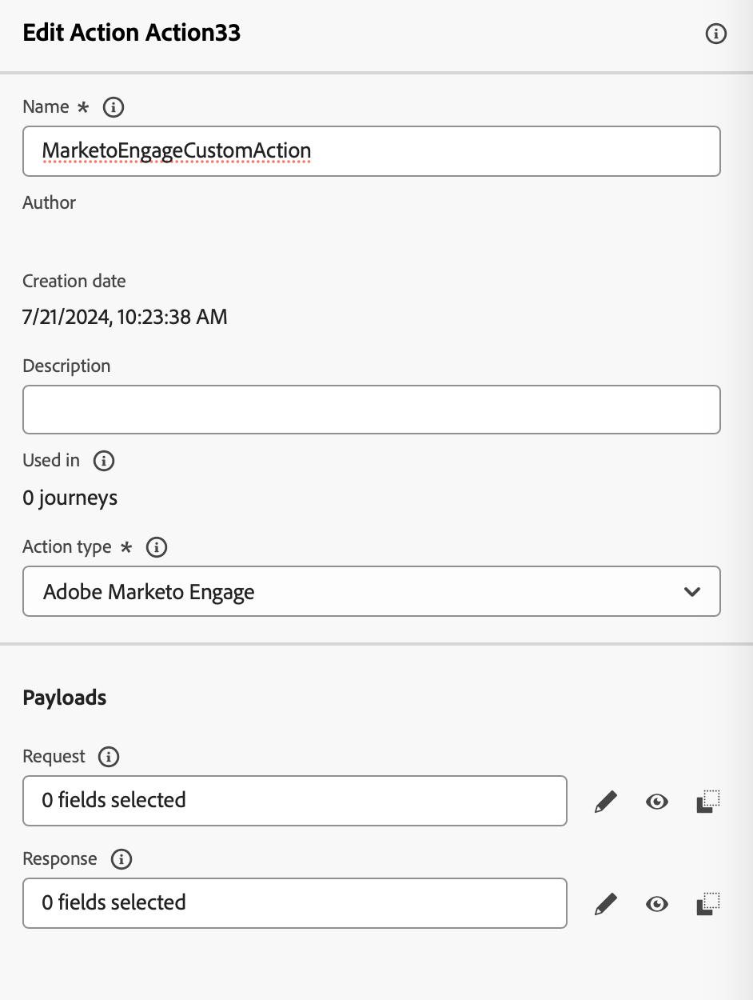
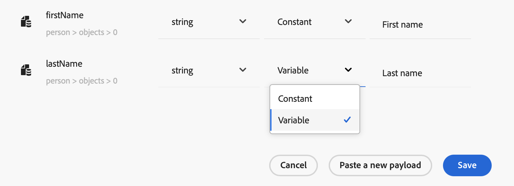
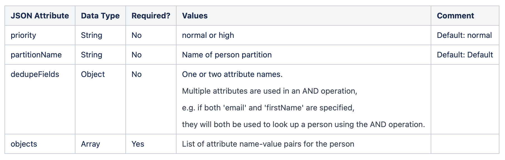
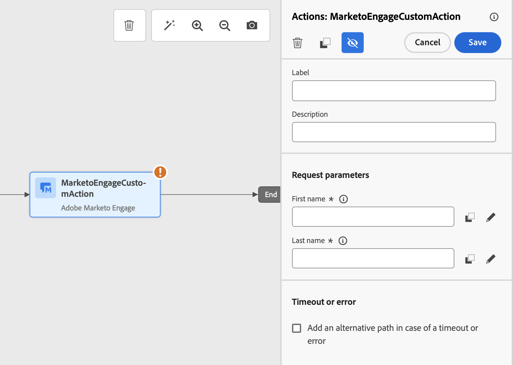

# Marketo Engage과 통합 {#integrating-with-marketo-engage}

Marketo Engage과의 원활한 데이터 통합 여정을 시작하십시오. Journey Optimizer의 이 특정 사용자 지정 작업은 두 가지 주요 데이터 유형 수집을 지원합니다.

* 사람(프로필): Marketo은 프로필을 실행 가능한 인사이트로 변환합니다.
* 사용자 지정 개체: 개인화된 마케팅 접근 방식을 위해 제품과 같은 사용자 지정 개체로 데이터를 사용자 지정합니다.

## 전제 조건 {#prerequisites}

* Marketo Engage의 고객 인스턴스는 IMS를 사용할 수 있어야 합니다.
* Marketo Engage 인스턴스와 AEP/AJO 인스턴스가 동일한 IMS 조직에 있어야 합니다. +링크
* 고객은 MktoSync: 수집 서비스 액세스 권한을 제공받아야 합니다(여기에 추가하기 참고 + 링크).

## 작업 구성 {#configure-marketo-action}

* 관리 > 구성 > 작업 으로 이동한 다음 관리 를 클릭합니다
* 작업 목록에서 작업 생성을 누릅니다. 사용자 지정 작업 만들기에 대한 자세한 내용은 여기(+link)를 참조하십시오.
* 이름, 설명을 입력하고 작업 유형으로 Adobe Marketo Engage 를 선택합니다.



* **요청** 및 **응답** 페이로드에 대한 페이로드 편집을 클릭합니다.
* 두 경우 모두 페이로드를 구성하고 전용 팝업에 붙여 넣습니다.


* Inspect 및 페이로드 값 구성
참고: 값을 동적으로 전달하려면 각 필드에 대해 **상수**&#x200B;를 **변수**(으)로 변경하십시오.



* 필드 구성 창에서 **저장**&#x200B;을 클릭한 다음 사용자 지정 작업에 대해 **저장**&#x200B;을 클릭합니다.

이제 전용 캔버스에서 사용자 지정 작업을 사용할 수 있습니다.


## 페이로드 구문 {#payload-syntax}

### 개인



### CustomObject


**개인용 페이로드 예**

```json
{
   "munchkinID": "388-KKG-245",  
   "person": {
    "priority": "normal",
    "partitionName": "XYZ",
    "dedupeFields": {
      "field1": "email",
      "field2": "firstName"
    },
    "objects": [
      {
        "email": "Email address",
        "firstName": "First name",
        "lastName": "Last name"
      }
    ]
  }
}
```

**사용자 지정 개체에 대한 페이로드 예**

```json
{
  "munchkinID": "388-KKG-245", 
  "customObject": {
    "priority": "normal",
    "objectName": "products",
    "objects": [
      {
        "email": "Email Address",
        "productName": "Product Name",
        "productQty": "Product Quantity",
        "priceTotal": "Price Total"
      }
    ]
  }
}
```


## 작업 사용 {#engage-using}

* 사용자 지정 작업을 여정 캔버스로 드래그합니다. (사용자 지정 작업/링크를 사용하는 방법 참조)
* 요청 매개 변수에서 페이로드에 구성한 동적 값이 있는 각 매개 변수에 대해 편집 을 클릭합니다.



