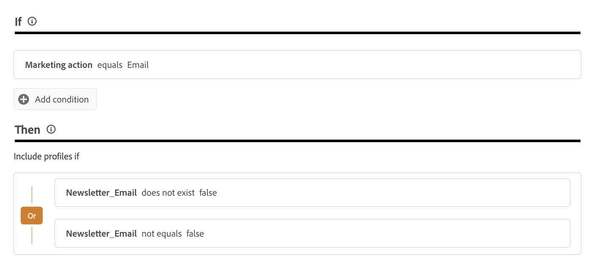

# 고객의 환경 설정 관리 {#preference-center}

>[!AVAILABILITY]
>
>이 기능은 현재 Adobe **Healthcare Shield** 또는 **Privacy and Security Shield** 추가 기능 서비스를 구입한 조직에서만 사용할 수 있습니다.

최신 마케팅 자동화 생태계에서 브랜드는 다양한 접점에서 고객과 관계를 맺으며 무관하거나 과도한 커뮤니케이션의 위험에 직면하여 이탈, 스팸 불만 및 규정 준수 리스크로 이어집니다. 대상자에 대한 실시간 통찰력을 얻고 개인화되고 존중되는 커뮤니케이션을 제공하기 위해 고객의 선호도를 관리해야 하는 이유입니다.

[!DNL Adobe Journey Optimizer]을(를) 사용하면 [동의 정책](consent.md)을 통해 고객의 환경 설정을 적용할 수 있습니다<!-- in terms of **channels** and **topics**-->. 이렇게 하면 [!DNL Journey Optimizer]이(가) 동의를 존중하면서 자신의 선택에 따라 <!-- their preferred channels and on the subscription topics-->을(를) 타깃팅할 수 있습니다.

[!DNL Journey Optimizer]을(를) 통해 사용자의 환경 설정을 관리하려면 다음을 수행할 수 있습니다.

* 기본 아웃바운드 채널에 대한 옵트인/옵트아웃에 대한 고객의 동의를 검색합니다. 예를 들어, 지정된 채널에 대한 통신 수신에 동의하지 않은 고객을 제외하려면 [!DNL Experience Platform]에 동의 정책을 만듭니다. 그런 다음 전자 메일 채널 구성을 사용하여 [!DNL Journey Optimizer]에서 이 동의 정책을 적용하세요. [방법 알아보기](consent.md#surface-marketing-actions)

  >[!NOTE]
  >
  >지원되는 채널은 이메일, 푸시, SMS 및 인앱입니다.<!--To check-->

* 고객에게 구독할 주제를 묻습니다(예: 수신 여부에 동의한 커뮤니케이션 유형). [방법 알아보기](#manage-preferences)

>[!IMPORTANT]
>
>동의가 환경 설정에 우선합니다. 예를 들어, 고객 중 한 명이 선호 채널이 이메일이며 뉴스레터 <!-- they are interested in yoga-->을(를) 수신하는 데 동의한다고 표시했습니다. 그러나 귀하로부터 커뮤니케이션 수신을 옵트아웃한 경우 해당 채널을 귀하가 전송하는 이메일 뉴스레터로 타겟팅할 수 없습니다<!-- on yoga-->.

## 환경 설정 기록 및 준수 {#manage-preferences}

[!DNL Journey Optimizer]의 동의 정책을 사용하면 고객의 환경 설정을 중앙에서 관리할 수 있습니다. 이를 통해 고객이 동의 선택 사항을 준수하면서 선택한 주제에 따라 고객만 타겟팅하도록 할 수 있습니다. 이렇게 하려면 아래 단계를 수행합니다.

여러 구독 주제(*뉴스레터*, *오퍼*, *새 제품 출시*)에서 커뮤니케이션 환경 설정을 기반으로 여정 및 캠페인을 통해 고객을 타깃팅하고 싶다고 가정해 보겠습니다.

1. 프로필 수준 <!--how??-->에서 부울 연산자로 환경 설정 특성을 정의합니다. 예를 들어 다음을 지정할 수 있습니다.

   * *Newsletter_Email* - 부울(true/false)
   * *Offers_Push* - 부울(True/False)
   * *새 제품 출시* - 부울(True/False)

   이러한 특성은 프로필이 활성화된 [데이터 세트](../data/get-started-datasets.md)의 스키마에서 캡처되고 [통합 고객 프로필](../audience/get-started-profiles.md)에 매핑됩니다.

   >[!NOTE]
   >
   >고객 동의 및 연락처 환경 설정은 복잡한 주제입니다. 동의 및 컨텍스트 환경 설정을 [!DNL Experience Platform]에서 수집, 처리 및 필터링하는 방법에 대해 알아보려면 다음 문서를 읽는 것이 좋습니다.
   >
   >* 동의 데이터를 수집하는 데 필요한 스키마 필드 그룹에 대한 자세한 내용은 [이 페이지](https://experienceleague.adobe.com/ko/docs/experience-platform/landing/governance-privacy-security/consent/adobe/overview){target="_blank"}를 참조하세요. 고객으로부터 수집한 동의 데이터를 처리하고 저장된 고객 프로필에 통합하는 방법에 대해 자세히 설명합니다.
   >* 동의 및 환경 설정 필드 그룹에 대한 자세한 내용은 [이 페이지](https://experienceleague.adobe.com/ko/docs/experience-platform/xdm/field-groups/profile/consents#ingest){target="_blank"}를 참조하세요.
   >* 사용자 지정 환경 설정 필드를 스키마에 추가하려면 [이 섹션](https://experienceleague.adobe.com/ko/docs/experience-platform/landing/governance-privacy-security/consent/adobe/dataset#custom-consent){target="_blank"}의 단계를 따르십시오.

1. 고객의 환경 설정을 캡처할 페이지를 만듭니다. 다음 방법 중 하나를 사용하십시오.

   * [Adobe Experience Platform Web SDK](https://experienceleague.adobe.com/ko/docs/experience-platform/web-sdk/home){target="_blank"}를 사용하여 고객의 환경 설정을 기록할 웹 페이지를 만듭니다.

   * 프로필 데이터를 통해 고객의 환경 설정을 캡처하는 양식을 포함하는 [!DNL Journey Optimizer] [랜딩 페이지](../landing-pages/create-lp.md)를 사용합니다.  [양식에 대해 자세히 알아보기](../landing-pages/lp-forms.md) <!--Forms not released/announced yet - TBC-->

     >[!NOTE]
     >
     >사용 중인 랜딩 페이지의 도메인이 하위 브랜드가 아니라 상위 브랜드에 속하는지 확인하십시오. 실제로 수집된 환경 설정은 상위 브랜드 수준에 있는 프로필 데이터에 저장됩니다.

1. 이 페이지에서 고객은 확인란을 선택하거나 선택 취소하여 주제 단위 구독과 같은 환경 설정을 업데이트할 수 있습니다.

   각 작업은 프로필 사용 데이터 세트 스키마`true`에 데이터를 수집하여 해당 프로필 특성(`false`(옵트인, <!-- that contains the corresponding preference fields-->(옵트아웃)에 대해 저장된 동의 이벤트를 트리거합니다.

   <!--Record your users' preferences through the web page or landing page that you created. The data is saved against the corresponding profile, meaning that the preference data is ingested into a Profile-enabled dataset whose schema contains consent/preference fields.-->

   예를 들어 <!--whose email address is john.black@lumamail.com--> 사용자는 푸시 오퍼를 받는 데 동의하지만 이메일 뉴스레터를 받지 않으려고 합니다. 해당 프로필은 다음과 같이 업데이트됩니다.

   {width=80%}

<!--The corresponding profile dataset is updated as follows:

|Attribute = Email id | Attribute = Offers_Push | Attribute = Newsletters_Email |
|---------|----------|---------|
| john.black@lumamail.com | Y | N |-->

    >[!NOTE]
    >
    >들어오는 동의 이벤트는 고객 프로필에 전달되어 실시간 업데이트를 보장합니다. 각 프로필은 구독 환경 설정에서 가장 최근에 선택한 항목을 반영합니다.

1. Adobe Experience Platform에서 사용자 정의 정책(**[!UICONTROL 개인 정보]** > **[!UICONTROL 정책]** 메뉴)을 생성합니다. [방법 알아보기](https://experienceleague.adobe.com/docs/experience-platform/data-governance/policies/user-guide.html?lang=ko#create-policy){target="_blank"}

   >[!AVAILABILITY]
   >
   >동의 정책은 현재 Adobe **Healthcare Shield** 또는 **Privacy and Security Shield** 추가 기능 서비스를 구입한 조직에서만 사용할 수 있습니다. [동의 정책에 대해 자세히 알아보기](consent.md)

   동의 정책을 사용하려면 프로필 데이터에 기본 설정 속성이 있어야 합니다. 따라서 1단계에서 설명한 대로 프로필 수준에서 이러한 속성을 정의해야 합니다.

1. **[!UICONTROL 동의 정책]**&#x200B;을 선택하고 다음과 같이 조건을 입력하고 구성합니다. [동의 정책 구성 방법 알아보기](https://experienceleague.adobe.com/docs/experience-platform/data-governance/policies/user-guide.html?lang=ko#consent-policy){target="_blank"}

<!--Consent policies are comprised of two logical components:

* **If**: The condition that will trigger the policy check, based on a certain marketing action (email, SMS, push, custom action, etc.) being performed, the presence of certain data usage labels, or a combination of the two.

* **Then**: The consent attribute must be present for a profile to be included in the action that triggered the policy. More than one field can also be selected.-->

    예를 들어 이메일 뉴스레터 수신을 옵트아웃하지 않은 고객에게만 커뮤니케이션을 보내려면 사용자 지정 정책을 만들고 다음 조건을 정의합니다.
    
    * **[!UICONTROL 마케팅 액션]**&#x200B;이 **[!UICONTROL 이메일]**
    
    인 경우 **[!UICONTROL 뉴스레터_이메일]**&#x200B;이 존재하지 않습니다 **[!UICONTROL false]** 또는 **[!UICONTROL 뉴스레터_이메일]**&#x200B;이(가) 존재하지 않습니다 **[!UICONTROL false]**
    
    {width=80%}
    
    >[!TIP]
    >
    >프로필 사용 데이터 세트에는 프로필 속성 **[!UICONTROL Newsletter_Email]**&#x200B;이 포함되며 값은 &#39;true&#39;로 설정되어야 합니다(예: 1단계에서 설명)

1. 동의 정책을 만든 후에는 [!DNL Journey Optimizer]채널 구성[&#x200B; 또는 &#x200B;](consent.md#surface-marketing-actions)사용자 지정 작업 여정[을 사용하여 &#x200B;](consent.md#journey-custom-actions)에서 활용하십시오.

1. 이제 여정 및 캠페인에서 이러한 채널 구성 또는 사용자 지정 작업을 사용하여 <!--targeted--> 고객의 환경 설정을 적용할 수 있습니다.
