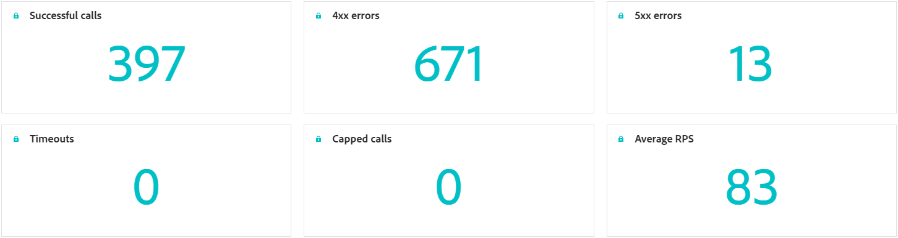

# 사용자 지정 작업 모니터링 {#reporting}

>[!CONTEXTUALHELP]
>id="ajo_campaigns_custom_actions_monitor"
>title="사용자 지정 작업 모니터링"
>abstract="**[!UICONTROL 사용자 지정 작업]** 보고 페이지를 사용하여 여정이 서드파티 시스템에 대해 수행하는 API 호출의 성능과 안정성을 추적할 수 있습니다."

>[!AVAILABILITY]
>
>사용자 지정 작업 보고는 현재 조직 집합(제한된 가용성)에만 사용할 수 있습니다.

**[!UICONTROL 사용자 지정 작업]** 보고 페이지에서는 여정에서 서드파티 시스템으로 전송되는 API 호출의 안정성과 성능을 모니터링할 수 있습니다. 이러한 보고서를 통해 통합에 영향을 미칠 수 있는 문제, 지연 병목 현상 또는 제한/한도 제한을 신속하게 파악할 수 있습니다.

사용자 지정 작업 보고 페이지는 Journey Optimizer의 다른 모든 시간 보고서와 마찬가지로 작동합니다. 대시보드 기능에 대한 자세한 내용은 [이 설명서](../reports/report-cja-manage.md)를 참조하세요.

**[!UICONTROL 사용자 지정 작업]** 보고 페이지에 액세스하려면 작업&#x200B;**[!UICONTROL 홈 페이지에서]**&#x200B;을(를) 클릭하십시오.

➡️ [사용자 지정 작업을 구성하는 방법에 대해 자세히 알아보기](../action/about-custom-action-configuration.md)

**[!UICONTROL 사용자 지정 작업]** 보고 페이지 외에도 **[!DNL Adobe Experience Platform Query Service]**&#x200B;을(를) 사용하여 사용자 지정 작업 성능 지표에 대해 보고할 쿼리를 작성할 수 있습니다. 쿼리 예제는 [이 섹션](../reports/query-examples.md)에서 사용할 수 있습니다.

## KPI {#kpis}

**[!UICONTROL 사용자 지정 작업]** KPI(주요 성능 지표)는 중앙 집중식 대시보드 역할을 하며 사용자 지정 작업 호출의 작동 상태 및 안정성에 대한 통합된 보기를 제공합니다. 이러한 지표를 통해 성능을 평가하고 병목 현상을 식별하며 외부 시스템과의 안정적인 통합을 보장할 수 있습니다.

+++ 사용자 지정 작업 KPI에 대해 자세히 알아보기

* **[!UICONTROL 성공한 호출]**: 오류 없이 유효한 응답을 반환하는 총 HTTP 호출 수입니다.

* **[!UICONTROL 4xx/5xx 오류]**: 클라이언트측(4xx) 또는 서버측(5xx) 오류로 인해 실패한 호출 수로, 구성 문제 또는 끝점 오류가 강조 표시됩니다.

* **[!UICONTROL 시간 초과]**: 최대 응답 시간을 초과하여 실패한 호출 수입니다. 이렇게 하면 외부 끝점과 관련하여 지연 또는 성능 문제를 표면화하는 데 도움이 됩니다.

* **[!UICONTROL 제한된 호출]**: 제한 제한으로 인해 차단된 호출 수로 다운스트림 시스템이 오버로드되지 않도록 합니다.

* **[!UICONTROL 평균 RPS]**: 선택한 시간 범위 동안 사용자 지정 작업에서 처리한 초당 요청 수입니다.

+++

## 초과 근무 호출 {#calls}

**[!UICONTROL 초과 작업 호출]** 그래프는 보고서에 대해 선택한 기간 동안의 HTTP 호출 KPI 트렌드를 보여 줍니다. 시계열의 세부기간은 선택한 시간 범위에 따라 다릅니다. 예:

* 7일 보고서의 경우 각 데이터 포인트에 1일의 KPI가 표시됩니다.
* 1일 시간 범위를 선택하면 그래프에 시간당 KPI가 표시됩니다.
* 1시간 시간 범위를 선택하면 그래프에 분당 KPI가 표시됩니다.

➡️[HTTP 호출 지표에 대한 설명은 KPI 섹션을 참조하십시오](#kpis)

## 통화 분류 {#breakdown}

**[!UICONTROL 호출 분석]** 테이블은 최상위 수준의 끝점당 전체 지표부터 각 끝점을 사용하는 사용자 지정 작업당 지표까지 HTTP 호출 지표의 계층 구조 분석을 제공하며 최하위 수준의 여정을 사용합니다.

➡️[HTTP 호출 지표에 대한 설명은 KPI 섹션을 참조하십시오](#kpis)

