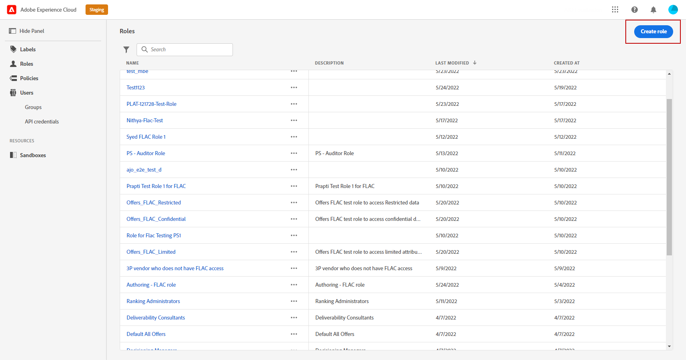
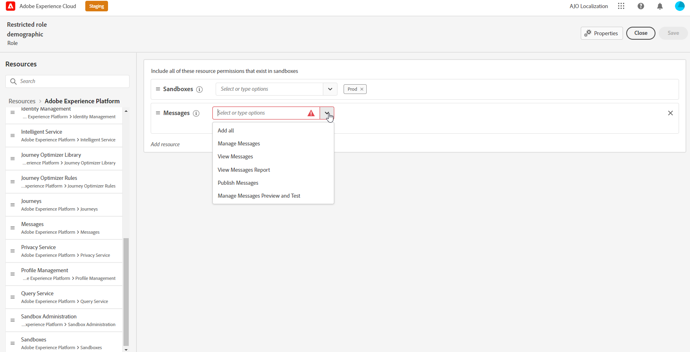

# 속성 기반 액세스 제어 {#attribute-based-access}

속성 기반 액세스 제어(ABAC) 기능을 사용하면 특정 팀이나 사용자 그룹에 대한 데이터 액세스를 관리할 권한을 정의할 수 있습니다. 그 목적은 개인 데이터를 더 이상 보호할 수 있도록 권한이 없는 사용자로부터 민감한 디지털 자산을 보호하는 것입니다.

Adobe Journey Optimizer에서 ABAC를 사용하면 데이터를 보호하고 XDM(경험 데이터 모델) 스키마, 프로필 속성 및 대상을 포함한 특정 필드 요소에 특정 액세스 권한을 부여할 수 있습니다.

ABAC에 사용되는 용어의 자세한 목록은 [Adobe Experience Platform 설명서](https://experienceleague.adobe.com/docs/experience-platform/access-control/abac/overview.html?lang=ko)를 참조하세요.

이 예제에서는 **Nationality** 스키마 필드에 레이블을 추가하여 권한이 없는 사용자의 사용을 제한하려고 합니다. 이를 수행하려면 다음 단계를 수행해야 합니다.

1. 사용자가 스키마 필드에 액세스하고 사용할 수 있도록 새 **[!UICONTROL 역할]**&#x200B;을(를) 만들고 해당 **[!UICONTROL 레이블]**&#x200B;과(와) 함께 할당하십시오.

1. Adobe Experience Platform의 **국적** 스키마 필드에 **[!UICONTROL Label]**&#x200B;을(를) 할당합니다.

1. Adobe Journey Optimizer의 **[!UICONTROL 스키마 필드]**&#x200B;을(를) 사용합니다.

특성 기반 액세스 제어 API를 통해 **[!UICONTROL 역할]**, **[!UICONTROL 정책]** 및 **[!UICONTROL 제품]**&#x200B;에 액세스할 수도 있습니다. 자세한 정보는 이 [설명서](https://experienceleague.adobe.com/docs/experience-platform/access-control/abac/abac-api/overview.html)를 참조하세요.

## 역할 만들기 및 레이블 할당 {#assign-role}

>[!IMPORTANT]
>
>역할에 대한 권한을 관리하려면 먼저 정책을 만들어야 합니다. 자세한 내용은 [Adobe Experience Platform 설명서](https://experienceleague.adobe.com/docs/experience-platform/access-control/abac/permissions-ui/policies.html?lang=ko)를 참조하세요.

**[!UICONTROL 역할]**&#x200B;은(는) 조직 내에서 동일한 권한, 레이블 및 샌드박스를 공유하는 사용자 집합입니다. **[!UICONTROL 역할]**에 속하는 각 사용자는 제품에 포함된 Adobe 앱 및 서비스에 대한 권한이 있습니다.
인터페이스의 특정 기능이나 개체에 대한 사용자 액세스를 미세 조정하려면 **[!UICONTROL 역할]**&#x200B;을(를) 직접 만들 수도 있습니다.

이제 선택한 사용자에게 C2 레이블이 지정된 **국적** 필드에 대한 액세스 권한을 부여하려고 합니다. 이렇게 하려면 특정 사용자 집합으로 새 **[!UICONTROL 역할]**&#x200B;을(를) 만들고 **[!UICONTROL 여정]**&#x200B;에서 **국적** 세부 정보를 사용할 수 있도록 하는 레이블 C2를 부여해야 합니다.

1. [!DNL Permissions] 제품의 왼쪽 창 메뉴에서 **[!UICONTROL 역할]**&#x200B;을(를) 선택하고 **[!UICONTROL 역할 만들기]**&#x200B;를 클릭합니다. 기본 제공 역할에 **[!UICONTROL Label]**&#x200B;을(를) 추가할 수도 있습니다.

   

1. 새 **[!UICONTROL 역할]**&#x200B;에 **[!UICONTROL 이름]** 및 **[!UICONTROL 설명]**&#x200B;을(를) 추가합니다. 여기서 제한된 역할 인구 통계학입니다.

1. 드롭다운에서 **[!UICONTROL 샌드박스]**&#x200B;를 선택합니다.

   

1. **[!UICONTROL 리소스]** 메뉴에서 **[!UICONTROL Adobe Experience Platform]**&#x200B;을(를) 클릭하여 다른 기능을 엽니다. **[!UICONTROL 여정]**&#x200B;을(를) 선택합니다.

   

1. 드롭다운에서 선택한 기능(예: **[!UICONTROL 여정 보기]** 또는 **[!UICONTROL Publish 여정]**)에 연결된 **[!UICONTROL 권한]**&#x200B;을 선택합니다.

   

1. 새로 만든 **[!UICONTROL 역할]**&#x200B;을(를) 저장한 후 **[!UICONTROL 속성]**&#x200B;을(를) 클릭하여 역할에 대한 액세스를 추가로 구성하십시오.

   

1. **[!UICONTROL 사용자]** 탭에서 **[!UICONTROL 사용자 추가]**&#x200B;를 클릭합니다.

   

1. **[!UICONTROL 레이블]** 탭에서 **[!UICONTROL 레이블 추가]**&#x200B;를 선택합니다.

   

1. 역할에 추가할 **[!UICONTROL 레이블]**&#x200B;을(를) 선택하고 **[!UICONTROL 저장]**&#x200B;을 클릭합니다. 이 예제에서는 사용자가 이전에 제한된 스키마의 필드에 액세스할 수 있도록 레이블 C2를 부여합니다.

   

**제한된 역할 인구 통계학적** 역할의 사용자는 이제 C2 레이블이 지정된 개체에 액세스할 수 있습니다.

## Adobe Experience Platform의 오브젝트에 레이블 할당 {#assign-label}

>[!WARNING]
>
>잘못된 레이블 사용으로 인해 사람에 대한 액세스가 중단되고 정책 위반이 트리거될 수 있습니다.

**[!UICONTROL 레이블]**을 사용하여 특성 기반 액세스 제어를 사용하여 특정 기능 영역을 할당할 수 있습니다.
이 예제에서는 **국적** 필드에 대한 액세스를 제한하려고 합니다. 이 필드는 해당 **[!UICONTROL Label]**&#x200B;이(가) **[!UICONTROL 역할]**&#x200B;에 있는 사용자만 액세스할 수 있습니다.

**[!UICONTROL 스키마]**, **[!UICONTROL 데이터 세트]** 및 **[!UICONTROL 대상]**&#x200B;에 **[!UICONTROL 레이블]**&#x200B;을(를) 추가할 수도 있습니다.

1. **[!UICONTROL 스키마]**&#x200B;를 만듭니다. 자세한 내용은 [이 설명서](https://experienceleague.adobe.com/docs/experience-platform/xdm/schema/composition.html?lang=ko-KR)를 참조하세요.

   

1. 새로 만든 **[!UICONTROL 스키마]**&#x200B;에서 먼저 **국적** 필드가 포함된 **[!UICONTROL 인구 통계학적 세부 정보]** 필드 그룹을 추가합니다.

   

1. **[!UICONTROL 레이블]** 탭에서 제한된 필드 이름(여기 **국적**)을 확인하세요. 그런 다음 오른쪽 창 메뉴에서 **[!UICONTROL 거버넌스 레이블 편집]**&#x200B;을 선택합니다.

   

1. 해당 **[!UICONTROL 레이블]**&#x200B;을(를) 선택하십시오. 이 경우 C2 - 데이터를 서드파티로 내보낼 수 없습니다. 사용 가능한 레이블의 자세한 목록을 보려면 [이 페이지](https://experienceleague.adobe.com/docs/experience-platform/data-governance/labels/reference.html#contract-labels)를 참조하세요.

   

1. 필요한 경우 스키마를 추가로 개인화한 다음 활성화합니다. 스키마를 활성화하는 방법에 대한 자세한 단계는 이 [페이지](https://experienceleague.adobe.com/docs/experience-platform/xdm/ui/resources/schemas.html#profile)를 참조하십시오.

이제 스키마의 필드만 표시되며 C2 레이블이 있는 역할 세트의 일부인 사용자만 사용할 수 있습니다.
**[!UICONTROL 필드 이름]**&#x200B;에 **[!UICONTROL 레이블]**&#x200B;을(를) 적용하면 **[!UICONTROL 레이블]**&#x200B;이(가) 만들어진 모든 스키마의 **국적** 필드에 자동으로 적용됩니다.

## Adobe Journey Optimizer에서 레이블이 지정된 오브젝트에 액세스 {#attribute-access-ajo}

새 스키마와 새 역할에서 **국적** 필드 이름에 레이블을 지정하면 이제 Adobe Journey Optimizer에서 이 제한의 영향을 볼 수 있습니다.
예를 들어 C2 레이블이 지정된 개체에 대한 액세스 권한을 가진 첫 번째 사용자 X는 제한된 **[!UICONTROL 필드 이름]**&#x200B;을(를) 타깃팅하는 조건으로 여정을 만듭니다. C2 레이블이 지정된 객체에 대한 액세스 권한이 없는 두 번째 사용자 Y는 여정을 게시해야 합니다.

1. Adobe Journey Optimizer에서는 먼저 새 스키마로 **[!UICONTROL 데이터 원본]**&#x200B;을 구성해야 합니다.

   

1. 새로 만든 **[!UICONTROL 스키마]**&#x200B;의 새 **[!UICONTROL 필드 그룹]**&#x200B;을(를) 기본 제공 **[!UICONTROL 데이터 원본]**&#x200B;에 추가하십시오. 새 외부 **[!UICONTROL 데이터 원본]** 및 연결된 **[!UICONTROL 필드 그룹]**&#x200B;을 만들 수도 있습니다.

   

1. 이전에 만든 **[!UICONTROL 스키마]**&#x200B;를 선택한 후 **[!UICONTROL 필드]** 범주에서 **[!UICONTROL 편집]**&#x200B;을 클릭하세요.

   

1. 타깃팅할 **[!UICONTROL 필드 이름]**&#x200B;을(를) 선택하십시오. 여기서는 제한된 **국적** 필드를 선택합니다.

   

1. 그런 다음 특정 국적의 사용자에게 이메일을 보내는 여정을 만듭니다. **[!UICONTROL 이벤트]**&#x200B;와 **[!UICONTROL 조건]**&#x200B;을 차례로 추가합니다.

   

1. 제한된 **국적** 필드를 선택하여 식 작성을 시작하십시오.

   

1. 제한된 **국적** 필드를 가진 특정 모집단을 타깃팅하려면 **[!UICONTROL 조건]**&#x200B;을(를) 편집하세요.

   

1. 필요에 따라 여정을 개인화하십시오. 여기에서는 **[!UICONTROL 이메일]** 액션을 추가합니다.

   

레이블 C2 오브젝트에 대한 액세스 권한이 없는 여정 Y가 이 제한된 필드로 이 사용자에 액세스해야 하는 경우:

* 제한된 필드 이름은 표시되지 않으므로 사용자 Y는 사용할 수 없습니다.

* 사용자 Y는 고급 모드에서 제한된 필드 이름으로 표현식을 편집할 수 없습니다. 다음 오류가 `The expression is invalid. Field is no longer available or you don't have enough permission to see it`에 나타납니다.

* 사용자 Y는 표현식을 삭제할 수 있습니다.

* 사용자 Y는 여정을 테스트할 수 없습니다.

* 여정 Y는 사용자를 게시할 수 없습니다.
