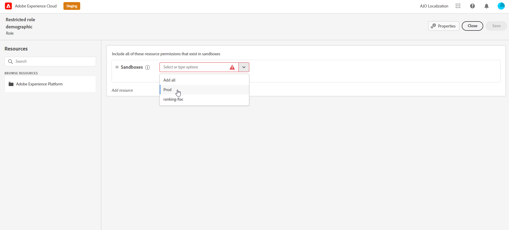
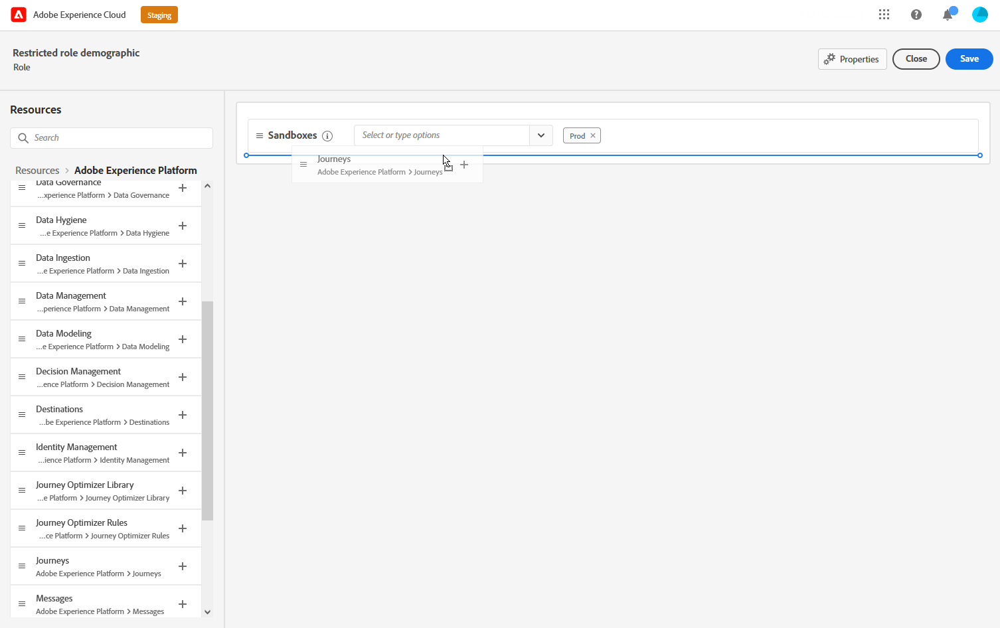
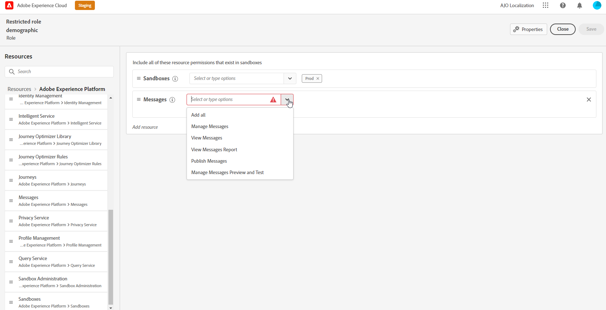
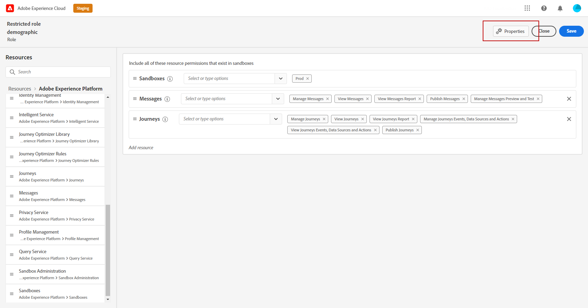
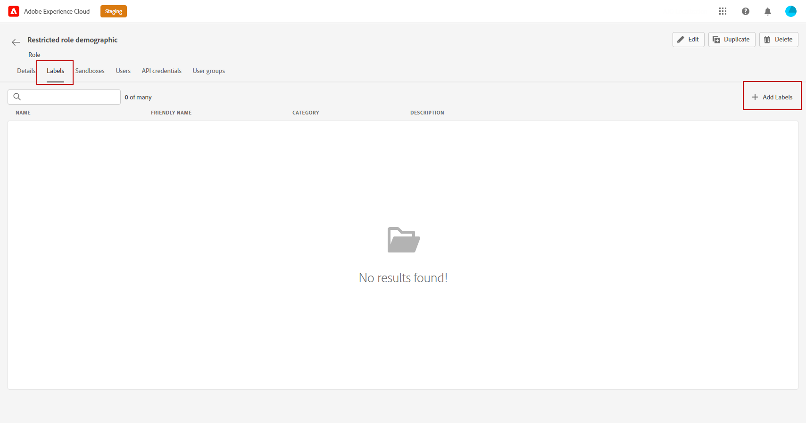
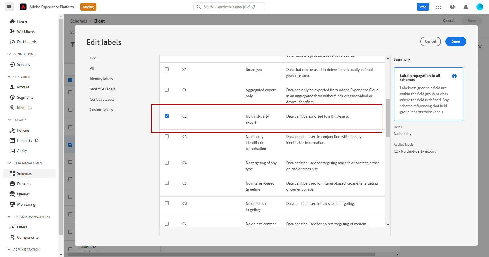
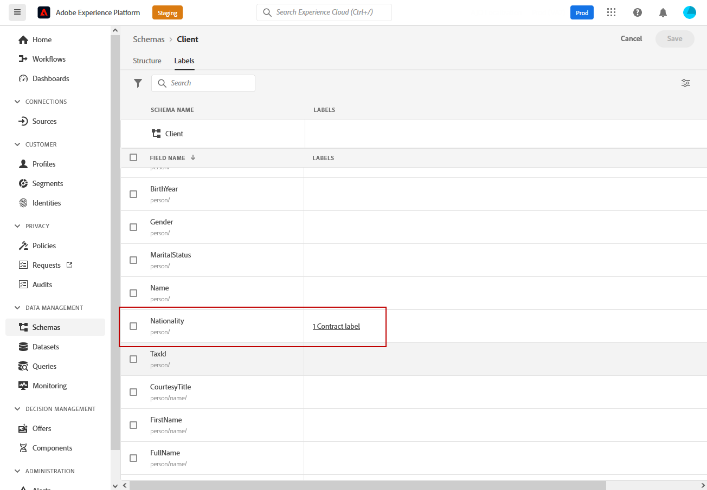
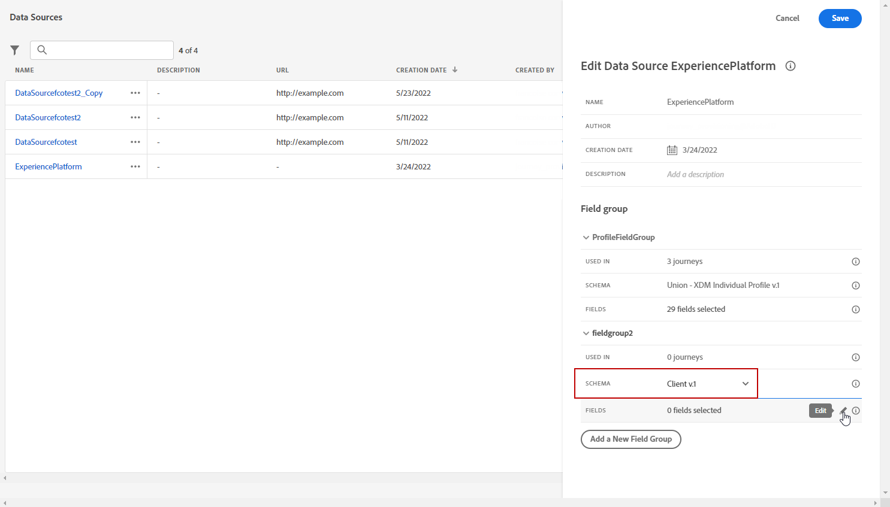
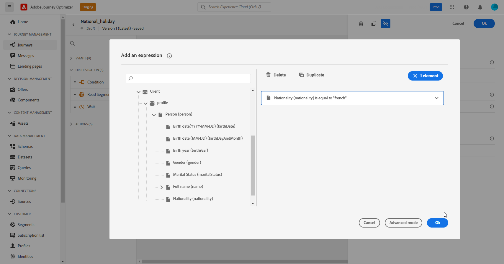
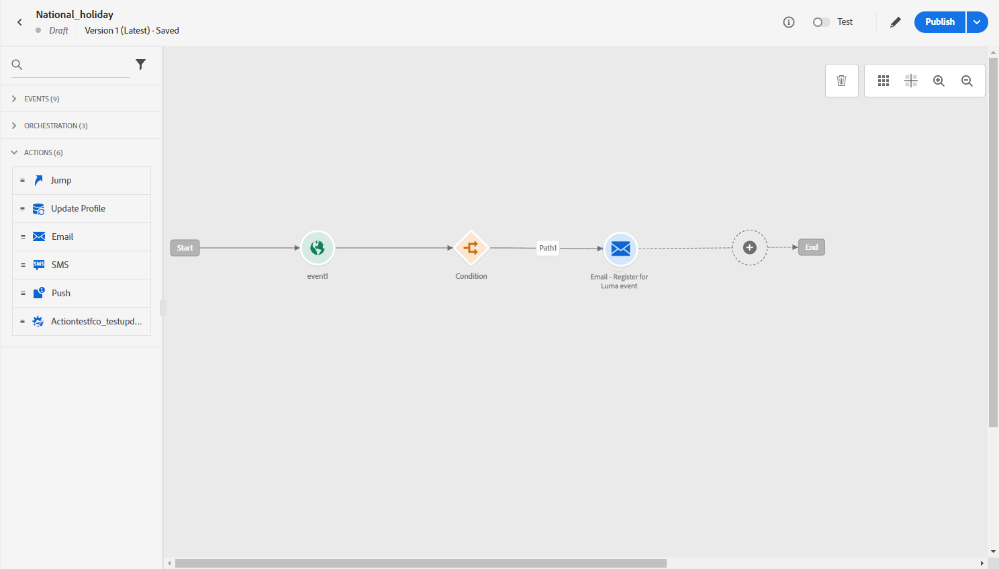

# 속성 기반 액세스 제어 {#attribute-based-access}

>[!BEGINSHADEBOX]

**이 페이지에서:** Adobe Journey Optimizer의 특성 기반 액세스 제어를 사용하여 중요한 스키마 필드, 프로필 특성 및 대상을 승인된 역할로 제한하면 개인 데이터를 보호하고 권한이 없는 사용자가 해당 역할을 수행하지 못하도록 할 수 있습니다.

>[!ENDSHADEBOX]

속성 기반 액세스 제어 기능을 사용하면 특정 팀이나 사용자 그룹에 대한 데이터 액세스를 관리할 권한을 정의할 수 있습니다. 그 목적은 승인되지 않은 사용자로부터 민감한 디지털 자산을 보호하여 개인 데이터를 더욱 안전하게 보호하는 것입니다.

Adobe Journey Optimizer의 속성 기반 액세스 제어를 사용하여 데이터를 보호하고 XDM(Experience Data Model) 스키마, 프로필 속성 및 대상을 비롯한 특정 필드 요소에 특정 액세스 권한을 부여합니다.

특성 기반 액세스 제어에 사용되는 용어의 자세한 목록을 보려면 [Adobe Experience Platform 설명서](https://experienceleague.adobe.com/docs/experience-platform/access-control/abac/overview.html?lang=ko){target="_blank"}를 참조하세요.

이 예제에서는 권한이 없는 사용자가 사용할 수 없도록 제한하기 위해 **Nationality** 스키마 필드에 레이블을 추가합니다. 이를 수행하려면 다음 단계를 수행하십시오.

1. 사용자가 스키마 필드에 액세스하고 사용할 수 있도록 새 **[!UICONTROL 역할]**&#x200B;을(를) 만들고 해당 **[!UICONTROL 레이블]**&#x200B;과(와) 함께 할당하십시오.

1. Adobe Experience Platform의 **국적** 스키마 필드에 **[!UICONTROL Label]**&#x200B;을(를) 할당합니다.

1. Adobe Journey Optimizer의 **[!UICONTROL 스키마 필드]**&#x200B;을(를) 사용합니다.

특성 기반 액세스 제어 API를 사용하여 **[!UICONTROL 역할]**, **[!UICONTROL 정책]** 및 **[!UICONTROL 제품]**&#x200B;에 액세스할 수도 있습니다. 자세한 내용은 이 [설명서](https://experienceleague.adobe.com/docs/experience-platform/access-control/abac/abac-api/overview.html){target="_blank"}를 참조하세요.

## 역할 만들기 및 레이블 할당 {#assign-role}

>[!IMPORTANT]
>
>&#x200B;>역할에 대한 권한을 관리하려면 먼저 정책을 만듭니다. 자세한 내용은 [Adobe Experience Platform 설명서](https://experienceleague.adobe.com/docs/experience-platform/access-control/abac/permissions-ui/policies.html){target="_blank"}를 참고하세요.

**[!UICONTROL 역할]**&#x200B;은(는) 조직 내에서 동일한 권한, 레이블 및 샌드박스를 공유하는 사용자 집합입니다. **[!UICONTROL 역할]**&#x200B;에 속하는 각 사용자는 제품에 포함된 Adobe 앱 및 서비스에 대한 권한이 있습니다. 자신만의 **[!UICONTROL 역할]**&#x200B;을 만들어 인터페이스의 특정 기능이나 개체에 대한 사용자 액세스를 세밀하게 조정할 수도 있습니다.

선택한 사용자에게 C2 레이블이 지정된 **국적** 필드에 대한 액세스 권한을 부여하려면 특정 사용자 집합으로 새 **[!UICONTROL 역할]**&#x200B;을(를) 만들고 레이블 C2를 부여하면 **[!UICONTROL 여정]**&#x200B;에서 **국적** 세부 정보를 사용할 수 있습니다.

1. [!DNL Permissions] 제품의 왼쪽 창 메뉴에서 **[!UICONTROL 역할]**&#x200B;을(를) 선택하고 **[!UICONTROL 역할 만들기]**&#x200B;를 클릭합니다. 기본 제공 역할에 **[!UICONTROL Label]**&#x200B;을(를) 추가할 수도 있습니다.

   

1. 새 **[!UICONTROL 역할]**&#x200B;에 **[!UICONTROL 이름]** 및 **[!UICONTROL 설명]**&#x200B;을(를) 추가합니다. 여기서 제한된 역할 인구 통계학입니다.

1. 드롭다운에서 **[!UICONTROL 샌드박스]**&#x200B;를 선택합니다.

   

1. **[!UICONTROL 리소스]** 메뉴에서 **[!UICONTROL Adobe Experience Platform]**&#x200B;을(를) 클릭하여 다른 기능을 엽니다. **[!UICONTROL 여정]**&#x200B;을(를) 선택합니다.

   

1. 드롭다운에서 선택한 기능(예: **[!UICONTROL 여정 보기]** 또는 **[!UICONTROL 여정 게시]**)에 연결된 **[!UICONTROL 권한]**&#x200B;을 선택합니다.

   

1. 새로 만든 **[!UICONTROL 역할]**&#x200B;을(를) 저장한 후 **[!UICONTROL 속성]**&#x200B;을(를) 클릭하여 역할에 대한 액세스를 추가로 구성하십시오.

   

1. **[!UICONTROL 사용자]** 탭에서 **[!UICONTROL 사용자 추가]**&#x200B;를 클릭합니다.

   

1. **[!UICONTROL 레이블]** 탭에서 **[!UICONTROL 레이블 추가]**&#x200B;를 선택합니다.

   

1. 역할에 추가할 **[!UICONTROL 레이블]**&#x200B;을(를) 선택하고 **[!UICONTROL 저장]**&#x200B;을 클릭합니다. 이 예에서는 사용자가 이전에 제한된 스키마의 필드에 액세스할 수 있도록 레이블 C2를 부여합니다.

   

**제한된 역할 인구 통계학적** 역할의 사용자는 이제 C2 레이블이 지정된 개체에 액세스할 수 있습니다.

## Adobe Experience Platform의 오브젝트에 레이블 할당 {#assign-label}

>[!WARNING]
>
>잘못된 레이블 사용으로 인해 사람에 대한 액세스가 중단되고 정책 위반이 트리거될 수 있습니다.

특성 기반 액세스 제어를 사용하여 **[!UICONTROL 레이블]**&#x200B;을(를) 사용하여 특정 기능 영역을 할당할 수 있습니다. 이 예제에서는 **국적** 필드에 대한 액세스가 제한됩니다. 이 필드는 해당 **[!UICONTROL 레이블]**&#x200B;이(가) **[!UICONTROL 역할]**&#x200B;에 할당된 사용자만 액세스할 수 있습니다.

**[!UICONTROL 스키마]**, **[!UICONTROL 데이터 세트]** 및 **[!UICONTROL 대상]**&#x200B;에 **[!UICONTROL 레이블]**&#x200B;을(를) 추가할 수도 있습니다.

1. **[!UICONTROL 스키마]**&#x200B;를 만듭니다. 자세한 내용은 [이 설명서](https://experienceleague.adobe.com/docs/experience-platform/xdm/schema/composition.html?lang=ko-KR){target="_blank"}를 참조하세요.

   

1. 새로 만든 **[!UICONTROL 스키마]**&#x200B;에서 먼저 **국적** 필드가 포함된 **[!UICONTROL 인구 통계학적 세부 정보]** 필드 그룹을 추가합니다.

   

1. **[!UICONTROL 레이블]** 탭에서 제한된 필드 이름(여기 **국적**)을 확인하세요. 그런 다음 오른쪽 창 메뉴에서 **[!UICONTROL 거버넌스 레이블 편집]**&#x200B;을 선택합니다.

   

1. 해당 **[!UICONTROL 레이블]**&#x200B;을(를) 선택하십시오. 이 경우 C2 - 데이터를 서드파티로 내보낼 수 없습니다. 사용 가능한 레이블의 자세한 목록을 보려면 [이 페이지](https://experienceleague.adobe.com/docs/experience-platform/data-governance/labels/reference.html#contract-labels){target="_blank"}를 참조하세요.

   

1. 필요한 경우 스키마를 추가로 개인화한 다음 활성화합니다. 스키마를 활성화하는 방법에 대한 자세한 단계는 이 [페이지](https://experienceleague.adobe.com/docs/experience-platform/xdm/ui/resources/schemas.html#profile){target="_blank"}를 참조하십시오.

이제 C2 레이블이 있는 역할 세트의 일부인 사용자만 스키마의 필드를 볼 수 있고 사용할 수 있습니다. **[!UICONTROL 필드 이름]**&#x200B;에 **[!UICONTROL 레이블]**&#x200B;을(를) 적용하면 **[!UICONTROL 레이블]**&#x200B;이(가) 만들어진 모든 스키마의 **국적** 필드에 자동으로 적용됩니다.

## Adobe Journey Optimizer에서 레이블이 지정된 오브젝트에 액세스 {#attribute-access-ajo}

새 스키마 및 역할에서 **국적** 필드 이름에 레이블을 지정한 후 이 제한의 영향을 Adobe Journey Optimizer에서 확인할 수 있습니다. 이 예제의 경우:

* C2 레이블이 지정된 개체에 대한 액세스 권한을 가진 여정 X는 제한된 **[!UICONTROL 필드 이름]**&#x200B;을(를) 대상으로 하는 조건으로 사용자를 만듭니다.
* C2 레이블이 지정된 객체에 대한 액세스 권한이 없는 사용자 Y는 여정 게시를 시도합니다.

1. Adobe Journey Optimizer에서 새 스키마로 **[!UICONTROL 데이터 원본]**&#x200B;을(를) 구성합니다.

   

1. 새로 만든 **[!UICONTROL 스키마]**&#x200B;의 새 **[!UICONTROL 필드 그룹]**&#x200B;을(를) 기본 제공 **[!UICONTROL 데이터 원본]**&#x200B;에 추가하십시오. 새 외부 **[!UICONTROL 데이터 원본]** 및 연결된 **[!UICONTROL 필드 그룹]**&#x200B;을 만들 수도 있습니다.

   

1. 이전에 만든 **[!UICONTROL 스키마]**&#x200B;를 선택한 후 **[!UICONTROL 필드]** 범주에서 **[!UICONTROL 편집]**&#x200B;을 클릭하세요.

   

1. 타깃팅할 **[!UICONTROL 필드 이름]**&#x200B;을(를) 선택하십시오. 여기서는 제한된 **국적** 필드를 선택합니다.

   

1. 특정 국적의 사용자에게 이메일을 보내는 여정을 만듭니다. **[!UICONTROL Event]** 및 **[!UICONTROL Condition]**&#x200B;을(를) 추가합니다.

   

1. 제한된 **국적** 필드를 선택하여 식 작성을 시작하십시오.

   

1. 제한된 **국적** 필드를 가진 특정 모집단을 타깃팅하려면 **[!UICONTROL 조건]**&#x200B;을(를) 편집하세요.

   

1. 필요에 따라 여정을 개인화하십시오. 여기에서는 **[!UICONTROL 이메일]** 액션을 추가합니다.

   

사용자 Y가 레이블 C2 오브젝트에 대한 액세스 권한이 없는 경우 제한된 필드로 이 여정에 액세스해야 합니다.

* 제한된 필드 이름은 표시되지 않으므로 사용자 Y는 사용할 수 없습니다.
* 사용자 Y는 고급 모드에서 제한된 필드 이름으로 표현식을 편집할 수 없습니다. 다음 오류가 표시됩니다. `The expression is invalid. Field is no longer available or you do not have enough permission to see it`.
* 사용자 Y는 표현식을 삭제할 수 있습니다.
* 사용자 Y는 여정을 테스트할 수 없습니다.
* 여정 Y는 사용자를 게시할 수 없습니다.

+++ AI 기술 자료 참조

이 단원에는 이 주제와 관련된 해석, 검색 및 질문 답변을 지원하기 위한 구조화된 지식이 포함되어 있습니다.

이해를 돕기 위해 이 정보를 이 페이지의 설명서와 통합해야 합니다. 두 소스 모두 독립적으로 사용하기 위한 것은 아닙니다. 이 페이지에서는 기능에 대해 설명하지만, 용어, 의도, 적용 가능성 및 제약 조건을 명확히 하는 데 도움이 되는 추가 컨텍스트를 제공합니다.

* **TL;DR:** 스키마 필드에 거버넌스 레이블을 적용하고 역할에 일치하는 레이블을 할당하여 Journey Optimizer의 중요한 데이터 필드를 보호하므로 권한이 없는 사용자가 이러한 제한된 필드를 사용하는 여정을 보거나, 편집하거나, 테스트하거나, 게시할 수 없습니다.

**의도:**

* 역할을 만들고 거버넌스 레이블을 할당하여 특정 스키마 필드에 대한 액세스를 제한합니다.
* Adobe Experience Platform의 스키마 필드에 레이블을 적용하여 액세스 제한을 적용합니다
* Journey Optimizer 여정에서 레이블이 지정된 스키마 필드 사용
* 여정에서 필수 레이블 경험 액세스 제한이 없는 사용자가 어떻게 액세스하는지 이해합니다.
* 속성 기반 액세스 제어 API를 통해 역할, 정책 및 제품 관리

**용어집:**

* **ABAC(특성 기반 액세스 제어)**: 레이블 *(제품별)과 같은 특성을 기반으로 특정 팀이나 사용자 그룹의 데이터 액세스를 관리할 권한을 정의하는 기능*
* **역할**: 조직 *(제품별) 내에서 동일한 권한, 레이블 및 샌드박스를 공유하는 사용자 집합*
* **레이블**: 스키마 필드, 데이터 세트 또는 대상에 적용되어 *(제품별)에 액세스할 수 있는 역할을 제어하는 거버넌스 마커(예: C2)*
* **정책**: 역할에 대한 권한을 관리하기 전에 만들어야 하는 구성 — ABAC *(제품별)에 대한 필수 구성 요소*
* **XDM 스키마**: Adobe Experience Platform *(제품별)에서 데이터 구조를 정의하는 데 사용되는 Experience Data Model 스키마*

**보호 기능:**

* 역할에 대한 권한을 관리하려면 먼저 정책을 만들어야 합니다(페이지의 중요 참고 사항에 설명된 대로 사전 요구 사항)
* 잘못된 레이블 사용으로 인해 사람에 대한 액세스가 중단되고 정책 위반이 트리거될 수 있습니다(페이지의 경고에 설명)
* 제한된 필드와 일치하는 레이블이 없는 사용자는 제한된 필드 이름을 보거나, 고급 모드에서 이를 참조하는 표현식을 편집하거나, 여정을 테스트하거나, 여정을 게시할 수 없습니다

**용어:**

* 정식 이름: 속성 기반 액세스 제어 — 약어: ABAC — 변형: 속성 기반 액세스 관리
* 정식 이름: Experience Data Model — 약어: XDM — 변형: XDM 스키마, XDM 스키마
* 동의어: &quot;Label&quot; = &quot;governance label&quot; = &quot;data governance label&quot;
* 혼동하지 마십시오. &quot;역할&quot;(공유 권한 및 레이블을 가진 사용자 그룹) ≠ &quot;정책&quot;(레이블을 기반으로 데이터 액세스 시행을 제어하는 규칙)
* ABAC(플랫폼 수준에서 레이블 정책을 통해 스키마 필드, 데이터 세트 및 대상에 대한 액세스를 제어) ≠ OLAC(여정 및 캠페인과 같은 특정 Journey Optimizer 개체에 대한 액세스를 제어)

**FAQ:**

* **Q: 기본 제공 역할에 레이블을 추가할 수 있습니까?** — 예. 사용자 정의 역할과 기본 제공 역할 모두에 레이블을 추가할 수 있습니다.
* **Q: 여정의 제한된 필드에 대한 레이블이 없는 사용자는 어떻게 됩니까?** — 필드가 사용자에게 표시되지 않으므로 해당 필드를 참조하는 표현식을 편집하거나, 여정을 테스트하거나, 여정을 게시할 수 없습니다.
* **Q: 스키마 필드 이외의 개체에 레이블을 적용할 수 있습니까?** — 예. 스키마, 데이터 세트 및 대상에도 레이블을 적용할 수 있습니다.
* **Q: ABAC를 사용하여 역할, 정책 및 제품을 관리하는 API가 있습니까?** — 예. 속성 기반 액세스 제어 API를 통해 역할, 정책 및 제품에 액세스할 수 있습니다.

+++
<!-- ai-accordion-version: 1 | source-hash: aa94c226 -->