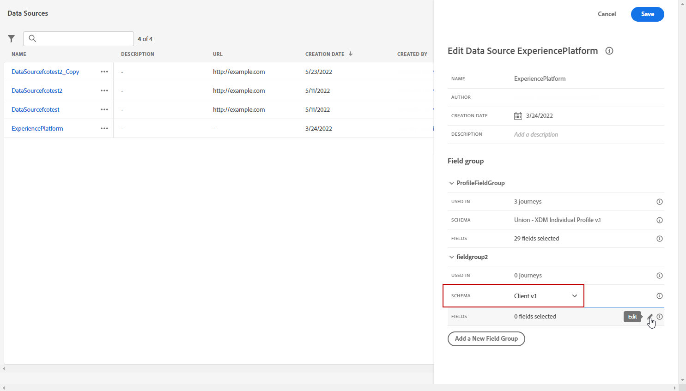

# 속성 기반 액세스 제어 {#attribute-based-access}

속성 기반 액세스 제어(ABAC)를 사용하면 특정 팀이나 사용자 그룹에 대한 데이터 액세스를 관리할 권한을 정의할 수 있습니다. 그 목적은 개인 데이터를 더 이상 보호할 수 있도록 권한이 없는 사용자로부터 민감한 디지털 자산을 보호하는 것입니다.

Adobe Journey Optimizer에서 ABAC를 사용하면 데이터를 보호하고 XDM(경험 데이터 모델) 스키마, 프로필 속성 및 세그먼트를 포함한 특정 필드 요소에 특정 액세스 권한을 부여할 수 있습니다.

ABAC에 사용되는 용어의 자세한 목록은 다음을 참조하십시오. [Adobe Experience Platform 설명서](https://experienceleague.adobe.com/docs/experience-platform/access-control/abac/overview.html).

이 예제에서는 레이블을 **국적** 권한이 없는 사용자가 사용할 수 없도록 제한하는 스키마 필드. 이를 수행하려면 다음 단계를 수행해야 합니다.

1. 새로 만들기  **[!UICONTROL 역할]** 및 해당 와 할당  **[!UICONTROL 레이블]** 사용자가 스키마 필드에 액세스하고 사용할 수 있도록 합니다.

1. 할당  **[!UICONTROL 레이블]** (으)로 **국적** Adobe Experience Platform의 스키마 필드.

1. 사용  **[!UICONTROL 스키마 필드]** Adobe Journey Optimizer.

참고: **[!UICONTROL 역할]**, **[!UICONTROL 정책]** 및 **[!UICONTROL 제품]** 속성 기반 액세스 제어 API로 액세스할 수도 있습니다. 자세한 정보는 다음을 참조하십시오. [설명서](https://experienceleague.adobe.com/docs/experience-platform/access-control/abac/abac-api/overview.html).

## 역할 만들기 및 레이블 할당 {#assign-role}

>[!IMPORTANT]
>
>역할에 대한 권한을 관리하려면 먼저 정책을 만들어야 합니다. 자세한 내용은 다음을 참조하십시오. [Adobe Experience Platform 설명서](https://experienceleague.adobe.com/docs/experience-platform/access-control/abac/permissions-ui/policies.html).

**[!UICONTROL 역할]** 는 조직 내에서 동일한 권한, 레이블 및 샌드박스를 공유하는 사용자 세트입니다. 에 속한 각 사용자 **[!UICONTROL 역할]** 은 제품에 포함된 Adobe 앱 및 서비스를 이용할 수 있습니다.
자신만의 고유한 을 만들 수도 있습니다 **[!UICONTROL 역할]** 인터페이스에서 특정 기능 또는 개체에 대한 사용자 액세스를 미세 조정하려는 경우.

이제 선택한 사용자에게 다음에 대한 액세스 권한을 부여합니다. **국적** C2라는 레이블이 지정된 필드입니다. 그러기 위해서는 새로운 를 만들어야 합니다 **[!UICONTROL 역할]** 특정 사용자 집합을 사용하여 레이블 C2를 부여하면 **국적** 의 세부 사항 **[!UICONTROL 여정]**.

1. 다음에서 [!DNL Permissions] product, select **[!UICONTROL 역할]** 왼쪽 창 메뉴에서 **[!UICONTROL 역할 만들기]**. 을 추가할 수도 있습니다. **[!UICONTROL 레이블]** 기본 제공 역할로 변경되었습니다.

   

1. 추가 **[!UICONTROL 이름]** 및 **[!UICONTROL 설명]** 새 사용자에게 **[!UICONTROL 역할]**, 여기: 제한된 역할 인구 통계학.

1. 드롭다운에서 다음을 선택합니다. **[!UICONTROL 샌드박스]**.

   

1. 다음에서 **[!UICONTROL 리소스]** 메뉴, 클릭 **[!UICONTROL Adobe Experience Platform]** 다른 기능을 엽니다. 여기에서 다음을 선택합니다. **[!UICONTROL 여정]**.

   

1. 드롭다운에서 **[!UICONTROL 권한]** 다음과 같이 선택한 기능에 연결됨 **[!UICONTROL 여정 보기]** 또는 **[!UICONTROL 여정 게시]**.

   

1. 새로 만든 을 저장한 후 **[!UICONTROL 역할]**, 클릭 **[!UICONTROL 속성]** 역할에의 액세스를 추가로 구성합니다.

   

1. 다음에서 **[!UICONTROL 사용자]** 탭을 클릭하고 **[!UICONTROL 사용자 추가]**.

   

1. 다음에서 **[!UICONTROL 레이블]** 탭, 선택 **[!UICONTROL 레이블 추가]**.

   

1. 다음 항목 선택 **[!UICONTROL 레이블]** 을(를) 역할에 추가하고 을(를) 클릭합니다. **[!UICONTROL 저장]**. 이 예제에서는 사용자가 이전에 제한된 스키마의 필드에 액세스할 수 있도록 레이블 C2를 부여합니다.

   

의 사용자 **제한된 역할 인구 통계** 이제 역할에서 C2 레이블이 지정된 객체에 액세스할 수 있습니다.

## Adobe Experience Platform의 오브젝트에 레이블 할당 {#assign-label}

>[!WARNING]
>
>잘못된 레이블 사용으로 인해 사람에 대한 액세스가 중단되고 정책 위반이 트리거될 수 있습니다.

**[!UICONTROL 레이블]** 속성 기반 액세스 제어를 사용하여 특정 기능 영역을 할당하는 데 사용할 수 있습니다.
이 예제에서는 다음에 대한 액세스를 제한하려고 합니다. **국적** 필드. 이 필드는 해당하는 사용자만 액세스할 수 있습니다. **[!UICONTROL 레이블]** 대상  **[!UICONTROL 역할]**.

을 추가할 수도 있습니다.  **[!UICONTROL 레이블]** 끝  **[!UICONTROL 스키마]**,  **[!UICONTROL 데이터 세트]** 및  **[!UICONTROL 세그먼트]**.

1. 사용자 만들기 **[!UICONTROL 스키마]**. 자세한 내용은 다음을 참조하십시오. [이 설명서](https://experienceleague.adobe.com/docs/experience-platform/xdm/schema/composition.html?lang=ko-KR).

   

1. 새로 만든 **[!UICONTROL 스키마]**, 먼저 다음을 추가합니다. **[!UICONTROL 인구 통계 세부 정보]** 다음을 포함하는 필드 그룹 **국적** 필드.

   

1. 다음에서 **[!UICONTROL 레이블]** 탭에서 제한된 필드 이름을 확인합니다. 여기에서 **국적**. 그런 다음 오른쪽 창 메뉴에서 **[!UICONTROL 거버넌스 레이블 편집]**.

   

1. 해당 항목 선택 **[!UICONTROL 레이블]**, 이 경우 C2 - 데이터를 서드파티로 내보낼 수 없습니다. 사용 가능한 레이블의 자세한 목록은 다음을 참조하십시오. [이 페이지](https://experienceleague.adobe.com/docs/experience-platform/data-governance/labels/reference.html#contract-labels).

   

1. 필요한 경우 스키마를 추가로 개인화한 다음 활성화합니다. 스키마를 활성화하는 방법에 대한 자세한 단계는 다음을 참조하십시오 [페이지](https://experienceleague.adobe.com/docs/experience-platform/xdm/ui/resources/schemas.html#profile).

이제 스키마의 필드만 표시되며 C2 레이블이 있는 역할 세트의 일부인 사용자만 사용할 수 있습니다.
를 적용하여 **[!UICONTROL 레이블]** (으)로 **[!UICONTROL 필드 이름]**, 다음 사항에 주의하십시오. **[!UICONTROL 레이블]** 이(가) 다음에 자동으로 적용됩니다. **국적** 생성된 모든 스키마의 필드.

## Adobe Journey Optimizer에서 레이블이 지정된 오브젝트에 액세스 {#attribute-access-ajo}

에 레이블을 지정한 후 **국적** 새 스키마의 필드 이름 및 새 역할의 경우 이제 Adobe Journey Optimizer에서 이 제한의 영향을 볼 수 있습니다.
예를 들어 C2 레이블이 지정된 객체에 대한 액세스 권한을 가진 첫 번째 사용자 X는 제한된 대상을 타겟팅하는 조건을 가진 여정을 만듭니다 **[!UICONTROL 필드 이름]**. C2 레이블이 지정된 객체에 대한 액세스 권한이 없는 두 번째 사용자 Y는 여정을 게시해야 합니다.

1. Adobe Journey Optimizer에서 먼저 다음을 구성해야 합니다 **[!UICONTROL 데이터 소스]** 새 스키마와 함께.

   

1. 새 항목 추가 **[!UICONTROL 필드 그룹]** 새로 만든 **[!UICONTROL 스키마]** 기본 제공 **[!UICONTROL 데이터 소스]**. 새 외부 파일을 만들 수도 있습니다 **[!UICONTROL 데이터 소스]** 및 연결됨 **[!UICONTROL 필드 그룹]**.

   

1. 이전에 만든 을(를) 선택한 후 **[!UICONTROL 스키마]**, 클릭 **[!UICONTROL 편집]** 다음에서 **[!UICONTROL 필드]** 범주.

   

1. 다음 항목 선택 **[!UICONTROL 필드 이름]** 타겟팅하려고 합니다. 여기에서는 제한된 항목을 선택합니다 **국적** 필드.

   

1. 그런 다음 특정 국적의 사용자에게 이메일을 보내는 여정을 만듭니다. 추가 **[!UICONTROL 이벤트]** 다음 a **[!UICONTROL 조건]**.

   

1. 제한된 항목 선택 **국적** 표현식 작성을 시작하는 필드입니다.

   

1. 편집 **[!UICONTROL 조건]** 제한된 특정 모집단을 타겟팅하려면 **국적** 필드.

   

1. 필요에 따라 여정을 개인화합니다. 여기에서 다음을 추가합니다. **[!UICONTROL 이메일]** 작업.

   

레이블 C2 오브젝트에 대한 액세스 권한이 없는 여정 Y가 이 제한된 필드로 이 사용자에 액세스해야 하는 경우:

* 제한된 필드 이름은 표시되지 않으므로 사용자 Y는 사용할 수 없습니다.

* 사용자 Y는 고급 모드에서 제한된 필드 이름으로 표현식을 편집할 수 없습니다. 다음 오류가 표시됩니다 `The expression is invalid. Field is no longer available or you don't have enough permission to see it`.

* 사용자 Y는 표현식을 삭제할 수 있습니다.

* 사용자 Y는 여정을 테스트할 수 없습니다.

* 여정 Y는 사용자를 게시할 수 없습니다.
