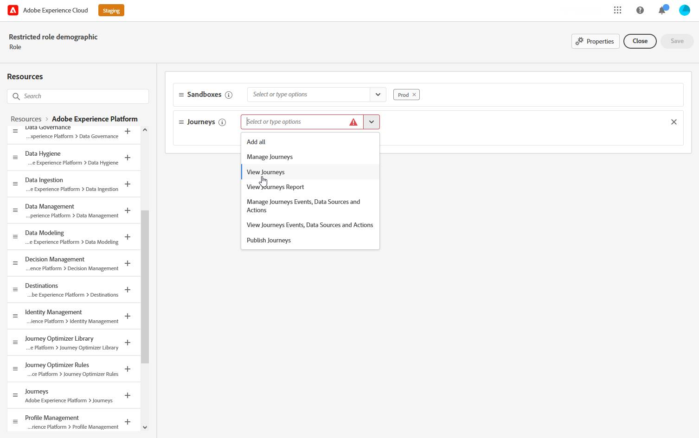

# 속성 기반 액세스 제어 {#attribute-based-access}

>[!IMPORTANT]
>
>속성 기반 액세스 제어 사용은 현재 선택한 고객으로 제한되며 향후 릴리스의 모든 환경에 배포될 예정입니다.

ABAC(속성 기반 액세스 제어)를 사용하면 특정 팀 또는 사용자 그룹의 데이터 액세스를 관리하기 위한 권한을 정의할 수 있습니다. 이 소프트웨어의 목적은 개인 데이터를 추가로 보호할 수 있도록 권한이 없는 사용자로부터 중요한 디지털 자산을 보호하는 것입니다.

Adobe Journey Optimizer에서 ABAC를 사용하면 데이터를 보호하고 XDM(Experience Data Model) 스키마, 프로필 속성 및 세그먼트를 포함한 특정 필드 요소에 대한 특정 액세스 권한을 부여할 수 있습니다.

ABAC에서 사용되는 용어에 대한 자세한 목록은 다음을 참조하십시오 [Adobe Experience Platform 설명서](https://experienceleague.adobe.com/docs/experience-platform/access-control/abac/overview.html).

이 예제에서는 레이블을 **국적** 권한이 없는 사용자가 스키마 필드를 사용하지 못하도록 제한합니다. 이를 수행하려면 다음 단계를 수행해야 합니다.

1. 새 만들기  **[!UICONTROL 역할]** 그리고 해당  **[!UICONTROL 레이블]** 사용자가 스키마 필드에 액세스하여 사용할 수 있도록 합니다.

1. 할당  **[!UICONTROL 레이블]** 변환 후 **국적** Adobe Experience Platform의 스키마 필드.

1. 를 사용하십시오  **[!UICONTROL 스키마 필드]** Adobe Journey Optimizer.

참고 사항 **[!UICONTROL 역할]**, **[!UICONTROL 정책]** 및 **[!UICONTROL 제품]** 속성 기반 액세스 제어 API로 액세스할 수도 있습니다. 자세한 내용은 다음을 참조하십시오 [설명서](https://experienceleague.adobe.com/docs/experience-platform/access-control/abac/abac-api/overview.html).

## 역할 만들기 및 레이블 지정 {#assign-role}

>[!IMPORTANT]
>
>역할에 대한 권한을 관리하려면 먼저 정책을 만들어야 합니다. 자세한 내용은 [Adobe Experience Platform 설명서](https://experienceleague.adobe.com/docs/experience-platform/access-control/abac/permissions-ui/policies.html).

**[!UICONTROL 역할]** 는 조직 내에서 동일한 권한, 레이블 및 샌드박스를 공유하는 사용자 집합입니다. 에 속하는 각 사용자 **[!UICONTROL 역할]** 는 제품에 포함된 Adobe 앱 및 서비스를 통해 권한을 받습니다.
직접 만들 수도 있습니다 **[!UICONTROL 역할]** 인터페이스에서 특정 기능 또는 개체에 대한 사용자의 액세스를 세밀하게 조정하려면

이제 선택한 사용자에게 **국적** 필드에 C2라는 레이블이 지정됩니다. 이를 위해서는 새로운 기능이 필요합니다 **[!UICONTROL 역할]** 특정 사용자 세트를 사용하여 사용자가 Marketing Cloud ID 클라이언트측 또는 서버측을 위해 **국적** 의 세부 사항 **[!UICONTROL 여정]**.

1. 에서 [!DNL Permissions] product, select **[!UICONTROL 역할]** 왼쪽 창 메뉴에서 **[!UICONTROL 역할 만들기]**. 다음을 추가할 수도 있습니다 **[!UICONTROL 레이블]** 기본 제공 역할 을 참조하십시오.

   

1. 추가 **[!UICONTROL 이름]** 및 **[!UICONTROL 설명]** 새 **[!UICONTROL 역할]**&#x200B;에는 다음이 포함되어 있습니다. 제한된 역할 인구 통계학.

1. 드롭다운에서 을(를) 선택합니다. **[!UICONTROL 샌드박스]**.

   

1. 에서 **[!UICONTROL 리소스]** 메뉴 아래의 **[!UICONTROL Adobe Experience Platform]** 를 눌러 다른 기능을 엽니다. 여기서는 **[!UICONTROL 여정]**.

   

1. 드롭다운에서 을(를) 선택합니다. **[!UICONTROL 권한]** 다음과 같이 선택한 피쳐에 연결됩니다. **[!UICONTROL 여정 보기]** 또는 **[!UICONTROL 여정 게시]**.

   

1. 새로 만든 파일을 저장한 후 **[!UICONTROL 역할]**&#x200B;를 클릭합니다. **[!UICONTROL 속성]** 역할에 대한 액세스를 추가로 구성합니다.

   

1. 에서 **[!UICONTROL 사용자]** 탭, **[!UICONTROL 사용자 추가]**.

   

1. 에서 **[!UICONTROL 레이블]** 탭, 선택 **[!UICONTROL 레이블 추가]**.

   

1. 을(를) 선택합니다 **[!UICONTROL 레이블]** 역할에 을 추가하고 **[!UICONTROL 저장]**. 이 예에서는 사용자가 이전에 제한된 스키마의 필드에 액세스할 수 있도록 레이블 C2를 부여합니다.

   

의 사용자 **제한된 역할 인구 통계** 이제 역할은 C2에서 레이블이 지정된 객체에 액세스할 수 있습니다.

## Adobe Experience Platform에서 개체에 레이블 지정 {#assign-label}

>[!WARNING]
>
>레이블 사용이 잘못되면 사람에 대한 액세스가 중단되고 정책 위반이 발생할 수 있습니다.

**[!UICONTROL 레이블]** 속성 기반 액세스 제어를 사용하여 특정 기능 영역을 할당하는 데 사용할 수 있습니다.
이 예제에서는 **국적** 필드. 이 필드는 해당 **[!UICONTROL 레이블]** 해당  **[!UICONTROL 역할]**.

다음을 추가할 수도 있습니다  **[!UICONTROL 레이블]** to  **[!UICONTROL 스키마]**,  **[!UICONTROL 데이터 세트]** 및  **[!UICONTROL 세그먼트]**.

1. 만들기 **[!UICONTROL 스키마]**. 자세한 내용은 [이 설명서](https://experienceleague.adobe.com/docs/experience-platform/xdm/schema/composition.html?lang=ko-KR).

   

1. 새로 만든 **[!UICONTROL 스키마]**, 먼저 **[!UICONTROL 인구 통계 세부 정보]** 를 포함하는 필드 그룹 **국적** 필드.

   

1. 에서 **[!UICONTROL 레이블]** 탭에서 제한된 필드 이름을 확인합니다. **국적**. 그런 다음 오른쪽 창 메뉴에서 **[!UICONTROL 거버넌스 레이블 편집]**.

   

1. 해당 선택 **[!UICONTROL 레이블]**&#x200B;인 경우, C2 - 데이터를 타사 시스템으로 내보낼 수 없습니다. 사용 가능한 레이블의 자세한 목록은 [이 페이지](https://experienceleague.adobe.com/docs/experience-platform/data-governance/labels/reference.html#contract-labels).

   

1. 필요한 경우 스키마를 추가로 개인화한 다음 활성화합니다. 스키마를 활성화하는 방법에 대한 자세한 단계는 다음을 참조하십시오 [페이지](https://experienceleague.adobe.com/docs/experience-platform/xdm/ui/resources/schemas.html#profile).

이제 스키마의 필드가 만 표시되며 C2 레이블이 있는 역할 세트의 일부인 사용자만 사용할 수 있습니다.
다음을 적용하여 **[!UICONTROL 레이블]** 아래와 같이 **[!UICONTROL 필드 이름]**&#x200B;를 채울 때는 **[!UICONTROL 레이블]** 에 자동으로 적용됩니다. **국적** 생성된 모든 스키마의 필드입니다.

## Adobe Journey Optimizer에서 레이블이 지정된 객체에 액세스 {#attribute-access-ajo}

레이블 지정 후 **국적** 이제 새 스키마와 새 역할의 필드 이름과 새로운 역할을 통해 Adobe Journey Optimizer에서 이러한 제한 사항이 미치는 영향을 확인할 수 있습니다.
예를 들어, C2라는 레이블이 지정된 객체에 액세스할 수 있는 첫 번째 여정 X는 제한된 항목을 대상으로 하는 조건이 있는 사용자를 생성합니다 **[!UICONTROL 필드 이름]**. C2라는 레이블이 지정된 객체에 액세스할 수 없는 두 번째 여정 Y가 게시됩니다.

1. Adobe Journey Optimizer에서 먼저 **[!UICONTROL 데이터 소스]** 새 스키마 사용.

   

1. 새 추가 **[!UICONTROL 필드 그룹]** 새로 만든 **[!UICONTROL 스키마]** 기본 제공 **[!UICONTROL 데이터 소스]**. 새 외부 파일을 만들 수도 있습니다 **[!UICONTROLD데이터 소스]** 및 관련 **[!UICONTROL 필드 그룹]**.

   

1. 앞에서 만든 을(를) 선택한 후 **[!UICONTROL 스키마]**&#x200B;를 클릭합니다. **[!UICONTROL 편집]** 에서 **[!UICONTROL 필드]** 카테고리.

   

1. 을(를) 선택합니다 **[!UICONTROL 필드 이름]** 타겟팅하고 싶을 때 여기제한사항을 선택합니다 **국적** 필드.

   

1. 그런 다음 특정 국적을 가진 사용자에게 이메일을 보낼 여정을 만듭니다. 추가 **[!UICONTROL 이벤트]** 그러면 **[!UICONTROL 조건]**.

   

1. 제한된 항목 선택 **국적** 표현식 작성을 시작하는 필드.

   

1. 편집 **[!UICONTROL 조건]** 제한된 **국적** 필드.

   

1. 필요에 따라 여정을 개인화하고 여기에서 **[!UICONTROL 이메일]** 작업.

   

C2 개체에 레이블을 지정할 수 없는 여정 Y가 이 제한된 필드로 이 객체에 액세스해야 하는 경우:

* 사용자 Y는 제한된 필드 이름이 표시되지 않으므로 사용할 수 없습니다.

* 사용자 Y는 고급 모드에서 제한된 필드 이름으로 표현식을 편집할 수 없습니다. 다음 오류가 표시됩니다 `The expression is invalid. Field is no longer available or you don't have enough permission to see it`.

* 사용자 Y는 표현식을 삭제할 수 있습니다.

* 사용자 Y가 여정을 테스트할 수 없습니다.

* 사용자 Y가 여정을 게시할 수 없습니다.
