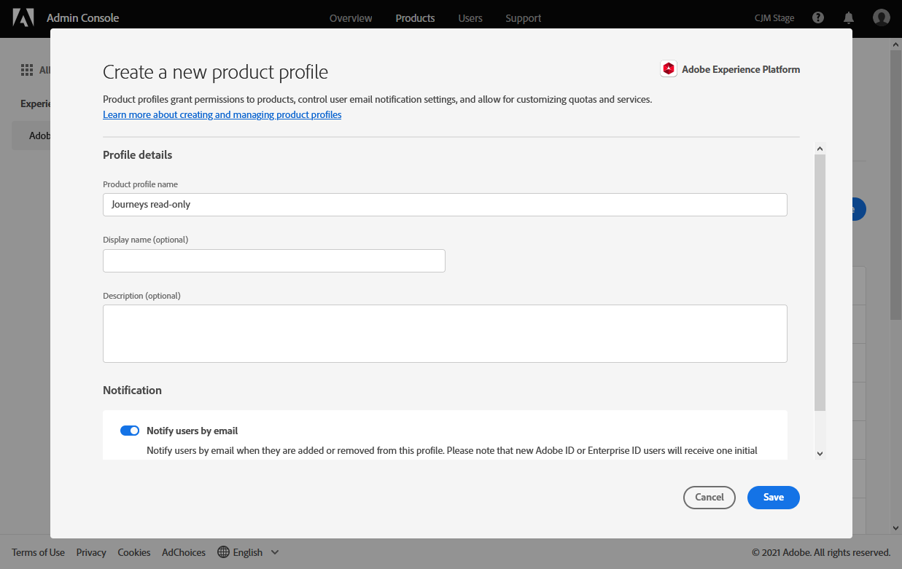
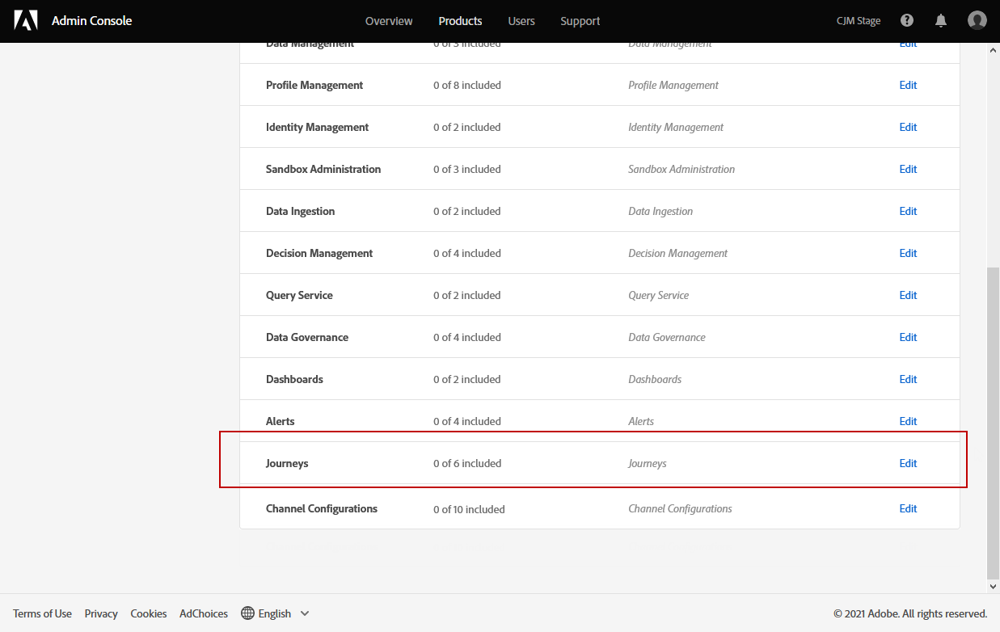

# 사용자 및 역할 관리 {#manage-permissions}

>[!BEGINSHADEBOX]

**이 페이지에서:** 권한 제품에서 역할을 할당, 편집 및 만들어 각 사용자에게 Journey Optimizer에서 작업을 수행하는 데 필요한 액세스 권한을 제공할 수 있습니다.

>[!ENDSHADEBOX]

**[!UICONTROL 역할]**&#x200B;은(는) 동일한 권한과 샌드박스를 공유하는 사용자 컬렉션을 참조합니다. 이러한 역할을 사용하면 조직 내의 다양한 사용자 그룹에 대한 액세스 및 권한을 쉽게 관리할 수 있습니다.

[!DNL Journey Optimizer] 제품을 사용하면 다양한 수준의 권한을 가진 다양한 기존 **[!UICONTROL 역할]** 중에서 선택하여 사용자에게 할당할 수 있습니다. 사용 가능한 **[!UICONTROL 역할]**&#x200B;에 대한 자세한 내용은 이 [페이지](ootb-product-profiles.md)를 참조하세요.

사용자가 **[!UICONTROL 역할]**&#x200B;에 속해 있으면 제품에 포함된 Adobe 앱 및 서비스에 액세스할 수 있습니다.

기존 역할이 조직의 특정 요구 사항에 맞지 않는 경우 사용자 지정 **[!UICONTROL 역할]**&#x200B;을 만들어 인터페이스의 특정 기능이나 개체에 대한 액세스를 미세 조정할 수도 있습니다. 이렇게 하면 각 사용자가 작업을 효율적으로 수행하는 데 필요한 리소스 및 도구에만 액세스할 수 있습니다.

>[!IMPORTANT]
>
>아래에 설명된 단계 및 절차는 **[!UICONTROL 제품]** 또는 **[!UICONTROL 시스템]** 관리자만 수행할 수 있습니다.

## 역할 할당 {#assigning-role}

사용자에게 기본 제공 또는 사용자 지정 **[!UICONTROL 역할]**&#x200B;을(를) 할당할 수 있습니다.

[기본 역할](ootb-product-profiles.md) 섹션에서 권한이 할당된 모든 기본 역할 목록을 사용할 수 있습니다.

**[!UICONTROL 역할]**&#x200B;을(를) 할당하려면:

1. [!DNL Permissions] 제품의 사용자에게 역할을 할당하려면 **[!UICONTROL 역할]** 탭으로 이동하여 원하는 역할을 선택하십시오.

   

1. **[!UICONTROL 사용자]** 탭에서 **[!UICONTROL 사용자 추가]**&#x200B;를 클릭합니다.

   

1. 사용자 이름 또는 전자 메일 주소를 입력하거나 목록에서 사용자를 선택하고 **[!UICONTROL 저장]**&#x200B;을 클릭합니다.

   사용자가 이전에 [!DNL Admin Console]에서 만들어지지 않은 경우 [사용자 추가 설명서](https://experienceleague.adobe.com/docs/experience-platform/access-control/ui/users.html){target="_blank"}를 참조하세요.

   

사용자는 인스턴스로 리디렉션되는 이메일을 수신하게 됩니다.

사용자 관리에 대한 자세한 내용은 [액세스 제어 설명서](https://experienceleague.adobe.com/docs/experience-platform/access-control/home.html?lang=ko){target="_blank"}를 참조하세요.

인스턴스에 액세스할 때 사용자는 **[!UICONTROL 역할]**&#x200B;에서 할당된 권한에 따라 특정 보기를 볼 수 있습니다. 사용자에게 기능에 대한 올바른 액세스 권한이 없는 경우 다음 메시지가 나타납니다.

`You do not have permission to access this feature. Permission needed: XX.`

## 기존 역할 편집 {#edit-product-profile}

기본 제공 또는 사용자 지정 **[!UICONTROL 역할]**&#x200B;의 경우 언제든지 권한을 추가하거나 삭제하도록 결정할 수 있습니다.

아래 예제에서는 여정 뷰어 **[!UICONTROL 여정]**&#x200B;에 할당된 사용자의 **[!UICONTROL 역할]** 리소스와 관련된 **[!UICONTROL 권한]**&#x200B;을 추가하려고 합니다. 그러면 사용자는 여정을 게시할 수 있습니다.

>[!IMPORTANT]
>
>기본 제공 또는 사용자 지정 역할에 대한 변경 사항은 해당 역할에 할당된 모든 사용자에게 영향을 줍니다.

1. [!DNL Permissions] 제품에서 역할을 편집하려면 **[!UICONTROL 역할]** 탭으로 이동하여 원하는 역할을 선택하십시오. 여정 뷰어 **[!UICONTROL 역할]**&#x200B;에서 선택하십시오.
   

1. **[!UICONTROL 역할]** 대시보드에서 **[!UICONTROL 편집]**&#x200B;을(를) 클릭합니다.

   

1. **[!UICONTROL 리소스]** 메뉴에 **[!UICONTROL Experience Cloud - 플랫폼 기반 응용 프로그램]** 제품에 적용되는 리소스 목록이 표시됩니다. 리소스를 드래그 앤 드롭하여 권한을 할당합니다.

   **[!UICONTROL 여정]** 리소스 드롭다운에서 게시 여정 **[!UICONTROL 권한]**&#x200B;을 선택합니다.

   

1. 필요한 경우 **[!UICONTROL 포함된 권한 항목]**&#x200B;에서 X 아이콘을 클릭하여 역할에서 권한 또는 리소스를 제거합니다.

1. 완료되면 **[!UICONTROL 저장]**&#x200B;을 클릭하세요.

필요한 경우 특정 권한을 가진 새 역할을 만들 수도 있습니다.

## 새 역할 만들기 {#create-product-profile}

[!DNL Journey Optimizer]을(를) 통해 나만의 **[!UICONTROL 역할]**&#x200B;을(를) 만들고 사용자에게 권한 집합 및 샌드박스를 할당할 수 있습니다. **[!UICONTROL 역할]**&#x200B;을(를) 사용하면 인터페이스의 특정 기능이나 개체에 대한 액세스를 승인하거나 거부할 수 있습니다.

샌드박스를 만들고 관리하는 방법에 대한 자세한 내용은 [Adobe Experience Platform 설명서](https://experienceleague.adobe.com/docs/experience-platform/sandbox/ui/user-guide.html?lang=ko-KR){target="_blank"}를 참조하십시오.

이 예제에서는 여정 기능에 읽기 전용 권한을 부여하는 **여정 읽기 전용** 역할을 만듭니다. 사용자는 여정에 액세스하고 볼 수만 있으며 [!DNL Journey Optimizer]의 **[!DNL Decision management]**&#x200B;과(와) 같은 다른 기능에는 액세스할 수 없습니다.

**여정 읽기 전용** **[!UICONTROL 역할]**&#x200B;을(를) 만들려면:

1. [!DNL Permissions] 제품의 사용자에게 역할을 할당하려면 **[!UICONTROL 역할]** 탭으로 이동하여 **[!UICONTROL 역할 만들기]**&#x200B;를 클릭합니다.

   

1. 새 **[!UICONTROL 역할]**&#x200B;에 대해 **[!UICONTROL 이름]** 및 **[!UICONTROL 설명]**&#x200B;을(를) 추가하십시오. 그런 다음 **[!UICONTROL 확인]**&#x200B;을 클릭합니다.

   

1. **[!UICONTROL 샌드박스]** 리소스 드롭다운에서 **[!UICONTROL 역할]**&#x200B;에 할당할 샌드박스를 선택하십시오. [샌드박스에 대한 자세한 내용을 살펴보십시오](sandboxes.md).

   

1. 왼쪽 메뉴에 나열된 [!DNL Journey Optimizer]에서 사용할 수 있는 **[!DNL Journeys]**, **[!DNL Segments]** 또는 **[!DNL Decision management]**&#x200B;과(와) 같은 다른 리소스에서 선택하십시오.

   여기에서 **[!UICONTROL 여정]** 리소스를 선택합니다.

   

1. **[!UICONTROL 여정]** 드롭다운에서 **[!UICONTROL 역할]**&#x200B;에 할당할 권한을 선택합니다.

   여기에서 **[!DNL View journeys]**, **[!DNL View journeys report]** 및 **[!DNL View journeys event, data sources, actions]**&#x200B;을(를) 선택합니다.

   

1. 완료되면 **[!UICONTROL 저장]**&#x200B;을 클릭하세요.

이제 **[!UICONTROL 역할]**&#x200B;이 만들어지고 구성되었습니다. 이제 사용자에게 할당합니다.

역할 만들기 및 관리에 대한 자세한 내용은 [Adobe Admin Console 설명서](https://experienceleague.adobe.com/docs/experience-platform/access-control/abac/permissions-ui/roles.html){target="_blank"}를 참조하세요.

+++ AI 기술 자료 참조

이 단원에는 이 주제와 관련된 해석, 검색 및 질문 답변을 지원하기 위한 구조화된 지식이 포함되어 있습니다.

이해를 돕기 위해 이 정보를 이 페이지의 설명서와 통합해야 합니다. 두 소스 모두 독립적으로 사용하기 위한 것은 아닙니다. 이 페이지에서는 기능에 대해 설명하지만, 용어, 의도, 적용 가능성 및 제약 조건을 명확히 하는 데 도움이 되는 추가 컨텍스트를 제공합니다.

- **TL;DR:** 이 페이지에서는 제품 및 시스템 관리자에게 권한 제품의 세 가지 역할 관리 작업을 안내합니다. 사용자에게 기존 역할 할당, 역할의 권한 편집, 특정 권한 및 샌드박스로 새 사용자 지정 역할 만들기.

**의도:**

- Journey Optimizer에서 사용자에게 기본 제공 또는 사용자 지정 역할 할당
- 기존 역할의 권한 편집(권한 추가 또는 제거)
- 특정 권한 및 샌드박스 할당을 사용하여 새 사용자 정의 역할 만들기
- 역할 및 권한 관리를 수행할 권한이 있는 사용자를 파악합니다.

**용어집:**

- **역할**: 조직 *(제품별) 내에서 액세스를 관리하는 데 사용되는 동일한 권한 및 샌드박스를 공유하는 사용자의 컬렉션입니다.*
- **권한 제품**: 역할, 권한 및 샌드박스가 구성된 Adobe CX 엔터프라이즈 인터페이스([!DNL Permissions]을(를) 통해 액세스) *(제품별)*
- **기본 제공 역할**: 사용자 지정 구성 *(제품별) 없이 즉시 할당할 수 있는 권한 집합이 정의된 기존 역할입니다.*

**보호 기능:**

- 제품 또는 시스템 관리자만 역할을 할당, 편집 또는 만들 수 있습니다(페이지의 중요 참고 사항에 설명된 대로 사전 요구 사항).
- 기본 제공 또는 사용자 지정 역할에 대한 변경 사항은 해당 역할에 할당된 모든 사용자에게 영향을 줍니다(페이지의 중요 참고 사항에 설명)

**용어:**

- 정식 이름: 권한 제품 — 변형: Adobe 권한, 권한 UI, Adobe CX Enterprise 권한
- 혼동하지 마십시오. &quot;역할 할당&quot;(기존 역할에 사용자 추가) ≠ &quot;역할 만들기&quot;(처음부터 고유한 권한 및 샌드박스로 새 역할 정의)
- 혼동하지 마십시오. &quot;기존 역할 편집&quot;(기존 역할에 대한 권한 또는 샌드박스 수정, 할당된 모든 사용자에게 영향) ≠ &quot;새 역할 만들기&quot;(기존 역할 또는 해당 사용자에게 영향을 주지 않고 새 역할 빌드)

**FAQ:**

- **Q: Journey Optimizer에서 사용자에게 역할을 할당할 수 있는 사용자는 누구입니까?** — 제품 또는 시스템 관리자만 사용할 수 있습니다.
- **Q: 기본 제공 역할의 권한을 편집하면 어떻게 됩니까?** — 변경 사항은 해당 역할에 현재 할당된 모든 사용자에게 영향을 줍니다.
- **Q: 역할을 관리하려면 제품에서 어디로 이동해야 합니까?** — 권한 제품에서 역할 탭으로 이동합니다.
- **Q: 역할이 할당된 후 사용자가 알림을 수신합니까?** — 예. 인스턴스로 리디렉션되는 이메일을 사용자가 자동으로 수신합니다.

+++
<!-- ai-accordion-version: 1 | source-hash: 09d3612e -->
