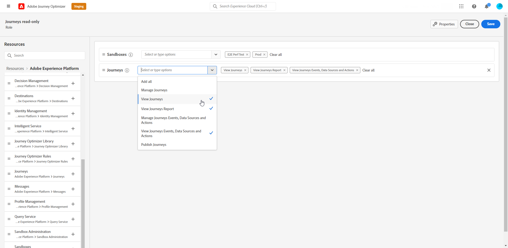

# 사용자 및 역할 관리 {#manage-permissions}

>[!IMPORTANT]
>
> 아래에 설명된 각 절차는 **[!UICONTROL 제품]** 또는 **[!UICONTROL 시스템]** 관리자만 수행할 수 있습니다.

**[!UICONTROL 역할]**&#x200B;은(는) 동일한 권한과 샌드박스를 공유하는 사용자 컬렉션을 참조합니다. 이러한 역할을 사용하면 조직 내의 다양한 사용자 그룹에 대한 액세스 및 권한을 쉽게 관리할 수 있습니다.

[!DNL Journey Optimizer] 제품을 사용하면 다양한 수준의 권한을 가진 기존 **[!UICONTROL 역할]** 범위 중에서 선택하여 사용자에게 할당할 수 있습니다. 사용 가능한 **[!UICONTROL 역할]**&#x200B;에 대한 자세한 내용은 이 [페이지](ootb-product-profiles.md)를 참조하세요.

사용자가 **[!UICONTROL 역할]**&#x200B;에 속해 있으면 제품에 포함된 Adobe 앱 및 서비스에 대한 액세스 권한이 부여됩니다.

기존 역할이 조직의 특정 요구 사항에 맞지 않는 경우 사용자 지정 **[!UICONTROL 역할]**&#x200B;을 만들어 인터페이스의 특정 기능이나 개체에 대한 액세스를 미세 조정할 수도 있습니다. 이렇게 하면 각 사용자가 작업을 효율적으로 수행하는 데 필요한 리소스 및 도구에만 액세스할 수 있습니다.

## 역할 할당 {#assigning-role}

기본 제공 또는 사용자 지정 **[!UICONTROL 역할]**&#x200B;을(를) 사용자에게 할당하도록 선택할 수 있습니다.

권한이 할당된 모든 기본 역할 목록은 [기본 제공 역할](ootb-product-profiles.md) 섹션에서 찾을 수 있습니다.

**[!UICONTROL 역할]**&#x200B;을(를) 할당하려면:

1. [!DNL Permissions] 제품의 사용자에게 역할을 할당하려면 **[!UICONTROL 역할]** 탭으로 이동하여 원하는 역할을 선택하십시오.

   

1.  **[!UICONTROL 사용자]** 탭에서 **[!UICONTROL 사용자 추가]**&#x200B;를 클릭합니다.

   

1. 사용자 이름 또는 이메일 주소를 입력하거나 목록에서 사용자를 선택하고 **[!UICONTROL 저장]**&#x200B;합니다.

   사용자가 이전에 [!DNL Admin Console]에서 만들어지지 않은 경우 [사용자 추가 설명서](https://experienceleague.adobe.com/docs/experience-platform/access-control/ui/users.html)를 참조하세요.

   

그러면 인스턴스로 리디렉션되는 이메일을 사용자가 받게 됩니다.

사용자 관리에 대한 자세한 내용은 [액세스 제어 설명서](https://experienceleague.adobe.com/docs/experience-platform/access-control/home.html?lang=ko)를 참조하세요.

인스턴스에 액세스하면 **[!UICONTROL 역할]**&#x200B;에서 할당된 권한에 따라 사용자에게 특정 보기가 표시됩니다. 사용자에게 기능에 대한 올바른 액세스 권한이 없는 경우 다음 메시지가 표시됩니다.

`You don't have permission to access this feature. Permission needed: XX.`

## 기존 역할 편집 {#edit-product-profile}

기본 제공 또는 사용자 지정 **[!UICONTROL 역할]**&#x200B;의 경우 언제든지 권한을 추가하거나 삭제할 것인지 결정할 수 있습니다.

이 예제에서는 여정 뷰어 **[!UICONTROL 여정]**&#x200B;에 할당된 사용자의 **[!UICONTROL 역할]** 리소스와 관련된 **[!UICONTROL 권한]**&#x200B;을 추가하려고 합니다. 그러면 사용자는 여정을 게시할 수 있습니다.

기본 제공 또는 사용자 지정 **[!UICONTROL 역할]**&#x200B;을(를) 수정하는 경우 이 **[!UICONTROL 역할]**&#x200B;에 할당된 모든 사용자에게 영향을 줍니다.

1. [!DNL Permissions] 제품에서 사용자에게 역할을 할당하려면 **[!UICONTROL 역할]** 탭으로 이동하여 원하는 역할을 선택합니다. 여정 뷰어 **[!UICONTROL 역할]**에 있습니다.
   

1. **[!UICONTROL 역할]** 대시보드에서 **[!UICONTROL 편집]**&#x200B;을(를) 클릭합니다.

   

1. **[!UICONTROL 리소스]** 메뉴에 **[!UICONTROL Experience Cloud - 플랫폼 기반 응용 프로그램]** 제품에 적용되는 리소스 목록이 표시됩니다. 리소스를 드래그 앤 드롭하여 권한을 할당합니다.

   **[!UICONTROL 여정]** 리소스 드롭다운에서 게시 여정 **[!UICONTROL 권한]**&#x200B;을 선택합니다.

   

1. 필요한 경우 **[!UICONTROL 포함된 권한 항목]**&#x200B;에서 옆에 있는 X 아이콘을 클릭하여 역할에 대한 권한 또는 리소스를 제거합니다.

1. 완료되면 **[!UICONTROL 저장]**&#x200B;을 클릭하세요.

필요한 경우 특정 권한을 사용하여 새 역할을 만들 수도 있습니다. 자세한 내용은 [새 역할 만들기](#create-product-profile)를 참조하세요.

## 새 역할 만들기 {#create-product-profile}

[!DNL Journey Optimizer]을(를) 통해 나만의 **[!UICONTROL 역할]**&#x200B;을(를) 만들고 사용자에게 권한 집합 및 샌드박스를 할당할 수 있습니다. **[!UICONTROL 역할]**&#x200B;을(를) 사용하면 인터페이스의 특정 기능이나 개체에 대한 액세스를 승인하거나 거부할 수 있습니다.

샌드박스를 만들고 관리하는 방법에 대한 자세한 내용은 [Adobe Experience Platform 설명서](https://experienceleague.adobe.com/docs/experience-platform/sandbox/ui/user-guide.html?lang=ko-KR){target="_blank"}를 참조하세요.

이 예제에서는 여정 기능에 읽기 전용 권한을 부여하는 **여정 읽기 전용** 역할을 만듭니다. 사용자는 여정에 액세스하고 볼 수만 있으며 [!DNL Journey Optimizer]의 **[!DNL  Decision management]**&#x200B;과(와) 같은 다른 기능에는 액세스할 수 없습니다.

**여정 읽기 전용** **[!UICONTROL 역할]**&#x200B;을(를) 만들려면:

1. [!DNL Permissions] 제품의 사용자에게 역할을 할당하려면 **[!UICONTROL 역할]** 탭으로 이동하여 **[!UICONTROL 역할 만들기]**&#x200B;를 클릭합니다.

   

1. 새 **[!UICONTROL 역할]**&#x200B;에 대해 **[!UICONTROL 이름]** 및 **[!UICONTROL 설명]**&#x200B;을(를) 추가하십시오. 그런 다음 **[!UICONTROL 확인]**&#x200B;을 클릭합니다.

   

1. **[!UICONTROL 샌드박스]** 리소스 드롭다운에서 **[!UICONTROL 역할]**&#x200B;에 할당할 샌드박스를 선택하십시오. [샌드박스에 대한 자세한 내용을 살펴보십시오](sandboxes.md).

   

1. 왼쪽 메뉴에 나열된 [!DNL Journey Optimizer]에서 사용할 수 있는 **[!DNL Journeys]**, **[!DNL Segments]** 또는 **[!DNL Decision management]**&#x200B;과(와) 같은 다른 리소스 중에서 선택하십시오.

   여기에서 **[!UICONTROL 여정]** 리소스를 선택합니다.

   

1. **[!UICONTROL 여정]** 드롭다운에서 **[!UICONTROL 역할]**&#x200B;에 할당할 권한을 선택합니다.

   여기에서 **[!DNL View journeys]**, **[!DNL View journeys report]** 및 **[!DNL View journeys event, data sources, actions]**&#x200B;을(를) 선택합니다.

   

1. 완료되면 **[!UICONTROL 저장]**&#x200B;을 클릭하세요.

이제 **[!UICONTROL 역할]**&#x200B;이 만들어지고 구성되었습니다. 이제 사용자에게 할당합니다.

역할 만들기 및 관리에 대한 자세한 내용은 [Admin Console 설명서](https://experienceleague.adobe.com/docs/experience-platform/access-control/abac/permissions-ui/roles.html)를 참조하세요.
