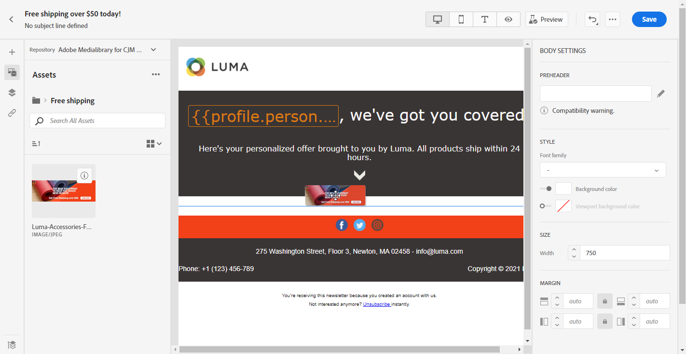

#  [!DNL Adobe Experience Manager Assets Essentials] {#experience-manager-assets}

## [!DNL Assets Essentials] 시작 {#get-started-assets-essentials}

[!DNL Adobe Experience Manager Assets Essentials] 는 메시지를 채우는 데 사용할 수 있는 중앙 집중식 단일 자산 저장소를 제공합니다. 다음 위치에서 직접 액세스할 수 있습니다. [!DNL Adobe Journey Optimizer] 사용 **[!UICONTROL Assets]** 섹션을 참조하십시오. 이메일 콘텐츠를 디자인할 때 자산 및 폴더에 액세스할 수도 있습니다. [이메일 디자인에 대한 자세한 정보](design-emails.md).

>[!NOTE]
>
> 을 사용하여 작업하려면 [!DNL Adobe Experience Manager Assets Essentials]를 배포 [!DNL Assets Essentials] 조직에 대해 액세스 권한이 필요한 사용자를 [!DNL Assets Essentials]는 의 일부입니다 **Assets Essentials 소비자 사용자** 또는/and **Assets Essentials 사용자** 제품 프로필.   자세한 내용은 다음을 참조하십시오 [페이지](https://experienceleague.adobe.com/docs/experience-manager-assets-essentials/help/deploy-administer.html){target=&quot;_blank&quot;}.

자세한 절차 [!DNL Assets Essentials]를 참조하려면 [Adobe Experience Manager Assets Essentials 설명서](https://experienceleague.adobe.com/docs/experience-manager-assets-essentials/help/introduction.html){target=&quot;_blank&quot;}.

## 자산 업로드 및 삽입{#add-asset}

에서 파일을 업로드하려면 [!DNL Assets Essentials]로 지정하는 경우, 먼저 해당 폴더가 저장될 폴더를 찾아보거나 만들어야 합니다. 그러면 전자 메일 콘텐츠에 삽입할 수 있습니다.

자산을 업로드하는 방법에 대한 자세한 내용은 [Adobe Experience Manager Assets Essentials 설명서](https://experienceleague.adobe.com/docs/experience-manager-assets-essentials/help/add-delete.html){target=&quot;_blank&quot;}.

1. From [!DNL Adobe Journey Optimizer] 홈 페이지에서 **[!UICONTROL Assets]** 아래의 탭 **[!UICONTROL Content management]** 액세스 메뉴 [!DNL Assets Essentials].

   

1. 중앙 섹션 또는 트리 보기에서 폴더를 두 번 클릭하여 엽니다.

   을 클릭할 수도 있습니다 **[!UICONTROL Create folder]** 새 폴더를 만들려면

   

1. 선택한 폴더 또는 생성된 폴더에서 **[!UICONTROL Add Assets]** 새 자산을 폴더에 업로드하려면 다음을 수행하십시오.

   

1. 에서 **[!UICONTROL Upload files]**&#x200B;를 클릭합니다. **[!UICONTROL Browse]** 원하는 경우 **[!UICONTROL Browse files]** 또는 **[!UICONTROL Browse folders]**.

   

1. 업로드할 파일을 선택합니다. 완료되면 **[!UICONTROL Upload]**&#x200B;을(를) 클릭합니다.

   자산 관리 방법에 대한 자세한 내용은 다음을 참조하십시오 [페이지](https://experienceleague.adobe.com/docs/experience-manager-assets-essentials/help/manage-organize.html).

1. 이제 자산이 업로드되면 이메일 디자이너를 통해 메시지 중 하나에 자산을 삽입할 수 있습니다.

   자산을 **편집** 모드 [!DNL Assets Essentials]. [추가 정보](https://experienceleague.adobe.com/docs/experience-manager-assets-essentials/help/edit-images.html){target=&quot;_blank&quot;}.

   

1. From [!DNL Adobe Journey Optimizer], 선택 **[!UICONTROL Asset picker]** 이메일 디자이너의 왼쪽 창에서 클릭합니다.

   

1. 자산 폴더를 선택합니다. 검색 창에서 자산이나 폴더를 검색할 수도 있습니다.

1. 이메일 콘텐츠에서 자산을 끌어다 놓습니다.

   

1. 외부 링크 추가 또는 를 사용하여 텍스트 추가와 같이 자산을 추가로 사용자 지정할 수 있습니다 **[!UICONTROL Components settings]**. [구성 요소 설정에 대해 자세히 알아보기](content-components.md)

   
