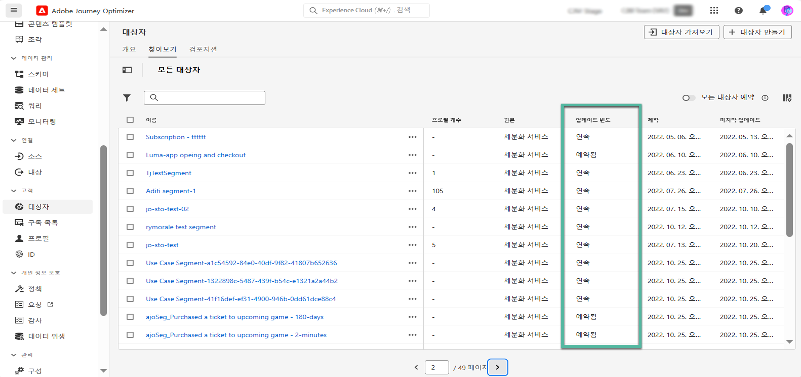

# Adobe Experience Platform 대상자 시작 {#about-segments}

>[!CONTEXTUALHELP]
>id="ajo_campaigns_content_experiment_segment"
>title="Audience"
>abstract="Adobe Experience Platform에서는 실시간 고객 프로필 데이터를 활용하여 간단히 세그먼트 정의를 작성함으로써 고객의 고유 행동과 선호를 포착한 타겟팅 대상자를 만들 수 있습니다."

>[!CONTEXTUALHELP]
>id="ajo_campaigns_audience"
>title="캠페인 대상자 선택"
>abstract="이 목록에는 사용 가능한 모든 Adobe Experience Platform 대상자가 표시됩니다. 캠페인으로 타기팅할 대상자를 선택합니다. 캠페인에 구성된 메시지는 선택한 대상자에 속한 모든 개인 사용자에게 전송됩니다. [대상자에 대해 자세히 알아보기](../audience/about-audiences.md)"

대상자는 유사한 행동 및/또는 특성을 공유하는 사람들의 집합입니다. 대상자에 대한 자세한 내용은 [Adobe Experience Platform 세그먼테이션 서비스 설명서](https://experienceleague.adobe.com/docs/experience-platform/segmentation/home.html?lang=ko){target="_blank"}를 참조하세요.

[!DNL Journey Optimizer]을(를) 사용하면 **[!UICONTROL 대상]** 메뉴에서 직접 Adobe Experience Platform 대상을 빌드하고 여정 또는 캠페인에 활용할 수 있습니다.

다음과 같은 다양한 방법을 사용하여 대상을 생성할 수 있습니다.

* **세그먼트 정의**: Adobe Experience Platform 세분화 서비스를 사용하여 새 대상 정의를 만듭니다. [세그먼트 정의를 만드는 방법을 알아봅니다](creating-a-segment-definition.md)

* **사용자 지정 업로드**: CSV 파일을 사용하여 대상을 가져옵니다. Adobe Experience Platform [세그먼테이션 서비스 설명서](https://experienceleague.adobe.com/en/docs/experience-platform/segmentation/ui/audience-portal#import-audience){target="_blank"}에서 대상을 가져오는 방법을 알아보세요.

* **대상 구성**: 기존 Adobe Experience Platform 대상을 시각적 캔버스로 결합하고 다양한 활동(분할, 제외...)을 활용하여 새 대상을 만드는 구성 워크플로를 만듭니다. [대상자 구성 시작](get-started-audience-orchestration.md)

* **페더레이션 대상 구성**: 기존 데이터 웨어하우스에서 직접 데이터 세트를 페더레이션하여 하나의 시스템에 Adobe Experience Platform 대상 및 특성을 모두 빌드하고 보강합니다. [Federated Audience Composition](https://experienceleague.adobe.com/ko/docs/federated-audience-composition/using/home)에 대한 안내서를 읽어 보십시오.

  >[!AVAILABILITY]
  >
  >페더레이션된 대상자 구성은 현재 조직 집합에만 사용할 수 있습니다(제한된 가용성). 자세한 내용은 Adobe 담당자에게 문의하십시오.

[!DNL Journey Optimizer]에서 사용자 지정 업로드 및 Federated Audience Composition 대상을 사용하는 방법에 대한 자세한 내용은 [이 섹션](custom-upload-fac.md)을 참조하세요.

## [!DNL Journey Optimizer]의 대상 {#segments-in-journey-optimizer}

캠페인 및 여정에서 세그먼트 정의, 사용자 지정 업로드, 작성 워크플로우 또는 페더레이션 대상 작성을 사용하여 생성된 대상을 선택할 수 있습니다.

>[!AVAILABILITY]
>
>대상자 작성의 대상자 및 속성은 현재 Healthcare Shield 또는 Privacy and Security Shield에서 사용할 수 없습니다. [Journey Optimizer에서 대상 데이터 보강 특성을 사용하는 방법을 알아보세요](../audience/about-audiences.md#enrichment)

**[!DNL Journey Optimizer]**&#x200B;에서 다양한 방법으로 대상자를 활용할 수 있습니다.

* **캠페인** 대상자를 선택하면 선택한 대상자에 속하는 모든 개인에게 메시지를 보냅니다. [캠페인의 대상자를 정의하는 방법을 알아봅니다](../campaigns/create-campaign.md#define-the-audience-audience).

* 여정에서 **대상자 읽기** 오케스트레이션 활동을 사용하여 대상자의 모든 개인이 여정을 입력하고 여정에 포함된 메시지를 받도록 합니다. “실버 고객”이라는 대상자가 있다고 가정해 보겠습니다. 이 활동으로 모든 실버 고객이 여정에 입장하도록 하여 이들에게 연속으로 이어지는 개인화된 메시지를 보낼 수 있습니다. [대상자 읽기 활동을 구성하는 방법을 알아봅니다](../building-journeys/read-audience.md#configuring-segment-trigger-activity).

* 여정에 **조건** 활동을 사용하면 대상자 멤버십을 기반으로 조건을 작성할 수 있습니다. [조건에서 대상자를 사용하는 방법을 알아봅니다](../building-journeys/condition-activity.md#using-a-segment).

* 여정에서 **대상 자격** 이벤트 활동을 사용하여 개인이 Adobe Experience Platform 대상 출입구를 기준으로 여정에 들어오거나 앞으로 이동하도록 할 수 있습니다. 예를 들면 모든 신규 실버 고객이 여정에 입장하도록 하여 이들에게 메시지를 보낼 수 있습니다. 이 활동을 사용하는 자세한 방법은 [대상자 자격 조건 활동을 구성하는 방법 알아보기](../building-journeys/audience-qualification-events.md)를 참조하세요.

  >[!NOTE]
  >
  >작성 워크플로우, 사용자 지정 업로드 또는 연합 대상 작성을 사용하여 만든 대상의 일괄 처리 특성으로 인해, &quot;대상 자격&quot; 활동에서 이러한 대상을 타깃팅할 수 없습니다. 세그먼트 정의를 사용하여 생성된 대상만 이 활동에서 활용할 수 있습니다.

## 대상자 강화 속성 사용 {#enrichment}

작성 워크플로우, 사용자 지정(CSV 파일) 대상 또는 통합 대상 작성을 사용하여 생성된 대상을 타깃팅할 때 이러한 대상의 보강 속성을 활용하여 여정을 작성하고 메시지를 개인화할 수 있습니다.

>[!NOTE]
>
>2024년 10월 1일 이전에 CSV 파일 사용자 지정 업로드를 통해 생성된 대상은 개인화할 수 없습니다. 이러한 대상의 속성을 사용하고 이 기능을 최대한 활용하려면 이 날짜 이전에 가져온 외부 CSV 대상을 다시 만들고 다시 업로드하십시오.
>
>동의 정책은 데이터 보강 속성을 지원하지 않습니다. 따라서 동의 정책 규칙은 프로필에 있는 속성만 기반으로 해야 합니다.

다음은 대상의 데이터 보강 속성을 사용하여 수행할 수 있는 작업입니다.

* 대상 대상의 강화 특성을 활용하는 규칙을 기반으로 **여정에 여러 경로를 만듭니다**. 이렇게 하려면 [대상 읽기](../building-journeys/read-audience.md) 활동을 사용하여 대상을 타깃팅한 다음 대상의 데이터 보강 특성을 기반으로 [조건](../building-journeys/condition-activity.md) 활동에서 규칙을 만듭니다.

  {width="70%" zoomable="yes"}

* 개인화 편집기에서 타겟팅된 대상의 데이터 보강 특성을 추가하여 여정 또는 캠페인에서 **메시지를 개인화합니다**. [개인화 편집기로 작업하는 방법을 알아보세요](../personalization/personalization-build-expressions.md)

  {width="70%" zoomable="yes"}

>[!IMPORTANT]
>
>작성 워크플로우를 사용하여 만든 대상의 보강 속성을 사용하려면 &quot;ExperiencePlatform&quot; 데이터 Source 내의 필드 그룹에 추가되었는지 확인하십시오.
>
+++ 필드 그룹에 데이터 보강 속성을 추가하는 방법 알아보기>
>
1. &quot;관리&quot; > &quot;구성&quot; > &quot;데이터 소스&quot;로 이동합니다.
1. &quot;Experience Platform&quot;를 선택하고 필드 그룹을 만들거나 편집합니다.
1. 스키마 선택기에서 적절한 스키마를 선택합니다. 스키마 이름은 &#39;Schema for audienceId:&#39; + 대상 ID 형식으로 이루어집니다. 대상자 인벤토리의 대상자 세부 사항 화면에서 대상자 ID를 찾을 수 있습니다.
1. 필드 선택기를 열고 추가할 데이터 보강 속성을 찾은 다음 해당 속성 옆의 확인란을 선택합니다.
1. 변경 내용을 저장합니다.
1. 데이터 보강 속성이 필드 그룹에 추가되면 위에 나열된 위치의 Journey Optimizer에서 이를 활용할 수 있습니다.
>
데이터 소스에 대한 자세한 내용은 다음 섹션에서 확인할 수 있습니다.
>
* [Adobe Experience Platform 데이터 원본으로 작업](../datasource/adobe-experience-platform-data-source.md)
* [데이터 원본 구성](../datasource/configure-data-sources.md)
>
+++

## 대상자 평가 방법 {#evaluation-method-in-journey-optimizer}

Adobe Journey Optimizer에서 대상자는 아래 세 가지 평가 방법 중 하나를 사용하여 세그먼트 정의에서 생성됩니다.

+++ 스트리밍 세분화

대상에 대한 프로필 목록은 새 데이터가 시스템으로 유입될 때 실시간으로 최신 상태로 유지됩니다.

스트리밍 세분화는 사용자 활동에 대응하여 대상자를 업데이트하는 진행형 데이터 선택 프로세스입니다. 세그먼트 정의를 작성하고 결과 대상자를 저장한 다음부터는 Journey Optimizer로 들어오는 데이터에 세그먼트 정의가 적용됩니다. 즉, 프로필 데이터가 변경될 때 개인이 대상에서 추가되거나 제거되어 대상 대상이 항상 관련성이 있게 됩니다. [자세히 알아보기](https://experienceleague.adobe.com/docs/experience-platform/segmentation/ui/streaming-segmentation.html){target="_blank"}

>[!NOTE]
>
스트리밍 세분화 기준으로 올바른 이벤트를 사용해야 합니다. [자세히 알아보기](#streaming-segmentation-events-guardrails)

+++

+++ 배치 세분화

대상자에 대한 프로필 목록은 24시간마다 평가됩니다.

일괄 처리 세분화는 스트리밍 세분화 대신 사용할 수 있는 방법으로, 세그먼트 정의를 통해 모든 프로필 데이터를 한꺼번에 처리합니다. 이를 통해 대상자의 스냅샷을 만드는데, 이를 저장하거나 내보내서 사용할 수 있습니다. 하지만 스트리밍 세분화와 달리 배치 세분화는 실시간으로 대상 목록을 지속적으로 업데이트하지 않으며, 배치 프로세스 후에 들어오는 새 데이터는 다음 배치 프로세스가 진행될 때까지 대상에 반영되지 않습니다. [자세히 알아보기](https://experienceleague.adobe.com/docs/experience-platform/segmentation/home.html#batch){target="_blank"}

+++

+++ 에지 세분화

Edge 세그멘테이션은 Adobe Experience Platform의 세그먼트를 즉시 [edge](https://experienceleague.adobe.com/docs/experience-platform/edge/home.html){target="_blank"}에서 평가하는 기능으로, 동일한 페이지 및 다음 페이지 개인화 사용 사례를 가능하게 합니다. 현재 선택한 쿼리 유형만 가장자리 세분화를 통해 평가할 수 있습니다. [자세히 알아보기](https://experienceleague.adobe.com/docs/experience-platform/segmentation/ui/edge-segmentation.html#query-types){target="_blank"}

+++

사용할 평가 방법을 알고 있는 경우 드롭다운 목록을 사용하여 선택합니다. 돋보기로 찾아보기 아이콘 폴더 아이콘을 클릭하여 사용 가능한 세그먼트 정의 평가 방법 목록을 볼 수도 있습니다. [자세히 알아보기](https://experienceleague.adobe.com/docs/experience-platform/segmentation/ui/segment-builder.html#segment-properties){target="_blank"}

<!--The determination between batch segmentation and streaming segmentation is made by the system for each audience, based on the complexity and the cost of evaluating the segment definition rule. You can view the evaluation method for each audience in the **[!UICONTROL Evaluation method]** column of the audience list.
    

>[!NOTE]
>
>If the **[!UICONTROL Evaluation method]** column does not display, you  need to add it using configuration button on the top right of the list.-->

대상자를 처음 정의한 후 프로필이 자격 조건을 충족하면 대상자에 추가됩니다.

이전 데이터를 사용하여 대상자를 다시 채우는 데 최대 24시간이 걸릴 수 있습니다. 대상자를 다시 채운 후 대상자는 계속 최신 상태로 유지되며 언제든 타겟팅할 수 있습니다.

### 스트리밍 세분화를 통한 이벤트 사용 {#streaming-segmentation-events-guardrails}

스트리밍 세분화는 가치가 높은 사용 사례를 사용하는 실시간 개인화에 유용합니다. 그러나 세분화 기준으로 사용할 올바른 [이벤트](https://experienceleague.adobe.com/docs/experience-platform/segmentation/ui/segment-builder.html#events){target="_blank"}를 선택하는 것이 중요합니다.

따라서 스트리밍 세분화 최적 성능을 위해 다음 이벤트를 사용하지 마십시오.

* **메시지 열림** 상호 작용 유형 이벤트

  대상을 구축할 때 **열린 메시지** 상호 작용 이벤트는 사용자 활동의 실제 지표가 아니며 세그멘테이션 성능에 부정적인 영향을 줄 수 있으므로 이 이벤트의 사용을 신뢰할 수 없게 되었습니다. 이 [Adobe 블로그 게시물](https://blog.adobe.com/en/publish/2021/06/24/what-apples-mail-privacy-protection-means-for-email-marketers){target="_blank"}에서 이유를 알아보세요. Adobe 따라서 스트리밍 세분화를 통해 **열린 메시지** 상호 작용 이벤트를 사용하지 않는 것이 좋습니다. 대신 클릭, 구매 또는 비콘 데이터와 같은 실제 사용자 활동 신호를 사용합니다.

* **보낸 메시지** 피드백 상태 이벤트

  **보낸 메시지** 피드백 이벤트는 대개 전자 메일을 보내기 전에 빈도 또는 비표시 확인에 사용됩니다. Adobe은 성능에 부담을 주고 시스템 저하를 유발할 수 있으므로 피하는 것이 좋습니다. 따라서 빈도 또는 제외 논리의 경우 **보낸 메시지** 피드백 이벤트가 아닌 비즈니스 규칙을 사용하십시오. 비즈니스 규칙에 대한 기존 월별 케이던스를 보완하여 개별 프로필에 대한 일일 빈도 상한을 곧 사용할 수 있습니다.

>[!NOTE]
>
성능 문제 없이 일괄 세분화에서 **열린 메시지** 및 **보낸 메시지** 이벤트를 사용할 수 있습니다.

## 대상 구성 및 사용자 지정 업로드 FAQ {#faq}

다음 섹션에는 작성 워크플로우 및 사용자 지정 업로드(CSV 파일)로 생성된 대상의 Journey Optimizer 사용에 대한 FAQ가 나열되어 있습니다.

+++ Journey Optimizer 내에서 대상 구성 및 사용자 지정 업로드의 대상을 사용할 수 있는 곳은 어디입니까?

대상자 구성 및 사용자 지정 업로드의 대상자를 캠페인 및 여정 중 하나에서 타깃팅할 수 있습니다. [대상자를 타깃팅하는 방법 알아보기 [!DNL Journey Optimizer]](#segments-in-journey-optimizer)

* **캠페인**&#x200B;에서 이러한 대상은 &quot;대상 선택&quot; 단추를 클릭한 후 대상 선택기에 표시됩니다.

* **여정**&#x200B;에서는 대상 선택 중 &quot;대상 읽기&quot; 활동과 대상 멤버십 확인을 위한 &quot;조건&quot; 활동에서 이러한 대상을 사용할 수 있습니다. 그러나 이러한 대상은 배치 특성으로 인해 &quot;대상 자격&quot; 활동에 표시되지 않습니다.

  >[!NOTE]
  >
  사용자 지정 업로드 대상의 경우, 반복 여정에서 &quot;증분 읽기&quot;가 활성화되면 이러한 대상이 수정되므로 프로필은 첫 번째 반복에서만 검색됩니다.

또한 이러한 대상은 개인화 편집기에서 여정 및 캠페인에서 메시지를 개인화하는 데 사용할 수 있습니다. [개인화 편집기로 작업하는 방법을 알아보세요](../personalization/personalization-build-expressions.md)

+++

+++ 데이터 보강 속성이란 무엇입니까?

데이터 보강 속성은 상황에 맞는 추가 속성이며 대상에만 국한됩니다. 프로필과 연결되어 있지 않으며 일반적으로 개인화 목적으로 사용됩니다.

데이터 보강 특성은 대상 구성에서 [데이터 보강](composition-canvas.md#enrich) 활동을 통해 또는 사용자 지정 업로드 프로세스를 통해 대상에 연결됩니다.

+++

+++ Journey Optimizer 내에서 데이터 보강 속성을 사용할 수 있는 곳은 어디입니까?

대상자 구성의 데이터 보강 속성은 다음 영역에서 활용할 수 있습니다. [대상 데이터 보강 특성을 사용하는 방법을 알아보세요](#enrichment)

* 조건 활동(여정)
* 사용자 지정 작업 특성(여정)
* 메시지 개인화(여정 및 캠페인)

+++

+++ 여정에서 데이터 보강 속성을 활성화하려면 어떻게 해야 합니까?

작성 워크플로를 사용하여 만든 대상의 데이터 보강 속성을 사용하려면 해당 속성이 &quot;ExperiencePlatform&quot; 데이터 Source 내의 필드 그룹에 추가되어 있는지 확인하십시오. 필드 그룹에 데이터 보강 특성을 추가하는 방법에 대한 정보는 [이 섹션](#enrichment)에서 확인할 수 있습니다.

+++

+++ Journey Optimizer에서 대상 구성에서 대상을 게시한 후 얼마나 빨리 사용할 수 있습니까?

**대상 구성**&#x200B;의 대상은 매일 실행되므로 Journey Optimizer에서 사용하려면 최대 24시간을 기다려야 할 수 있습니다.

+++

+++ 여정이 시작된 후 데이터 보강 속성 값이 업데이트됩니까?

현재는 없습니다. 대기 노드나 이벤트 여정 후에도 데이터 보강 속성 값은 이벤트가 시작될 때와 동일하게 유지됩니다.

+++

+++ 사용자 지정 업로드 대상은 어떻게 프로필과 결합합니까?

사용자 지정 업로드 프로세스 중에 ID 및 매핑되는 프로필 ID로 사용할 CSV 속성을 지정합니다. 이렇게 하면 대상 데이터와 프로필 간에 링크가 설정됩니다. CSV 파일에 프로필에서 찾을 수 없는 ID 값이 포함되어 있는 경우 해당 ID 값으로 새 프로필이 만들어집니다.

사용자 지정 업로드 프로세스에 대한 자세한 내용은 Adobe Experience Platform [세그먼테이션 서비스 설명서](https://experienceleague.adobe.com/docs/experience-platform/segmentation/ui/overview.html#import-audience){target="_blank"}를 참조하세요.

+++

+++ Journey Optimizer에서 내 데이터가 얼마나 최신 상태입니까?

대상 구성 및 사용자 지정 업로드의 대상 데이터는 대상 내보내기 서비스(AES)로 채워집니다. AES는 프로필 속성 및 대상자 멤버십을 읽으며, 다음과 같은 타임라인을 통해 이러한 대상자에게 사용할 수 있습니다.

* **대상 구성**: 매일 내보내기(~24시간)
* **사용자 지정 업로드**: 전용 내보내기 작업(~2시간)

대상 읽기 활동의 대상 구성 또는 사용자 지정 업로드에서 대상을 활용하는 모든 여정은 마지막 일괄 처리 평가만큼 새로운 프로필 속성을 갖게 됩니다. 여기에는 여정의 동의/억제도 포함됩니다.

또한 대상 구성 대상의 풍부한 속성은 마지막 구성 실행만큼 신선하며 과거에는 최대 24시간까지 소요될 수 있습니다.

+++

## 방법 비디오 {#video}

Journey Optimizer의 통합 고객 프로필 및 대상자에 대해 알아봅니다.

>[!VIDEO](https://video.tv.adobe.com/v/3432671?quality=12)
