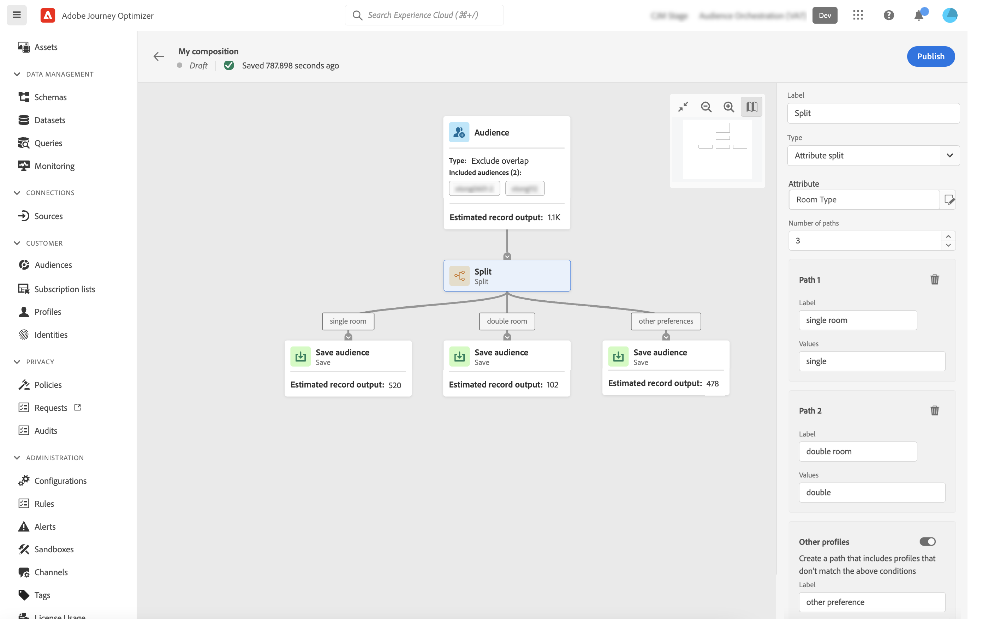

# 컴포지션 캔버스 작업 {#composition-canvas}

>[!BEGINSHADEBOX]

이 설명서에서는 Adobe Journey Optimizer 내에서 대상자 구성을 사용하는 방법에 대해 자세한 정보를 제공합니다. Adobe Journey Optimizer를 사용하지 않는 경우 [여기를 클릭하세요](https://experienceleague.adobe.com/docs/experience-platform/segmentation/ui/audience-composition.html?lang=ko){target="_blank"}.

>[!ENDSHADEBOX]

대상 컴포지션은 대상을 만들고 다양한 활동(분할, 강화 등)을 사용할 수 있는 시각적 캔버스를 제공합니다.

캔버스에서 대상을 구성하는 단계는 다음과 같습니다.

1. [시작 대상자 정의](#starting-audience)
1. [하나 이상의 활동 추가](#action-activities)
1. [새 대상에 결과 저장](#save)

## 시작 대상자 선택 {#starting-audience}

컴포지션을 만드는 첫 번째 단계는 컴포지션의 기반으로 하나 이상의 기존 대상을 선택하는 것입니다.

1. 다음 항목 선택 **[!UICONTROL 대상자]** 그런 다음 활동용 레이블을 제공합니다.

1. 타깃팅할 대상 선택:

   * 다음을 클릭합니다. **[!UICONTROL 대상자 추가]** 하나 또는 여러 개의 기존 대상을 선택하는 단추
   * 다음을 클릭합니다. **[!UICONTROL 규칙 작성]** 단추를 클릭하여 새 대상 정의를 만듭니다. [세분화 서비스](https://experienceleague.adobe.com/docs/experience-platform/segmentation/ui/overview.html?lang=ko).

   

1. 여러 대상자를 선택한 경우 이러한 대상자의 프로필을 병합하는 방법을 지정합니다.

* **[!UICONTROL 합집합]**: 선택한 대상자의 모든 프로필 포함,
* **[!UICONTROL 교차]**: 선택한 모든 대상자에게 공통되는 프로필을 포함합니다.
* **[!UICONTROL 중복 제외]**: 대상자 중 하나에 속하는 프로필만 포함합니다. 둘 이상의 대상에 속하는 프로필은 포함되지 않습니다.

이 예제에서는 골드 및 실버 대상에 속하는 모든 프로필을 타겟팅하려고 합니다.

대상을 선택하면 활동 하단에 예상 프로필 수가 표시됩니다.

## 활동 추가 {#action-activities}

시작 대상자를 선택한 후 활동을 추가하여 선택 내용을 구체화합니다.

이렇게 하려면 작성 경로에서 + 단추를 클릭한 다음 원하는 활동을 선택합니다. 오른쪽 창이 열리고 새로 추가된 활동을 구성할 수 있습니다.

사용 가능한 활동은 다음과 같습니다.

* [대상자](#audience): 하나 이상의 기존 대상자에 속하는 추가 프로필을 포함합니다.
* [제외](#exclude): 기존 대상자에 속한 프로필을 제외하거나 특정 속성을 기준으로 프로필을 제외합니다.
* [강화](#enrich): Adobe Experience Platform 데이터 세트에서 오는 추가 속성으로 대상자를 강화합니다.
* [등급](#rank): 특정 속성에 따라 프로필의 등급을 매기고, 유지할 프로필 수를 지정하고, 이를 컴포지션에 포함합니다.
* [분할](#split): 무작위 백분율 또는 속성에 따라 컴포지션을 여러 경로로 나눕니다.

최대 개까지 추가할 수 있습니다. **[!UICONTROL 대상자]** 및 **[!UICONTROL 제외]** 작성에 필요한 활동. 그러나 이후에 추가 활동을 추가할 수 없습니다. **[!UICONTROL 등급]** 및 **[!UICONTROL 분할]** 활동.

오른쪽 창에서 삭제 버튼을 클릭하여 언제든지 캔버스에서 활동을 제거할 수 있습니다.  삭제하려는 활동이 컴포지션에서 다른 활동의 상위 활동인 경우 선택한 활동만 삭제할지 또는 모든 하위 활동을 삭제할지 여부를 지정할 수 있는 메시지가 표시됩니다.

### 대상자 활동 {#audience}

>[!CONTEXTUALHELP]
>id="ajo_ao_audience"
>title="대상자 활동"
>abstract="대상자 활동을 통해 기존 대상에 속하는 추가 프로필이 구성에 포함되도록 할 수 있습니다."

>[!CONTEXTUALHELP]
>id="ajo_ao_merge_types"
>title="병합 유형"
>abstract="선택한 대상자 프로필을 어떻게 병합해야 하는지 지정합니다."

다음 **[!UICONTROL 대상자]** 활동을 사용하면 기존 대상자에 속하는 추가 프로필을 컴포지션에 포함할 수 있습니다.

이 활동의 구성은 시작 과 동일합니다 [대상자 활동](#starting-audience).

### 제외 활동 {#exclude}

>[!CONTEXTUALHELP]
>id="ajo_ao_exclude_type"
>title="제외 유형"
>abstract="대상 제외 유형을 사용하여 기존 대상자에 속하는 프로필을 제외합니다. 속성 유형을 사용하는 제외를 통해 특정 속성을 기반으로 프로필을 제외할 수 있습니다."

>[!CONTEXTUALHELP]
>id="ajo_ao_exclude"
>title="제외 활동"
>abstract="제외 활동을 통해 기존 대상자를 선택하거나 규칙을 사용하여 구성에서 프로필을 제외할 수 있습니다."

다음 **[!UICONTROL 제외]** 활동을 사용하면 작성에서 프로필을 제외할 수 있습니다. 두 가지 유형의 제외를 사용할 수 있습니다.

* **[!UICONTROL 대상자 제외]**: 기존 대상자에 속한 프로필을 제외합니다.

  다음을 클릭합니다. **[!UICONTROL 대상자 추가]** 버튼을 클릭하고 제외할 대상을 선택합니다.

  

* **[!UICONTROL 속성을 사용하여 제외]**: 특정 속성을 기준으로 프로필을 제외합니다.

  조회할 속성을 선택한 다음 제외할 값을 지정합니다. 이 예에서는 홈 주소가 일본에 있는 작성 프로필에서 제외합니다.

  >[!NOTE]
  >
  >하나의 제외 값만 지정할 수 있습니다.

  

### 보강 활동 {#enrich}

>[!CONTEXTUALHELP]
>id="ajo_ao_enrich"
>title="보강 활동"
>abstract="보강 활동을 사용하여 Adobe Experience Platform 데이터 세트에서 제공되는 추가 속성으로 대상자를 보강하십시오. 예를 들어 이름, 가격 또는 제조업체 ID와 같이 구매한 제품과 관련된 정보를 추가하고 이러한 정보를 활용하여 대상자에게 전송하는 게재를 개인화할 수 있습니다."

>[!CONTEXTUALHELP]
>id="ajo_ao_enrich_dataset"
>title="보강 데이터 세트"
>abstract="대상자에 연결하려는 데이터가 포함된 보강 데이터 세트를 선택합니다."

>[!CONTEXTUALHELP]
>id="ajo_ao_enrich_criteria"
>title="보강 기준"
>abstract="소스 데이터 세트(즉, 대상자 및 보강 데이터 세트) 사이의 조정 키로 사용할 필드를 선택합니다."

>[!CONTEXTUALHELP]
>id="ajo_ao_enrich_attributes"
>title="보강 속성"
>abstract="보강 데이터 세트에서 하나 또는 여러 속성을 선택하여 대상자와 연결합니다. 구성이 게시되면 해당 속성을 대상자에 연결하고 Journey Optimizer 캠페인에서 활용하여 게재 정보를 개인화할 수 있습니다."

다음 **[!UICONTROL 강화]** 활동을 사용하면 Adobe Experience Platform 데이터 세트에서 오는 추가 속성으로 대상자를 강화할 수 있습니다. 예를 들어 이름, 가격 또는 제조업체 ID와 같이 구매한 제품과 관련된 정보를 추가하고 이러한 정보를 활용하여 대상자에게 전송하는 게재를 개인화할 수 있습니다.

를 사용하여 작업할 때 다음 제한 사항을 참고하십시오. **[!UICONTROL 강화]** 활동:

* **데이터 세트** 데이터 보강의 경우 레코드 유형(이벤트 유형이 아님)이어야 하며 시스템 데이터 세트이거나 프로필로 표시할 수 없습니다. 1GB 미만이어야 합니다.
* **데이터 보강 - 1:1 조인 지원**. 즉, 조인 키에 데이터 보강 데이터 세트에 대한 일치 항목이 두 개 이상 있으면 시스템에서 일치 항목 중 하나를 선택하여 1:1 조인에 사용합니다.
* **RTCDP 대상에서 대상을 활성화할 수 있습니다.**, 하지만 데이터 보강 속성은 있을 경우 가능하지 않습니다.

활동을 구성하려면 다음 단계를 수행합니다.

1. 다음 항목 선택 **[!UICONTROL 데이터 세트 보강]** 대상자에 연결할 데이터가 포함되어 있습니다.

1. 다음에서 **[!UICONTROL 데이터 보강 기준]** 섹션에서 소스 데이터 세트(예: 대상자)와 데이터 보강 데이터 세트 간에 조정 키로 사용할 필드를 선택합니다. 이 예제에서는 구매한 제품의 ID를 조정 키로 사용합니다.

1. 다음을 클릭합니다. **[!UICONTROL 속성 추가]** 버튼을 누른 다음 강화 데이터 세트에서 대상자에 연결할 속성을 하나 또는 여러 개 선택합니다.

   

컴포지션이 게시되면 선택한 속성이 대상자와 연결되고 캠페인에서 활용하여 게재를 개인화할 수 있습니다.

### 순위 활동 {#rank}

>[!CONTEXTUALHELP]
>id="ajo_ao_ranking"
>title="순위 활동"
>abstract="순위 활동을 통해 특정 속성을 기반으로 프로필의 순위를 지정하고 구성에 포함할 수 있습니다. 예를 들어 로열티 포인트가 가장 많은 50개의 프로필이 구성에 포함됩니다."

>[!CONTEXTUALHELP]
>id="ajo_ao_rank_profilelimit_text"
>title="프로필 제한 추가"
>abstract="이 옵션을 설정하여 이 구성에 포함할 최대 프로필 수를 지정합니다."

다음 **[!UICONTROL 등급]** 활동을 사용하면 특정 속성에 따라 프로필의 등급을 매기고 컴포지션에 포함할 수 있습니다. 예를 들어 충성도 점수가 가장 큰 50개의 프로필을 포함할 수 있습니다.

1. 조회할 속성을 선택하고 순위 순서(오름차순 또는 내림차순)를 지정합니다.

   >[!NOTE]
   >
   >integer, numbers, short 데이터 유형의 속성을 선택할 수 있습니다. <!--(other?)-->

1. 전환 **[!UICONTROL 프로필 제한 추가]** 옵션을 켜고 컴포지션에 포함할 최대 프로필 수를 지정합니다.

   

### 분할 활동 {#split}

<!-- [!CONTEXTUALHELP]
>id="ajo_ao_control_group_text"
>title="Control Group"
>abstract="Use control groups to isolate a portion of the profiles. This allows you to measure the impact of a marketing activity and make a comparison with the behavior of the rest of the population."-->

>[!CONTEXTUALHELP]
>id="ajo_ao_split"
>title="분할 활동"
>abstract="분할 활동을 통해 구성을 여러 경로로 나눌 수 있습니다. 구성을 게시할 때 하나의 대상자가 각 경로의 Adobe Experience Platform에 저장됩니다."

>[!CONTEXTUALHELP]
>id="ajo_ao_split_type"
>title="분할 유형"
>abstract="% 분할 유형을 사용하여 프로필을 여러 경로로 임의 분할합니다. 속성 분할 유형을 사용하여 특정 속성을 기반으로 프로필을 분할할 수 있습니다."

>[!CONTEXTUALHELP]
>id="ajo_ao_split_otherprofiles_text"
>title="기타 프로필"
>abstract="이 옵션을 설정하여 다른 경로에 지정된 조건과 일치하지 않는 나머지 프로필로 추가 경로를 만듭니다."

다음 **[!UICONTROL 분할]** 활동을 사용하면 컴포지션을 여러 경로로 나눌 수 있습니다.

이 작업은 **[!UICONTROL 저장]** 각 경로의 끝에 있는 활동. 구성을 게시할 때 하나의 대상자가 각 경로의 Adobe Experience Platform에 저장됩니다.

두 가지 유형의 분할 작업을 사용할 수 있습니다.

* **[!UICONTROL 비율 분할]**: 프로필을 두 개 이상의 경로로 임의로 분할합니다. 예를 들어 프로필을 각각 50%의 2개의 서로 다른 경로로 분할할 수 있습니다. <!--and add an additional path for control group.-->

  

* **[!UICONTROL 속성 분할]**: 특정 속성을 기준으로 프로필을 분할합니다. 이 예제에서는 룸 유형 기본 설정에 따라 프로필을 분할합니다.

  

  속성 기반 분할 활동을 구성하려면 다음을 수행합니다.

   1. 다음 옆에 있는 버튼을 클릭합니다. **[!UICONTROL 속성]** 기준으로 선택할 속성을 선택하는 필드입니다.
   1. 원하는 만큼 경로를 추가한 다음 각 경로에 대해 경로에 포함할 프로필을 선택하는 데 사용할 레이블과 값을 지정합니다.

      >[!NOTE]
      >
      >각 경로에 대해 하나의 값만 지정할 수 있습니다.

   1. 전환 **[!UICONTROL 기타 프로필]** 다른 경로에 지정된 조건과 일치하지 않는 나머지 프로필로 추가 경로를 생성하는 옵션입니다.

## 대상자 저장 {#save}

Adobe Experience Platform에 저장할 최종 대상자를 구성합니다.

이렇게 하려면 **[!UICONTROL 대상자 저장]** 각 경로의 끝에 있는 활동은 만들 새 대상의 이름을 지정합니다.

컴포지션이 준비되면 게시할 수 있습니다. [컴포지션 만들기 방법 알아보기](create-compositions.md)
