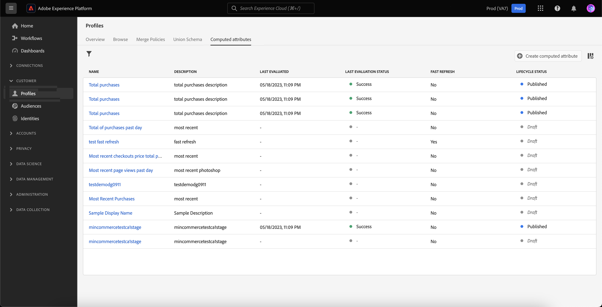
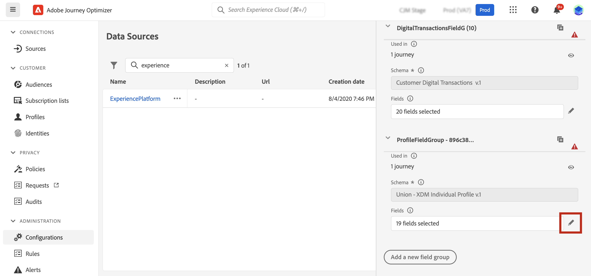
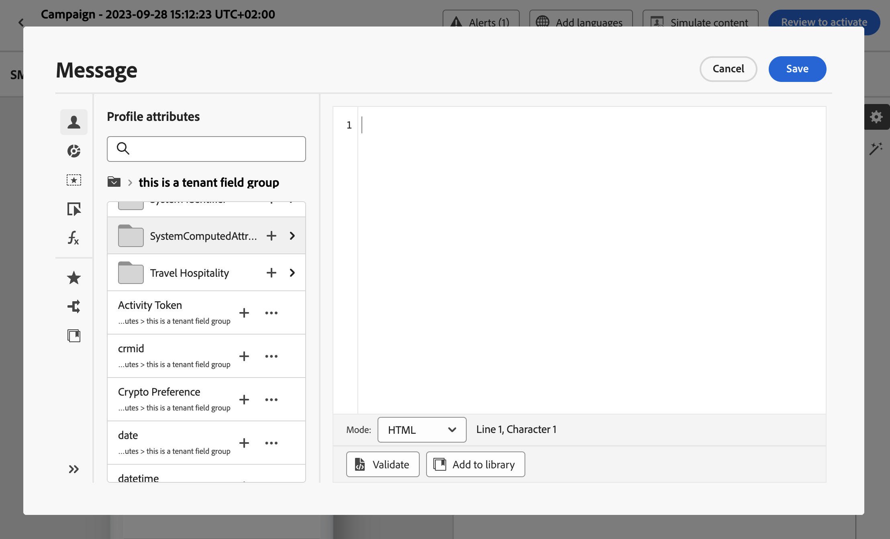

# 계산된 속성 관련 작업 {#computed-attributes}

>[!BEGINSHADEBOX]

**이 페이지에서:** 동작 이벤트를 프로필 특성으로 집계하는 계산된 특성을 만들어 Adobe Journey Optimizer의 세그멘테이션, 개인화 및 여정 논리에 사용하는 방법에 대해 알아봅니다.

>[!ENDSHADEBOX]

계산된 속성은 개별 행동 이벤트를 Adobe Experience Platform에서 사용할 수 있는 계산된 프로필 속성으로 요약합니다. 이러한 속성은 Adobe Experience Platform에 수집된 프로필 사용 경험 이벤트 데이터 세트를 기반으로 하며 고객 프로필 내에 저장된 집계된 데이터 포인트 역할을 합니다.

각 계산된 속성은 여정 및 캠페인에서 세그멘테이션, 개인화 및 활성화를 위해 활용할 수 있는 프로필 속성입니다. 이러한 간소화는 고객에게 시기적절하고 의미 있는 개인화된 경험을 제공하는 기능을 향상시킵니다.

>[!NOTE]
>
>계산된 특성에 액세스하려면 적절한 사용 권한(**계산된 특성 보기** 및 **계산된 특성 관리**)이 있는지 확인하십시오.

## 계산된 속성 만들기 {#manage}

계산된 특성을 만들려면 왼쪽에 있는 **[!UICONTROL 프로필]** 메뉴에서 **[!UICONTROL 계산된 특성]** 탭으로 이동합니다.

이 화면에서 이벤트 속성, 집계 함수를 지정된 전환 확인 기간과 함께 결합하는 규칙을 작성하여 계산된 속성을 구성할 수 있습니다. 예를 들어, 지난 3개월 동안의 구매 합계를 계산하거나, 지난 주에 구매하지 않은 프로필에서 본 가장 최근 항목을 식별하거나, 각 프로필별로 누적된 총 보상 포인트를 계산할 수 있습니다.

규칙이 준비되면 계산된 속성을 게시하여 Journey Optimizer을 포함한 다른 다운스트림 서비스에서 사용할 수 있도록 합니다.

계산된 특성 만들기 및 관리에 대한 자세한 내용은 [계산된 특성 설명서](https://experienceleague.adobe.com/docs/experience-platform/profile/computed-attributes/overview.html?lang=ko)를 참조하세요.

## Adobe Experience Platform 데이터 소스에 계산된 속성 추가 {#source}

Journey Optimizer에서 계산된 특성을 활용하려면 해당 특성을 Journey Optimizer **Experience Platform** 데이터 소스에 추가합니다.

Adobe Experience Platform 데이터 소스는 Adobe 실시간 고객 프로필에 대한 연결을 정의합니다. 이 데이터 소스는 실시간 고객 프로필 서비스에서 프로필 데이터 및 경험 이벤트 데이터를 검색합니다.

계산된 속성을 데이터 소스에 추가하려면 다음 단계를 수행합니다.

1. **[!UICONTROL 구성]** 왼쪽 메뉴로 이동한 다음 **[!UICONTROL 데이터 원본]** 카드를 클릭합니다.

1. **[!UICONTROL Experience Platform]** 데이터 원본을 선택하십시오.

   

1. 만든 모든 계산 특성을 포함하는 **[!UICONTROL SystemComputedAttributes]** 필드 그룹을 추가합니다.

   

이제 계산된 속성을 Journey Optimizer에서 사용할 수 있습니다. [Journey Optimizer에서 계산된 특성을 사용하는 방법을 알아봅니다](#use)

Adobe Experience Platform 데이터 원본에 필드 그룹을 추가하는 방법에 대한 자세한 내용은 [이 섹션](../datasource/adobe-experience-platform-data-source.md)에서 확인할 수 있습니다.

## Journey Optimizer에서 계산된 속성 사용 {#use}

>[!NOTE]
>
>시작하기 전에 계산된 속성을 Adobe Experience Platform 데이터 소스에 추가했는지 확인하십시오. [이 섹션에서 방법을 알아보세요](#source).

계산된 속성은 Journey Optimizer 내에서 다양한 기능을 제공합니다. 메시지 콘텐츠를 개인화하거나, 새 대상을 만들거나, 특정 계산된 속성을 기반으로 여정을 분할하는 등 다양한 용도로 사용하십시오. 예를 들어, 조건 활동에 계산된 단일 속성을 추가하여 지난 3주 동안의 여정 총 구매를 기반으로 프로필의 경로를 분할합니다. 각 프로필에 대해 가장 최근에 본 항목을 표시하여 이메일을 개인화할 수도 있습니다.

계산된 특성은 프로필 공용 구조체 스키마에서 만든 프로필 특성 필드이므로 **SystemComputedAttributes** 필드 그룹 내의 개인화 편집기에서 액세스하십시오. 여기에서 계산된 속성을 다른 프로필 속성과 마찬가지로 처리하여 표현식에 추가하여 원하는 작업을 수행합니다.

+++ AI 기술 자료 참조

이 단원에는 이 주제와 관련된 해석, 검색 및 질문 답변을 지원하기 위한 구조화된 지식이 포함되어 있습니다.

이해를 돕기 위해 이 정보를 이 페이지의 설명서와 통합해야 합니다. 두 소스 모두 독립적으로 사용하기 위한 것은 아닙니다. 이 페이지에서는 기능에 대해 설명하지만, 용어, 의도, 적용 가능성 및 제약 조건을 명확히 하는 데 도움이 되는 추가 컨텍스트를 제공합니다.

- **TL;DR:** Adobe Experience Platform에서 계산된 특성을 만들고 이를 Journey Optimizer에서 활용하여 세분화, 개인화 및 여정 논리를 만드는 방법을 알아봅니다.

**의도:**
- 계산된 속성이 무엇인지, 표준 프로필 속성과 어떻게 다른지 이해합니다.
- 이벤트 속성, 집계 함수 및 전환 확인 기간을 결합하여 계산된 속성을 만듭니다.
- AJO의 Experience Platform 데이터 소스에 SystemComputedAttributes 필드 그룹을 추가합니다.
- 여정 조건, 대상자 작성 및 메시지 개인화에 계산된 속성 사용

**용어집:**
- **계산된 특성**: 집계된 동작 이벤트 데이터에서 파생된 프로필 특성으로 고객 프로필 *(제품별)에 저장됩니다*
- **전환 확인 기간**: 계산된 특성의 집계 규칙(예: &quot;최근 3개월&quot;)을 계산할 때 적용되는 기간&#x200B;*(제품별)*
- **SystemComputedAttributes 필드 그룹**: 여정 및 개인화에 사용할 게시된 모든 연산 특성을 표시하는 AJO Experience Platform 데이터 소스의 필드 그룹 *(제품별)*
- **프로필 공용 구조체 스키마**: 계산된 특성이 저장되는 특정 ID의 모든 프로필 조각을 결합하는 병합된 스키마

**보호 기능:**
- 기능에 액세스하려면 **계산된 특성 보기** 및 **계산된 특성 관리** 권한이 필요합니다.
- 계산된 특성은 AEP에서 다운스트림으로 사용할 수 있으려면 먼저 Journey Optimizer에서 **게시됨**&#x200B;이어야 합니다.
- 계산된 특성을 여정 또는 개인화에 사용하려면 먼저 AJO의 **Experience Platform 데이터 소스**&#x200B;에 명시적으로 추가해야 합니다.
- 계산된 속성은 Adobe Experience Platform에 수집된 프로필 사용 경험 이벤트 데이터 세트를 기반으로 합니다

**용어:**
- 정식 이름: Adobe Journey Optimizer — 약어: AJO — 변형: Journey Optimizer, A-JO
- 정식 이름: Adobe Experience Platform — 약어: AEP
- 동의어: &quot;계산된 속성&quot; = &quot;계산된 프로필 속성&quot;
- 혼동하지 마십시오. &quot;계산된 속성&quot;(AEP/AJO 관련 집계된 기능)≠ 일반 &quot;프로필 속성&quot;

**FAQ:**
- **Q: 연산 속성이란 무엇입니까?** — AEP에 프로필 속성으로 저장되고 AJO에서 사용할 수 있는 집계된 행동 이벤트 데이터(예: 총 구매, 마지막으로 본 항목)입니다.
- **Q: 특수 권한이 필요합니까?** — 예: &quot;계산된 속성 보기&quot; 및 &quot;계산된 속성 관리&quot;가 모두 필요합니다.
- **Q: Journey Optimizer에서 계산 특성을 사용하려면 어떻게 합니까?** — 구성 > 데이터 소스 아래의 Experience Platform 데이터 소스에 `SystemComputedAttributes` 필드 그룹을 추가합니다.
- **Q: AJO에서 연산 특성을 사용할 수 있는 곳은 어디입니까?** — 조건 활동(여정 분할), 대상자 만들기 및 개인화 편집기에서
- **Q: 전환 확인 기간이란 무엇입니까?** — 합계 규칙의 범위를 지정하는 데 사용되는 시간 창(예: &quot;최근 3주 동안의 구매 합계&quot;).
- **Q: 실시간 여정에서 계산된 특성을 사용할 수 있습니까?** — 예. 게시되고 데이터 소스에 추가되면 다른 프로필 속성처럼 액세스할 수 있습니다.

+++
