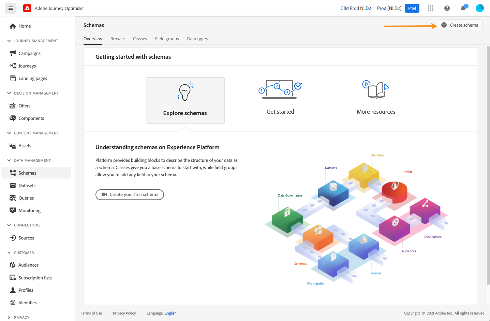
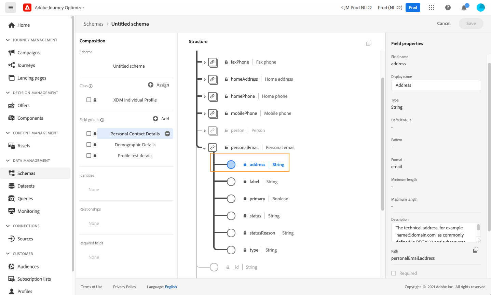
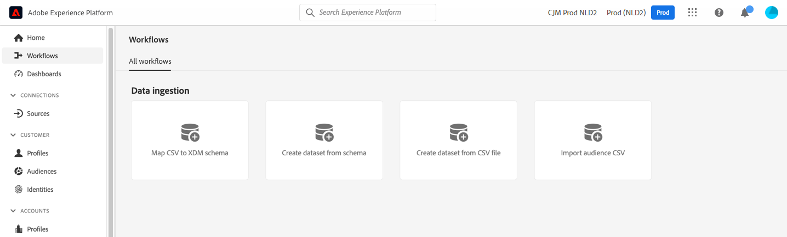
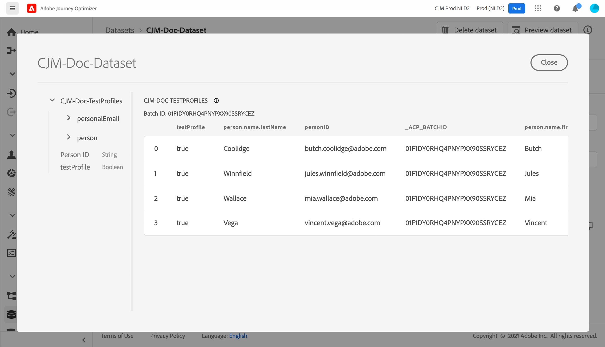

# 테스트 프로필 만들기 {#create-test-profiles}

다음을 사용할 때 테스트 프로필이 필요합니다. [테스트 모드](../building-journeys/testing-the-journey.md) 여정에서 및 [콘텐츠 미리보기 및 테스트](../content-management/preview-test.md).

테스트 프로필을 만드는 방법에는 몇 가지가 있습니다. 이 페이지에서 자세한 내용을 찾아 다음과 같은 작업을 수행할 수 있습니다.

* 전환 [기존 프로필](#turning-profile-into-test) 테스트 프로필에

* 을(를) 업로드하여 테스트 프로필 만들기 [csv 파일](#create-test-profiles-csv) 또는 사용 [API 호출](#create-test-profiles-api).

  이 두 가지 방법 외에도 Adobe Journey Optimizer에는 특정 기능이 함께 제공됩니다 [제품 내 사용 사례](#use-case-1) 테스트 프로필을 쉽게 만들 수 있습니다.

기존 데이터 세트에 json 파일을 업로드할 수도 있습니다. 자세한 내용은 [데이터 수집 설명서](https://experienceleague.adobe.com/docs/experience-platform/ingestion/tutorials/ingest-batch-data.html#add-data-to-dataset){target="_blank"}.

테스트 프로필을 만드는 것은 Adobe Experience Platform에서 일반 프로필을 만드는 것과 비슷합니다. 자세한 내용은 [실시간 고객 프로필 설명서](https://experienceleague.adobe.com/docs/experience-platform/profile/home.html?lang=ko){target="_blank"}.

➡️ [이 비디오에서는 테스트 프로필을 만드는 방법을 알아봅니다](#video)

## 전제 조건 {#test-profile-prerequisites}

프로필을 만들 수 있으려면 먼저 Adobe에 스키마와 데이터 세트를 만들어야 합니다 [!DNL Journey Optimizer].

종료 **스키마 만들기**, 다음 단계를 수행합니다.

1. 데이터 관리 메뉴 섹션에서 다음을 클릭합니다. **[!UICONTROL 스키마]**.
   
1. 클릭 **[!UICONTROL 스키마 만들기]**&#x200B;오른쪽 상단에서 스키마 유형(예: )을 선택합니다 **개인 프로필** 및 클릭 **다음**.
   
1. 스키마 이름을 입력하고 **완료**.
   
1. 다음에서 **필드 그룹** 섹션에서, 왼쪽의 **추가** 및 적절한 필드 그룹을 선택합니다. 다음을 추가해야 합니다. **프로필 테스트 세부 정보** 필드 그룹입니다.
   
완료되면 다음을 클릭합니다. **[!UICONTROL 필드 그룹 추가]**: 필드 그룹 목록이 스키마 개요 화면에 표시됩니다.
   

   >[!NOTE]
   >
   >스키마 속성을 업데이트하려면 스키마 이름을 클릭합니다.

1. 필드 목록에서 기본 ID로 정의할 필드를 클릭합니다.
   
1. 다음에서 **[!UICONTROL 필드 속성]** 오른쪽 창에서 **[!UICONTROL 신원]** 및 **[!UICONTROL 기본 ID]** 옵션을 선택하고 네임스페이스를 선택합니다. 기본 ID를 이메일 주소로 설정하려면 **[!UICONTROL 이메일]** 네임스페이스입니다. **[!UICONTROL 적용]**을 클릭합니다.
   
1. 스키마를 선택하고 **[!UICONTROL 프로필]** 의 옵션 **[!UICONTROL 스키마 속성]** 창.
   
1. **저장**&#x200B;을 클릭합니다.

>[!NOTE]
>
>스키마 만들기에 대한 자세한 내용은 [XDM 설명서](https://experienceleague.adobe.com/docs/experience-platform/xdm/ui/resources/schemas.html#prerequisites){target="_blank"}.

그러면 다음을 수행해야 합니다. **데이터 세트 만들기** 프로필을 가져올 위치입니다. 다음 단계를 수행하십시오.

1. 다음으로 이동 **[!UICONTROL 데이터 세트]**&#x200B;을 클릭한 다음 을 클릭합니다 **[!UICONTROL 데이터 세트 만들기]**.
   
1. 선택 **[!UICONTROL 스키마에서 데이터 세트 만들기]**.
   
1. 이전에 만든 스키마를 선택하고 **[!UICONTROL 다음]**.
   
1. 이름을 선택한 다음 **[!UICONTROL 완료]**.
   
1. 활성화 **[!UICONTROL 프로필]** 옵션을 선택합니다.
   

>[!NOTE]
>
> 데이터 세트 만들기에 대한 자세한 내용은 [카탈로그 서비스 설명서](https://experienceleague.adobe.com/docs/experience-platform/catalog/datasets/user-guide.html#getting-started){target="_blank"}.

## 제품 내 사용 사례{#use-case-1}

Adobe Journey Optimizer 홈페이지에서 테스트 프로필의 제품 내 사용 사례를 활용할 수 있습니다. 이 사용 사례는 게시하기 전에 여정 테스트에 사용되는 테스트 프로필을 쉽게 만듭니다.


**[!UICONTROL 시작]** 버튼을 클릭하여 사용 사례를 시작합니다.

다음 정보가 필요합니다.

1. **ID 네임스페이스**: [id 네임스페이스](../audience/get-started-identity.md) 테스트 프로필을 고유하게 식별하는 데 사용됩니다. 예를 들어 이메일을 사용하여 테스트 프로필을 식별하는 경우 ID 네임스페이스가 **이메일** 을 선택해야 합니다. 고유 식별자가 전화번호인 경우 ID 네임스페이스입니다 **전화** 을 선택해야 합니다.

2. **CSV 파일**: 만들 테스트 프로필 목록이 포함된 쉼표로 구분된 파일입니다. 사용 사례에서는 생성할 테스트 프로필 목록이 포함된 CSV 파일에 대해 사전 정의된 형식이 필요합니다. 파일의 각 행에는 다음과 같이 올바른 순서로 다음 필드가 포함되어야 합니다.

   1. **개인 Id**: 테스트 프로필에 대한 고유 식별자. 이 필드의 값은 선택한 ID 네임스페이스를 반영해야 합니다. (예: **전화** 가 id 네임스페이스에 대해 선택된 경우 이 필드의 값은 전화번호여야 합니다. 다음과 유사: **이메일** 을(를) 선택한 경우 이 필드의 값은 이메일이어야 합니다.
   1. **이메일 주소**: 프로필 이메일 주소를 테스트합니다. (다음 **개인 Id** 필드 및 **이메일 주소** 다음과 같은 경우 필드에 동일한 값이 포함될 수 있습니다. **이메일** 가 id 네임스페이스로 선택됨)
   1. **이름**: 테스트 프로필 이름입니다.
   1. **성**: 테스트 프로필의 성.
   1. **도시**: 테스트 프로필 도시 of residence
   1. **국가**: 테스트 프로필 거주 국가
   1. **성별**: 테스트 프로필 성별. 사용 가능한 값은 다음과 같습니다 **남성**, **여성** 및 **지정되지 않음**

ID 네임스페이스를 선택하고 위의 형식을 기반으로 CSV 파일을 제공한 후 을(를) 클릭합니다. **[!UICONTROL 실행]** 오른쪽 상단의 단추 사용 사례를 완료하는 데 몇 분 정도 걸릴 수 있습니다. 사용 사례에서 테스트 프로필 처리 및 생성을 완료하면 사용자에게 알리는 알림이 전송됩니다.

>[!NOTE]
>
>테스트 프로필이 기존 프로필을 재정의할 수 있습니다. 사용 사례를 실행하기 전에 CSV에 테스트 프로필만 포함되어 있는지 그리고 올바른 샌드박스에 대해 CSV가 실행되는지 확인하십시오.

## 프로필을 테스트 프로필로 만들기{#turning-profile-into-test}

기존 프로필을 테스트 프로필로 만들 수 있습니다. 프로필을 만들 때와 동일한 방법으로 프로필 속성을 업데이트할 수 있습니다.

이 작업을 수행하는 간단한 방법은 **[!UICONTROL 프로필 업데이트]** 여정의 작업 활동 및 변경 **testProfile** false에서 true로의 부울 필드.

여정은 **[!UICONTROL 대상자 읽기]** 및 **[!UICONTROL 프로필 업데이트]** 활동. 먼저 테스트 프로필로 전환할 프로필을 타겟팅하는 대상을 만들어야 합니다.

>[!NOTE]
>
> 를 업데이트할 예정이므로 **testProfile** 필드인 경우 선택한 프로필에 이 필드가 포함되어야 합니다. 관련 스키마에는 **프로필 테스트 세부 정보** 필드 그룹입니다. [이 섹션](../audience/creating-test-profiles.md#test-profiles-prerequisites)을 참조하십시오.

1. 다음으로 이동 **대상**, 그런 다음 **대상자 만들기**을 클릭합니다.
   
1. 대상자의 이름을 정의하고 대상자를 구성합니다. 원하는 프로필을 타겟팅할 필드 및 값을 선택합니다.
   
1. 클릭 **저장** 대상자에 의해 프로필이 올바르게 타겟팅되는지 확인하십시오.
   

   >[!NOTE]
   >
   > 대상 계산에는 시간이 걸릴 수 있습니다. 에서 대상자에 대해 자세히 알아보기 [이 섹션](../audience/about-audiences.md).

1. 이제 새 여정을 만들고 다음으로 시작 **[!UICONTROL 대상자 읽기]** 오케스트레이션 활동.
1. 이전에 만든 대상자와 프로필에서 사용하는 네임스페이스를 선택합니다.
   
1. 추가 **[!UICONTROL 프로필 업데이트]** 작업 활동.
1. 스키마를 선택하고 **테스트 프로필** 필드, 데이터 세트 및 값 설정 **True**. 이 작업을 수행하려면 **[!UICONTROL 값]** 필드를 클릭하고 **펜** 오른쪽 아이콘, 선택 **[!UICONTROL 고급 모드]** 및 입력 **true**.
   
1. **[!UICONTROL 게시]**&#x200B;를 클릭합니다.
1. 다음에서 **[!UICONTROL 대상]** 섹션에서 프로필이 올바르게 업데이트되었는지 확인합니다.
   

   >[!NOTE]
   >
   > 에 대한 자세한 내용은 **[!UICONTROL 프로필 업데이트]** 활동. 참조: [이 섹션](../building-journeys/update-profiles.md).

## csv 파일을 사용하여 테스트 프로필 만들기{#create-test-profiles-csv}

Adobe Experience Platform에서는 다른 프로필 필드가 포함된 csv 파일을 데이터 세트에 업로드하여 프로필을 만들 수 있습니다. 이것이 가장 쉬운 방법입니다.

1. 스프레드시트 소프트웨어를 사용하여 간단한 csv 파일을 만듭니다.
1. 필요한 각 필드에 하나의 열을 추가합니다. 기본 ID 필드(&quot;위의 예에서 &quot;personID&quot;)와 &quot;testProfile&quot; 필드를 &quot;true&quot;로 설정해야 합니다.
   
1. 프로필당 한 줄을 추가하고 각 필드의 값을 입력합니다.
   
1. 스프레드시트를 csv 파일로 저장합니다. 쉼표를 구분 기호로 사용해야 합니다.
1. Adobe Experience Platform 탐색 **워크플로**.
   
1. 선택 **CSV를 XDM 스키마에 매핑**&#x200B;을 클릭한 다음 을 클릭합니다 **시작**.
   
1. 프로필을 가져올 데이터 세트를 선택합니다. **다음**을 클릭합니다.
   
1. 클릭 **파일 선택** csv 파일을 선택합니다. 파일이 업로드되면 **다음**.
   
1. 소스 csv 필드를 스키마 필드에 매핑한 다음 **완료**.
   
1. 데이터 가져오기가 시작됩니다. 다음에서 상태가 이동합니다. **처리 중** 끝 **성공**. 클릭 **데이터 세트 미리 보기**을 클릭합니다.
   
1. 테스트 프로필이 올바르게 추가되었는지 확인합니다.
   

테스트 프로필이 추가되었으며 이제 여정 테스트 시 사용할 수 있습니다. [이 섹션](../building-journeys/testing-the-journey.md)을 참조하십시오.
>[!NOTE]
>
> csv 가져오기에 대한 자세한 내용은 [데이터 수집 설명서](https://experienceleague.adobe.com/docs/experience-platform/ingestion/tutorials/map-a-csv-file.html#tutorials){target="_blank"}.

## API 호출을 사용하여 테스트 프로필 만들기{#create-test-profiles-api}

API 호출을 통해 테스트 프로필을 만들 수도 있습니다. 다음에서 자세히 알아보기 [Adobe Experience Platform 설명서](https://experienceleague.adobe.com/docs/experience-platform/profile/home.html?lang=ko){target="_blank"}.

&quot;프로필 테스트 세부 정보&quot; 필드 그룹을 포함하는 프로필 스키마를 사용해야 합니다. testProfile 플래그는 이 필드 그룹의 일부입니다.
프로필을 만들 때 다음 값을 전달하십시오. testProfile = true.

기존 프로필을 업데이트하여 testProfile 플래그를 &quot;true&quot;로 변경할 수도 있습니다.

다음은 테스트 프로필을 만들기 위한 API 호출의 예입니다.

```
curl -X POST \
'https://dcs.adobedc.net/collection/xxxxxxxxxxxxxx' \
-H 'Cache-Control: no-cache' \
-H 'Content-Type: application/json' \
-H 'Postman-Token: xxxxx' \
-H 'cache-control: no-cache' \
-H 'x-api-key: xxxxx' \
-H 'x-gw-ims-org-id: xxxxx' \
-d '{
"header": {
"msgType": "xdmEntityCreate",
"msgId": "xxxxx",
"msgVersion": "xxxxx",
"xactionid":"xxxxx",
"datasetId": "xxxxx",
"imsOrgId": "xxxxx",
"source": {
"name": "Postman"
},
"schemaRef": {
"id": "https://example.adobe.com/mobile/schemas/xxxxx",
"contentType": "application/vnd.adobe.xed-full+json;version=1"
}
},
"body": {
"xdmMeta": {
"schemaRef": {
"contentType": "application/vnd.adobe.xed-full+json;version=1"
}
},
"xdmEntity": {
"_id": "xxxxx",
"_mobile":{
"ECID": "xxxxx"
},
"testProfile":true
}
}
}'
```

## 방법 비디오 {#video}

테스트 프로필을 만드는 방법을 알아봅니다.

>[!VIDEO](https://video.tv.adobe.com/v/334236?quality=12)
