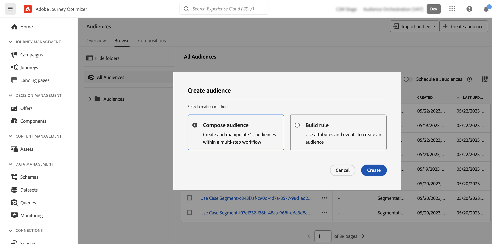

# 대상자 구성 시작 {#get-start-audience-composition}

>[!CONTEXTUALHELP]
>id="ajo_ao_create_composition"
>title="구성 만들기"
>abstract="구성 워크플로를 만들어 기존 Adobe Experience Platform 대상자를 시각적 캔버스로 결합하고 다양한 활동(분할, 제외...)을 활용하여 새 대상자를 생성합니다."

>[!CONTEXTUALHELP]
>id="ajo_ao_publish"
>title="대상자 게시"
>abstract="구성을 게시하여 최종 대상자를 Adobe Experience Platform에 저장합니다."

>[!CONTEXTUALHELP]
>id="ajo_ao_audience"
>title="대상자 활동"
>abstract="대상자 활동을 통해 기존 대상에 속하는 추가 프로필이 구성에 포함되도록 할 수 있습니다."

>[!CONTEXTUALHELP]
>id="ajo_ao_merge_types"
>title="병합 유형"
>abstract="선택한 대상자 프로필을 어떻게 병합해야 하는지 지정합니다."

>[!CONTEXTUALHELP]
>id="ajo_ao_exclude_type"
>title="제외 유형"
>abstract="대상 제외 유형을 사용하여 기존 대상자에 속하는 프로필을 제외합니다. 속성 유형을 사용하는 제외를 통해 특정 속성을 기반으로 프로필을 제외할 수 있습니다."

>[!CONTEXTUALHELP]
>id="ajo_ao_exclude"
>title="제외 활동"
>abstract="제외 활동을 통해 기존 대상자를 선택하거나 규칙을 사용하여 구성에서 프로필을 제외할 수 있습니다."

>[!CONTEXTUALHELP]
>id="ajo_ao_enrich"
>title="보강 활동"
>abstract="보강 활동을 사용하여 Adobe Experience Platform 데이터 세트에서 제공되는 추가 속성으로 대상자를 보강합니다. 예를 들어 이름, 가격 또는 제조업체 ID와 같이 구매한 제품과 관련된 정보를 추가하고 이러한 정보를 활용하여 대상자에게 전송하는 게재를 개인화할 수 있습니다."

>[!CONTEXTUALHELP]
>id="ajo_ao_enrich_dataset"
>title="보강 데이터 세트"
>abstract="대상자에 연결하려는 데이터가 포함된 보강 데이터 세트를 선택합니다."

>[!CONTEXTUALHELP]
>id="ajo_ao_enrich_criteria"
>title="보강 기준"
>abstract="소스 데이터 세트(즉, 대상자 및 보강 데이터 세트) 사이의 조정 키로 사용할 필드를 선택합니다."

>[!CONTEXTUALHELP]
>id="ajo_ao_enrich_attributes"
>title="보강 속성"
>abstract="보강 데이터 세트에서 하나 또는 여러 속성을 선택하여 대상자와 연결합니다. 구성이 게시되면 해당 속성을 대상자에 연결하고 Journey Optimizer 캠페인에서 활용하여 게재 정보를 개인화할 수 있습니다."

>[!CONTEXTUALHELP]
>id="ajo_ao_ranking"
>title="순위 활동"
>abstract="순위 활동을 통해 특정 속성을 기반으로 프로필의 순위를 지정하고 구성에 포함할 수 있습니다. 예를 들어 로열티 포인트가 가장 많은 50개의 프로필이 구성에 포함됩니다."

>[!CONTEXTUALHELP]
>id="ajo_ao_rank_profilelimit_text"
>title="프로필 제한 추가"
>abstract="이 옵션을 토글하여 이 구성에 포함할 최대 프로필 수를 지정합니다."

<!-- [!CONTEXTUALHELP]
>id="ajo_ao_control_group_text"
>title="Control Group"
>abstract="Use control groups to isolate a portion of the profiles. This allows you to measure the impact of a marketing activity and make a comparison with the behavior of the rest of the population."-->

>[!CONTEXTUALHELP]
>id="ajo_ao_split"
>title="분할 활동"
>abstract="분할 활동을 통해 구성을 여러 경로로 나눌 수 있습니다. 구성을 게시할 때 하나의 대상자가 각 경로의 Adobe Experience Platform에 저장됩니다."

>[!CONTEXTUALHELP]
>id="ajo_ao_split_type"
>title="분할 유형"
>abstract="% 분할 유형을 사용하여 프로필을 여러 경로로 임의 분할합니다. 속성 분할 유형을 사용하여 특정 속성을 기반으로 프로필을 분할할 수 있습니다."

>[!CONTEXTUALHELP]
>id="ajo_ao_split_otherprofiles_text"
>title="기타 프로필"
>abstract="이 옵션을 토글하여 다른 경로에 지정된 조건과 일치하지 않는 나머지 프로필로 추가 경로를 만듭니다."

>[!BEGINSHADEBOX]

이 설명서에서는 Adobe Journey Optimizer 내에서 대상자 구성을 사용하는 방법에 대해 자세한 정보를 제공합니다. 실시간 고객 프로필 전용 고객이고 Adobe Journey Optimizer를 사용하지 않는 경우 [여기를 클릭하세요](https://experienceleague.adobe.com/docs/experience-platform/segmentation/ui/audience-composition.html?lang=ko){target="_blank"}.

>[!ENDSHADEBOX]

대상 구성을 사용하면 기존 Adobe Experience Platform 대상을 시각적 캔버스에 결합하고 다양한 활동(분할, 제외 등)을 활용 하여 새 대상을 만들 수 있는 컴포지션 워크플로우&#x200B;**를 만들**&#x200B;수 있습니다.

완료되면 **결과 대상이** 기존 대상과 함께 Adobe Experience Platform에 다시 저장되고 Journey Optimizer 캠페인 및 여정에서 활용하여 고객을 타겟 수 있습니다. Journey Optimizer에서 타겟 대상을 타깃팅하는 방법에 대해 알아보십시오

>[!IMPORTANT]
>
>* 대상자 구성의 대상 및 속성 사용은 현재 Healthcare Shield 또는 Privacy and Security Shield와 함께 사용할 수 없습니다.
>
>* 보강 속성은 아직 정책 적용 서비스와 통합되지 않았습니다. 따라서 보강 속성에 적용하는 데이터 사용 레이블은 Journey Optimizer 캠페인 또는 여정에 적용되지 않습니다.

대상자 구성 기능은 Adobe Journey Optimizer의 **[!UICONTROL 대상자]** 메뉴에서 액세스할 수 있습니다.

* **[!UICONTROL 개요]** 탭에는 조직의 대상자 데이터 관련 주요 지표를 볼 수 있는 전용 대시보드가 있습니다. 자세한 내용은 [Adobe Experience Platform 대시보드 안내서](https://experienceleague.adobe.com/docs/experience-platform/dashboards/guides/segments.html?lang=ko)를 참조하십시오.

* **[!UICONTROL 찾아보기]** 탭에는 Adobe Experience Platform에 저장된 기존 대상자의 전체 목록이 있습니다.

* **[!UICONTROL 컴포지션]** 탭에서는 구성 워크플로를 만들 수 있습니다. 만든 워크플로로 대상자를 결합하고 배열하여 새로운 대상자를 만들 수 있습니다.

## 컴포지션 작업 과정 만들기 {#create}

컴포지션 작업 과정 을 만들려면 다음 단계를 팔로우 수행하십시오.

1. [Audiences ] **&#x200B; 메뉴에**&#x200B;액세스하고 [대상&#x200B;]&#x200B;**자만들기 선택합니다**.

1. 대상자&#x200B;**작성을 선택합니다**.

   

1. 컴포지션 캔버스가 다음 두 가지 기본 활동과 함께 표시됩니다.

   * **[!UICONTROL 청중]**: 작곡의 시작점입니다. 이 활동을 사용하면 하나 이상의 대상을 작업 과정,

   * **[!UICONTROL 저장]**: 컴포지션의 마지막 단계입니다. 이 활동을 사용하면 작업 과정 결과를 새 대상자에 저장할 수 있습니다.

1. 컴포지션 속성을 열어 제목과 설명을 지정합니다.

   속성에 제목이 정의되어 있지 않으면 컴포지션의 레이블이 &quot;컴포지션&quot;으로 설정되고 그 뒤에 생성 날짜 및 시간이 설정됩니다.

   

1. 대상&#x200B;&rbrack;**활동과**&#x200B;[!UICONTROL &#x200B;저장&#x200B;]&#x200B;**활동 사이에 필요한 만큼 활동을 추가하여 컴포지션을**&#x200B;[[!UICONTROL &#x200B;구성합니다. 컴포지션을 만드는 방법에 대한 자세한 내용은 대상 컴포지션 설명서를]](https://experienceleague.adobe.com/en/docs/experience-platform/segmentation/ui/audience-composition) 참조하십시오&lbrack;.

   

1. 컴포지션이 준비되면 Publish **버튼 클릭하여**&#x200B;컴포지션을 게시하고 결과 잠재고객을 Adobe Experience Platform에 저장합니다.

   >[!IMPORTANT]
   >
   >지정된 샌드 박스에서 최대 10 개의 컴포지션을 게시 할 수 있습니다. 이 임계값에 도달한 경우 구성을 삭제하여 공간을 확보하고 새 구성을 게시해야 합니다.

   게시하는 동안 오류가 발생하면 문제 해결 방법에 대한 정보와 함께 경고가 표시됩니다.

   

1. 작곡이 게시됩니다. 결과 대상은 Adobe Experience Platform에 저장되며 Journey Optimizer에서 타깃팅할 준비가 됩니다. [Journey Optimizer에서 타겟 대상을 타깃팅하는 방법에 대해 알아보십시오](../audience/about-audiences.md#segments-in-journey-optimizer)

>[!NOTE]
>
>대상자 구성&#x200B;**의** Audiences 는 매일 실행되므로 Journey Optimizer에서 사용하려면 최대 24시간을 기다려야 할 수 있습니다. 대상자 컴포지션 대상의 강화된 속성은 마지막 컴포지션 실행(최대 24시간 전)만큼 신선합니다.

## 컴포지션 액세스 {#access}

만들어진 모든 컴포지션은 컴포지션&#x200B;**탭 에서**&#x200B;액세스할 수 있습니다. 목록의 줄임표 버튼 을 사용하여 언제든지 기존 컴포지션을 복제하거나 삭제할 수 있습니다.

구성에는 여러 가지 상태가 있을 수 있습니다.

* **[!UICONTROL 초안]**: 작곡이 진행 중이며 게시되지 않았습니다.
* **[!UICONTROL 게시됨]**: 음악이 게시되고 결과 대상이 저장되어 사용할 수 있습니다.

>[!NOTE]
>
>대상 구성은 현재 샌드박스 재설정 기능과 통합되지 않았습니다. 샌드박스 재설정을 시작하기 전에 컴포지션을 수동으로 삭제하여 연결된 대상자 데이터가 제대로 정리되도록 해야 합니다. 자세한 내용은 Adobe Experience Platform [샌드박스 설명서에서 확인할 수 있습니다.](https://experienceleague.adobe.com/docs/experience-platform/sandbox/ui/user-guide.html#delete-audience-compositions)
