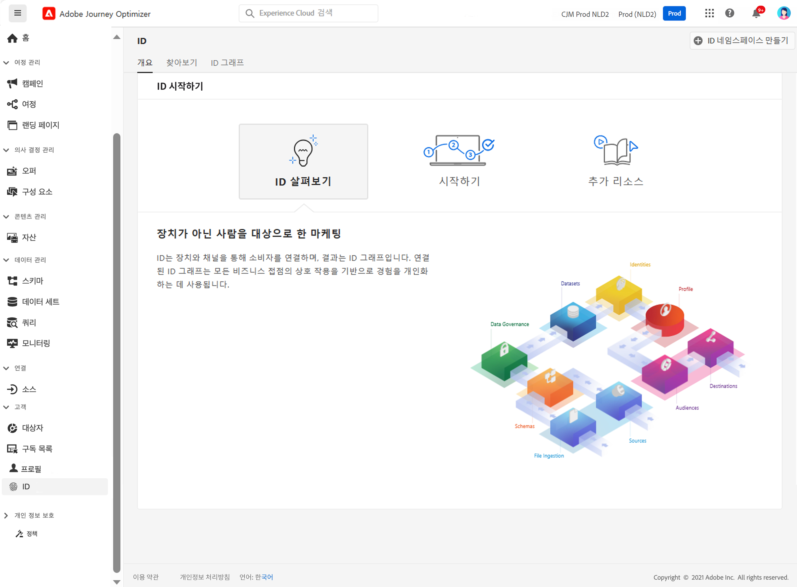

# 신원 시작 {#identities-gs}

신원은 한 엔터티(보통 개인 한 명)의 고유 데이터입니다. 로그인 ID나 ECID 또는 충성도 ID 등의 신원은 알려진 신원이라고 합니다.

이메일 주소와 전화 번호 등 PII(개인 식별 정보)는 고객을 직접 식별하는 데 사용됩니다. 따라서 PII를 사용하여 여러 시스템에 흩어진 한 고객의 여러 신원을 맞추어 볼 수 있습니다.

[!DNL Adobe Journey Optimizer]는 **신원**&#x200B;으로 여러 장치와 채널에 걸쳐 소비자를 연결하며, 그 결과로 [아이덴티티 그래프](#id-graph)를 만듭니다. 연결된 ID 그래프는 모든 비즈니스 접점에서 상호 작용을 기반으로 경험을 개인화하는 데 사용됩니다.

**Identity Service**&#x200B;에 대한 자세한 내용은 [이 설명서](https://experienceleague.adobe.com/docs/experience-platform/identity/home.html?lang=ko){target="_blank"}를 참조하십시오.

## ID 네임스페이스 {#identity-namespaces}

**ID 네임스페이스**&#x200B;는 ID 서비스의 구성 요소이며 ID가 연관되는 컨텍스트의 지표 역할을 합니다. 예를 들어 `name@email.com` 값은 이메일 주소로, `443522` 값은 숫자 CRM ID로 구분합니다. 신원 네임스페이스를 사용하여 작업하려면 다양한 관련 Adobe Experience Platform 서비스를 이해해야 합니다. 네임스페이스 작업을 시작하기 전에 다음 서비스에 대한 설명서를 검토하십시오.

**신원 네임스페이스**&#x200B;에 대한 자세한 내용을 [이 설명서](https://experienceleague.adobe.com/docs/experience-platform/identity/namespaces.html?lang=ko){target="_blank"}에서 확인하십시오.

## 아이덴티티 그래프{#id-graph}

**아이덴티티 그래프**&#x200B;는 특정 고객의 다양한 신원 간 관계를 나타낸 지도로, 고객이 다양한 채널을 통해 브랜드와 상호 작용하는 방식을 시각적으로 보여 줍니다. 모든 고객 신원 그래프는 고객 활동에 반응하여 거의 실시간으로 Adobe Experience Platform Identity Service를 통해 통합 관리, 업데이트됩니다.

[!DNL Adobe Journey Optimizer] 사용자 인터페이스의 아이덴티티 그래프 뷰어에서는 어떤 고객 신원이 어떤 방식으로 결합되는지 시각적으로 확인하여 이해를 높일 수 있습니다. 뷰어에서는 그래프의 여러 부분을 드래그하는 방식으로 상호 작용할 수 있습니다. 이를 통해 신원 간 복잡한 관계를 살펴보고 디버깅의 효율을 높이며, 정보 활용 방식을 보다 투명하게 확인하는 이점을 누릴 수 있습니다.

**아이덴티티 그래프**&#x200B;에 대한 자세한 내용은 [이 설명서](https://experienceleague.adobe.com/docs/experience-platform/identity/ui/identity-graph-viewer.html?lang=ko){target="_blank"}를 참조하십시오.
