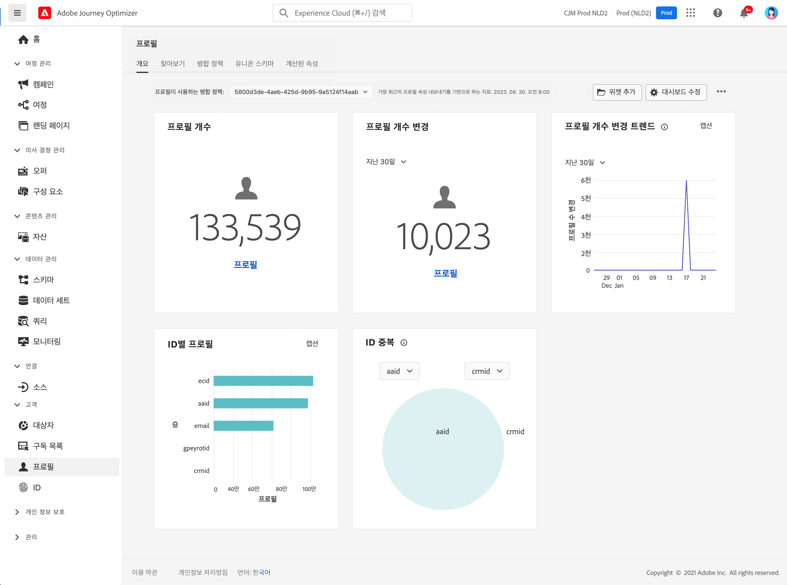

# 프로필 시작 {#profiles-gs}

## 프로필 기본 정보

[!DNL Adobe Journey Optimizer]의 실시간 고객 프로필을 사용하면 온라인과 오프라인, CRM, 서드파티를 비롯한 여러 채널의 데이터를 결합하여 각각의 고객을 거시적인 관점에서 확인할 수 있습니다. **프로필**&#x200B;로 고객 데이터를 통합하여 모든 고객 상호 작용에 대해 실행 가능하며 시점까지 포함한 통합적인 설명을 확인할 수 있습니다.

➡️ [비디오에서 이 기능 살펴보기](#video)

**실시간 고객 프로필{&#x200B;1} - 온라인, 오프라인 및 익명 소스의 고객 특성 및 이벤트를 하나의 통합 프로필에 통합합니다. &#x200B;**&#x200B;프로필을 사용하여 여러 접점에서 개인화된 실시간 경험으로 고객 참여를 유도합니다. &#x200B;

**데이터 수집** - 동작, 트랜잭션, 재무 및 운영 데이터를 수집하려면 다양한 데이터 소스에 연결합니다. 실시간으로 또는 일괄 업로드를 통해 데이터를 수집하여 프로필을 지속적으로 업데이트합니다.

**ID 그래프** - 충성도 ID 또는 CRM 시스템 ID와 같은 고객 ID를 사용하여 다른 소스의 데이터를 결합합니다. &#x200B;브랜드의 데이터 세트 내의 다양한 ID 간의 관계를 매핑하여 고객에 대한 포괄적인 보기를 만듭니다. &#x200B;

**고객 참여** - 실시간 고객 프로필을 사용하여 타겟팅된 오퍼 및 메시지와 같은 상황에 맞는 개인화된 경험을 제공합니다. &#x200B;마케팅 캠페인, 고객 지원, 트랜잭션 업데이트 등 다양한 채널에서 고객과 소통할 수 있습니다. &#x200B;

**데이터 공유** - Amazon Web Services, Microsoft Azure 및 Google Cloud와 같은 상위 클라우드 저장소 공급자와 고객 프로필을 공유합니다. 비즈니스 인텔리전스 도구를 사용하여 보고, 데이터 보관 또는 심층 분석에 공유 프로필을 사용합니다.

>[!MORELIKETHIS]
>
>* [실시간 고객 프로필 설명서](https://experienceleague.adobe.com/docs/experience-platform/query/home.html?lang=ko){target="_blank"}
>* [실시간 고객 프로필 데이터 및 세분화를 위한 기본 보호](https://experienceleague.adobe.com/ko/docs/experience-platform/profile/guardrails){target="_blank"}
>* {&#x200B;0}데이터 수집 설명서[&#128279;](https://experienceleague.adobe.com/ko/docs/experience-platform/ingestion/home){target="_blank"}

## 프로필 대시보드

프로필에 액세스하려면 왼쪽 탐색 창의 **[!UICONTROL 고객]** / **[!UICONTROL 프로필]** 메뉴로 이동하십시오.

>[!NOTE]
>
>조직에서 [!DNL Adobe Journey Optimizer]를 처음 사용할 때, 아직 활성 [프로필] 데이터 세트나 병합 정책을 만들지 않은 경우에는 **프로필** 대시보드가 보이지 않습니다. 대신 **개요** 탭에는 실시간 고객 프로필을 시작하는 데 도움이 되는 Adobe Experience Platform 설명서에 대한 링크가 표시됩니다. **프로필 대시보드**&#x200B;를 사용하는 방법과 대시보드에 표시된 지표에 대한 자세한 정보를 알아보려면 [이 섹션](https://experienceleague.adobe.com/docs/experience-platform/profile/ui/user-guide.html?lang=ko){target="_blank"}을 참조하세요.

여러 소스의 데이터 조각을 모으고 결합하여 개별 고객 각각을 완결성 있게 확인할 수 있습니다. 이 데이터를 결합할 때 병합 정책은 데이터의 우선 순위 지정 방법과 어떤 데이터를 결합하여 통합 보기를 만들 것인지 결정하는 데 사용되는 규칙입니다. **병합 정책**&#x200B;에 대한 자세한 내용은 이 [설명서](https://experienceleague.adobe.com/docs/experience-platform/profile/merge-policies/ui-guide.html?lang=ko){target="_blank"}를 참조하십시오.

## 사용 방법 비디오 {#video}

Adobe Experience Platform에서 실시간 고객 프로필을 조합하고 업데이트하는 방법과 이러한 프로필에 액세스하여 사용하는 방법을 알아봅니다.

>[!VIDEO](https://video.tv.adobe.com/v/31709?quality=12&captions=kor)
