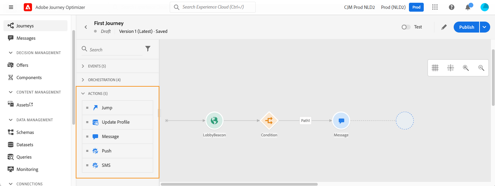

# 여정 활동 정보 {#about-journey-activities}

다양한 이벤트, 오케스트레이션 및 작업 활동을 조합하여 여러 단계로 구성된 크로스 채널 시나리오를 작성할 수 있습니다.

## 이벤트 활동 {#event-activities}

기술 사용자가 구성한 이벤트(참조) [이 페이지](../event/about-events.md))은 모두 화면 왼쪽에 있는 팔레트의 첫 번째 카테고리에 표시됩니다. 다음 이벤트 활동을 사용할 수 있습니다.

* [일반 이벤트](../building-journeys/general-events.md)
* [반응](../building-journeys/reaction-events.md)
* [세그먼트 자격](../building-journeys/segment-qualification-events.md)

이벤트 활동을 끌어다 놓아 여정을 시작합니다. 두 번 클릭해도 됩니다.

## 오케스트레이션 활동 {#orchestration-activities}

화면 왼쪽에 있는 팔레트에서 다음 오케스트레이션 활동을 사용할 수 있습니다.

* [조건](../building-journeys/condition-activity.md)
* [끝](../building-journeys/end-activity.md)
* [대기](../building-journeys/wait-activity.md)
* [세그먼트 읽기](../building-journeys/read-segment.md)

## 작업 활동 {#action-activities}

화면 왼쪽에 있는 팔레트에서 아래 **[!UICONTROL Events]** 및 **[!UICONTROL Orchestration]**&#x200B;를 찾으면 **[!UICONTROL Actions]** 카테고리. 다음 작업 활동을 사용할 수 있습니다.

* [메시지](../building-journeys/journeys-message.md)
* [사용자 정의 작업](../building-journeys/using-custom-actions.md)
* [점프](../building-journeys/jump.md)

이곳에는 사용 가능한 다양한 통신 채널의 활동이 표시됩니다. 채널을 결합하여 크로스채널 시나리오를 만들 수 있습니다.

사용자 지정 작업을 구성한 경우 여기에 표시됩니다( [이 페이지](../building-journeys/using-custom-actions.md)).

## 모범 사례 {#best-practices}

대부분의 활동을 통해 **[!UICONTROL Label]**. 그러면 캔버스에서 활동 아래에 표시되는 이름에 접미사가 추가됩니다. 이 기능은 여정에서 동일한 활동을 여러 번 사용하고 보다 쉽게 식별하려는 경우 유용합니다. 또한 오류가 발생할 경우 디버깅을 더 쉽게 수행할 수 있고 보고서를 더 쉽게 읽을 수 있도록 해줍니다. 옵션을 추가할 수도 있습니다 **[!UICONTROL Description]**.

작업 또는 조건에 오류가 발생하면 개별 여정이 중지됩니다. 이 작업을 계속 진행할 수 있는 유일한 방법은 **[!UICONTROL Add an alternative path in case of a timeout or an error]** 상자를 선택하는 것입니다 . [이 섹션](../building-journeys/using-the-journey-designer.md#paths)을 참조하십시오.

