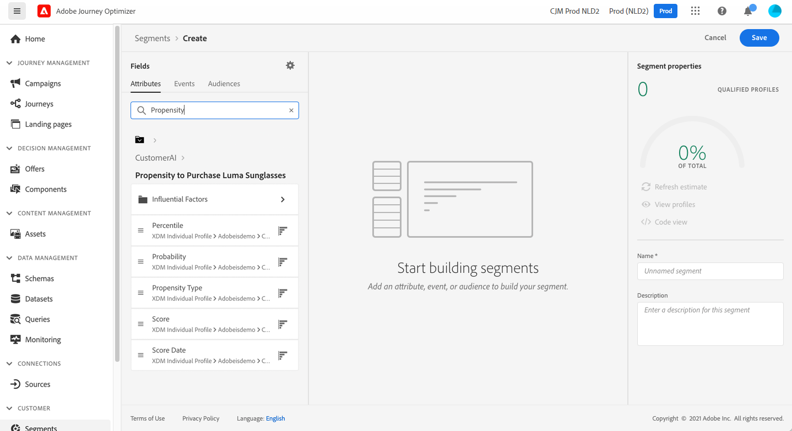

# 인텔리전트 서비스와 통합 {#ai-overview}

**[!DNL Adobe Intelligent Services]**&#x200B;과의 통합을 통해 고객 경험 사용 사례에 인공 지능과 머신 러닝을 활용할 수 있습니다. 이를 통해 마케팅 분석가는 데이터 과학 전문 지식 없이도 비즈니스 수준의 구성을 사용하여 기업의 요구 사항에 맞게 예측을 설정할 수 있습니다.

[!DNL Adobe Experience Platform]에 빌드된 [!DNL Intelligent Services]은(는) 고객 경험 팀에 AI-as-a-service를 제공합니다. 이는 고객 행동을 예측하고, 캠페인 영향을 측정하고, 투자 수익을 개선하는 데 도움이 됩니다. 자세한 내용은 [[!DNL Adobe Experience Platform] 설명서](https://experienceleague.adobe.com/docs/experience-platform/intelligent-services/home.html?lang=ko){target="_blank"}를 참조하세요.

[!DNL Journey Optimizer]과(와) [!DNL Intelligent Services] 간의 통합을 통해 고객 예측을 활용할 수 있습니다.

[!DNL Adobe Intelligent Services]의 구성 요소인 Customer AI는 고객의 행동을 예측합니다. [[!DNL Adobe Experience Platform] 설명서](https://experienceleague.adobe.com/docs/experience-platform/intelligent-services/customer-ai/overview.html?lang=ko){target="_blank"}를 참조하세요.

고객 AI를 통해 브랜드는 이탈 또는 전환 머신 러닝 기반 점수를 만들 수 있습니다. 이러한 점수는 [!DNL Adobe Experience Platform]개 프로필(실시간 고객 프로필)에서 프로필 특성으로 사용할 수 있습니다.

따라서 이러한 속성은 Journey Optimizer의 다른 프로필 속성과 마찬가지로 사용할 수 있습니다. 의사 결정, 작업 또는 세그먼트 작성 조건에 사용할 수 있습니다.

