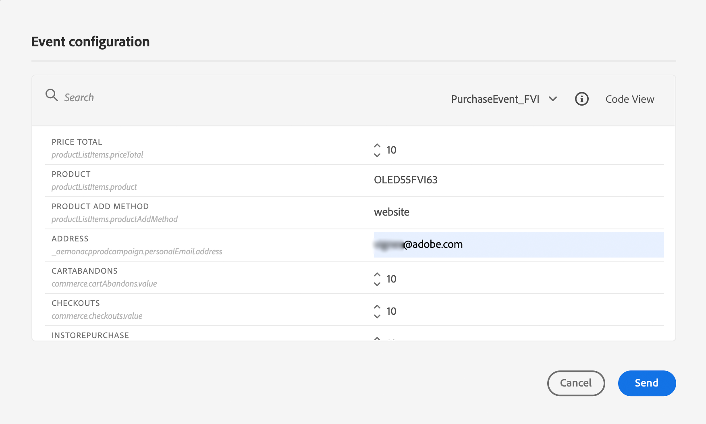

# Campaign v7/v8에서 메시지 보내기 {#campaign-v7-v8-use-case}

이 사용 사례에서는 [!DNL Adobe Campaign] v7 및 [!DNL Adobe Campaign] v8과의 통합을 사용하여 전자 메일을 보내는 데 필요한 모든 단계를 설명합니다.

>[!NOTE]
>
>이 통합을 사용하려면 Campaign v7/v8 빌드 9125 이상이 있어야 합니다.

먼저 Campaign에서 트랜잭션 이메일 템플릿을 만듭니다. 그런 다음 Journey Optimizer에서 이벤트, 작업을 만들고 여정을 디자인합니다.

Campaign 통합에 대한 자세한 내용은 다음 페이지를 참조하십시오.

* [Campaign 작업 만들기](../action/acc-action.md)
* [여정에서 작업 사용](../building-journeys/using-adobe-campaign-v7-v8.md).

**[!DNL Adobe Campaign]**

이 통합을 위해 Campaign 인스턴스를 프로비저닝해야 합니다. 트랜잭션 메시지 기능을 구성해야 합니다.

1. Campaign 컨트롤 인스턴스에 로그인합니다.

1. **관리** > **플랫폼** > **열거형**&#x200B;에서 **이벤트 유형**(eventType) 열거형을 선택합니다. 새 이벤트 유형(&quot;이 예제의 경우 &quot;여정-이벤트&quot;)을 만듭니다. 나중에 JSON 파일을 작성할 때 이벤트 유형의 내부 이름을 사용합니다.

   ![스키마 및 필드 선택을 사용하여 [!DNL Adobe Journey Optimizer]에서 이벤트 구성](assets/accintegration-uc-1.png)

1. 생성을 적용하려면 인스턴스 연결을 끊고 다시 연결하십시오.

1. **메시지 센터** > **트랜잭션 메시지 템플릿**&#x200B;에서 이전에 만든 이벤트 유형을 기반으로 새 전자 메일 템플릿을 만듭니다.

   

1. 템플릿 디자인 이 예에서는 개인화가 프로필의 이름과 주문 번호에 적용됩니다. 이름은 [!DNL Adobe Experience Platform] 데이터 원본에 있으며 주문 번호는 Journey Optimizer 이벤트의 필드입니다. Campaign에서 올바른 필드 이름을 사용해야 합니다.

   

1. 트랜잭션 템플릿을 게시합니다.

   

1. 템플릿에 해당하는 JSON 페이로드를 씁니다.

```
{
     "channel": "email",
     "eventType": "journey-event",
     "email": "Email address",
     "ctx": {
          "firstName": "First name", "purchaseOrderNumber": "Purchase order number"
     }
}
```

* 채널의 경우 &quot;email&quot;을 입력해야 합니다.
* eventType의 경우 이전에 만든 이벤트 유형의 내부 이름을 사용합니다.
* 이메일 주소는 변수가 되므로 임의의 레이블을 입력할 수 있습니다.
* ctx에서 개인화 필드도 변수입니다.

**Journey Optimizer**

1. 이벤트를 만듭니다. &quot;purchaseOrderNumber&quot; 필드를 포함합니다.

   ![&#x200B; 클래식 통합에 대한 [!DNL Adobe Campaign]사용자 지정 작업 구성 화면](assets/accintegration-uc-5.png)

1. Journey Optimizer에서 Campaign 템플릿에 해당하는 작업을 만듭니다. **작업 유형** 드롭다운에서 **[!DNL Adobe Campaign]클래식**&#x200B;을 선택합니다.

   ![기본 옵션 [!DNL Adobe Campaign]을(를) 표시하는 작업 유형 선택](assets/accintegration-uc-6.png)

1. **페이로드 필드**&#x200B;를 클릭하고 이전에 만든 JSON을 붙여 넣습니다.

   

1. 전자 메일 주소와 두 개의 개인화 필드의 경우 **상수**&#x200B;을(를) **변수**(으)로 변경하십시오.

   

1. 이제 새 여정을 만들고 이전에 만든 이벤트로 시작합니다.

   

1. 작업을 추가하고 각 필드를 Journey Optimizer의 올바른 필드에 매핑합니다.

   

1. 여정을 테스트합니다.

   

1. 이제 여정을 게시할 수 있습니다.
