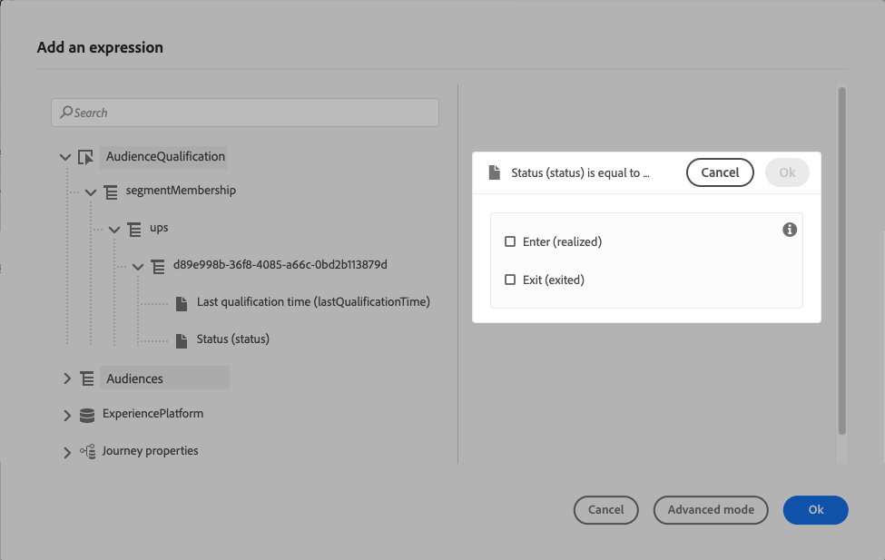

# 대상 자격 이벤트 {#segment-qualification}

## 대상 자격 이벤트 기본 정보{#about-segment-qualification}

>[!CONTEXTUALHELP]
>id="ajo_journey_event_segment_qualification"
>title="대상자 자격 이벤트"
>abstract="이 활동을 통해 Adobe Experience Platform 대상자의 프로필의 처음과 끝에서 의견을 수렴하여 개인 사용자가 여정으로 들어오거나 이동할 수 있습니다."

이 활동을 통해 Adobe Experience Platform 대상자의 프로필의 처음과 끝에서 의견을 수렴하여 개인 사용자가 여정으로 들어오거나 이동할 수 있습니다. 대상자 만들기에 대한 자세한 내용은 다음을 참조하십시오 [섹션](../audience/about-audiences.md).

“실버 고객”이라는 대상자가 있다고 가정해 보겠습니다. 이 활동을 사용하면 모든 신규 실버 고객이 여정을 입력하고 일련의 개인화된 메시지를 보내도록 할 수 있습니다.

이 유형의 이벤트는 여정에서 첫 번째 단계 또는 그 이후로 배치할 수 있습니다.

### 중요 정보{#important-notes-segment-qualification}

* Adobe Experience Platform 대상자는 하루에 한 번 계산됩니다(**일괄 처리** 대상자) 또는 실시간(**스트리밍됨** 대상, Adobe Experience Platform의 고빈도 대상 옵션 사용).

* 선택한 대상자가 스트리밍되는 경우 이 대상자에 속한 개인이 잠재적으로 실시간으로 여정에 입장할 수 있습니다. 대상이 일괄 처리인 경우 Adobe Experience Platform에서 대상 계산이 실행될 때 이 대상에 대해 새로 자격을 얻은 사람이 여정에 들어올 수 있습니다.

* 경험 이벤트 필드 그룹은 대상자 읽기, 대상자 자격 조건 또는 비즈니스 이벤트 활동으로 시작하는 여정에서 사용할 수 없습니다.

* 여정에서 대상자 자격을 사용할 때 해당 대상자 자격 활동이 활성화되고 대상자에 들어오거나 나가는 프로필을 듣는 데 최대 10분이 걸릴 수 있습니다.

### 활동 구성{#cnfigure-segment-qualification}

1. 펼치기 **[!UICONTROL 이벤트]** 범주 및 놓기 **[!UICONTROL 대상 자격 조건]** 활동을 캔버스에 추가합니다.

   

1. 추가 **[!UICONTROL 레이블]** 을 활동에 추가합니다. 데이터 소스에 이벤트에 설명을 추가합니다.

1. 을(를) 클릭합니다. **[!UICONTROL 대상자]** 을(를) 필드에 추가하고 활용할 대상을 선택합니다.

   >[!NOTE]
   >
   >목록에 표시되는 열을 사용자 정의하고 정렬할 수 있습니다.

   

   대상자가 추가되면 **[!UICONTROL 복사]** 버튼을 사용하면 해당 이름과 ID를 복사할 수 있습니다.

   `{"name":"Loyalty membership“,”id":"8597c5dc-70e3-4b05-8fb9-7e938f5c07a3"}`

   

1. 다음에서 **[!UICONTROL 비헤이비어]** 필드에서 대상자 출입문, 출구 또는 둘 다 수신 여부를 선택합니다.

   >[!NOTE]
   >
   >참고: **[!UICONTROL 입력]** 및 **[!UICONTROL 종료]** 다음에 해당합니다. **실현됨** 및 **종료됨** Adobe Experience Platform의 대상자 참여 상태. 대상을 평가하는 방법에 대한 자세한 내용은 [세그먼테이션 서비스 설명서](https://experienceleague.adobe.com/docs/experience-platform/segmentation/tutorials/evaluate-a-segment.html#interpret-segment-results){target="_blank"}.

1. 네임스페이스를 선택합니다. 이는 이벤트가 여정의 첫 번째 단계로 배치되는 경우에만 필요합니다. 기본적으로 필드는 마지막으로 사용된 네임스페이스로 미리 채워집니다.

   >[!NOTE]
   >
   >사용자 기반 ID 네임스페이스만 선택할 수 있습니다. 조회 테이블에 대한 네임스페이스를 정의한 경우(예: 제품 조회에 대한 ProductID 네임스페이스) **네임스페이스** 드롭다운 목록입니다.

   

페이로드에는 조건 및 작업에서 사용할 수 있는 다음 컨텍스트 정보가 포함됩니다.

* 동작(시작, 종료)
* 자격 타임스탬프
* 대상자 id

다음 조건 또는 작업에서 표현식 편집기를 사용할 때 **[!UICONTROL 대상 자격 조건]** 활동에 대해 다음에 대한 액세스 권한이 있습니다. **[!UICONTROL AudienceQualification]** 노드. 다음 중 하나를 선택할 수 있습니다. **[!UICONTROL 마지막 선별 시간]** 및 **[!UICONTROL 상태]** (시작 또는 종료).

다음을 참조하십시오 [조건 활동](../building-journeys/condition-activity.md#about_condition).

대상 자격 이벤트를 포함하는 새 여정은 게시한 후 10분 후에 작동합니다. 이 시간 간격은 전용 서비스의 캐시 새로 고침 간격에 해당합니다. 따라서 이 여정을 사용하기 전에 10분 정도 기다려야 합니다.

## 모범 사례 {#best-practices-segments}

다음 **[!UICONTROL 대상 자격 조건]** 활동을 통해 Adobe Experience Platform 대상에서 자격을 부여받거나 자격을 박탈당한 개인 여정을 즉시 시작할 수 있습니다.

이 정보는 수신 속도가 빠르다. 측정된 속도는 초당 수신된 10,000개의 이벤트의 속도를 보여준다. 그 결과, 가장 높은 수준의 출입이 발생할 수 있는 상황, 이러한 입구를 피하는 방법 및 이러한 입구를 위한 여정을 준비하는 방법을 이해해야 합니다.

### 대상자 일괄 처리{#batch-speed-segment-qualification}

일괄 처리 대상에 대해 대상 자격을 사용할 때 일일 계산 시 최대 시작이 발생합니다. 정점의 크기는 매일 관객에게 입장하는(또는 퇴장하는) 개인의 수에 따라 달라질 것이다.

또한 일괄 처리 대상을 새로 만들어 여정에서 즉시 사용하는 경우 첫 번째 일괄 처리 계산을 통해 매우 많은 수의 개인이 여정에 들어갈 수 있습니다.

### 스트리밍된 대상자{#streamed-speed-segment-qualification}

스트리밍된 관객에 대해 관객자격을 이용할 경우, 관객에 대한 지속적인 평가로 인해 출입구의 큰 정점을 맞이할 위험이 적다. 하지만 대상 정의가 많은 수의 고객이 동시에 자격을 얻도록 유도하는 경우 최고점이 발생할 수도 있습니다.

스트리밍 세분화에 대한 자세한 내용은 을 참조하십시오. [Adobe Experience Platform 설명서](https://experienceleague.adobe.com/docs/experience-platform/segmentation/api/streaming-segmentation.html#api)

### 오버로드를 방지하는 방법{#overloads-speed-segment-qualification}

다음은 여정에서 활용하는 시스템(데이터 소스, 사용자 지정 작업, 채널 작업 활동)을 오버로드할 수 없도록 하는 몇 가지 모범 사례입니다.

에서 를 사용하지 마십시오. **[!UICONTROL 대상 자격 조건]** 활동(작성 후 즉시 일괄 처리 대상자). 첫 번째 계산 피크가 나타나지 않습니다. 계산된 적이 없는 대상을 사용하려는 경우 여정 캔버스에 노란색 경고가 표시됩니다.

여정에서 사용되는 데이터 소스 및 작업에 대한 최대 가용량 규칙을 적용하여 오버로드를 방지합니다. 다음에서 자세히 알아보기 [Journey Orchestration 설명서](https://experienceleague.adobe.com/docs/journeys/using/working-with-apis/capping.html){target="_blank"}. 최대 가용량 규칙에는 재시도가 없습니다. 다시 시도해야 하는 경우 상자를 선택하여 여정에서 대체 경로를 사용해야 합니다 **[!UICONTROL 시간 초과 또는 오류 발생 시 대체 경로 추가]** 조건 또는 작업에서 을 참조하십시오.

프로덕션 여정에서 대상을 사용하기 전에 항상 먼저 매일 이 대상에 대해 자격이 있는 개인의 양을 평가하십시오. 이렇게 하려면 다음을 확인할 수 있습니다. **[!UICONTROL 대상자]** 메뉴를 열고 대상을 확인한 다음 **[!UICONTROL 시간 경과에 따른 프로필]** 그래프.

