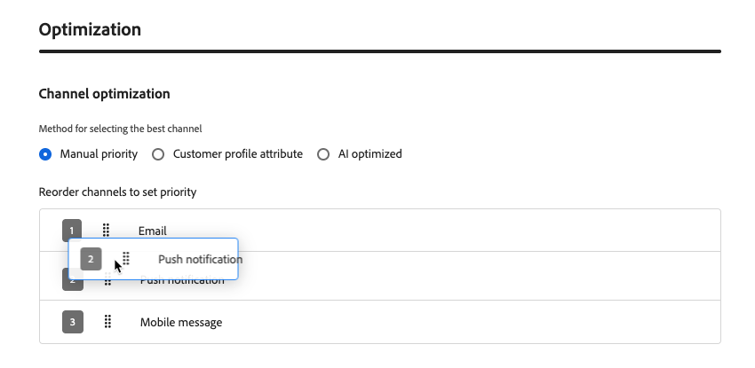
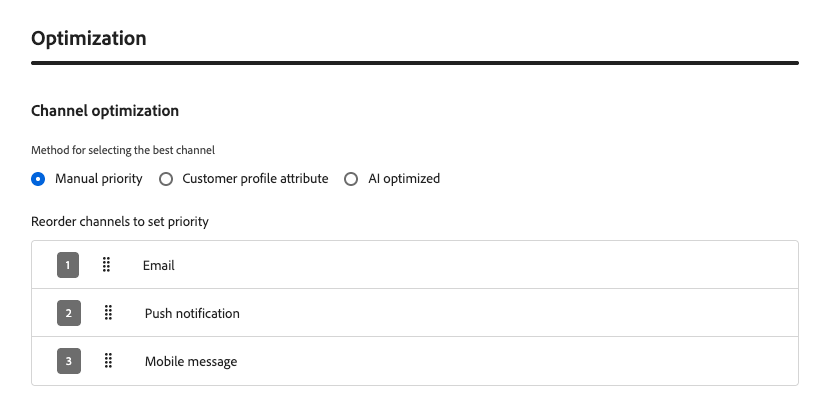

# 채널 최적화 {#channel-optimization}

>[!BEGINSHADEBOX]

**이 페이지에서:** 수동 순위, 프로필 환경 설정 또는 AI 기반 성향 점수를 사용하여 각 고객에게 최상의 아웃바운드 채널을 통해 메시지를 전달하도록 여정 또는 캠페인 작업을 구성하는 방법에 대해 알아봅니다.

>[!ENDSHADEBOX]

>[!AVAILABILITY]
>
>채널 최적화는 현재 제한된 조직 집합(제한된 가용성)에서 사용할 수 있습니다. 액세스 권한을 받으려면 Adobe 담당자에게 문의하십시오.

채널 최적화를 사용하면 여러 아웃바운드 채널(이메일, 푸시, 모바일 메시지)을 단일 여정 또는 캠페인 작업에 추가할 수 있으며 Journey Optimizer에서 전송 시간에 각 고객에 대해 가장 적합한 채널을 자동으로 선택하도록 할 수 있습니다.

시스템은 한 번에 하나의 채널을 선취하거나 모든 채널에서 고객에게 메시지를 보내는 대신 각 고객이 선택한 가장 높은 등급의 채널을 선택하고 해당 채널을 사용할 수 없을 때 신중하게 후퇴합니다.

➡️ [이 비디오에서 채널 최적화에 대해 자세히 알아보세요](#video)

## 가드레일 및 제한 사항 {#limitations}

* **지원되는 채널**: 기본 이메일, 푸시 및 모바일 메시지 채널만 지원됩니다. WhatsApp와 같은 다른 아웃바운드 채널은 지원되지 않습니다. 채널 최적화를 사용하려면 Journey Optimizer의 기본 이메일, 푸시 및 모바일 메시징 기능을 사용해야 합니다. 사용자 지정 작업을 통한 실행은 지원되지 않습니다.

* **AI 최적화 지표**: AI 모델은 참여(클릭 수)에 대해서만 최적화됩니다. 주문, 매출 또는 기타 비즈니스 지표에 최적화되지 않습니다. 주문 또는 매출에 대한 최적화가 필요한 경우 데이터 과학 팀에서 오프라인으로 사용자 지정 모델을 교육하고 고객 프로필 속성 기능을 통해 적용할 수 있습니다.

* **AI 등급에 필요한 클릭 추적**: AI 모델 기반 등급을 사용하는 경우 구성된 모든 채널에 대해 클릭 추적을 사용하도록 설정해야 합니다. 이 모델은 클릭 데이터를 사용하여 성향 점수를 계산합니다. 추적이 비활성화되면 AI 등급 모드가 제대로 작동하지 않습니다. [이메일에서 클릭 추적을 사용하도록 설정하는 방법 알아보기](../email/message-tracking.md)

* **방해 금지 시간**: 여러 채널이 단일 작업으로 결합되면 채널 우선 순위에 따라 방해 금지 시간이 적용됩니다. 모바일 메시징이 우선 순위를 차지하고 푸시, 이메일이 순서대로 적용됩니다. 채널당 서로 다른 방해 금지 모드 시간 설정을 사용하려면 채널을 단일 작업으로 결합하지 않고 별도의 여정 작업을 만듭니다.

  >[!NOTE]
  >
  >General Availability 릴리스에서는 채널당 자동 중지 시간 설정이 지원됩니다.

* **전송 시간 최적화 비호환성**: 현재 [전송 시간 최적화](send-time-optimization.md)와(과) 채널 최적화는 함께 사용할 수 없습니다. 둘 중 하나를 선택하십시오. UI는 동일한 작업에서 두 기능을 동시에 활성화하지 않습니다.

* **반응 이벤트**: 여정 캔버스의 반응 이벤트는 현재 다중 채널 작업의 첫 번째 채널만 참조합니다.

  >[!NOTE]
  >
  >여러 채널이 있는 경우 유효한 반응 이벤트를 선택할 수 있도록 GA 릴리스가 예정되어 있습니다.

## 여정 또는 캠페인에서 채널 최적화 사용 {#configure}

여정 또는 캠페인에 채널 최적화를 사용하는 여러 아웃바운드 채널을 추가하려면 아래 단계를 따르십시오.

>[!BEGINTABS]

>[!TAB 여정]

1. [이벤트](general-events.md) 또는 [대상자 읽기](read-audience.md) 활동으로 여정을 시작하십시오.

1. 팔레트의 **[!UICONTROL 작업]** 섹션에서 **[!UICONTROL 작업]** 활동을 캔버스로 끌어서 놓습니다.

1. 아웃바운드 채널(전자 메일, 푸시 또는 모바일 메시지)을 선택하고 **[!UICONTROL 추가]**&#x200B;를 클릭합니다.

   {width="60%"}

1. 작업 레이블을 입력하고 **[!UICONTROL 작업 구성]**&#x200B;을 클릭합니다.

>[!TAB 캠페인에서]

1. [작업 캠페인을 만들고](../campaigns/create-campaign.md) **[!UICONTROL 작업]** 탭으로 이동합니다.

1. **[!UICONTROL 작업 추가]** 단추를 클릭하고 아웃바운드 채널(전자 메일, 푸시 또는 모바일 메시지)을 선택합니다.

>[!ENDTABS]

**[!UICONTROL 작업]** 탭에서 아웃바운드 작업을 선택한 후 다음 단계를 계속합니다.

1. 채널 구성을 선택하고 **[!UICONTROL 작업 추가]**&#x200B;를 클릭하여 다른 아웃바운드 채널을 선택합니다.

   {width="1000%"}

   >[!NOTE]
   >
   >단일 다중 채널 작업에서는 채널 유형당 하나의 작업만 지원됩니다. 예를 들어 구성이 다른 두 개의 개별 이메일 작업을 추가할 수는 없습니다.

   단일 여정 액션 또는 캠페인에 최대 3개의 아웃바운드 채널(**[!UICONTROL 이메일]**, **[!UICONTROL 푸시]**, **[!UICONTROL 모바일 메시지]**)을 추가할 수 있습니다.

1. **[!UICONTROL 채널 최적화]** 섹션에서 시스템이 각 고객에게 가장 적합한 채널을 선택하는 방법을 결정하는 방법을 설정합니다. [자세히 알아보기](#optimization-modes)

   {width="100%"}

1. 채널을 원하는 순서로 드래그 앤 드롭하여 대체 채널 순서(수동 순위 및 고객 환경 설정 방법의 경우)를 설정합니다. [자세히 알아보기](#fallback)

   {width="90%"}

1. 여정을 [저장 및 게시](publish-journey.md)하거나 캠페인을 [검토 및 활성화](../campaigns/review-activate-campaign.md)합니다.

## 채널 최적화 방법 설정 {#optimization-modes}

>[!CONTEXTUALHELP]
>id="ajo_channel_optimization_method"
>title="채널 선택의 작동 방식 정의"
>abstract="Journey Optimizer에서 각 고객에게 가장 적합한 채널을 선택하는 방법을 다음과 같이 선택합니다. **수동 우선순위** - 채널이 사용자가 정의한 순서대로 시도되며, 가용성은 선택된 채널 구성과 관련된 구독 환경 설정 및 마케팅 동의 규칙, 캠페인이나 여정과 관련된 모든 비즈니스 규칙(예: 채널 빈도 상한 설정)을 적용하여 결정됩니다. **고객 프로필 속성** - 프로필에서 선언된 고객의 환경 설정과 일치하는 채널이 먼저 선택됩니다. 설정된 사항이 발견되지 않으면 수동 우선 순위가 적용됩니다. **AI 최적화** - 머신 러닝 모델이 고객의 참여 이력을 기반으로 하여 각 채널에 점수를 매기고, 점수가 가장 높은 가용 채널이 선택됩니다."

<!--
Previous content for contextual help: "The customer's first available channel, based on the selected prioritization method, is used for this action. Availability is determined by the customer's subscription preferences and marketing consent rules for the selected channel configurations, as well as any business rules — such as frequency capping — configured for the campaign or journey." TBC which to keep.

Additional content for contextual help: For **Manual priority** and **Customer profile attribute** modes, Journey Optimizer falls back through your configured channel order when the top-ranked channel cannot be used. For **AI optimized**, it falls back to a random available channel."
-->

채널 최적화는 세 가지 모드를 지원하며, 각 모드는 서로 다른 방법을 사용하여 전송 시간에 각 고객에 가장 적합한 채널을 선택합니다.

### 수동 순위 {#manual-ranking}

**[!UICONTROL 수동 우선 순위]**&#x200B;가 기본 모드입니다. 작업에서 바로 기본 채널 순서를 정의합니다. Journey Optimizer은 고객이 옵트인하고 빈도 제한이 없는 목록의 첫 번째 채널을 통해 제공한 다음 필요한 경우 다음 채널로 [폴백](#fallback)합니다.

{width="90%"}

명확하고 일관된 채널 환경 설정이 있으며 프로필별 개인화가 필요하지 않은 경우 이 모드를 사용합니다.

### 고객 환경 설정 {#customer-preference}

**[!UICONTROL 고객 프로필 특성]**&#x200B;을(를) 선택한 상태에서 Journey Optimizer은 [동의 및 환경 설정 XDM 필드 그룹](https://experienceleague.adobe.com/ko/docs/experience-platform/xdm/field-groups/profile/consents)의 `preferred` 특성을 사용하여 고객이 선언한 기본 설정 채널을 프로필에서 읽습니다. 지원되는 값은 `email`, `push` 및 `sms`입니다.

{width="90%"}

기본 채널을 사용할 수 없는 경우(구성 안 됨, 옵트인 안 됨 또는 주파수 제한) Journey Optimizer은 구성된 [대체](#fallback) 목록의 다음 채널로 대체됩니다.

고객이 선호하는 통신 채널을 명시적으로 설명한 경우 이 모드를 사용하십시오.

### AI 모델 기반 순위 {#ai-ranking}

**[!UICONTROL AI 최적화]**&#x200B;를 선택하는 경우 Journey Optimizer에서는 과거의 참여(열기, 클릭 수)를 기반으로 각 고객의 채널당 성향 점수를 계산하는 기계 학습 모델을 사용합니다. 점수는 고객의 프로필에 저장되며 전송 시 예측된 성향이 가장 높은 채널을 선택합니다.

{width="70%"}

고객의 참여 기록이 충분하지 않으면 시스템은 무작위로 사용할 수 있는 채널로 돌아갑니다.

이 모드를 사용하면 수동 구성 없이 AI가 각 고객에 대해 가장 효과적인 채널을 유추할 수 있습니다.

## 대체 비헤이비어 {#fallback}

최적화 모드에 관계없이, 최상위 채널을 사용할 수 없을 때 Journey Optimizer은 사용 가능한 다음 채널로 폴백합니다. 다음 조건 중 하나가 적용되면 채널을 사용할 수 없는 것으로 간주됩니다.

* 고객이 채널에 옵트인되지 않았습니다.
* 액션에 채널이 구성되지 않았습니다.
* 채널이 주파수 한도에 도달했습니다.
* 해당 채널에 대한 고객의 프로필 선호도 또는 AI 모델 점수가 채워지지 않습니다.

**[!UICONTROL 수동 우선 순위]** 및 **[!UICONTROL 고객 프로필 특성]** 모드에서 대체 항목은 마케터가 구성한 채널 우선 순위 목록을 따릅니다. **[!UICONTROL AI 최적화]**&#x200B;에서 대체 항목은 임의의 사용 가능한 채널을 선택합니다.

## 사용 방법 비디오 {#video}

Adobe Journey Optimizer의 채널 최적화 기능이 수동 우선 순위, 프로필 속성 또는 Adobe의 AI 모델을 사용하여 가장 효과적인 채널을 통해 고객에게 도달하는 데 어떻게 도움이 되는지에 대해 알아봅니다.

>[!VIDEO](https://video.tv.adobe.com/v/3492132?quality=12)

<!--
**Related topics**

* [Use the Action activity](journey-action.md)
* [Send-Time optimization](send-time-optimization.md)
* [Content optimization](../content-management/gs-message-optimization.md)
-->
