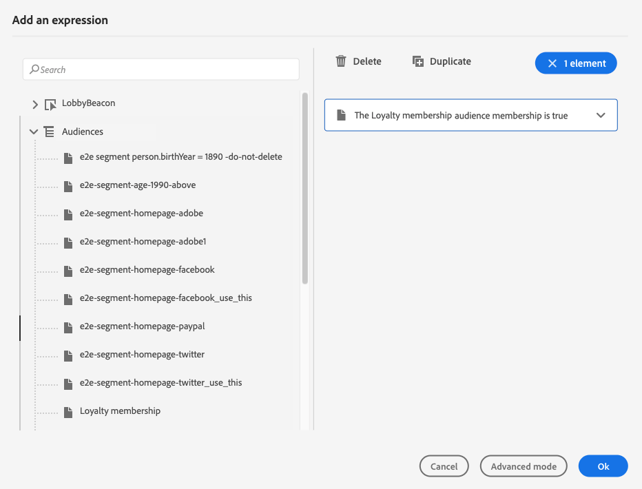

# 조건 활동{#condition-activity}

>[!CONTEXTUALHELP]
>id="ajo_journey_condition"
>title="조건 활동"
>abstract="이 활동을 사용하여 개인이 여정에 참여하는 방법을 정의할 수 있습니다. 다양한 기준에 따라 여러 경로가 만들어집니다. 시간이 초과되거나 오류가 발생한 경우 대체 경로를 만들 수도 있습니다."

다음 유형의 조건을 사용할 수 있습니다.

* [데이터 소스 조건](#data_source_condition)
* [시간 조건](#time_condition)
* [비율 분할](#percentage_split)
* [날짜 조건](#date_condition)
* [프로필 상한](#profile_cap)

## 조건 활동 정보 {#about_condition}

>[!CONTEXTUALHELP]
>id="ajo_journey_expression_simple"
>title="단순 표현식 편집기 정보"
>abstract="단순 표현식 편집기 모드를 사용하여 필드 조합을 기반으로 간단한 쿼리를 수행할 수 있습니다. 사용 가능한 모든 필드가 화면 왼쪽에 표시됩니다. 필드를 기본 영역으로 드래그 앤 드롭합니다. 다양한 요소를 결합하려면 서로 인터로크하여 다른 그룹 및/또는 그룹 수준을 만듭니다. 그런 다음 논리 연산자를 선택하여 동일한 수준에서 요소를 결합할 수 있습니다."

여정에서 여러 조건을 사용할 때 각 조건에 대한 레이블을 정의하여 보다 쉽게 식별할 수 있습니다.

클릭 **[!UICONTROL 경로 추가]** 여러 조건을 정의하려는 경우. 각 조건에 대해 활동 후에 캔버스에 새 경로가 추가됩니다.

여정 디자인은 기능에 영향을 줍니다. 조건 후에 여러 개의 경로를 정의하면 첫 번째 적격 경로만 실행됩니다. 즉, 경로 우선순위를 서로 위나 아래에 배치하여 경로 우선순위를 변경할 수 있습니다.

예를 들어 첫 번째 경로의 조건인 &quot;사람은 VIP&quot;와 두 번째 경로의 조건인 &quot;사람은 남성&quot;을 예로 들어 보겠습니다. 두 조건을 모두 충족하는 사람(VIP인 남성)이 이 단계를 통과하면 첫 번째 경로가 &quot;위&quot;이기 때문에 이 사람도 두 번째 단계에 참여할 수 있는 경우에도 첫 번째 경로가 선택됩니다. 이 우선 순위를 변경하려면 활동을 다른 세로 순서로 이동하십시오.

을(를) 확인하여 정의된 조건에 적합하지 않은 대상에 대해 다른 경로를 만들 수 있습니다 **[!UICONTROL 위의 사례 이외의 다른 사례에 대한 경로 표시]**. 분할 조건에서는 이 옵션을 사용할 수 없습니다. 다음을 참조하십시오 [비율 분할](#percentage_split).

단순 모드에서는 필드 조합을 기반으로 간단한 쿼리를 수행할 수 있습니다. 사용 가능한 모든 필드가 화면 왼쪽에 표시됩니다. 필드를 기본 영역으로 드래그 앤 드롭합니다. 다양한 요소를 결합하려면 서로 인터로크하여 다른 그룹 및/또는 그룹 수준을 만듭니다. 그런 다음 논리 연산자를 선택하여 동일한 수준에서 요소를 결합할 수 있습니다:

* AND: 두 가지 기준의 교집합. 모든 기준과 일치하는 요소만 고려합니다.
* 또는 두 가지 기준의 결합 두 기준 중 하나 이상에 일치하는 요소를 고려합니다.

를 사용하는 경우 [Adobe Experience Platform 세그멘테이션 서비스](https://experienceleague.adobe.com/docs/experience-platform/segmentation/home.html){target="_blank"} 세그먼트를 만들려면 세그먼트를 여정 조건에서 활용할 수 있습니다. 을(를) 참조하십시오 [조건에서 세그먼트 사용](../building-journeys/condition-activity.md#using-a-segment).

>[!NOTE]
>
>단순 편집기로 시계열에서는 쿼리(예: 구매 목록, 과거 메시지 클릭)를 수행할 수 없습니다. 이 경우 고급 편집기를 사용해야 합니다. [이 페이지](expression/expressionadvanced.md)를 참조하십시오.

작업 또는 조건에 오류가 발생하면 개별 여정이 중지됩니다. 이 작업을 계속하는 유일한 방법은 상자를 선택하는 것입니다 **[!UICONTROL 시간 초과 또는 오류 발생 시 대체 경로 추가]**. [이 섹션](../building-journeys/using-the-journey-designer.md#paths)을 참조하십시오.

단순 편집기에서는 이벤트 및 데이터 소스 카테고리 아래에 여정 속성 카테고리도 있습니다. 이 카테고리에는 지정된 프로필의 여정과 관련된 기술 필드가 포함되어 있습니다. 여정 ID 또는 발생한 특정 오류와 같은 라이브 여정 시스템에서 검색한 정보입니다. [자세히 알아보기](expression/journey-properties.md)

## 데이터 소스 조건 {#data_source_condition}

이렇게 하면 데이터 소스의 필드 또는 여정에 이전에 배치된 이벤트의 필드를 기반으로 조건을 정의할 수 있습니다. 에서 표현식 편집기를 사용하는 방법에 대해 알아봅니다. [이 섹션](expression/expressionadvanced.md).

고급 표현식 편집기를 사용하여 컬렉션을 조작하거나 매개 변수를 전달해야 하는 데이터 소스를 사용하는 고급 조건을 설정할 수 있습니다. [자세히 알아보기](../datasource/external-data-sources.md).

## 시간 조건{#time_condition}

이를 통해 시간 및/또는 요일에 따라 다른 작업을 수행할 수 있습니다. 예를 들어 주간에는 푸시 알림을 보내고, 주중에는 이메일을 밤에 보내도록 결정할 수 있습니다.

>[!NOTE]
>
>시간대는 조건에 따라 달라지지 않으며 여정 속성의 여정 수준에서 정의됩니다. [이 페이지](../building-journeys/timezone-management.md)를 참조하십시오.

세 가지 필터링 옵션을 사용할 수 있습니다.

* 시간: 하루 중 시간을 기준으로 조건을 설정할 수 있습니다. 그런 다음 시작 및 종료 시간을 정의합니다. 정의된 시간 범위 동안에만 개인이 경로를 입력합니다.
* 요일: 요일을 기준으로 조건을 설정할 수 있습니다. 그런 다음 개인이 경로를 입력할 날짜를 선택합니다.
* 요일 및 시간: 이 옵션은 처음 두 옵션을 결합합니다.

## 비율 분할 {#percentage_split}

이 옵션을 사용하면 대상을 임의로 분할하여 각 그룹에 대해 다른 작업을 정의할 수 있습니다. 각 경로에 대해 분할 수와 재분할 을 정의합니다. 시스템에서 이 여정 활동에서 유입되는 인원을 예상할 수 없으므로 분할 계산은 통계적입니다. 그 결과, 분할은 매우 낮은 오차 마진을 갖는다. 이 함수는 Java 무작위 메커니즘을 기반으로 합니다(이 참조). [페이지](https://docs.oracle.com/javase/7/docs/api/java/util/Random.html)).

테스트 모드에서는 분할에 도달할 때 항상 상단 분기가 선택됩니다. 검사에서 다른 경로를 선택하려는 경우 분할된 분기의 위치를 재구성할 수 있습니다. [이 페이지](../building-journeys/testing-the-journey.md)를 참조하십시오

>[!NOTE]
>
>백분율 분할 조건에는 경로를 추가하는 버튼이 없습니다. 경로 수는 분할 수에 따라 달라집니다. 분할 조건에서는 발생할 수 없는 다른 사례에 대한 경로를 추가할 수 없습니다. 사람들은 항상 갈라진 길 중 하나로 갈 것이다.

## 날짜 조건 {#date_condition}

이렇게 하면 날짜를 기준으로 다른 흐름을 정의할 수 있습니다. 예를 들어 &quot;판매&quot; 기간 동안 단계에 들어가는 경우 특정 메시지를 보냅니다. 남은 기간 동안 다른 메시지를 보내게 됩니다.

>[!NOTE]
>
>시간대는 더 이상 조건에 따라 달라지지 않으며 이제 여정 속성의 여정 수준에서 정의됩니다. [이 페이지](../building-journeys/timezone-management.md)를 참조하십시오.

## 프로필 상한 {#profile_cap}

이 조건 유형을 사용하여 여정 경로에 대해 최대 프로필 수를 설정합니다. 이 한도에 도달하면 입력한 프로필에서 대체 경로를 사용합니다. 이렇게 하면 여정이 정의된 제한을 초과하지 않도록 합니다.

>[!NOTE]
>
>높은 값 프로필 상한을 정의하는 것이 좋습니다. 모집단이 정확한 상한 번호에 도달할 정밀도와 가능성은 상한이 증가할수록 증가한다. 작은 숫자(예: 상한 50)의 경우 프로필이 대체 경로를 선택하기 전에 제한에 도달할 수 없으므로 숫자가 항상 일치하지 않습니다.

이 조건 유형을 사용하여 게재 볼륨을 증가시킬 수 있습니다. 이 항목 보기 [사용 사례](ramp-up-deliveries-uc.md).

기본 상한은 1000입니다.

카운터는 선택한 여정 버전에만 적용됩니다. 여정이 복제되거나 새 버전이 만들어지면 카운터가 0으로 재설정됩니다. 재설정한 후 카운터 제한에 도달할 때까지 입력한 프로필이 명목상 경로를 다시 사용합니다.

프로필 상한이 반복 여정에 정의되어 있으면 각 반복 후 카운터가 재설정되지 않습니다.

여정 캔버스에서 대체 경로를 명목 경로 위로 이동하는 경우에도 명목 경로는 항상 대체 경로보다 우선합니다.

라이브 여정의 경우 제한에 도달하는지 확인하기 위해 고려해야 할 임계값은 다음과 같습니다.

* 10000보다 큰 캡의 경우, 주입될 별개의 프로파일의 수는 캡의 적어도 1.3배여야 한다.
* 10000 미만의 캡의 경우, 주입할 개별 프로파일의 수는 캡에 1000개를 더한 값이어야 합니다.

테스트 모드에서는 프로필 상한을 고려하지 않습니다.

## 조건에서 세그먼트 사용 {#using-a-segment}

이 섹션에서는 여정 조건에서 세그먼트를 사용하는 방법을 설명합니다. 세그먼트 및 세그먼트 작성 방법에 대한 자세한 내용은 [이 섹션](../segment/about-segments.md).

여정 조건에서 세그먼트를 사용하려면 다음 단계를 따르십시오.

1. 여정을 열고 **[!UICONTROL 조건]** 활동 및 선택 **데이터 소스 조건**.
   

1. 클릭 **[!UICONTROL 경로 추가]** 각 추가 경로에 대해 필요합니다. 각 경로에 대해 **[!UICONTROL 표현식]** 필드.

   

1. 왼쪽에서 펼칩니다. **[!UICONTROL 세그먼트]** 노드. 조건에 사용할 세그먼트를 끌어서 놓습니다. 세그먼트의 조건은 기본적으로 true입니다.

   

   >[!NOTE]
   >
   >을(를) 가진 개인만 **실현됨** 및 **기존 항목** 세그먼트 기여도 상태는 세그먼트의 멤버로 간주됩니다. 세그먼트를 평가하는 방법에 대한 자세한 내용은 [세그먼테이션 서비스 설명서](https://experienceleague.adobe.com/docs/experience-platform/segmentation/tutorials/evaluate-a-segment.html#interpret-segment-results){target="_blank"}.
