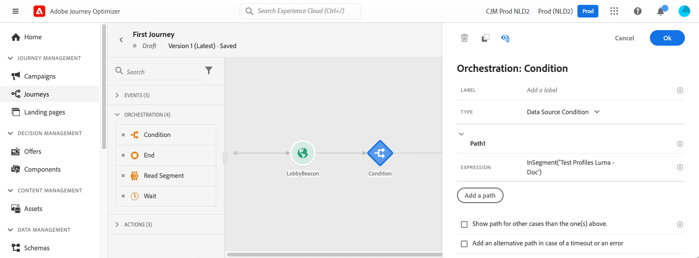

# 조건 활동 {#condition-activity}

>[!BEGINSHADEBOX]

**이 페이지에서:** Condition 활동을 사용하여 규칙, 데이터 및 대상 멤버십을 기반으로 프로필을 다른 여정 경로로 라우팅하는 방법에 대해 알아봅니다.

>[!ENDSHADEBOX]

조건 활동을 사용하여 규칙 및 데이터를 기반으로 프로필을 다른 경로로 라우팅합니다.

## 조건 활동 추가 {#add-condition-activity}

>[!CONTEXTUALHELP]
>id="ajo_journey_condition"
>title="조건 활동"
>abstract="**조건** 활동을 사용하면 특정 기준에 따라 여러 경로를 만들어 개인이 여정을 어떻게 진행할지 정의할 수 있습니다. 또한 시간 초과나 오류를 처리하기 위한 대체 경로를 구성하여 원활한 환경을 보장할 수 있습니다."

**조건** 활동을 사용하면 특정 기준에 따라 여러 경로를 만들어 개인이 여정을 어떻게 진행할지 정의할 수 있습니다. 또한 시간 초과나 오류를 처리하기 위한 대체 경로를 구성하여 원활한 환경을 보장할 수 있습니다.

다음 유형의 조건을 사용할 수 있습니다.

* [데이터 Source 조건](#data_source_condition)
* [시간 조건](#time_condition)
* [분할 비율](#percentage_split)
* [날짜 조건](#date_condition)
* [프로필 상한](#profile_cap)

대상자 멤버십을 조건으로 할 수도 있습니다. 다음 섹션을 참조하십시오.

* [조건에 대상 사용](#using-a-segment) - 프로필이 대상에 속하는지 여부에 따라 경로를 추가합니다.
* [대상 만들기 및 타깃팅](../audience/about-audiences.md) - 대상 메뉴에서 대상을 만들고 관리합니다.
* [여정의 대상 타깃팅](read-audience.md#audience-targeting-in-journeys) - 대상 읽기 활동 후 조건을 사용하여 분기를 세그먼트화하거나 제외하거나 병합합니다.

>[!NOTE]
>
>[프로필 저장소](https://experienceleague.adobe.com/docs/experience-platform/profile/home.html#profile-data-store){target="_blank"}에 두 개 이상의 교차 장치 ID가 포함된 프로필에 대해서는 조건 평가가 실패합니다.

## 조건 경로 추가 및 관리 {#about_condition}

>[!CONTEXTUALHELP]
>id="ajo_journey_expression_simple"
>title="단순 표현식 편집기 정보"
>abstract="단순 표현식 편집기 모드를 사용하여 필드 조합을 기반으로 간단한 쿼리를 수행할 수 있습니다. 사용 가능한 모든 필드가 화면 왼쪽에 표시됩니다. 필드를 기본 영역으로 드래그 앤 드롭합니다. 서로 다른 요소를 결합하려면 이 요소들을 서로 맞물리게 하여 다양한 그룹 및/또는 그룹 수준을 만듭니다. 그런 다음 논리 연산자를 사용하여 같은 수준의 요소들을 결합합니다."

여정에서 여러 조건을 사용할 때 각 조건에 대한 레이블을 정의하여 보다 쉽게 식별할 수 있습니다.

여러 조건을 정의하려면 **[!UICONTROL 경로 추가]**&#x200B;를 클릭합니다. 각 조건에 대해 활동 후에 캔버스에 새 경로가 추가됩니다.

여정 디자인은 기능에 영향을 줍니다. 조건 후에 여러 개의 경로를 정의하면 첫 번째 적격 경로만 실행됩니다. 즉, 경로 우선순위를 서로 위나 아래에 배치하여 다르게 지정할 수 있습니다.

두 가지 경로 조건인 &quot;사람은 VIP&quot;와 &quot;사람은 남성&quot;을 살펴보겠습니다. 사람이 두 조건을 모두 만족하면 첫 번째 경로가 두 번째 경로 위에 있기 때문에 선택됩니다. 이 우선 순위를 변경하려면 활동을 다른 세로 순서로 이동하십시오.

**[!UICONTROL 위의 사례 이외의 다른 사례에 대한 경로 표시]**&#x200B;를 선택하여 정의된 조건에 적합하지 않은 대상에 대해 다른 경로를 만들 수 있습니다. 분할 조건에서는 이 옵션을 사용할 수 없습니다. [분할 비율](#percentage_split)을 참조하세요.

단순 모드에서는 필드 조합을 기반으로 간단한 쿼리를 수행할 수 있습니다. 사용 가능한 모든 필드가 화면 왼쪽에 표시됩니다. 필드를 기본 영역으로 드래그 앤 드롭합니다. 다양한 요소를 결합하려면 서로 인터로크하여 다른 그룹 및/또는 그룹 수준을 만듭니다. 그런 다음 논리 연산자를 선택하여 동일한 수준에서 요소를 결합할 수 있습니다.

* AND: 두 가지 기준의 교집합. 모든 기준과 일치하는 요소만 고려합니다.
* 또는 두 가지 기준의 결합 두 기준 중 하나 이상에 일치하는 요소를 고려합니다.

[[!DNL Adobe Experience Platform] 세그먼테이션 서비스](https://experienceleague.adobe.com/docs/experience-platform/segmentation/home.html?lang=ko){target="_blank"}를 사용하여 대상을 만드는 경우 여정 조건에서 이를 활용할 수 있습니다. [조건에서 대상 사용](../building-journeys/condition-activity.md#using-a-segment)을 참조하세요. Journey Optimizer에서 대상자를 생성하고 타깃팅하는 방법에 대한 자세한 내용은 [이 섹션](../audience/about-audiences.md)을 참조하세요.

>[!NOTE]
>
>단순 편집기로 시계열에서는 쿼리(예: 구매 목록, 과거 메시지 클릭)를 수행할 수 없습니다. 이 경우 고급 편집기를 사용해야 합니다. [이 페이지](expression/expressionadvanced.md)를 참조하십시오.

작업 또는 조건에 오류가 발생하면 개별 여정이 중지됩니다. **[!UICONTROL 시간 초과 또는 오류 발생 시 대체 경로를 추가]** 확인란을 선택하여 계속하는 방법만 있습니다. [이 섹션](../building-journeys/using-the-journey-designer.md#paths)을 참조하십시오.

단순 편집기에서는 이벤트 및 데이터 소스 카테고리 아래에 여정 속성 카테고리도 있습니다. 이 카테고리에는 지정된 프로필의 여정과 관련된 기술 필드가 포함되어 있습니다. 여정 ID 또는 발생한 특정 오류와 같은 라이브 여정 시스템에서 검색한 정보입니다. [자세히 알아보기](expression/journey-properties.md)

## 데이터 Source 조건 {#data_source_condition}

**[!UICONTROL 데이터 Source 조건]**&#x200B;을 사용하여 데이터 원본 또는 여정에 이전에 배치된 이벤트의 필드를 기반으로 조건을 정의합니다. 이 유형의 조건은 표현식 편집기로 정의됩니다. [이 섹션](expression/expressionadvanced.md)에서 표현식 편집기를 사용하는 방법을 알아봅니다.

예를 들어, 작성 워크플로우 또는 사용자 지정 업로드(CSV 파일)를 사용하여 생성된 보강 속성으로 대상을 타깃팅하는 경우 이러한 보강 속성을 활용하여 조건을 작성할 수 있습니다.

>[!IMPORTANT]
>
>**누락되었거나 수집되지 않은 특성 처리**
>
>프로필 스키마에 스키마 필드가 정의되어 있지만 해당 필드에 대한 데이터가 수집되지 않은 경우 Journey Optimizer 및 기본 실시간 고객 프로필은 해당 필드를 `null`(으)로 해석합니다. 그 결과, `isEmpty()`, `isNull()` 또는 유사한 함수를 확인하는 조건은 해당 특성이 수집되지 않은 경우에도 `true`로 평가됩니다. 이렇게 하면 필드에 데이터가 없다는 것을 알지 못하는 경우 예기치 않은 여정 동작이 발생할 수 있습니다.
>
>혼동을 방지하기 위해 프로필이 여정에 들어가기 전에 조건 표현식에서 사용하는 특성이 실제 데이터로 수집되었는지 확인하십시오. [실시간 고객 프로필](https://experienceleague.adobe.com/docs/experience-platform/profile/home.html?lang=ko){target="_blank"}에서 특성 값을 확인하여 조건에 사용된 필드에 대한 데이터가 있는지 확인할 수 있습니다.

고급 표현식 편집기를 사용하여 컬렉션을 조작하거나 매개 변수를 전달해야 하는 데이터 소스를 사용하는 고급 조건을 설정할 수 있습니다. [자세히 알아보기](../datasource/external-data-sources.md)

## 시간 조건 {#time_condition}

**[!UICONTROL 시간 조건]**&#x200B;을 사용하여 요일 및/또는 요일에 따라 다른 작업을 수행하십시오. 예를 들어 주간에는 푸시 알림을 보내고, 주중에는 이메일을 밤에 보내도록 결정할 수 있습니다.

>[!NOTE]
>
>* 시간대는 조건에 따라 달라지지 않으며 여정 속성의 여정 수준에서 정의됩니다. [이 페이지](../building-journeys/timezone-management.md)에서 자세히 알아보십시오.
>
>* 기본적으로 **[!UICONTROL 시간 조건]**&#x200B;은(는) 00:00부터 12:00까지 시간 단위로 설정됩니다.

세 가지 필터링 옵션을 사용할 수 있습니다.

* 시간: 하루 중 시간을 기준으로 조건을 설정할 수 있습니다. 그런 다음 시작 및 종료 시간을 정의합니다. 정의된 시간 범위 동안에만 개인이 경로를 입력합니다.
* 요일: 요일을 기준으로 조건을 설정할 수 있습니다. 그런 다음 개인이 경로를 입력할 날짜를 선택합니다.
* 요일 및 시간: 이 옵션은 처음 두 옵션을 결합합니다.

## 비율 분할 {#percentage_split}

이 옵션을 사용하면 대상을 임의로 분할하여 각 그룹에 대해 다른 작업을 정의할 수 있습니다. 각 경로에 대해 분할 수와 재분할 을 정의합니다. 시스템에서 이 여정 활동에서 유입되는 인원을 예상할 수 없으므로 분할 계산은 통계적입니다. 그 결과, 분할은 매우 낮은 오차 마진을 갖는다. 이 함수는 Java 임의 메커니즘을 기반으로 합니다([페이지](https://docs.oracle.com/javase/7/docs/api/java/util/Random.html){target="_blank"} 참조).

테스트 모드에서는 분할에 도달할 때 항상 상단 분기가 선택됩니다. 검사에서 다른 경로를 선택하려는 경우 분할된 분기의 위치를 재구성할 수 있습니다. [이 페이지](../building-journeys/testing-the-journey.md)를 참조하십시오

>[!NOTE]
>
>백분율 분할 조건에는 경로를 추가하는 버튼이 없습니다. 경로 수는 분할 수에 따라 달라집니다. 분할 조건에서는 발생할 수 없는 다른 사례에 대한 경로를 추가할 수 없습니다. 사람들은 항상 갈라진 길 중 하나로 갈 것이다.

## 날짜 조건 {#date_condition}

이렇게 하면 날짜를 기준으로 다른 흐름을 정의할 수 있습니다. 예를 들어 &quot;판매&quot; 기간 동안 단계에 들어가는 경우 특정 메시지를 보냅니다. 남은 기간 동안 다른 메시지를 보내게 됩니다.

>[!NOTE]
>
>시간대는 더 이상 조건에 따라 달라지지 않으며 이제 여정 속성의 여정 수준에서 정의됩니다. [이 페이지](../building-journeys/timezone-management.md)를 참조하십시오.

## 프로필 상한 {#profile_cap}

이 조건 유형을 사용하여 여정 경로에 대해 최대 프로필 수를 설정합니다. 이 한도에 도달하면 입력한 프로필에서 대체 경로를 사용합니다. 이렇게 하면 여정이 정의된 제한을 초과하지 않도록 합니다.

>[!NOTE]
>
>높은 값 프로필 상한을 정의하는 것이 좋습니다. 모집단이 정확한 상한 번호에 도달할 정밀도와 가능성은 상한이 증가할수록 증가한다. 작은 숫자(예: 상한 50)의 경우 프로필이 대체 경로를 선택하기 전에 제한에 도달할 수 없으므로 숫자가 항상 일치하지 않습니다.

<!--You can use this condition type to ramp up the volume of your deliveries. See this [use case](ramp-up-deliveries-uc.md).-->

기본 상한은 1,000입니다.

카운터는 선택한 여정 버전에만 적용됩니다. 여정이 복제되거나 새 버전이 만들어지면 카운터가 0으로 재설정됩니다. 재설정한 후 카운터 제한에 도달할 때까지 입력한 프로필이 명목상 경로를 다시 사용합니다.

프로필 상한이 반복 여정에 정의되어 있으면 각 반복 후 카운터가 재설정되지 않습니다.

여정 캔버스에서 대체 경로를 명목 경로 위로 이동하는 경우에도 명목 경로는 항상 대체 경로보다 우선합니다.

라이브 여정의 경우 제한에 도달하는지 확인하기 위해 고려해야 할 임계값은 다음과 같습니다.

* 10,000개를 초과하는 캡의 경우, 주입될 개별 프로파일의 수가 캡의 적어도 1.3배여야 한다.
* 10,000 이하의 캡의 경우, 주입될 개별 프로파일의 수는 캡에 1000개를 더한 값이어야 합니다.

테스트 모드에서는 프로필 상한을 고려하지 않습니다.

## 조건에서 대상 사용 {#using-a-segment}

이 섹션에서는 여정 조건에서 대상을 사용하는 방법을 설명합니다. 대상 및 빌드 방법에 대한 자세한 내용은 [이 섹션](../audience/about-audiences.md)을 참조하세요.

여정 조건에서 대상을 사용하려면 다음 단계를 수행합니다.

1. 여정을 열고 **[!UICONTROL 조건]** 활동을 삭제하고 **데이터 Source 조건**&#x200B;을 선택하세요.

   

1. 필요한 각 추가 경로에 대해 **[!UICONTROL 경로 추가]**&#x200B;를 클릭합니다. 각 경로에 대해 **[!UICONTROL 식]** 필드를 클릭합니다.

1. 왼쪽에서 **[!UICONTROL 대상]** 노드를 펼칩니다. 조건에 사용할 대상을 끌어다 놓습니다. 기본적으로 대상의 조건은 true입니다.

   

   >[!NOTE]
   >
   >대상자 참여 상태가 **실현됨**&#x200B;인 개인만 대상자의 구성원으로 간주됩니다. 대상자를 평가하는 방법에 대한 자세한 내용은 [세그먼테이션 서비스 설명서](https://experienceleague.adobe.com/docs/experience-platform/segmentation/tutorials/evaluate-a-segment.html#interpret-segment-results){target="_blank"}를 참조하세요.

+++ AI 기술 자료 참조

이 단원에는 이 주제와 관련된 해석, 검색 및 질문 답변을 지원하기 위한 구조화된 지식이 포함되어 있습니다.

이해를 돕기 위해 이 정보를 이 페이지의 설명서와 통합해야 합니다. 두 소스 모두 독립적으로 사용하기 위한 것은 아닙니다. 이 페이지에서는 기능에 대해 설명하지만, 용어, 의도, 적용 가능성 및 제약 조건을 명확히 하는 데 도움이 되는 추가 컨텍스트를 제공합니다.

* **TL;DR:** 이 페이지에서는 사용 가능한 5가지 조건 유형(데이터 Source, 시간, 비율 분할, 날짜 및 프로필 상한)에 대해 다루는 Journey Optimizer의 조건 활동과 규칙, 데이터 또는 대상 멤버십을 기반으로 프로필을 다양한 여정 경로로 라우팅하는 방법에 대해 설명합니다.

**의도:**
* 여정에 조건 활동을 추가하고 여러 분기 경로를 만듭니다
* 표현식 편집기를 사용하여 Data Source 조건을 구성하여 프로필 또는 이벤트 속성을 평가합니다
* 시간 조건을 설정하여 요일 또는 시간을 기준으로 프로필을 라우팅합니다.
* 비율 분할 을 사용하여 경로에 프로필을 임의로 분할합니다.
* 프로필 상한을 적용하여 특정 여정 경로를 사용하는 프로필 수를 제한합니다
* 여정 경로의 조건으로 대상 멤버십 확인 사용

**용어집:**
* **조건 활동**: 규칙을 평가하고 결과 *(제품별)*&#x200B;을(를) 기반으로 프로필을 다른 경로로 라우팅하는 여정 활동
* **데이터 Source 조건**: 식 편집기 *(제품별)*&#x200B;을(를) 사용하여 데이터 원본 또는 여정 이벤트의 필드를 평가하는 조건 형식입니다
* **시간 조건**: 시간, 요일 또는 *(제품별)의 조합을 기준으로 프로필을 필터링하는 조건 형식*
* **분할 비율**: 통계적 Java 임의 메커니즘 *(제품별)*&#x200B;을(를) 사용하여 경로를 통해 프로필을 임의로 배포하는 조건 유형입니다.
* **프로필 상한**: 특정 경로를 사용할 수 있는 프로필 수를 제한하는 조건 형식입니다. 추가 프로필은 대체 경로 *(제품별)로 라우팅됩니다.*
* **대체 경로**: 오류, 시간 제한 또는 프로필 상한 제한에 도달했을 때 활성화된 대체 경로 *(제품별)*

**보호 기능:**
* 프로필 스토어에서 두 개 이상의 교차 장치 ID가 있는 프로필에 대한 조건 평가가 실패합니다
* 수집된 데이터가 없는 스키마 필드는 null로 해석됩니다. isEmpty() 및 isNull()은 이러한 필드에 대해 true로 평가되므로 예기치 않은 동작이 발생할 수 있습니다
* 시간대는 개별 조건 수준이 아닌 여정 수준에서 정의됩니다
* 비율 분할 조건에서는 &quot;다른 사례에 대한 경로 표시&quot; 옵션을 사용할 수 없습니다.
* 프로필 상한 기본값은 1,000입니다. 여정이 복제되거나 새 버전이 만들어질 때 카운터가 재설정되지만 반복 여정의 반복 사이에는 재설정되지 않습니다.
* 캡이 10,000개를 초과하는 경우 캡 수의 1.3배 이상을 주사하고, 캡이 10,000개 미만인 경우 캡을 1,000개 이상 주사합니다
* 프로필 상한이 테스트 모드에서 적용되지 않음
* 시계열 쿼리(예: 구매 목록, 과거 클릭 수)는 단순 표현식 편집기에서 지원되지 않으므로 고급 편집기를 사용해야 합니다

**용어:**
* 정식 이름: 조건 활동 — 약어: 없음 — 변형: 조건 노드, 조건 단계
* 동의어: &quot;Data Source 조건&quot; = &quot;표현식 기반 조건&quot; ; &quot;비율 분할&quot; = &quot;무작위 분할&quot;
* 혼동하지 마십시오. &quot;비율 분할&quot; ≠ &quot;프로필 상한&quot;(비율 분할은 모든 프로필을 임의로 분산함. 프로필 상한은 카운트 임계값에 도달하면 경로 라우팅을 중지함)

**FAQ:**
* **Q: 여러 경로를 정의하고 프로필이 두 개 이상의 조건을 충족하면 어떻게 됩니까?** — 첫 번째 적격 경로(캔버스에서 위쪽에서 아래쪽)만 실행됩니다. 경로 순서에 따라 우선 순위가 결정됩니다.
* **Q: 조건에 맞지 않는 프로필에 대한 대체 경로를 추가할 수 있습니까?** — 예, 위의 경우 이외의 경우 경로 표시 — 모든 프로파일이 항상 분할 경로 중 하나를 입력하는 [비율 분할] 조건에서 제외합니다.
* **Q: 데이터가 있을 것으로 예상되는 필드에 대해 my isEmpty() 조건이 true로 평가되는 이유는 무엇입니까?** — 스키마 필드가 존재하지만 해당 필드에 대한 데이터가 수집되지 않은 경우 Journey Optimizer 및 실시간 고객 프로필은 이 필드를 null로 해석하므로 isEmpty() 및 isNull()은 true를 반환합니다.
* **Q: 프로필 상한 카운터가 반복 여정에서 재설정됩니까?** — 아니요. 카운터는 재귀 간에 재설정되지 않습니다. 여정이 복제되거나 새 버전이 만들어질 때만 재설정됩니다.
* **Q: 테스트 모드에서 비율 분할이 어떻게 작동합니까?** — 테스트 모드에서는 구성된 분할 비율에 관계없이 항상 최상위 분기가 선택됩니다.

+++
