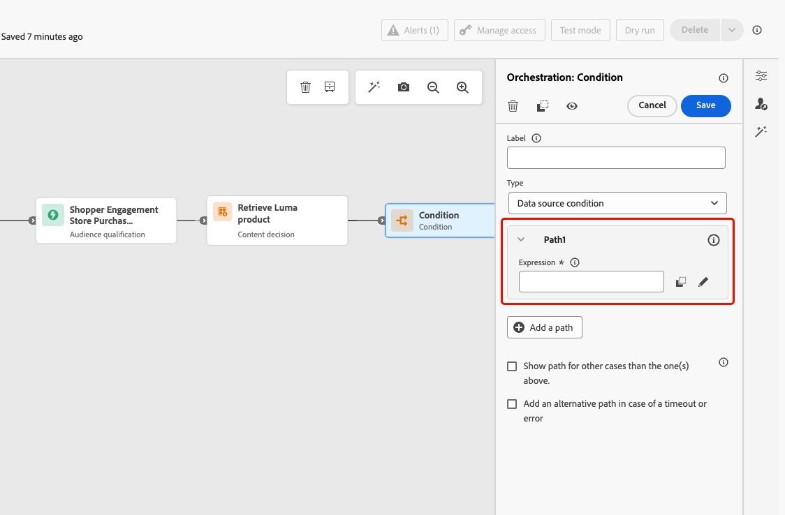
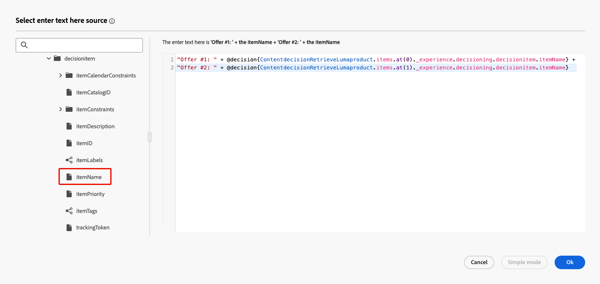

# 콘텐츠 결정 활동 {#content-decision}

>[!AVAILABILITY]
>
>이 기능은 일부 조직에서만 사용할 수 있으며(제한된 가용성) 향후 릴리스에서 전체 사용자를 대상으로 공개될 예정입니다.

[!DNL Journey Optimizer]을(를) 사용하면 여정 캔버스에서 전용 **콘텐츠 결정** 활동을 통해 여정에 오퍼를 포함할 수 있습니다. 그런 다음 여정에 다른 활동(예: [사용자 지정 작업](../action/about-custom-action-configuration.md))을 추가하여 이러한 개인화된 오퍼로 대상을 타깃팅할 수 있습니다.

>[!NOTE]
>
>콘텐츠 결정 활동의 출력은 기본 채널 활동에서 사용할 수 없습니다.

이 기능을 활용하려면 [콘텐츠 결정 활동](#add-content-decision-activity)을 추가하여 적격 프로필에 제공할 오퍼를 정의하는 여정을 만드십시오.

그런 다음 다음에서 컨텐츠 결정 활동의 출력을 사용할 수 있습니다.

* 검색된 오퍼에 따라 특정 경로로 프로필을 이동하는 [조건 활동](#add-condition-activity)

* 외부 시스템에 해당 오퍼를 보낼 수 있는 [사용자 지정 작업](#add-custom-action).

## 콘텐츠 의사 결정 활동 구성 {#add-content-decision-activity}

콘텐츠 의사 결정 활동을 사용하여 [!DNL Journey Optimizer] 의사 결정에서 가장 적합한 항목을 선택하고 적합한 대상자에게 전달할 수 있는 의사 결정 정책을 정의할 수 있습니다.

<!--Their goal is to select the best offers for each profile, while the campaign/journey authoring allows you to indicate how the selected decision items should be presented, including which item attributes to be included in the message.-->

**[!UICONTROL 콘텐츠 결정]** 활동을 구성하려면 아래 단계를 따르십시오.

1. **[!UICONTROL 오케스트레이션]** 범주를 펼친 후 **[!UICONTROL 콘텐츠 결정]** 활동을 캔버스에 드롭하십시오.

   {width=100%}

1. 선택적으로 활동에 레이블과 설명을 추가합니다.

1. **[!UICONTROL 결정 정책 추가]**&#x200B;를 클릭합니다. [의사 결정 정책에 대해 자세히 알아보기](../experience-decisioning/create-decision.md)

   >[!NOTE]
   >
   >의사 결정 정책을 작성하려면 의사 결정 권한이 필요합니다. [자세히 알아보기](../experience-decisioning/gs-experience-decisioning.md#steps)

1. 반환할 항목 수를 선택합니다. 예를 들어 2를 선택하면 최적의 2가지 적격 오퍼가 표시됩니다. **[!UICONTROL 다음]**&#x200B;을 클릭합니다.

1. **[!UICONTROL 전략 순서]** 섹션에서 결정 정책에 표시할 결정 항목 및/또는 선택 전략을 선택합니다. [자세히 알아보기](../experience-decisioning/create-decision.md#create-decision)

1. 필요에 따라 평가 순서를 정렬합니다.

   여러 의사 결정 항목 및/또는 전략을 추가할 때 각 객체 또는 객체 그룹의 왼쪽에 숫자가 표시된 순차적 순서로 평가됩니다. 기본 시퀀스를 변경하려면 개체 및/또는 그룹을 드래그하여 놓아 원하는 대로 순서를 변경할 수 있습니다. [자세히 알아보기](../experience-decisioning/create-decision.md#create-decision)

1. (선택 사항) 대체 오퍼를 추가합니다. [자세히 알아보기](../experience-decisioning/create-decision.md#create-decision)

1. 결정 정책을 검토하고 저장합니다.

   {width=70%}<!--reshoot or change screen-->

이제 여정에서 이 콘텐츠 결정 활동의 결과를 활용할 준비가 되었습니다.

## 가드레일 및 제한 사항 {#guardrails}

**동의 정책**

동의 정책에 대한 업데이트는 적용되는 데 최대 48시간이 걸립니다. 의사 결정 정책이 최근에 업데이트된 동의 정책에 연결된 속성을 참조하는 경우 변경 사항이 즉시 적용되지 않습니다.

마찬가지로 동의 정책의 적용을 받는 새 프로필 속성을 의사 결정 정책에 추가하여 사용할 수 있습니다. 지연 시간이 경과할 때까지 관련 동의 정책이 시행되지 않습니다.

동의 정책은 Adobe Healthcare Shield 또는 Privacy and Security Shield 추가 기능이 있는 조직만 사용할 수 있습니다.

## 콘텐츠 결정 활동의 출력 사용 {#use-content-decision-output}

컨텐츠 결정의 출력은 여러 여정 활동에서 사용할 수 있습니다. 예를 들어 검색된 여정 수에 따라 [조건 활동](#add-condition-activity)을 사용하여 프로필을 프로필의 특정 분기로 이동할 수 있습니다.

여정 결정 활동의 오퍼를 외부 시스템에 공유하기 위해 [사용자 지정 작업](#add-custom-action)을 추가할 수도 있습니다.

### 조건 활동에서 {#add-condition-activity}

컨텐츠 결정 활동의 출력을 활용하려면 여정에 조건을 추가합니다. 여기서 해당 오퍼의 데이터를 사용하여 프로필을 특정 경로로 이동하는 표현식을 정의합니다. 아래 단계를 수행합니다.

1. **[!UICONTROL Orchestration]** 범주에서 **[!UICONTROL Condition]** 활동을 캔버스에 놓습니다. [자세히 알아보기](condition-activity.md#add-condition-activity)

1. (선택 사항) 정의한 첫 번째 식에 해당하는 **[!UICONTROL Path1]**&#x200B;의 이름을 더 적절한 레이블로 변경합니다.

1. 이 첫 번째 경로에 대해 **[!UICONTROL 식]** 필드 내부를 클릭하거나 편집 아이콘을 사용하여 식을 추가하십시오.

   {width=80%}

1. 팝업창이 열리면 **[!UICONTROL 고급 모드]**(으)로 전환하여 [고급 표현식 편집기](expression/expressionadvanced.md)를 사용합니다.

   >[!CAUTION]
   >
   >콘텐츠 결정 노드의 출력은 **[!UICONTROL 고급 모드]**&#x200B;에서만 사용할 수 있습니다.

1. **[!UICONTROL Context]** 노드를 펼치고 결정 정책으로 이동하여 [오퍼 카탈로그 스키마](../experience-decisioning/catalogs.md#access-catalog-schema)에서 사용할 수 있는 모든 특성을 표시합니다.

   

   >[!NOTE]
   >
   >속성에 정의된 모든 제한된 레이블은 DULE 또는 동의에 대한 정책 위반을 초래할 수 있습니다. 의사 결정 규칙에 사용된 여정 경험 이벤트 및 [오퍼 스키마](../experience-decisioning/catalogs.md#access-catalog-schema)에 적용됩니다. [이 섹션](../action/action-privacy.md)에서 데이터 거버넌스 정책에 대해 자세히 알아보세요.

1. 여정을 입력한 프로필에 대해 반환된 오퍼가 있는지 확인하려면 다음 구문과 함께 [listSize](functions/list-functions.md#listSize) 함수를 사용하십시오. `listSize(@decision{ContentdecisionName.items})>0`

   >[!NOTE]
   >
   >이 예에서 `Name`은(는) 여정에 추가한 콘텐츠 결정의 레이블입니다.

   

1. **[!UICONTROL 확인]**&#x200B;을 클릭합니다.

1. 필요에 따라 다른 조건을 정의할 경로를 더 추가합니다.

   **[!UICONTROL 위의 사례 이외의 다른 사례에 대한 경로 표시]**&#x200B;를 선택하여 첫 번째 조건을 충족하지 않는 프로필에 대해 다른 경로를 만들 수도 있습니다. <!--These profiles will then exit the journey if no other activity is added in that path.-->

1. 조건 활동을 저장합니다.

### 사용자 지정 작업에서 {#add-custom-action}

컨텐츠 결정 활동의 출력을 활용하려면 여정에 사용자 지정 작업을 추가하여 정의한 오퍼를 외부 시스템에 공유할 수 있습니다. 아래 단계를 수행합니다.

1. 여정에 사용자 지정 작업을 추가합니다. [자세히 알아보기](../action/about-custom-action-configuration.md)

1. 작업에 대한 레이블을 입력합니다.

1. **[!UICONTROL 요청 매개 변수]** 섹션에서 검색된 오퍼의 특성에 매핑할 매개 변수를 선택합니다.

   편집 가능한 텍스트 필드 내부를 클릭하고 검색된 오퍼의 속성에 매핑할 매개 변수를 선택합니다.

   

1. 열려 있는 팝업 창에서 **[!UICONTROL 고급 모드]**(으)로 전환합니다. [고급 표현식 편집기](expression/expressionadvanced.md)에서 **[!UICONTROL 컨텍스트]** 노드를 펼쳐 모든 결정 정책 항목을 표시합니다.

   >[!CAUTION]
   >
   >콘텐츠 결정 노드의 출력은 **[!UICONTROL 고급 모드]**&#x200B;에서만 사용할 수 있습니다.

1. [&#x200B; 배열을 사용하여 &#x200B;](../experience-decisioning/catalogs.md#access-catalog-schema)오퍼 카탈로그 스키마`items`를 찾아봅니다. 예를 들어 검색된 첫 번째 오퍼의 `itemName`과(와) 검색된 두 번째 오퍼의 `itemName`을(를) 사용합니다.

   

1. **[!UICONTROL 확인]**&#x200B;을 클릭하여 식을 저장합니다.

1. 사용자 지정 작업 구성을 **[!UICONTROL 저장]**&#x200B;합니다.

### 전체적인 예 {#use-case}

아래는 위에서 설명한 대로 조건 활동 및 사용자 지정 작업에 결합된 컨텐츠 결정 활동을 사용하는 여정의 전체 예입니다.

<!--When all activities are properly configured and saved, [publish](publish-journey.md) your journey.-->

여정이 [활성화](publish-journey.md)되면:

<!--* Profiles who enter the journey and are eligible for at least one offer are targeted by the custom action.

* If no offer is returned for a profile, they are excluded from the custom action.-->

1. 프로필이 해당 대상자 자격을 얻을 때마다 여정에 들어갑니다.

1. [!DNL Journey Optimizer]은(는) 콘텐츠 결정 활동을 통해 각 프로필과 관련된 오퍼를 검색합니다.

1. 하나 이상의 오퍼가 검색된 프로필만 여정(&#39;적격 프로필&#39; 경로를 통해)을 계속합니다.

1. 조건이 충족되면 사용자 지정 작업을 통해 해당 오퍼가 외부 시스템으로 전송됩니다.
