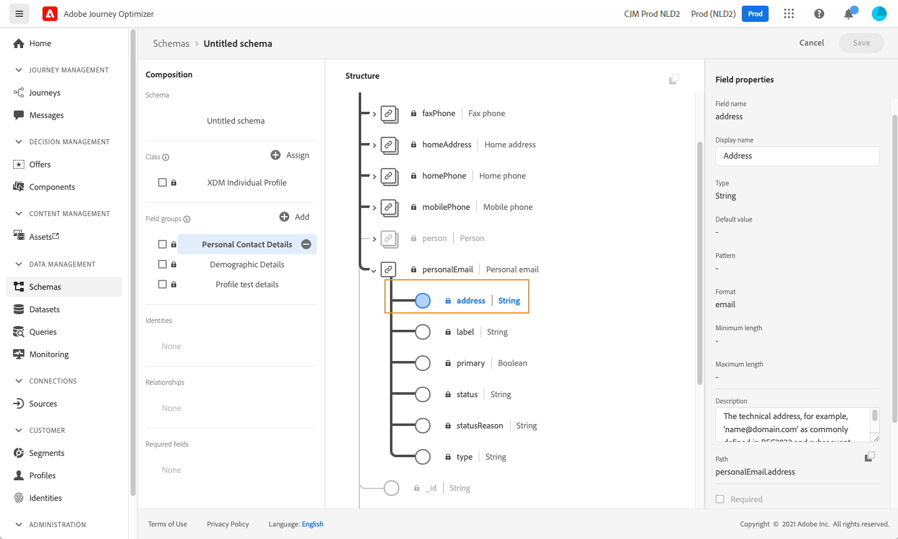
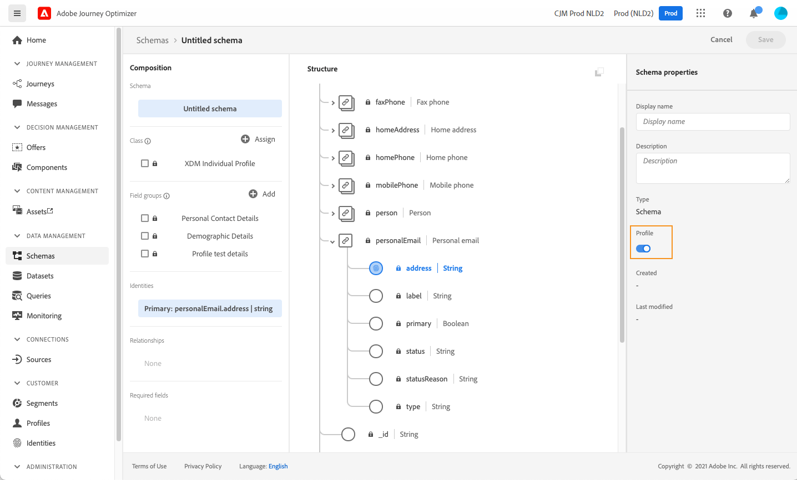
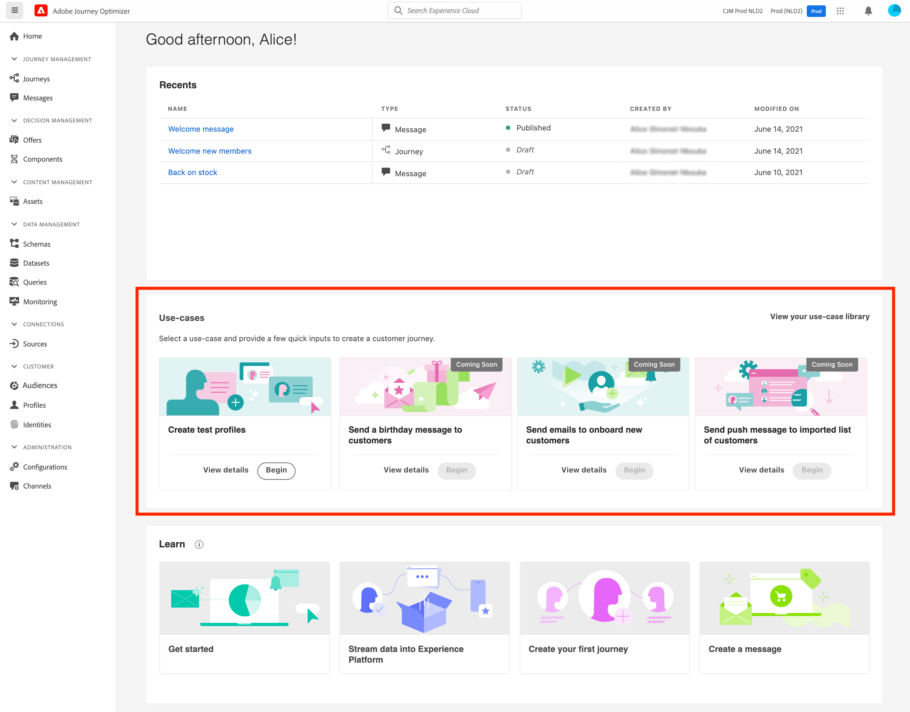
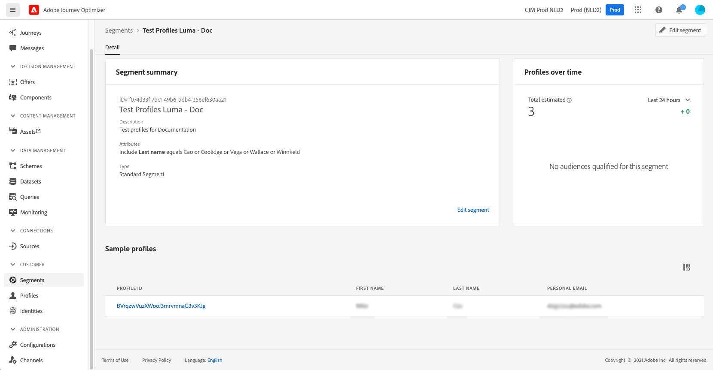
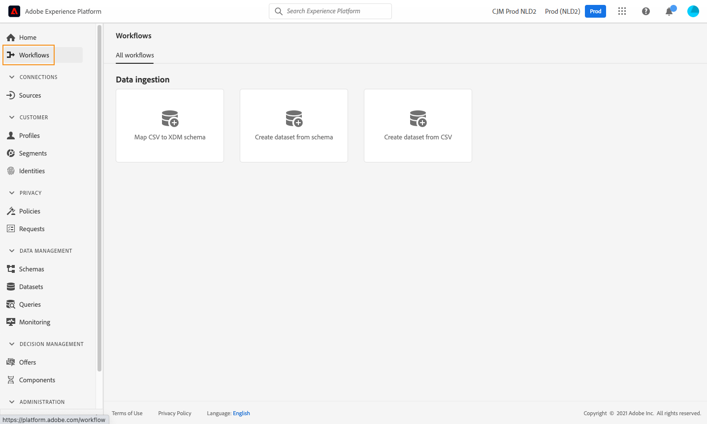
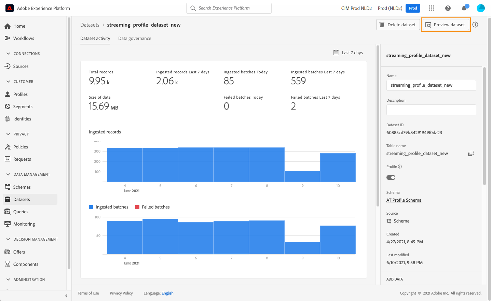

# 테스트 프로필 만들기 {#create-test-profiles}

테스트 프로필은 [테스트 모드](../building-journeys/testing-the-journey.md) 여정 및 [컨텐츠 미리 보기 및 테스트](../messages/preview.md).

테스트 프로필을 만드는 방법에는 여러 가지가 있습니다. 이 페이지 세부 정보에서 다음을 찾을 수 있습니다.

* 회전 [기존 프로필](#turning-profile-into-test) 테스트 프로필로

* 다음을 업로드하여 테스트 프로필 만들기 [csv 파일](#create-test-profiles-csv) 또는 [API 호출](#create-test-profiles-api).

   이 두 가지 방법 외에도 Adobe Journey Optimizer에는 특정 메서드가 있습니다 [제품 내 사용 사례](#use-case-1) 테스트 프로필 생성을 용이하게 하기 위해 사용됩니다.

기존 데이터 세트에 json 파일을 업로드할 수도 있습니다. 자세한 내용은 [데이터 수집 설명서](https://experienceleague.adobe.com/docs/experience-platform/ingestion/tutorials/ingest-batch-data.html#add-data-to-dataset){target=&quot;_blank&quot;}.

테스트 프로필을 만드는 것은 Adobe Experience Platform에서 일반 프로필을 만드는 것과 비슷합니다. 자세한 내용은 [실시간 고객 프로필 설명서](https://experienceleague.adobe.com/docs/experience-platform/profile/home.html?lang=ko){target=&quot;_blank&quot;}.

➡️ [이 비디오에서 테스트 프로필을 만드는 방법을 알아봅니다](#video)

## 전제 조건 {#test-profile-prerequisites}

프로필을 만들려면 먼저 Adobe에서 스키마와 데이터 세트를 만들어야 합니다 [!DNL Journey Optimizer].

종료 **스키마 만들기**&#x200B;다음 단계를 수행합니다.

1. 데이터 관리 메뉴 섹션에서 **[!UICONTROL Schemas]**.
   
1. 클릭 **[!UICONTROL Create schema]**&#x200B;오른쪽 상단에서 스키마 유형을 선택합니다. 예를 들면 다음과 같습니다 **XDM 개별 프로필**.
   
1. 적절한 필드 그룹을 선택합니다. 를 추가해야 합니다. **프로필 테스트 세부 사항** 필드 그룹.
   
완료되면 을(를) 클릭합니다. **[!UICONTROL Add field groups]**: 필드 그룹 목록이 스키마 개요 화면에 표시됩니다.
   

   >[!NOTE]
   >
   >* 스키마 이름을 클릭하여 변경하고 해당 속성을 업데이트합니다.
   >
   >* 을(를) 클릭합니다. **[!UICONTROL Add]** 필드 그룹 섹션의 버튼을 클릭하여 스키마에 추가할 다른 필드 그룹을 선택합니다.


1. 필드 목록에서 기본 ID로 정의할 필드를 클릭합니다.
   
1. 에서 **[!UICONTROL Field properties]** 오른쪽 창에서 **[!UICONTROL Identity]** 및 **[!UICONTROL Primary Identity]** 옵션을 선택하고 네임스페이스를 선택합니다. 기본 ID를 이메일 주소로 지정하려면 **[!UICONTROL Email]** 네임스페이스. **[!UICONTROL Apply]**을(를) 클릭합니다.
   
1. 스키마를 선택하고 를 활성화합니다 **[!UICONTROL Profile]** 옵션 **[!UICONTROL Schema properties]** 창
   
1. **저장**&#x200B;을 클릭합니다.

>[!NOTE]
>
>스키마 만들기에 대한 자세한 내용은 [XDM 설명서](https://experienceleague.adobe.com/docs/experience-platform/xdm/ui/resources/schemas.html#prerequisites){target=&quot;_blank&quot;}.

그러면 다음 작업을 수행해야 합니다 **데이터 세트 만들기** 가져올 프로필 다음 단계를 수행합니다.

1. 찾아보기 **[!UICONTROL Datasets]**&#x200B;를 클릭한 다음 **[!UICONTROL Create dataset]**.
   
1. 선택 **[!UICONTROL Create dataset from schema]**.
   
1. 앞에서 만든 스키마를 선택하고 **[!UICONTROL Next]**.
   
1. 이름을 선택한 다음 **[!UICONTROL Finish]**.
   
1. 를 활성화합니다 **[!UICONTROL Profile]** 선택 사항입니다.
   

>[!NOTE]
>
> 데이터 집합 만들기에 대한 자세한 내용은 [카탈로그 서비스 설명서](https://experienceleague.adobe.com/docs/experience-platform/catalog/datasets/user-guide.html#getting-started){target=&quot;_blank&quot;}.

## 제품 내 사용 사례{#use-case-1}

Adobe Journey Optimizer 홈페이지에서 테스트 프로필 제품 내 사용 사례를 활용할 수 있습니다. 이 사용 사례를 사용하면 게시하기 전에 여정을 테스트하는 데 사용되는 테스트 프로필을 쉽게 만들 수 있습니다.



**[!UICONTROL Begin]** 버튼을 클릭하여 사용 사례를 시작합니다.

다음 정보가 필요합니다.

1. **ID 네임스페이스**: 다음 [id 네임스페이스](../start/get-started-identity.md) 테스트 프로필을 고유하게 식별하는 데 사용됩니다. 예를 들어 이메일을 사용하여 테스트 프로필을 식별하는 경우 ID 네임스페이스 **이메일** 을 선택해야 합니다. 고유 식별자가 전화 번호인 경우 ID 네임스페이스가 됩니다 **전화** 을 선택해야 합니다.

2. **CSV 파일**: 만들 테스트 프로필 목록이 포함된 쉼표로 구분된 파일입니다. 사용 사례에는 만들 테스트 프로필 목록이 포함된 CSV 파일에 대해 사전 정의된 형식이 필요합니다. 파일의 각 행에는 다음과 같이 올바른 순서로 다음 필드가 포함되어야 합니다.

   1. **개인 Id**: 테스트 프로필의 고유 식별자입니다. 이 필드의 값은 선택한 ID 네임스페이스를 반영해야 합니다. 예를 들어, **전화** id 네임스페이스에 대해 을(를) 선택한 경우 이 필드의 값은 전화 번호여야 합니다. 유사한 경우 **이메일** 이(가) 선택된 경우 이 필드의 값은 이메일 값이어야 합니다.
   1. **이메일 주소**: 테스트 프로필 이메일 주소입니다. (다음 **개인 Id** 필드 및 **이메일 주소** 필드에는 동일한 값이 포함될 수 있습니다. **이메일** id 네임스페이스로 선택됨)
   1. **이름**: 테스트 프로필 이름.
   1. **성**: 테스트 프로필 성.
   1. **구/군/시**: 테스트 프로필 구/군/시
   1. **국가**: 테스트 프로필 국가 거주
   1. **성별**: 테스트 프로필 성별 사용 가능한 값은 다음과 같습니다 **남성**, **여성** 및 **non_specified**

ID 네임스페이스를 선택하고 위의 형식을 기반으로 CSV 파일을 제공한 후 을(를) 클릭합니다. **[!UICONTROL Run]** 오른쪽 위에 있는 단추입니다. 사용 사례를 완료하는 데 몇 분이 걸릴 수 있습니다. 사용 사례 처리가 완료되고 테스트 프로필 만들기가 완료되면 사용자에게 알림을 보냅니다.

>[!NOTE]
>
>테스트 프로필은 기존 프로필을 재정의할 수 있습니다. 사용 사례를 실행하기 전에 CSV에 테스트 프로필만 포함되어 있으며 이 프로필이 올바른 샌드박스에 대해 실행되었는지 확인하십시오.

## 프로필을 테스트 프로필로 변환{#turning-profile-into-test}

기존 프로필을 테스트 프로필로 전환할 수 있습니다. 프로필을 만들 때와 동일한 방법으로 프로필 속성을 업데이트할 수 있습니다.

이렇게 하는 간단한 방법은 **[!UICONTROL Update Profile]** 여정의 작업 활동 및 변경 **testProfile** false에서 true로 부울 필드.

여정은 **[!UICONTROL Read Segment]** 그리고 **[!UICONTROL Update Profile]** 활동. 먼저 테스트 프로필로 전환할 프로필을 타겟팅하는 세그먼트를 만들어야 합니다.

>[!NOTE]
>
> 업데이트되므로 **testProfile** 필드 선택한 프로필에는 이 필드가 포함되어야 합니다. 관련 스키마에는 **프로필 테스트 세부 사항** 필드 그룹. [이 섹션](../building-journeys/creating-test-profiles.md#test-profiles-prerequisites)을 참조하십시오.

1. 찾아보기 **세그먼트**, 그런 다음 **세그먼트 만들기**를 입력합니다.
   
1. 세그먼트의 이름을 정의하고 세그먼트를 만듭니다. 원하는 프로필을 타겟팅할 필드와 값을 선택합니다.
   
1. 클릭 **저장** 및 를 사용하여 프로필이 세그먼트의 타겟팅되는지 확인합니다.
   

   >[!NOTE]
   >
   > 세그먼트 계산에 시간이 걸릴 수 있습니다. 의 세그먼트에 대해 자세히 알아보기 [이 섹션](../segment/about-segments.md).

1. 이제 새 여정을 만들고 **[!UICONTROL Read Segment]** 오케스트레이션 활동.
1. 앞에서 만든 세그먼트와 프로필에서 사용하는 네임스페이스를 선택합니다.
   
1. 추가 **[!UICONTROL Update Profile]** 작업 활동.
1. 스키마를 선택하고 **testProfiles** 필드, 데이터 세트 및 값을 **True**. 이 작업을 수행하려면 다음을 수행하십시오. **[!UICONTROL VALUE]** 필드에서 **펜** 오른쪽에 있는 아이콘을 선택합니다. **[!UICONTROL Advanced mode]** 을 입력합니다. **true**.
   
1. 추가 **종료** 활동 후 클릭 **[!UICONTROL Publish]**.
1. 에서 **[!UICONTROL Segments]** 섹션에서 프로필이 올바르게 업데이트되었는지 확인합니다.
   

   >[!NOTE]
   >
   > 에 대한 자세한 내용은 **[!UICONTROL Update Profile]** 활동, [이 섹션](../building-journeys/update-profiles.md).

## csv 파일을 사용하여 테스트 프로필 만들기{#create-test-profiles-csv}

Adobe Experience Platform에서 다른 프로필 필드가 포함된 csv 파일을 데이터 세트에 업로드하여 프로필을 만들 수 있습니다. 이것이 가장 쉬운 방법입니다.

1. 스프레드시트 소프트웨어를 사용하여 간단한 csv 파일을 만듭니다.
1. 필요한 필드마다 열을 하나씩 추가합니다. 기본 ID 필드(&quot;personID&quot; 위의 예에서 )와 &quot;testProfile&quot; 필드를 &quot;true&quot;로 설정해야 합니다.
   
1. 프로필당 한 줄을 추가하고 각 필드의 값을 입력합니다.
   
1. 스프레드시트를 csv 파일로 저장합니다. 쉼표가 구분 기호로 사용되는지 확인하십시오.
1. Adobe Experience Platform 찾아보기 **워크플로우**.
   
1. 선택 **XDM 스키마에 CSV 매핑**&#x200B;를 클릭한 다음 **Launch**.
   
1. 프로필을 가져올 데이터 세트를 선택합니다. **다음**을 클릭합니다.
   
1. 클릭 **파일 선택** csv 파일을 선택합니다. 파일을 업로드하면 **다음**.
   
1. 소스 csv 필드를 스키마 필드에 매핑한 다음 를 클릭합니다 **완료**.
   
1. 데이터 가져오기가 시작됩니다. 상태가 **처리 중** to **성공**. 클릭 **데이터 세트 미리 보기**를 입력합니다.
   
1. 테스트 프로필이 올바르게 추가되었는지 확인합니다.
   

테스트 프로필이 추가되었으며 이제 여정을 테스트할 때 사용할 수 있습니다. [이 섹션](../building-journeys/testing-the-journey.md)을 참조하십시오.
>[!NOTE]
>
> csv 가져오기에 대한 자세한 내용은 [데이터 수집 설명서](https://experienceleague.adobe.com/docs/experience-platform/ingestion/tutorials/map-a-csv-file.html#tutorials){target=&quot;_blank&quot;}.

## API 호출을 사용하여 테스트 프로필 만들기{#create-test-profiles-api}

API 호출을 통해 테스트 프로필을 만들 수도 있습니다. 추가 정보 [Adobe Experience Platform 설명서](https://experienceleague.adobe.com/docs/experience-platform/profile/home.html){target=&quot;_blank&quot;}.

프로필 테스트 세부 사항 필드 그룹을 포함하는 프로필 스키마를 사용해야 합니다. testProfile 플래그는 이 필드 그룹의 일부입니다.
프로필을 만들 때 값을 전달해야 합니다. testProfile = true.

기존 프로필을 업데이트하여 testProfile 플래그를 &quot;true&quot;로 변경할 수도 있습니다.

다음은 테스트 프로필을 만들기 위한 API 호출의 예입니다.

```
curl -X POST \
'https://dcs.adobedc.net/collection/xxxxxxxxxxxxxx' \
-H 'Cache-Control: no-cache' \
-H 'Content-Type: application/json' \
-H 'Postman-Token: xxxxx' \
-H 'cache-control: no-cache' \
-H 'x-api-key: xxxxx' \
-H 'x-gw-ims-org-id: xxxxx' \
-d '{
"header": {
"msgType": "xdmEntityCreate",
"msgId": "xxxxx",
"msgVersion": "xxxxx",
"xactionid":"xxxxx",
"datasetId": "xxxxx",
"imsOrgId": "xxxxx",
"source": {
"name": "Postman"
},
"schemaRef": {
"id": "https://example.adobe.com/mobile/schemas/xxxxx",
"contentType": "application/vnd.adobe.xed-full+json;version=1"
}
},
"body": {
"xdmMeta": {
"schemaRef": {
"contentType": "application/vnd.adobe.xed-full+json;version=1"
}
},
"xdmEntity": {
"_id": "xxxxx",
"_mobile":{
"ECID": "xxxxx"
},
"testProfile":true
}
}
}'
```
## 방법 비디오 {#video}

테스트 프로필을 만드는 방법을 알아봅니다.

>[!VIDEO](https://video.tv.adobe.com/v/334236?quality=12)
