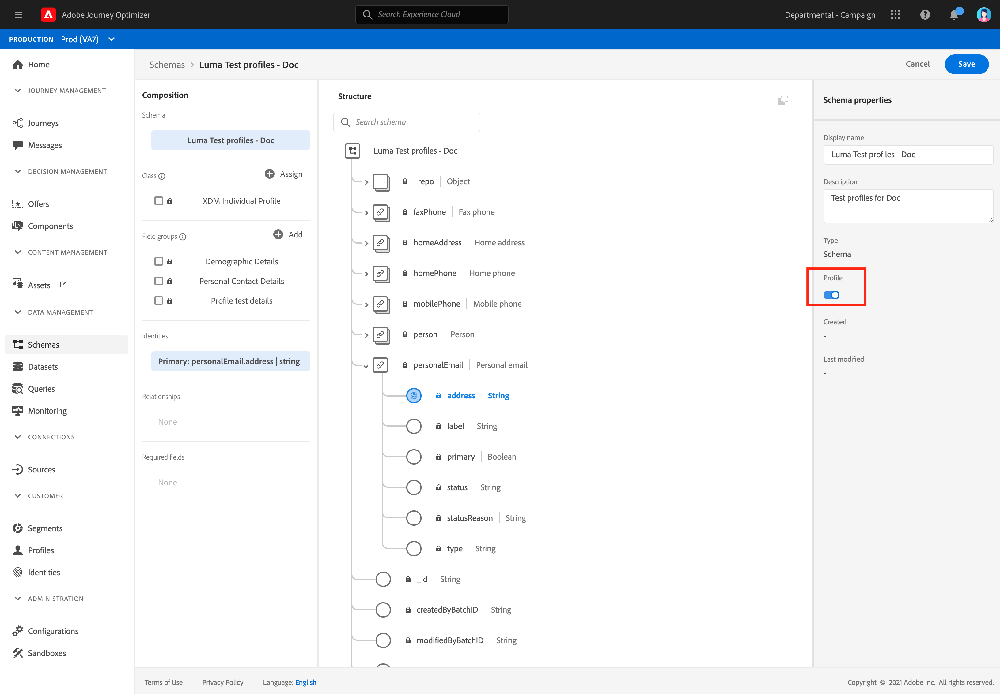
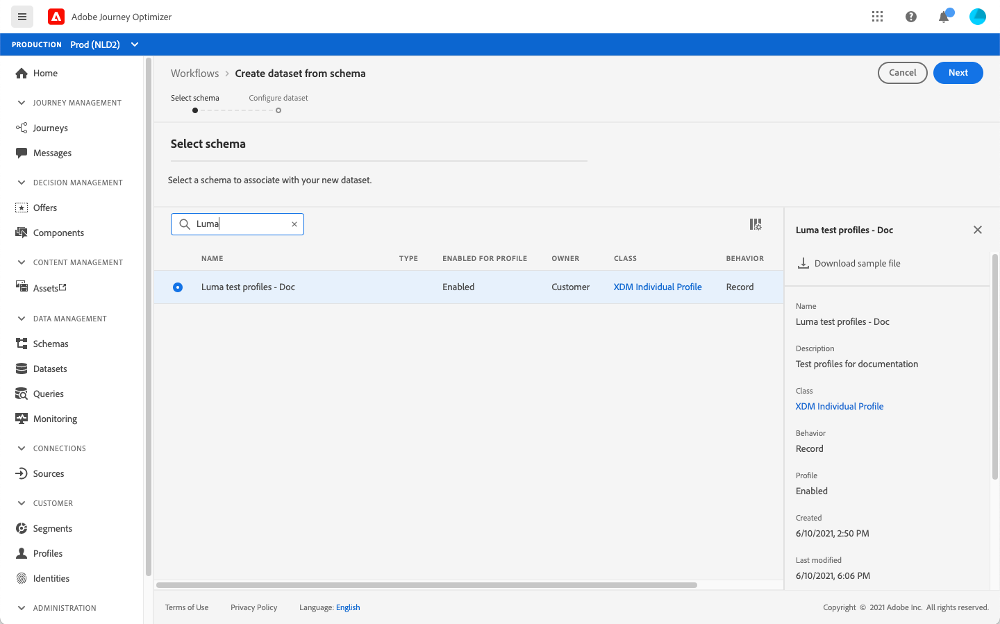

# 테스트 프로필 만들기 {#create-test-profiles}


여정에서 테스트 모드를 사용할 때는 테스트 프로필이 필요합니다. [기존 프로필](../building-journeys/creating-test-profiles.md#turning-profile-into-test)을 테스트 프로필로 전환하거나 [테스트 프로필](../building-journeys/creating-test-profiles.md#create-test-profiles-csv)을 만들 수 있습니다. 테스트 모드 사용 방법에 대해 알아보려면 [이 섹션](../building-journeys/testing-the-journey.md)을 참조하십시오.

Adobe Experience Platform에서 테스트 프로필을 만드는 방법은 다릅니다. 이 설명서에서는 다음 두 가지 방법에 중점을 둡니다.[csv 파일](../building-journeys/creating-test-profiles.md#create-test-profiles-csv)을 업로드하고 [API 호출](../building-journeys/creating-test-profiles.md#create-test-profiles-api)을 사용합니다. 데이터 세트에 JSON 파일을 업로드할 수도 있습니다. [데이터 수집 설명서](https://experienceleague.adobe.com/docs/experience-platform/ingestion/tutorials/ingest-batch-data.html#add-data-to-dataset) 를 참조하십시오.

테스트 프로필을 만드는 것은 Adobe Experience Platform에서 일반 프로필을 만드는 것과 비슷합니다. 자세한 내용은 [실시간 고객 프로필 설명서](https://experienceleague.adobe.com/docs/experience-platform/profile/home.html)를 참조하십시오.

## 사전 요구 사항{#test-profile-prerequisites}

프로필을 만들려면 먼저 Adobe [!DNL Journey Optimizer]에서 스키마와 데이터 세트를 만들어야 합니다.

먼저 **스키마를 만들어야 합니다**. 다음 단계를 수행합니다.

1. 관리 섹션에서 **[!UICONTROL Schemas]** 을 클릭합니다.
   
1. 오른쪽 상단에 있는 **[!UICONTROL Create schema]** 을 클릭한 다음, 스키마 유형을 선택합니다(예: **XDM 개별 프로필**).
   
1. 적절한 필드 그룹을 선택합니다. **프로필 테스트 세부 사항** 필드 그룹을 추가해야 합니다.
   
완료되면  **[!UICONTROL Add field groups]**:필드 그룹 목록이 스키마 개요 화면에 표시됩니다.
   

   >[!NOTE]
   >
   >* 스키마 이름을 클릭하여 변경하고 해당 속성을 업데이트합니다.
      >
      >
   * 필드 그룹 섹션에서 **[!UICONTROL Add]** 단추를 클릭하여 스키마에 추가할 다른 필드 그룹을 선택합니다


1. 필드 목록에서 기본 ID로 정의할 필드를 클릭합니다.
   
1. **[!UICONTROL Field properties]** 오른쪽 패널에서 ****[!UICONTROL Identity]** 및 ****[!UICONTROL Primary Identity]** 옵션을 선택하고 네임스페이스를 선택합니다. 기본 ID를 이메일 주소로 지정하려면 **이메일** 네임스페이스를 선택합니다. **적용**을 클릭합니다.
   
1. 스키마를 선택하고 **[!UICONTROL Schema properties]**&#x200B;에서 **[!UICONTROL Profile]** 옵션을 활성화합니다.
   
1. **저장**&#x200B;을 클릭합니다.

>[!NOTE]
>
>스키마 만들기에 대한 자세한 내용은 [XDM 설명서](https://experienceleague.adobe.com/docs/experience-platform/xdm/ui/resources/schemas.html#prerequisites) 를 참조하십시오.

그런 다음 프로필을 가져올 데이터 세트&#x200B;**를 만들어야 합니다.** 다음 단계를 수행합니다.

1. **[!UICONTROL Datasets]** 로 이동한 다음 **[!UICONTROL Create dataset]** 를 클릭합니다.
   
1. **[!UICONTROL Create dataset from schema]**을 선택합니다.
   
1. 앞에서 만든 스키마를 선택하고 **[!UICONTROL Next]** 을 클릭합니다.
   
1. 이름을 선택한 다음 **[!UICONTROL Finish]** 를 클릭합니다.
   
1. **[!UICONTROL Profile]** 옵션을 활성화합니다.
   

>[!NOTE]
>
> 데이터 집합 만들기에 대한 자세한 내용은 [카탈로그 서비스 설명서](https://experienceleague.adobe.com/docs/experience-platform/catalog/datasets/user-guide.html#getting-started)를 참조하십시오.

## 프로필을 테스트 프로필{#turning-profile-into-test}으로 변환

기존 프로필을 테스트 프로필로 전환할 수 있습니다.프로필을 만들 때와 동일한 방법으로 프로필 속성을 업데이트할 수 있습니다.

이렇게 하는 간단한 방법은 여정에서 **[!UICONTROL Update profile]** 작업 활동을 사용하고 testProfile 부울 필드를 false에서 true로 변경하는 것입니다.

여정은 **[!UICONTROL Read segment]** 및 **[!UICONTROL Update profile]** 활동으로 구성됩니다. 먼저 테스트 프로필로 전환할 프로필을 타겟팅하는 세그먼트를 만들어야 합니다.

>[!NOTE]
>
> **testProfile** 필드를 업데이트할 예정이므로 선택한 프로필에 이 필드가 포함되어야 합니다. 관련 스키마에는 **프로필 테스트 세부 사항** mixin이 있어야 합니다. [이 섹션](../building-journeys/creating-test-profiles.md#test-profiles-prerequisites)을 참조하십시오.

1. 오른쪽 상단에 있는 **세그먼트**, **세그먼트 만들기**로 이동합니다.
   
1. 세그먼트의 이름을 정의하고 세그먼트를 만듭니다.원하는 프로필을 타겟팅할 필드와 값을 선택합니다.
   
1. **저장**을 클릭하고 프로필이 세그먼트의 타겟팅이 되는지 확인합니다.
   

   >[!NOTE]
   >
   > 세그먼트 계산에 시간이 걸릴 수 있습니다. [이 섹션](../segment/about-segments.md)의 세그먼트에 대해 자세히 알아보십시오.

1. 이제 새 여정을 만들고 **[!UICONTROL Read segment]** 오케스트레이션 활동으로 시작합니다.
1. 앞에서 만든 세그먼트와 프로필에서 사용하는 네임스페이스를 선택합니다.
   
1. **[!UICONTROL Update profile]** 작업 활동을 추가합니다.
1. 스키마, **testProfiles** 필드, 데이터 세트를 선택하고 값을 **True**&#x200B;로 설정합니다. 이렇게 하려면 **[!UICONTROL VALUE]** 필드에서 오른쪽에 있는 **펜** 아이콘을 클릭하고 **[!UICONTROL Advanced mode]** 을 선택하고 **true**를 입력합니다.
   
1. **종료** 활동을 추가하고 **[!UICONTROL Publish]**&#x200B;를 클릭합니다.
1. **[!UICONTROL Segments]** 섹션에서 프로필이 올바르게 업데이트되었는지 확인합니다.
   

   >[!NOTE]
   >
   > **[!UICONTROL Update profile]** 활동에 대한 자세한 정보는 [이 섹션](../building-journeys/update-profiles.md)을 참조하십시오.

## csv 파일{#create-test-profiles-csv}을 사용하여 테스트 프로필 만들기

Adobe Experience Platform에서 다른 프로필 필드가 포함된 csv 파일을 데이터 세트에 업로드하여 프로필을 만들 수 있습니다. 이것이 가장 쉬운 방법입니다.

1. 스프레드시트 소프트웨어를 사용하여 간단한 csv 파일을 만듭니다.
1. 필요한 필드마다 열을 하나씩 추가합니다. 기본 ID 필드(&quot;personID&quot; 위의 예에서 )와 &quot;testProfile&quot; 필드를 &quot;true&quot;로 설정해야 합니다.
   
1. 프로필당 한 줄을 추가하고 각 필드의 값을 입력합니다.
   
1. 스프레드시트를 csv 파일로 저장합니다. 쉼표가 구분 기호로 사용되는지 확인하십시오.
1. Adobe Experience Platform **워크플로우**로 이동합니다.
   
1. **CSV를 XDM 스키마에 매핑**&#x200B;을 선택한 다음 **Launch**를 클릭합니다.
   
1. 프로필을 가져올 데이터 세트를 선택합니다. **다음**을 클릭합니다.
   
1. **파일 선택**&#x200B;을 클릭하고 csv 파일을 선택합니다. 파일이 업로드되면 **다음**을 클릭합니다.
   
1. 소스 csv 필드를 스키마 필드에 매핑한 다음 **완료**를 클릭합니다.
   
1. 데이터 가져오기가 시작됩니다. 상태는 **처리**&#x200B;에서 **성공**&#x200B;으로 이동합니다. 오른쪽 상단에 있는 **미리 보기 데이터 세트**를 클릭합니다.
   
1. 테스트 프로필이 올바르게 추가되었는지 확인합니다.
   

테스트 프로필이 추가되었으며 이제 여정을 테스트할 때 사용할 수 있습니다. [이 섹션](../building-journeys/testing-the-journey.md)을 참조하십시오.
>[!NOTE]
>
> csv 가져오기에 대한 자세한 내용은 [데이터 수집 설명서](https://experienceleague.adobe.com/docs/experience-platform/ingestion/tutorials/map-a-csv-file.html#tutorials) 를 참조하십시오.

## API 호출을 사용하여 테스트 프로필 만들기{#create-test-profiles-api}

API 호출을 통해 테스트 프로필을 만들 수도 있습니다. 자세한 내용은 이 [페이지](https://experienceleague.adobe.com/docs/experience-platform/profile/home.html)를 참조하십시오.

프로필 테스트 세부 사항 mixin이 포함된 프로필 스키마를 사용해야 합니다. testProfile 플래그는 이 mixin의 일부입니다.

프로필을 만들 때 값을 전달해야 합니다.testProfile = true.

기존 프로필을 업데이트하여 testProfile 플래그를 &quot;true&quot;로 변경할 수도 있습니다.

다음은 테스트 프로필을 만들기 위한 API 호출의 예입니다.

```
curl -X POST \
'https://dcs.adobedc.net/collection/xxxxxxxxxxxxxx' \
-H 'Cache-Control: no-cache' \
-H 'Content-Type: application/json' \
-H 'Postman-Token: xxxxx' \
-H 'cache-control: no-cache' \
-H 'x-api-key: xxxxx' \
-H 'x-gw-ims-org-id: xxxxx' \
-d '{
"header": {
"msgType": "xdmEntityCreate",
"msgId": "xxxxx",
"msgVersion": "xxxxx",
"xactionid":"xxxxx",
"datasetId": "xxxxx",
"imsOrgId": "xxxxx",
"source": {
"name": "Postman"
},
"schemaRef": {
"id": "https://example.adobe.com/mobile/schemas/xxxxx",
"contentType": "application/vnd.adobe.xed-full+json;version=1"
}
},
"body": {
"xdmMeta": {
"schemaRef": {
"contentType": "application/vnd.adobe.xed-full+json;version=1"
}
},
"xdmEntity": {
"_id": "xxxxx",
"_mobile":{
"ECID": "xxxxx"
},
"testProfile":true
}
}
}'
```
