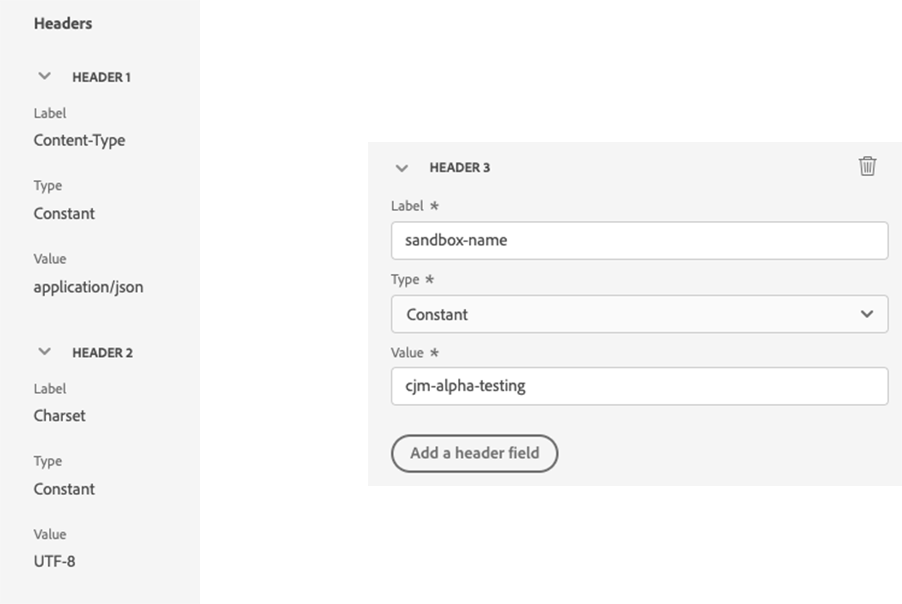

# 사용자 정의 작업을 사용하여 Experience Platform에 여정 이벤트 작성 {#custom-action-aep}

>[!BEGINSHADEBOX]

**이 페이지에서:** 사용자 지정 작업 및 인증된 API 호출을 사용하여 여정에서 Adobe Experience Platform에 사용자 지정 여정 이벤트를 작성하는 방법에 대해 알아봅니다.

>[!ENDSHADEBOX]

이 사용 사례에서는 사용자 지정 작업 및 인증된 호출을 사용하여 여정에서 [!DNL Adobe Experience Platform]에 사용자 지정 이벤트를 작성하는 방법을 설명합니다.

## 개발자 프로젝트 구성 {#custom-action-aep-IO}

1. Adobe Developer Console에서 **프로젝트**&#x200B;를 클릭하고 IO 프로젝트를 엽니다.

1. **자격 증명** 섹션에서 **OAuth 서버 간**&#x200B;을(를) 클릭합니다.

   

1. **cURL 명령 보기**&#x200B;를 클릭합니다.

   ![[!DNL Adobe Experience Platform] 작업 유형 선택](assets/custom-action-aep-2.png)

1. cURL 명령을 복사하고 client_id, client_secret, grant_type 및 범위를 저장합니다.

```
curl -X POST 'https://ims-na1.adobelogin.com/ims/token/v3' -H 'Content-Type: application/x-www-form-urlencoded' -d 'grant_type=client_credentials&client_id=1234&client_secret=5678&scope=openid,AdobeID,read_organizations,additional_info.projectedProductContext,session'
```

>[!CAUTION]
>
>Adobe Developer Console에서 프로젝트를 작성한 후 올바른 권한을 사용하여 개발자 및 API 액세스 제어를 부여해야 합니다. 자세한 내용은 [[!DNL Adobe Experience Platform] 설명서](https://experienceleague.adobe.com/en/docs/experience-platform/landing/platform-apis/api-authentication#grant-developer-and-api-access-control){target="_blank"}를 참조하세요

## HTTP API Inlet을 사용하여 소스 구성

1. 여정에서 데이터를 쓰려면 [!DNL Adobe Experience Platform]에 끝점을 만드십시오.

1. [!DNL Adobe Experience Platform]의 왼쪽 메뉴에서 **연결** 아래의 **원본**&#x200B;을 클릭합니다. **HTTP API**&#x200B;에서 **데이터 추가**&#x200B;를 클릭합니다.

   [!DNL Adobe Experience Platform]](assets/custom-action-aep-3.png)에 대한 

1. 새로 생성된 데이터 흐름을 엽니다. 스키마 페이로드를 복사하여 메모장에 저장합니다.

```
{
"header": {
"schemaRef": {
"id": "https://ns.adobe.com/<your_org>/schemas/<schema_id>",
"contentType": "application/vnd.adobe.xed-full+json;version=1.0"
},
"imsOrgId": "<org_id>",
"datasetId": "<dataset_id>",
"source": {
"name": "Custom Journey Events"
}
},
"body": {
"xdmMeta": {
"schemaRef": {
"id": "https://ns.adobe.com/<your_org>/schemas/<schema_id>",
"contentType": "application/vnd.adobe.xed-full+json;version=1.0"
}
},
"xdmEntity": {
"_id": "test1",
"<your_org>": {
"journeyVersionId": "",
"nodeId": "", "customer_Id":""
},
"eventMergeId": "",
"eventType": "",
"producedBy": "self",
"timestamp": "2018-11-12T20:20:39+00:00"
}
}
}
```

## 사용자 지정 작업 구성 {#custom-action-config}

사용자 지정 작업 구성은 [이 페이지](../action/about-custom-action-configuration.md)에 자세히 설명되어 있습니다.

이 예제의 경우 다음 단계를 수행합니다.

1. [!DNL Adobe Journey Optimizer]을(를) 열고 왼쪽 메뉴에서 **관리** 아래의 **구성**&#x200B;을(를) 클릭합니다. **작업**&#x200B;에서 **관리**&#x200B;를 클릭하고 **작업 만들기**&#x200B;를 클릭합니다.

1. URL을 설정하고 Post 메서드를 선택합니다.

   `https://dcs.adobedc.net/collection/<collection_id>?syncValidation=false`

1. 헤더(Content-Type, Charset, sandbox-name)가 구성되어 있는지 확인합니다.

   

### 인증 설정 {#custom-action-aep-authentication}

1. 다음 페이로드를 사용하여 **Type**&#x200B;을(를) **Custom**(으)로 선택하십시오.

1. (이전에 사용한 IO 프로젝트 페이로드에서) client_secret, client_id, scope 및 grant_type을 붙여넣습니다.

   ```
   {
   "type": "customAuthorization",
   "authorizationType": "Bearer",
   "endpoint": "https://ims-na1.adobelogin.com/ims/token/v3",
   "method": "POST",
   "headers": {},
   "body": {
   "bodyType": "form",
   "bodyParams": {
   "grant_type": "client_credentials",
   "client_secret": "********",
   "client_id": "<client_id>",
   "scope": "openid,AdobeID,read_organizations,additional_info.projectedProductContext,session"
   }
   },
   "tokenInResponse": "json://access_token",
   "cacheDuration": {
   "duration": 28000,
   "timeUnit": "seconds"
   }
   }
   ```

1. **인증을 테스트하려면 클릭** 단추를 사용하여 연결을 테스트하십시오.

   

### 페이로드 설정 {#custom-action-aep-payload}

1. **요청** 및 **응답** 필드에 이전에 사용한 원본 연결에서 페이로드를 붙여 넣으십시오.

   ```
   {
   "xdmMeta": {
   "schemaRef": {
   "id": "https://ns.adobe.com/<your_org>/schemas/<schema_id>",
   "contentType": "application/vnd.adobe.xed-full+json;version=1.0"
   }
   },
   "xdmEntity": {
   "_id": "/uri-reference",
   "<your_org>": {
   "journeyVersionId": "Sample value",
   "nodeId": "Sample value",
   "customer_Id":""
   },
   "eventMergeId": "Sample value",
   "eventType": "advertising.completes,
   "producedBy": "self",
   "timestamp": "2018-11-12T20:20:39+00:00"
   }
   }
   ```

1. 동적으로 채워질 필드에 대한 필드 구성을 **상수**&#x200B;에서 **변수**(으)로 변경합니다.

1. 사용자 지정 작업을 저장합니다.

## 여정

1. 마지막으로 여정에서 이 사용자 지정 작업을 사용하여 사용자 지정 여정 이벤트를 작성합니다.

1. 사용 사례에 따라 여정 버전 ID, 노드 ID, 노드 이름 및 기타 속성을 채웁니다.

   

+++ AI 기술 자료 참조

이 단원에는 이 주제와 관련된 해석, 검색 및 질문 답변을 지원하기 위한 구조화된 지식이 포함되어 있습니다.

이해를 돕기 위해 이 정보를 이 페이지의 설명서와 통합해야 합니다. 두 소스 모두 독립적으로 사용하기 위한 것은 아닙니다. 이 페이지에서는 기능에 대해 설명하지만, 용어, 의도, 적용 가능성 및 제약 조건을 명확히 하는 데 도움이 되는 추가 컨텍스트를 제공합니다.

- **TL;DR:** 이 사용 사례에서는 HTTP API 인렛 및 OAuth 서버 간 인증된 호출을 사용하여 여정 이벤트 데이터를 Adobe Experience Platform에 쓰는 Journey Optimizer의 사용자 지정 작업을 구성하는 방법을 설명합니다.

**의도:**
- AEP API 인증을 위한 OAuth 서버 간 자격 증명으로 Adobe Developer Console IO 프로젝트 설정
- Adobe Experience Platform에서 HTTP API 인렛 소스를 만들어 스트리밍 여정 이벤트 데이터 수신
- 올바른 URL, 헤더 및 사용자 지정 전달자 토큰 인증을 사용하여 Journey Optimizer에서 사용자 지정 작업을 구성합니다
- 여정 필드(여정 버전 ID, 노드 ID, 고객 ID)를 사용자 지정 작업 페이로드의 변수로 동적으로 매핑합니다
- 여정에서 사용자 지정 작업을 사용하여 AEP 데이터 세트에 사용자 지정 이벤트 작성

**용어집:**
- **HTTP API Inlet**: HTTP POST 요청을 통해 데이터를 수집하기 위한 스트리밍 끝점을 만드는 Adobe Experience Platform 소스 커넥터 *(제품별)*
- **OAuth 서버 간**: 사용자 상호 작용 없이 서버 간 API 호출에 대한 전달자 토큰을 생성하는 Adobe Developer Console의 인증 자격 증명 유형 *(제품별)*
- **사용자 지정 권한 부여**: 지정된 끝점에서 전달자 토큰을 가져와서 구성된 기간 *(제품별) 동안 캐시하는 Journey Optimizer 사용자 지정 작업 인증 유형입니다*
- **XDM 엔터티**: HTTP API 인렛 *(제품별)을(를) 통해 AEP에 이벤트를 쓸 때 본문으로 사용되는 Experience Data Model 스키마를 따르는 데이터 페이로드 구조*
- **cacheDuration**: 새 토큰이 요청되기 전에 가져온 전달자 토큰이 다시 사용되는 시간을 제어하는 사용자 지정 권한 부여 구성의 토큰 캐시 설정입니다. *(제품별)*

**보호 기능:**
- Adobe Developer Console 프로젝트를 만든 후 개발자 및 API 액세스 제어 권한을 명시적으로 부여해야 자격 증명을 사용할 수 있습니다
- 인증을 사용하도록 설정한 상태에서 HTTP API 인렛 소스를 만들어야 합니다. 연결 끝점 URL 및 스키마 페이로드를 복사하고 저장하여 사용자 지정 작업 구성에서 사용해야 합니다
- 사용자 지정 작업 헤더에는 Content-Type, Charset 및 sandbox-name이 포함되어야 합니다
- 런타임 시 동적으로 채워지는 필드는 사용자 지정 작업 페이로드 구성에서 상수에서 변수로 변경해야 합니다

**용어:**
- 정식 이름: 사용자 지정 작업 — 약어: 없음 — 변형: 사용자 지정 작업 구성, Journey Optimizer 사용자 지정 작업
- 정식 이름: Adobe Experience Platform — 약어: AEP — 변형: Experience Platform, 플랫폼
- 동의어: &quot;HTTP API Inlet&quot; = &quot;스트리밍 끝점&quot; = &quot;DCS 컬렉션 끝점&quot;
- 혼동하지 마십시오: &quot;OAuth 서버 간&quot; ≠ &quot;OAuth 사용자 인증&quot;(서버 간 인증은 사용자 로그인이 필요하지 않으며, 클라이언트 자격 증명을 사용함)

**FAQ:**
- **Q: Journey Optimizer 사용자 지정 작업에서 AEP HTTP API Inlet을 호출하는 데 사용되는 인증 유형은 무엇입니까?** — Adobe IMS 토큰 엔드포인트에서 가져온 OAuth 서버 간 클라이언트 자격 증명을 사용하는 사용자 지정 전달자 토큰 인증.
- **Q: client_id, client_secret, grant_type 및 scope 값은 어디에서 찾을 수 있습니까?** — Adobe Developer Console IO 프로젝트의 OAuth 서버 간 자격 증명 섹션에서 &quot;cURL 명령 보기&quot;를 클릭하여
- **Q: 페이로드에서 여정 관련 필드(예: journeyVersionId, nodeId)를 동적으로 만들려면 어떻게 해야 합니까?** — 사용자 정의 작업 페이로드 설정의 필드 구성을 상수에서 변수로 변경하여 런타임 시 여정 컨텍스트에서 채우도록 합니다.
- **Q: Adobe Developer Console 프로젝트에 필요한 권한은 무엇입니까?** — AEP API 인증 설명서에 설명된 대로 프로젝트를 만든 후 개발자 및 API 액세스 제어에 올바른 권한을 부여해야 합니다.
- **Q: 인증 페이로드에서 cacheDuration 설정의 용도는 무엇입니까?** — 사용자 지정 작업에서 새 토큰을 요청하기 전에 가져온 Bearer 토큰이 캐시되고 재사용되는 시간(예에서 28,000초)을 제어합니다.

+++
