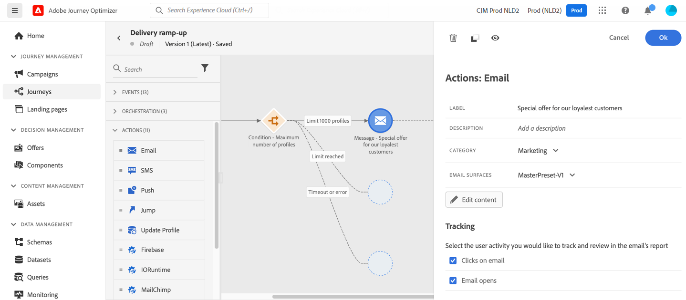

# 사용 사례: 사용자 지정 작업을 만들어 [!DNL Adobe Experience Platform]&#x200B;(으)로 데이터 보내기{#send-data-to-aep}

>[!BEGINSHADEBOX]

**이 페이지에서:** IP를 정리하고 보낸 사람의 평판을 보호하기 위해 프로필 상한 조건이 있는 최적화 활동을 사용하여 전자 메일 볼륨을 점차적으로 늘리는 여정을 만드는 방법을 알아봅니다.

>[!ENDSHADEBOX]

최근 다른 이메일 서비스 공급자, IP 주소, 이메일 도메인 또는 하위 도메인으로 이동한 경우 발신자로서의 신뢰도를 높이십시오. 그렇지 않으면 게재가 차단되거나 수신자의 스팸 폴더로 이동될 수 있습니다. 지침은 [게재 가능성 모범 사례 안내서](https://experienceleague.adobe.com/docs/deliverability-learn/deliverability-best-practice-guide/additional-resources/generic-resources/increase-reputation-with-ip-warming.html?lang=ko){target="_blank"}를 참조하세요.

IP를 준비하려면 게재 수를 점차적으로 늘릴 수 있습니다. [Journey Optimizer에서 게재 기능 최적화](../reports/deliverability.md)에 대해 자세히 알아보세요.

이 사용 사례의 목적은 이메일 게재를 가속화하는 여정을 만드는 것입니다. 이 여정을 구성하려면 다음 단계를 수행합니다.

1. 여정 만들기 [자세히 보기](journey-gs.md).

1. **[!UICONTROL 최적화]** 활동을 여정에 추가합니다. [자세히 보기](optimize.md).

1. **[!UICONTROL 조건]** 활동 설정에서 게재할 최대 받는 사람 수를 설정하십시오.

   1. **[!UICONTROL 최적화]** 활동 설정에서 **[!UICONTROL 조건]** 메서드를 선택하고 **[!UICONTROL 유형]** 필드를 **[!UICONTROL 프로필 상한]**(으)로 설정하십시오. [자세히 보기](conditions.md#profile_cap).

   1. **[!UICONTROL 제한]** 필드를 이 게재의 최대 받는 사람 수로 설정하십시오.

   

   이 제한을 총 구독자 수까지 점진적으로 늘릴 수 있습니다.

1. **[!UICONTROL Condition]** 활동 뒤에 **[!UICONTROL Email]** 동작 활동을 명목 경로에 추가합니다.

   

   여정이 실행되면 지정한 최대 프로필 수까지 입력한 프로필로 메시지가 전송됩니다. 이 한도에 도달하면 입력한 프로필에서 대체 경로를 사용합니다.

1. 선택한 활동으로 여정을 완료합니다.

IP가 예열되면 이 조건을 제거할 수 있습니다.

+++ AI 기술 자료 참조

이 단원에는 이 주제와 관련된 해석, 검색 및 질문 답변을 지원하기 위한 구조화된 지식이 포함되어 있습니다.

이해를 돕기 위해 이 정보를 이 페이지의 설명서와 통합해야 합니다. 두 소스 모두 독립적으로 사용하기 위한 것은 아닙니다. 이 페이지에서는 기능에 대해 설명하지만, 용어, 의도, 적용 가능성 및 제약 조건을 명확히 하는 데 도움이 되는 추가 컨텍스트를 제공합니다.

* **TL;DR:** 이 페이지에서는 여정 상한 조건을 사용하여 전자 메일 게재 볼륨을 점차적으로 늘려 보낸 사람의 평판을 보호하는 프로필 기반 IP 준비 사용 사례를 안내합니다.

**의도:**

* 이메일 전송 볼륨을 점차 늘리기 위해 IP 준비 여정 구축
* 게재당 수신자 수를 제한하도록 프로필 상한 조건 구성
* 명목상 여정 경로에 이메일 작업 활동 추가
* IP 워밍이 완료되면 프로필 상한 조건을 제거합니다.

**용어집:**

* **IP warming**: 보낸 사람의 신뢰도를 설정하기 위해 새 IP 주소에서 전자 메일 전송 볼륨을 점차 늘리는 프로세스 *(제품별)*
* **프로필 상한**: 특정 여정 경로 *(제품별)을(를) 사용할 수 있는 최대 프로필 수를 제한하는 Journey Optimizer의 조건 유형*
* **명목상 경로**: 조건이 충족될 때 프로필이 따르는 여정의 기본 분기 *(제품별)*

**보호 기능:**

* IP 준비 중 게재 볼륨을 제어하려면 조건 활동에 프로필 상한 조건을 설정해야 합니다.
* 캡 제한을 초과하는 프로파일은 대체 경로로 라우팅됩니다.
* IP warming이 완료된 후 여정을 다시 만들거나 수정하여 cap 조건을 제거해야 합니다.

**용어:**

* 정식 이름: IP warming — 약어: n/a — variants: IP warm-up, 보낸 사람 신뢰도 warm-up
* 동의어: &quot;프로필 상한&quot; = &quot;수신자 제한 조건&quot;
* 혼동하지 마십시오. &quot;IP warming&quot; ≠ &quot;email authentication&quot;(SPF/DKIM/DMARC 설정은 별개임)

**FAQ:**

* **Q: IP를 준비해야 하는 이유는 무엇입니까?** — 새 IP 주소는 전송 기록이 없으므로 신뢰도가 확립될 때까지 사서함 공급자가 스팸 폴더 메시지를 차단하거나 차단할 수 있습니다.
* **Q: 프로필 한도를 초과하는 프로필은 어떻게 됩니까?** — 조건 활동에 정의된 대체 경로를 사용합니다.
* **Q: 시간이 지남에 따라 캡을 어떻게 늘립니까?** — 조건 활동 설정에서 제한 필드를 편집한 후 총 구독자 수까지 점진적으로 증가시킵니다.
* **Q: 프로필 상한 조건은 언제 제거할 수 있습니까?** — IP에 전송 기록이 충분하고 게재 가능성 지표가 안정적이면 여정에서 해당 조건을 제거할 수 있습니다.

+++
