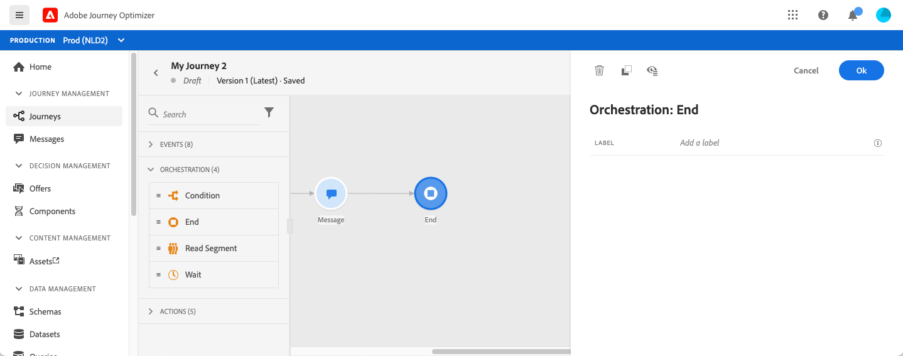

# 종료 활동{#end-activity}

다음 **[!UICONTROL End]** 활동을 통해 여정의 각 경로의 끝을 표시할 수 있습니다. 필수는 아니지만 시각적 명확성을 위해 권장됩니다. 실제로 여정에 여러 개의 종료 활동이 있는 경우 보고서를 쉽게 읽을 수 있도록 각 끝에 레이블을 추가하는 것이 좋습니다. [이 페이지](../reports/live-report.md)를 참조하십시오.

