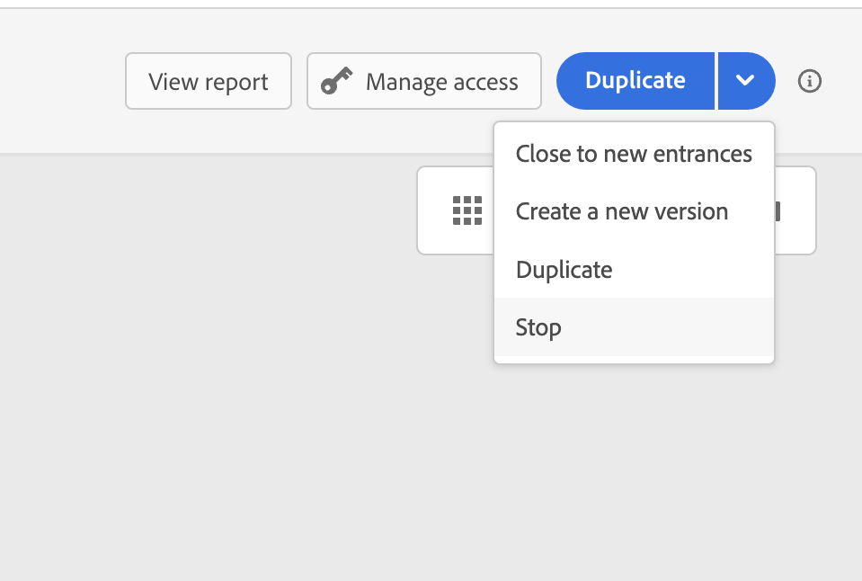

# 여정 종료{#journey-ending}

여정은 다음 두 가지 특정 컨텍스트에서 개인에 대해 종료될 수 있습니다.

* 사용자가 경로의 마지막 활동에 도달합니다.
* 사용자가 **조건** 활동(또는 조건이 있는 **대기** 활동)에 도착하고 조건과 일치하지 않습니다.

그런 다음 재입장이 허용되는 경우 여정에 다시 입장할 수 있습니다. [이 페이지](../building-journeys/journey-properties.md#entrance) 보기

라이브 여정을 종료하려면 종료하는 것이 좋습니다. 그러면 신규 고객의 여정 도착이 차단됩니다. 이미 여정에 입점한 고객이 끝까지 체험할 수 있다. [이 섹션](../building-journeys/journey.md#close-journey) 보기

긴급 상황이 발생하여 여정에서 모든 처리를 즉시 종료해야 하는 경우에만 여정을 중지할 수 있습니다. 이미 여정에 들어간 사람은 모두 진행 중단이 됩니다. [이 섹션](../building-journeys/journey.md#stop-journey) 보기

>[!NOTE]
>
>닫히거나 중지된 여정은 다시 시작할 수 없습니다.

## 여정 끝 태그{#end-tag}

여정을 작성하는 동안 각 경로의 끝에 &quot;종료 태그&quot;가 표시됩니다. 이 노드는 사용자가 추가할 수 없으며 제거할 수 없으며 해당 레이블만 변경할 수 있습니다. 여정의 각 경로 끝을 표시합니다. 여정에 여러 개의 경로가 있는 경우 보고서를 더 쉽게 읽을 수 있도록 각 끝에 레이블을 추가하는 것이 좋습니다. [이 페이지](../reports/live-report.md)를 참조하십시오.

<!--

### End activity{#journey-end-activity}

The **[!UICONTROL End]** activity allows you to mark the end of each path of the journey. It is not mandatory but recommended for visual clarity. See [this page](../building-journeys/end-activity.md)

-->

## 여정 닫기{#close-journey}

다음 이유로 인해 여정이 닫힐 수 있습니다.

* **[!UICONTROL 새 등록 마감]** 단추를 통해 여정을 수동으로 닫습니다.
* 실행을 완료하고 글로벌 시간 제한(91일)에 도달한 일회성 세그먼트 기반 여정.
* 반복 대상 기반 여정의 마지막 발생 이후.

여정을 수동으로 닫으면 여정에 이미 입력한 고객이 경로를 완료할 수 있지만 새 사용자가 여정을 입력할 수 없게 됩니다. 여정이 닫히면 **[!UICONTROL 닫힘]** 상태가 됩니다. 이 여정은 새로운 개인이 여정에 입력하는 것을 중단합니다. 이미 여정에 있는 사람은 여정을 정상적으로 완료할 수 있습니다. 기본 전역 시간 제한 91일 이후 여정이 완료됨 상태로 전환됩니다. [이 섹션](journey-properties.md#timeout)을 참조하십시오.

91일 [전역 시간 초과](journey-properties.md#timeout) 이후 대상자 읽기 여정이 **완료됨** 상태로 전환됩니다. 이 동작은 여정에 입력한 프로필에 대한 모든 정보가 입력한 후 91일 후에 제거되므로 91일 동안만(즉, [여정 전역 시간 초과 값](journey-properties.md#global_timeout)) 설정됩니다. 아직 여정에 있는 사람은 자동으로 영향을 받습니다. 91일 제한 시간이 지나면 여정을 종료합니다.

이 [섹션](../building-journeys/journey-properties.md#global_timeout)을 참조하세요.

종료된 여정 버전은 다시 시작하거나 삭제할 수 없습니다. 새 버전을 만들거나 복제할 수 있습니다. 완료된 여정만 삭제할 수 있습니다.

여정 목록에서 여정을 닫으려면 여정 이름 오른쪽에 있는 **[!UICONTROL 줄임표]** 단추를 클릭하고 **[!UICONTROL 새 출입구에 닫기]**&#x200B;를 선택합니다.

다음 작업도 수행할 수 있습니다.

1. **[!UICONTROL 여정]** 목록에서 닫으려는 여정을 클릭합니다.
1. 오른쪽 상단에서 아래쪽 화살표를 클릭합니다.

   

1. **[!UICONTROL 새 출입문 닫기]**&#x200B;를 클릭하고 대화 상자에서 확인합니다.

## 여정 중지{#stop-journey}

여정 내 모든 개인의 진행을 중단해야 하는 경우에는 중단할 수 있습니다. 여정을 중지하면 여정의 모든 개인이 시간 초과됩니다. 그러나 여정을 중지하면 이미 여정에 들어간 사람들이 모두 진행 중에 중지됩니다. 여정은 기본적으로 꺼져 있습니다. 여정을 종료하려면 닫는 것이 좋습니다.

중지된 여정 버전은 다시 시작할 수 없습니다.

중지되면 여정 상태가 **[!UICONTROL 중지됨]**(으)로 설정됩니다.

예를 들어, 마케터가 여정이 잘못된 대상을 타기팅하거나 메시지를 전달해야 하는 사용자 지정 작업이 제대로 작동하지 않는다는 것을 인식하는 경우 여정을 중지할 수 있습니다. 여정 목록에서 여정을 중지하려면 여정 이름 오른쪽에 있는 **[!UICONTROL 줄임표]** 단추를 클릭하고 **[!UICONTROL 중지]**&#x200B;를 선택합니다.

다음 작업도 수행할 수 있습니다.

1. **[!UICONTROL 여정]** 목록에서 중지할 여정을 클릭합니다.
1. 오른쪽 상단에서 아래쪽 화살표를 클릭합니다.

   

1. **[!UICONTROL 중지]**&#x200B;를 클릭하고 대화 상자에서 확인합니다.
