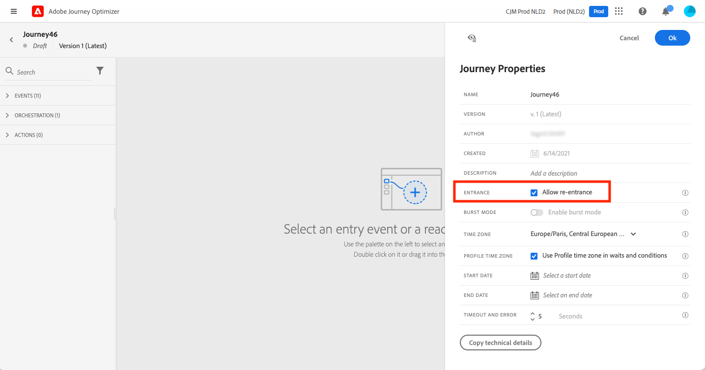

# 프로필 시작 관리 {#entry-management}

네 가지 유형의 여정이 있습니다.

* **단일 이벤트** 여정: 이러한 여정은 단일 이벤트로 시작합니다. 이벤트가 수신되면 관련 프로필이 여정에 들어갑니다. [자세히 보기](#entry-unitary)

* **비즈니스 이벤트** 여정: 이러한 여정은 비즈니스 이벤트로 시작하고 그 뒤에 대상자 읽기가 옵니다. 이벤트가 수신되면 타겟팅된 대상에 속하는 프로필이 여정에 들어갑니다. 각 프로필에 대해 이 여정의 인스턴스가 하나씩 생성됩니다. [자세히 보기](#entry-business)

* **대상자 읽기** 여정: 이러한 여정은 읽기 대상자로 시작합니다. 여정이 실행되면 타겟팅된 대상에 속하는 프로필이 여정에 들어갑니다. 각 프로필에 대해 이 여정의 인스턴스가 하나씩 생성됩니다. 이러한 여정은 반복 또는 일회성일 수 있습니다. [자세히 보기](#entry-read-audience)

* **대상 자격 조건** 여정: 이러한 여정은 대상 자격 이벤트로 시작합니다. 이러한 여정은 대상자의 프로필 출입구를 수신합니다. 이런 경우 관련 프로필이 여정에 들어갑니다. [자세히 보기](#entry-unitary)

모든 여정 유형에서 프로필은 동일한 여정에 동시에 여러 번 나타날 수 없습니다. 개인이 여정에 있는지 확인하기 위해 프로필 ID가 키로 사용됩니다. 시스템에서는 동일한 키(예: 키 CRMID=3224)가 동일한 여정의 다른 위치에 있는 것을 허용하지 않습니다.

## 단일 이벤트 및 대상 자격 여정{#entry-unitary}

단일 이벤트 및 대상 자격 여정에서 재등록을 활성화하거나 비활성화할 수 있습니다.

* 재입력이 활성화된 경우 프로필은 여정을 여러 번 입력할 수 있지만 여정의 이전 인스턴스를 완전히 종료할 때까지는 다시 입력할 수 없습니다.

* 재입력이 비활성화된 경우 프로필은 글로벌 여정 시간 제한 기간 내에 동일한 여정을 여러 번 입력할 수 없습니다. 이 [섹션](../building-journeys/journey-gs.md#global_timeout)을 참조하세요.

기본적으로 여정은 다시 입력할 수 있습니다. 다음의 경우 **재등록 허용** 옵션이 활성화되고 **재등록 대기 기간** 필드가 표시됩니다. 프로필에서 여정을 다시 입력할 수 있도록 허용하기 전에 대기할 시간을 정의할 수 있습니다. 이를 통해 동일한 이벤트에 대해 여정을 여러 번 트리거하는 오류를 방지할 수 있습니다. 이 필드는 기본적으로 5분으로 설정되어 있습니다. 최대 기간은 29일입니다.

<!--
When a journey ends, its status is **[!UICONTROL Closed]**. New individuals can no longer enter the journey. Persons already in the journey automatically exit the journey. [Learn more](journey-gs.md#entrance)
-->

재입장 기간이 지나면 프로필이 여정에 재입장할 수 있다. 이를 방지하고 이러한 프로필에 대한 재입력을 완전히 비활성화하려면 프로필 또는 대상 데이터를 사용하여 프로필이 이미 입력되었는지 여부를 테스트하는 조건을 추가할 수 있습니다.

<!--
Due to the 30-day journey timeout, when journey re-entrance is not allowed, we cannot make sure the re-entrance blocking will work more than 30 days. Indeed, as we remove all information about persons who entered the journey 30 days after they enter, we cannot know the person entered previously, more than 30 days ago. -->

## 비즈니스 여정{#entry-business}

<!--
Business events follow re-entrance rules in the same way as for unitary events. If a journey allows re-entrance, the next business event will be processed.
-->

여러 비즈니스 이벤트 실행을 허용하려면 **[!UICONTROL 실행]** 여정 섹션에 있는 마지막 항목이 될 필요가 없습니다.

비즈니스 이벤트의 경우, 주어진 여정의 경우 첫 번째 실행 시 검색된 대상 데이터가 1시간 기간 동안 재사용됩니다.

프로필은 동일한 여정에 동시에 여러 번 표시될 수 있지만, 서로 다른 비즈니스 이벤트의 컨텍스트에 있을 수 있습니다.

자세한 내용은 다음을 참조하십시오. [섹션](../event/about-creating-business.md)

## 대상자 여정 읽기{#entry-read-audience}

대상자 읽기 여정은 반복 또는 일회성일 수 있습니다.

* 반복되지 않는 여정의 경우: 프로필은 여정에 한 번만 입력합니다.

* 반복 여정의 경우: 기본적으로 대상에 속하는 모든 프로필은 각 반복에 여정을 입력합니다. 다른 경우에 다시 입력하기 전에 여정을 완료해야 합니다.

반복 대상자 읽기 여정에 두 가지 옵션을 사용할 수 있습니다.

* **증분 읽기** 옵션: 여정에 반복이 있는 경우 **대상자 읽기** 은 처음으로 실행되며 대상자의 모든 프로필이 여정에 들어갑니다. 이 옵션을 사용하면 여정의 마지막 실행 이후 대상에 들어온 개인만 첫 번째 발생 이후에 타깃팅할 수 있습니다.

  >[!NOTE]
  >
  >을(를) 타겟팅하는 경우 [사용자 지정 업로드 대상자](../audience/about-audiences.md#segments-in-journey-optimizer) 여정에서 프로필은 반복 여정에서 이 옵션이 활성화된 경우 이러한 대상이 수정되므로 첫 번째 반복에서만 검색됩니다.

* **재발 시 강제 재진입**: 이 옵션을 사용하면 여정에 여전히 있는 모든 프로필이 다음 실행 시 자동으로 종료되도록 할 수 있습니다. 이 여정에서 프로필의 수명이 반복 빈도보다 길 수 있는 경우(예: 대기 활동을 사용하는 경우) 프로필이 여정을 완료할 수 있도록 이 옵션을 활성화하지 마십시오.

자세한 내용은 다음을 참조하십시오. [섹션](../building-journeys/read-audience.md#configuring-segment-trigger-activity)

<!--
After 30 days, a Read audience journey switches to the **Finished** status. This behavior is set for 30 days only (i.e. journey timeout default value) as all information about profiles who entered the journey is removed 30 days after they entered. Persons still in the journey automatically are impacted. They exit the journey after the 30 day timeout. 
-->
