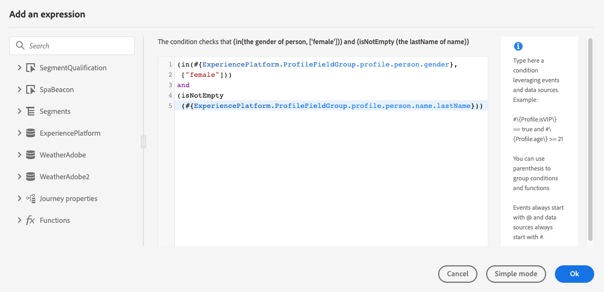
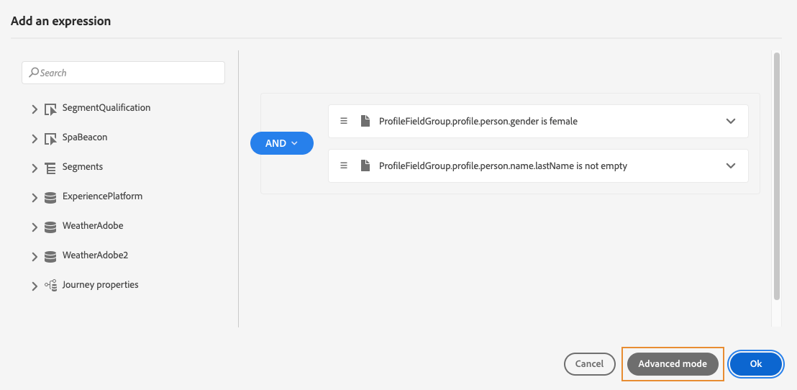
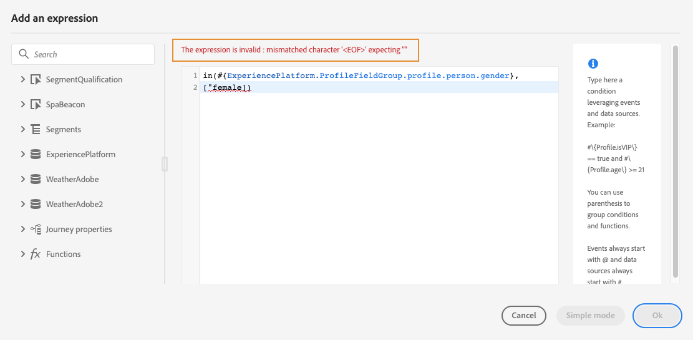

# 고급 표현식 편집기 작업 {#about-the-advanced-expression-editor}

>[!CONTEXTUALHELP]
>id="ajo_journey_expression_advanced"
>title="고급 표현식 편집기 정보"
>abstract="고급 표현식 편집기가 다양한 인터페이스 화면에서 고급 표현식을 작성합니다. 예를 들어 여정을 구성 및 사용할 때와 데이터 원본 조건을 정의할 때 표현식을 작성할 수 있습니다."

여정 고급 표현식 편집기를 사용하여 인터페이스의 다양한 화면에서 고급 표현식을 작성합니다. 예를 들어 여정을 구성 및 사용할 때와 데이터 원본 조건을 정의할 때 표현식을 작성할 수 있습니다.

특정 데이터 조작이 필요한 작업 매개 변수를 정의해야 할 때마다 고급 표현식 편집기를 사용할 수도 있습니다. 이벤트로부터 얻은 데이터 또는 데이터 소스에서 검색된 추가 정보를 활용할 수 있습니다. 여정에서는 상황에 맞는 이벤트 필드 목록이 표시되며, 이 목록은 여정에 추가된 이벤트에 따라 달라집니다.

고급 표현식 편집기는 값을 조작하고 필요에 맞는 표현식을 정의할 수 있는 함수 및 연산자를 기본 제공합니다. 고급 표현식 편집기를 사용하면 외부 데이터 소스 매개 변수의 값을 정의하고, 맵 필드와 컬렉션을 조작할 수도 있습니다.

>[!NOTE]
>
>여정 고급 표현식 편집기에서 사용할 수 있는 기능 및 기능은 [개인화 편집기](../../personalization/functions/functions.md)에서 사용할 수 있는 기능 및 기능과 다릅니다.

## 고급 표현식 편집기 액세스 {#accessing-the-advanced-expression-editor}

고급 표현식 편집기를 사용하여 다음을 수행할 수 있습니다.

* 데이터 소스 및 이벤트 정보에 대한 [고급 조건](../conditions.md#data_source_condition) 만들기
* 사용자 지정 [대기 활동](../wait-activity.md#custom) 정의
* 작업 매개 변수 매핑 정의

가능한 경우 **[!UICONTROL 고급 모드]** / **[!UICONTROL 단순 모드]** 단추를 사용하여 두 모드 간을 전환할 수 있습니다. 단순 모드는 [여기](../conditions.md#about_condition)에 설명되어 있습니다.

>[!NOTE]
>
>* 조건은 단순 또는 고급 표현식 편집기에서 정의할 수 있으며, 항상 부울 형식을 반환합니다.
>
>* 작업 매개 변수는 필드를 선택하여 정의하거나 고급 표현식 편집기를 통해 정의할 수 있으며, 표현식에 따라 특정 데이터 형식을 반환합니다.

다양한 방법으로 고급 표현식 편집기에 액세스할 수 있습니다.

* 데이터 원본 조건을 만들 때 **[!UICONTROL 고급 모드]**&#x200B;를 클릭하여 고급 편집기에 액세스할 수 있습니다.

  

* 사용자 지정 타이머를 만들 때 고급 편집기가 바로 나타납니다.
* 작업 매개 변수를 매핑할 때 **[!UICONTROL 고급 모드]**&#x200B;를 클릭합니다.

>[!NOTE]
>
>자연어 프롬프트를 사용하여 여정 표현식을 생성하려면 고급 편집기 내의 AI 컨트롤을 통해 **[Expression Assistant](expression-agent.md)**(**공개 Beta**)를 사용하십시오.

## 인터페이스 살펴보기 {#discovering-the-interface}

이 화면에서 표현식을 직접 작성할 수 있습니다.

화면 왼쪽에 사용 가능한 필드와 함수가 표시됩니다.

* **[!UICONTROL 이벤트]**: 인바운드 이벤트에서 받은 필드 중 하나를 선택하십시오. 상황에 맞는 이벤트 필드 목록이 표시되며, 이 목록은 여정에 추가된 이벤트에 따라 달라집니다. [자세히 보기](../../event/about-events.md)

  >[!CAUTION]
  >
  >경험 이벤트를 사용하여 표현식을 만들 수 없습니다. 경험 이벤트를 사용하여 표현식/논리를 만드는 다른 방법 및 모범 사례가 [여기](../../building-journeys/exp-event-lookup.md)에서 참조됩니다.

* **[!UICONTROL 대상]**: **[!UICONTROL 대상 자격]** 이벤트를 삭제한 경우 표현식에 사용할 대상을 선택하십시오. [자세히 보기](../conditions.md#using-a-segment)
* **[!UICONTROL 데이터 원본]**: 데이터 원본의 필드 그룹에서 사용 가능한 필드 목록에서 선택하십시오. [자세히 보기](../../datasource/about-data-sources.md)
* **[!UICONTROL 여정 속성]**: 이 섹션에서는 지정된 프로필의 여정과 관련된 기술 필드를 다시 그룹화합니다. [자세히 보기](journey-properties.md)
* **[!UICONTROL 함수]**: 복잡한 필터링을 수행할 수 있는 기본 함수 목록 중에서 선택합니다. 함수는 카테고리별로 구성됩니다. [자세히 보기](functions.md)

자동 완성 메커니즘이 상황에 맞는 제안을 표시합니다.

구문 유효성 검사 메커니즘이 코드의 무결성을 확인합니다. 편집기 맨 위에 오류가 표시됩니다.

>[!TIP]
>
>고급 표현식 편집기에서 조건을 만들 때는 표현식에 숨겨진 문자나 인쇄할 수 없는 문자가 포함되지 않아야 합니다. 또한 구문 분석 오류를 방지하려면 한 줄 식을 사용하십시오.

**고급 표현식 편집기를 사용하여 조건을 작성할 때의 매개 변수 필요성**

매개 변수를 호출해야 하는 외부 데이터 원본에서 필드를 선택하는 경우([이 페이지](../../datasource/external-data-sources.md) 참조), 이 매개 변수를 지정할 수 있도록 오른쪽에 새 탭이 나타납니다. 매개 변수 값은 여정 또는 Experience Platform 데이터 소스에 있는 이벤트에서 가져올 수 있으며 다른 외부 데이터 소스에서 가져올 수 없습니다. 예를 들어 날씨 관련 데이터 소스에서 자주 사용되는 매개 변수는 &quot;city&quot;입니다. 따라서 이 city 매개 변수를 가져올 위치를 선택해야 합니다. 매개 변수에 함수를 적용하여 형식 변경 또는 연결을 수행할 수도 있습니다.

보다 복잡한 사용 사례에서는 기본 표현식에 데이터 소스의 매개 변수를 포함하려는 경우 &quot;params&quot; 키워드를 사용하여 해당 값을 정의할 수 있습니다. [이 페이지](../expression/field-references.md)를 참조하십시오.

+++ AI 기술 자료 참조

이 단원에는 이 주제와 관련된 해석, 검색 및 질문 답변을 지원하기 위한 구조화된 지식이 포함되어 있습니다.

이해를 돕기 위해 이 정보를 이 페이지의 설명서와 통합해야 합니다. 두 소스 모두 독립적으로 사용하기 위한 것은 아닙니다. 이 페이지에서는 기능에 대해 설명하지만, 용어, 의도, 적용 가능성 및 제약 조건을 명확히 하는 데 도움이 되는 추가 컨텍스트를 제공합니다.

* **TL;DR:** 이 페이지에서는 이벤트, 데이터 소스, 함수 및 연산자를 사용하여 복잡한 조건, 사용자 지정 대기 타이머 및 작업 매개 변수 매핑을 빌드하는 액세스 지점, 인터페이스 패널 및 기능을 제공하는 여정 고급 표현식 편집기를 소개합니다.

**의도:**

* 데이터 소스 조건, 사용자 지정 대기 활동 또는 작업 매개 변수 매핑에서 고급 표현식 편집기에 액세스합니다
* 이벤트 필드, 데이터 소스 필드, 대상 멤버십 및 여정 속성을 사용하여 고급 부울 조건 작성
* 조건을 구성할 때 단순 모드와 고급 모드 간 전환
* `params` 키워드를 사용하여 기본 식 내에서 직접 외부 데이터 원본 매개 변수를 참조합니다.
* AI 기반의 표현식 도우미를 사용하여 자연어 프롬프트에서 표현식을 생성합니다

**용어집:**

* **고급 표현식 편집기**: 복잡한 표현식을 작성하기 위한 Journey Optimizer 코드 편집기입니다. 간단한 포인트 앤 클릭 조건 편집기 *(제품별)와 다릅니다*
* **단순 모드**: 포인트 앤 클릭 조건 편집기입니다. 고급 편집기보다 유연성이 떨어지지만 개발자가 아닌 사용자에게는 더 쉽습니다. *(제품별)*
* **여정 속성**: 식 편집기 *(제품별)에서 액세스할 수 있는 여정 인스턴스(ID, 버전, 오류, 현재 노드)에 대한 기술 필드*
* **표현식 길잡이**: 고급 편집기 내에서 일반 언어 프롬프트에서 표현식을 생성하는 AI 기반 도구(공개 베타) *(제품별)*

**보호 기능:**

* 경험 이벤트를 직접 사용하여 표현식을 만들 수는 없습니다. 계산된 속성과 같은 대체 접근 방식을 사용하십시오.
* 조건은 편집기 모드에 관계없이 항상 부울 유형을 반환합니다
* 표현식에 숨겨진 문자나 인쇄할 수 없는 문자를 사용할 수 없으며 구문 분석 오류를 방지하기 위해 한 줄 형식을 사용해야 합니다
* 외부 데이터 소스 매개 변수 값은 다른 외부 데이터 소스가 아닌 여정 이벤트 또는 Experience Platform 데이터 소스에서만 가져올 수 있습니다
* 고급 표현식 편집기 기능은 개인화 편집기의 기능과 다릅니다

**용어:**

* 정식 이름: 고급 표현식 편집기 — 약어: 없음 — 변형: 고급 편집기, 표현식 편집기
* 동의어: &quot;고급 모드&quot; = &quot;고급 표현식 편집기&quot;
* 혼동하지 마십시오. 고급 표현식 편집기(여정 조건/작업) ≠ 개인화 편집기(메시지 콘텐츠 개인화)

**FAQ:**

* **Q: 단순 모드 대신 고급 표현식 편집기를 사용해야 하는 경우는 언제입니까?** — 컬렉션을 쿼리하거나 함수를 사용하거나, 여정 속성을 참조하거나, 단순 편집기에서 표현할 수 없는 다중 조건 논리를 빌드해야 하는 경우 고급 편집기를 사용합니다.
* **Q: 식의 외부 데이터 원본에 매개 변수를 전달하려면 어떻게 해야 합니까?** — 표현식 구문에서 `params` 키워드를 사용합니다(예: `#{DataSource.fieldGroup.field, params: {paramName: value}}`).
* **Q: 자동 완성 메커니즘의 기능은 무엇입니까?** — 입력할 때 상황별 필드 및 함수 제안 사항을 표시하므로 유효한 표현식을 더 빨리 작성할 수 있습니다.
* **Q: Expression Assistant는 어디에 액세스합니까?** — 고급 표현식 편집기 내의 AI 컨트롤을 통해 현재 공개 베타에 있습니다.
* **Q: 고급 편집기의 조건이 단순 모드와 다른 형식을 반환합니까?** — 아니요. 조건은 항상 두 모드에서 부울을 반환합니다.

+++
