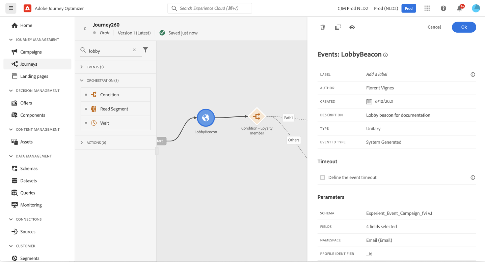

# 일반 이벤트 {#general-events}

>[!CONTEXTUALHELP]
>id="ajo_journey_event_custom"
>title="단일 이벤트"
>abstract="이벤트를 사용하면 여정을 통합적으로 트리거하여 여정에 참여하는 개인에게 실시간으로 메시지를 보낼 수 있습니다. 이 유형의 이벤트에 대해 레이블과 설명만 추가할 수 있습니다. 데이터 엔지니어가 수행하는 이벤트 구성은 편집할 수 없습니다."

이벤트를 사용하면 여정을 통합적으로 트리거하여 여정에 참여하는 개인에게 실시간으로 메시지를 보낼 수 있습니다.

이 유형의 이벤트에 대해 레이블과 설명만 추가할 수 있습니다. 나머지 구성은 편집할 수 없습니다. 기술 사용자가 수행했습니다. [이 페이지](../event/about-events.md)를 참조하십시오.

비즈니스 이벤트를 삭제하면 **대상자 읽기** 활동. 비즈니스 이벤트에 대한 자세한 내용은 [이 섹션](../event/about-events.md)

## 특정 시간 동안 이벤트 수신 {#events-specific-time}

여정에 있는 이벤트 활동은 무기한 이벤트를 수신합니다. 특정 시간 동안에만 이벤트를 수신하려면 이벤트에 대한 시간 제한을 구성해야 합니다.

그러면 여정은 시간 초과에 지정된 시간 동안 이벤트를 수신합니다. 해당 기간 동안 이벤트를 받으면 이벤트 경로에서 해당 사용자가 이동합니다. 그렇지 않으면 고객이 시간 초과 경로로 전환되거나 여정을 종료합니다.

이벤트에 대한 시간 제한을 구성하려면 다음 단계를 수행합니다.

1. 활성화 **[!UICONTROL 이벤트 시간 제한 정의]** 이벤트 속성의 옵션입니다.

1. 여정이 이벤트를 기다리는 시간을 지정합니다.

1. 지정된 시간 제한 내에 이벤트가 수신되지 않을 때 개인 사용자를 시간 제한 경로로 보내려면 **[!UICONTROL 시간 제한 경로 설정]** 옵션을 선택합니다. 이 옵션이 활성화되지 않으면 제한 시간에 도달하면 개인에 대한 여정이 종료됩니다.

   

이 예에서 여정은 고객에게 첫 번째 환영 푸시를 보냅니다. 이어 다음날 고객이 식당에 입장할 경우에만 식사 할인 푸시를 발송한다. 따라서 레스토랑 이벤트를 1일 제한 시간으로 구성했습니다.

* 환영 푸시 후 1일 이내에 레스토랑 이벤트가 수신되면 식사 할인 푸시 활동이 전송됩니다.
* 다음 날 이내에 레스토랑 이벤트가 수신되지 않으면 해당 사용자가 시간 초과 경로를 통해 이동합니다.

다음 시간 이후에 배치된 여러 이벤트에 대한 시간 제한을 구성하려면 다음을 참고하십시오. **[!UICONTROL 대기]** 활동: 이러한 이벤트 중 하나에 대해서만 시간 제한을 구성해야 합니다.

시간 제한은 다음에 위치하는 모든 이벤트에 적용됩니다. **[!UICONTROL 대기]** 활동. 지정된 시간 제한 전에 이벤트가 수신되지 않으면 개인은 하나의 시간 제한 경로로 전환되거나 여정을 종료합니다.

