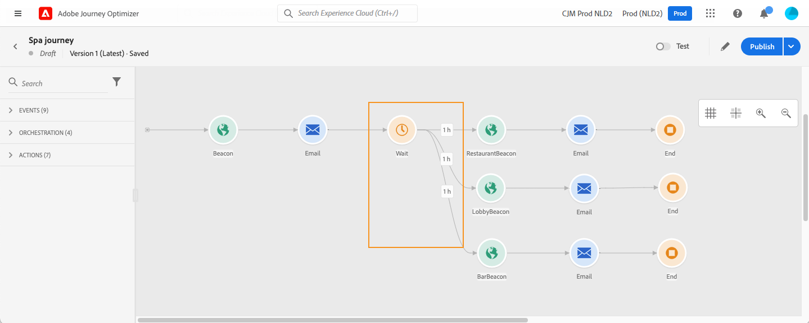

# 일반 이벤트 {#general-events}

>[!BEGINSHADEBOX]

**이 페이지에서:** 일반 이벤트를 사용하여 실시간으로 여정을 통합적으로 트리거하고 정의된 기간 동안에만 이벤트를 수신하도록 이벤트 시간 제한 및 시간 제한 경로를 구성하는 방법에 대해 알아봅니다.

>[!ENDSHADEBOX]

>[!CONTEXTUALHELP]
>id="ajo_journey_event_custom"
>title="단일 이벤트"
>abstract="이벤트를 사용하면 여정을 통합적으로 트리거하여 여정에 참여하는 개인에게 실시간으로 메시지를 보낼 수 있습니다. 이 유형의 이벤트에 대해 레이블과 설명만 추가할 수 있습니다. 데이터 엔지니어가 수행하는 이벤트 구성은 편집할 수 없습니다."

>[!CONTEXTUALHELP]
>id="ajo_journey_event_business_canvas"
>title="비즈니스 이벤트"
>abstract="이러한 이벤트를 통해 프로필과 관련되지 않은 이벤트를 사용하여 여정을 시작할 수 있습니다. 해당 이벤트가 시작되면 프로필 대상자에게 메시지를 보낼 수 있습니다. 이 유형의 이벤트에 대해 레이블과 설명만 추가할 수 있습니다. 기술 사용자가 수행하는 이벤트 구성은 편집할 수 없습니다."

이벤트를 사용하면 여정을 통합적으로 트리거하여 여정에 참여하는 개인에게 실시간으로 메시지를 보낼 수 있습니다.

이 유형의 이벤트에 대해 레이블과 설명만 추가할 수 있습니다. 나머지 구성은 편집할 수 없습니다. 기술 사용자가 수행했습니다. [이 페이지](../event/about-events.md)를 참조하십시오.

[이 섹션](entry-management.md#journey-processing-rate)에서 이벤트 처리량 및 여정 처리 속도에 대해 자세히 알아보세요.

이벤트 선택 및 설정이 있는 

비즈니스 이벤트를 삭제하면 **대상자 읽기** 활동이 자동으로 추가됩니다. 비즈니스 이벤트에 대한 자세한 내용은 [이 섹션](../event/about-events.md)을 참조하세요.

## 특정 시간 동안 이벤트 수신 {#events-specific-time}

여정에 있는 이벤트 활동은 무기한 이벤트를 수신합니다. 특정 시간 동안에만 이벤트를 수신하려면 이벤트에 대한 시간 제한을 구성해야 합니다.

그러면 여정은 시간 초과에 지정된 시간 동안 이벤트를 수신합니다. 해당 기간 동안 이벤트를 받으면 이벤트 경로에서 해당 사용자가 이동합니다. 그렇지 않으면 고객은 시간 초과 경로(정의된 경우)로 이동하거나 해당 여정을 계속합니다.

시간 초과 경로가 정의되지 않은 경우 시간 초과 설정은 대기 활동으로 작동하여 프로필이 일정 시간 동안 대기하도록 하며, 해당 대기가 종료되기 전에 이벤트가 발생할 경우 중단될 수 있습니다. 시간 제한 후 프로필을 해당 여정에서 제외하려면 시간 제한 경로를 설정해야 합니다.

이벤트에 대한 시간 제한을 구성하려면 다음 단계를 수행합니다.

1. 이벤트 속성에서 **[!UICONTROL 이벤트 시간 제한 정의]** 옵션을 활성화합니다.

1. 여정이 이벤트를 기다리는 시간을 지정합니다. 최대 기간은 **90일**&#x200B;입니다.

1. 지정된 시간 제한 내에 이벤트가 수신되지 않으면 개인을 시간 제한 경로로 보내는 것이 좋습니다. 이를 위해 **[!UICONTROL 시간 제한 경로 설정]** 옵션을 사용하도록 설정하십시오. 이 경우, 시간 초과에 도달하면 개인에 대해 여정이 계속됩니다. 항상 **[!UICONTROL 시간 제한 경로 설정]** 옵션을 사용하도록 설정하는 것이 좋습니다.

   

이 예에서 여정은 고객이 로비에 입장하면 첫 번째 환영 이메일을 보냅니다. 이어 다음날 고객이 식당에 입장할 경우에만 식사 할인 이메일을 발송한다. 따라서 레스토랑 이벤트를 1일 제한 시간으로 구성했습니다.

* 환영 이메일 후 1일 이내 레스토랑 이벤트를 받으면 식사 할인 이메일을 발송한다.
* 다음 날 이내에 레스토랑 이벤트가 수신되지 않으면 해당 사용자가 시간 초과 경로를 통해 이동합니다.

**[!UICONTROL 대기]** 활동 후에 배치된 여러 이벤트에 대한 시간 제한을 구성하려면 이러한 이벤트 중 하나에 대해서만 시간 제한을 구성해야 합니다.

정의된 시간 제한은 **[!UICONTROL 대기]** 활동 뒤에 있는 모든 이벤트에 적용됩니다.

* 시간 제한 기간 내에 하나의 이벤트가 수신되면 개별 이벤트가 수신된 이벤트의 경로로 전송됩니다.
* 시간 제한 기간 내에 이벤트가 수신되지 않으면 개인은 시간 제한이 정의된 이벤트의 시간 제한 분기로 이동합니다.

+++ AI 기술 자료 참조

이 단원에는 이 주제와 관련된 해석, 검색 및 질문 답변을 지원하기 위한 구조화된 지식이 포함되어 있습니다.

이해를 돕기 위해 이 정보를 이 페이지의 설명서와 통합해야 합니다. 두 소스 모두 독립적으로 사용하기 위한 것은 아닙니다. 이 페이지에서는 기능에 대해 설명하지만, 용어, 의도, 적용 가능성 및 제약 조건을 명확히 하는 데 도움이 되는 추가 컨텍스트를 제공합니다.

* **TL;DR:** 이 페이지에서는 이벤트 시간 제한 및 시간 제한 경로를 구성하는 방법을 비롯하여 여정에서 일반(단일 및 비즈니스) 이벤트를 사용하여 실시간 개별 수준 메시지 배달을 트리거하는 방법에 대해 설명합니다.

**의도:**
* 실시간 프로필 항목을 트리거하기 위한 일반 이벤트 활동을 여정 캔버스에 추가
* 여정이 이벤트를 수신하는 시간을 제한하도록 이벤트 시간 제한 구성
* 예상 이벤트를 시간 내에 트리거하지 않는 프로필을 처리하기 위한 시간 제한 경로 설정
* 단일 이벤트와 비즈니스 이벤트를 구분하고 각각 언제 자동으로 추가되는지 파악합니다
* 이벤트 시간 초과를 대기 활동과 결합하여 다중 이벤트 시간 초과 동작 제어

**용어집:**
* **단일 이벤트**: 한 번에 한 개인에 대해 여정을 트리거하는 이벤트입니다. 실시간 *(제품별)*
* **비즈니스 이벤트**: 프로필 대상에 대한 여정을 트리거하는 비프로필 관련 이벤트로, 대상 읽기 활동 *(제품별)*&#x200B;을(를) 자동으로 추가합니다.
* **이벤트 시간 제한**: 여정이 특정 이벤트 대기를 중단하고 프로필을 시간 제한 경로 *(제품별)*(으)로 라우팅하는 구성 가능한 기간(최대 90일)
* **시간 제한 경로**: 시간 제한 기간 *(제품별) 내에 예상 이벤트가 수신되지 않을 때 프로필이 따르는 선택적 여정 분기*

**보호 기능:**
* 이벤트 레이블 및 설명은 캔버스에서 일반적인 이벤트에 대해 편집 가능한 유일한 필드입니다. 다른 모든 구성은 기술 사용자가 수행하므로 여정에서 변경할 수 없습니다
* 최대 이벤트 시간 제한 기간은 90일입니다
* 여러 이벤트가 대기 활동을 따르는 경우 해당 이벤트 중 하나에 대해서만 시간 제한을 구성해야 합니다. 그러면 정의된 시간 제한이 대기 후 모든 이벤트에 적용됩니다
* 시간 초과 경로가 정의되지 않은 경우 시간 초과는 대기 활동으로 작동합니다. 이벤트를 받지 못한 프로필은 시간 초과가 경과할 때까지 여정에 유지됩니다

**용어:**
* 정식 이름: 일반 이벤트 — 약어: 없음 — 변형: 단일 이벤트, 사용자 지정 이벤트
* 동의어: &quot;general event&quot; = &quot;unitary event&quot; (캔버스 활동의 컨텍스트에서)
* 혼동하지 마십시오. &quot;비즈니스 이벤트&quot; ≠ &quot;단일 이벤트&quot; - 비즈니스 이벤트는 프로필 대상을 타겟팅하는 반면 단일 이벤트는 단일 개인을 타겟팅합니다

**FAQ:**
* **Q: 여정 캔버스에서 이벤트 구성을 변경할 수 있습니까?** — 아니요. 캔버스에서 레이블과 설명만 편집할 수 있습니다. 전체 여정 구성은 기술 사용자가 설정하므로 이벤트에서 수정할 수 없습니다.
* **Q: 시간 제한이 만료되기 전에 이벤트가 수신되지 않으면 어떻게 됩니까?** — 시간 제한 경로가 정의된 경우 해당 경로로 프로파일이 이동합니다. 시간 제한 경로가 설정되지 않은 경우 시간 제한은 대기 활동처럼 작동하고 프로필은 시간 제한 기간 후에도 여정을 계속합니다.
* **Q: 최대 이벤트 시간 제한 기간은 얼마입니까?** — 90일.
* **Q: 시간 제한 경로 옵션을 언제 활성화해야 합니까?** — 시간 제한 후 프로필이 해당 분기를 종료하도록 하려면 항상 활성화하십시오. 시간 제한 경로 없이 프로필은 이벤트를 기다리는 여정에 남아 있습니다.
* **Q: 비즈니스 이벤트는 여정 캔버스에서 단일 이벤트와 어떻게 다릅니까?** — 비즈니스 이벤트를 드롭하면 단일 개인이 아닌 여러 프로필을 동시에 타겟팅하므로 대상 읽기 활동이 자동으로 추가됩니다.

+++
