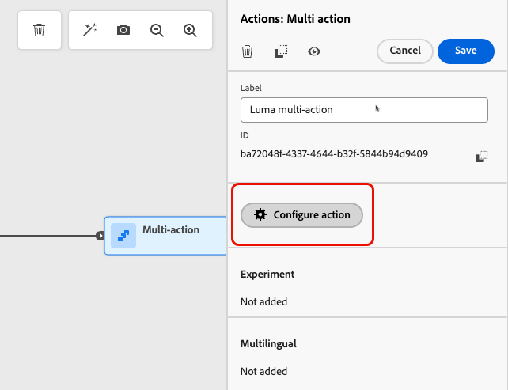

# 액션 활동 사용 {#add-a-message-in-a-journey}

>[!CONTEXTUALHELP]
>id="ajo_action_activity"
>title="액션 활동"
>abstract="일반 **액션** 활동을 사용하면 단일 네이티브 채널 액션과 여러 인바운드 활동을 구성하고 모든 기본 제공 채널 액션에 최적화를 추가할 수 있습니다."

>[!AVAILABILITY]
>
>이 기능은 제한적으로 이용할 수 있습니다. 액세스 권한을 얻으려면 Adobe 담당자에게 문의하십시오.

[!DNL Journey Optimizer]에는 단일 기본 제공 채널 작업과 여러 인바운드 활동을 구성할 수 있는 새로운 일반 **Action** 활동이 함께 제공됩니다.

이를 통해 다음과 같은 작업을 수행할 수 있습니다.

* 여정 캔버스 내 기본 액션 구성 간소화.
* 다중 액션 인바운드 액션 그룹을 만들 수 있는 용량.
* 모든 기본 제공 채널 액션에 최적화를 더하는 기능.

>[!NOTE]
>
>[!DNL Journey Optimizer]에서 메시지를 보낼 사용자 지정 작업을 설정할 수도 있습니다. [자세히 알아보기](#recommendation)

## 여정에 작업 추가  {#add-action}

여정에 기본 제공 채널 작업을 추가하려면 아래 단계를 수행합니다.

1. [이벤트](general-events.md) 또는 [대상자 읽기](read-audience.md) 활동으로 여정을 시작하십시오.

1. 팔레트의 **[!UICONTROL 작업]** 섹션에서 **[!UICONTROL 작업]** 활동을 캔버스로 끌어서 놓습니다.

1. 여정에서 활용할 기본 제공 채널 활동을 선택합니다.

   채널 동작 및 사용자 지정 동작 옵션을 표시하는 

1. 작업에 레이블을 추가하고 **[!UICONTROL 작업 구성]**&#x200B;을(를) 선택합니다.

   레이블 및 설명 필드가 있는 {width="80%"}

1. 여정 작업 구성 화면의 **[!UICONTROL 작업]** 탭으로 이동합니다.

   선택한 채널에 사용할 구성을 선택합니다.

   사용자 지정 및 Adobe 작업을 표시하는 관리 메뉴의 

1. 인바운드 채널을 선택한 경우 여러 작업을 추가할 수 있습니다. [자세히 알아보기](#multi-action)

1. 선택한 채널에 따라 활동을 구성합니다. [이 섹션](journeys-message.md)에서 기본 제공 채널 작업을 구성하는 방법을 알아봅니다.

1. **[!UICONTROL 최적화]** 섹션을 사용하여 콘텐츠 실험을 실행하거나, 타깃팅 규칙을 활용하거나, 실험과 타깃팅을 모두 사용하는 고급 조합을 사용할 수 있습니다.

   이러한 다양한 옵션과 따라야 할 단계는 [이 섹션](../content-management/gs-message-optimization.md)에 자세히 설명되어 있습니다.

1. **[!UICONTROL 언어]** 섹션을 사용하여 여정 작업에서 여러 언어로 콘텐츠를 만듭니다. 이렇게 하려면 **[!UICONTROL 언어 추가]** 단추를 클릭하고 원하는 **[!UICONTROL 언어 설정]**&#x200B;을 선택합니다.

   다국어 기능을 설정하고 사용하는 방법에 대한 자세한 내용은 [이 섹션](../content-management/multilingual-gs.md)을 참조하세요.

선택한 통신 채널에 따라 추가 설정을 사용할 수 있습니다. 자세한 내용을 보려면 아래 섹션을 확장하십시오.

+++**최대 가용량 규칙 적용**(전자 메일, 푸시, SMS)

**[!UICONTROL 비즈니스 규칙]** 드롭다운 목록에서 최대 가용량 규칙을 여정 작업에 적용할 규칙 집합을 선택하십시오.

채널 규칙 세트를 활용하면 통신 유형별로 빈도 상한을 설정하여 유사한 메시지가 있는 고객을 오버로드할 수 있습니다.

[규칙 집합 작업 방법 알아보기](../conflict-prioritization/rule-sets.md)

+++

+++**참여 추적**(전자 메일, SMS).

**[!UICONTROL 작업 추적]** 섹션을 사용하여 수신자가 이메일 또는 SMS 게재에 어떻게 반응하는지를 추적하세요.

여정이 실행되면 여정 보고서에서 추적 결과에 액세스할 수 있습니다.

[여정 보고서에 대해 자세히 알아보기](../reports/journey-global-report-cja.md)

+++

+++**빠른 전송 모드를 사용**(푸시)합니다.

빠른 전송 모드는 캠페인을 통해 대량으로 매우 빠른 푸시 메시지를 전송할 수 있는 [!DNL Journey Optimizer] 추가 기능입니다.

빠른 게재는 메시지 게재 지연이 비즈니스에 중요한 경우, 휴대폰에 긴급 푸시 알림(예: 뉴스 채널 앱을 설치한 사용자에게 속보)을 전송하려는 경우 사용됩니다.

푸시 알림에 대해 빠른 전송 모드를 사용하는 방법을 알아봅니다. [ 이 페이지](../push/create-push.md#rapid-delivery).

빠른 전송 모드를 사용할 때의 성능에 대한 자세한 내용은 [Adobe Journey Optimizer 제품 설명](https://helpx.adobe.com/kr/legal/product-descriptions/adobe-journey-optimizer.html){target="_blank"}을 참조하십시오.

+++

+++**우선 순위 점수 할당**(웹, 인앱, 코드 기반)

**[!UICONTROL 충돌 관리]** 섹션에서 여정 작업에 우선 순위 점수를 할당할 수 있으므로 동일한 채널 구성을 사용하는 여러 여정 작업 또는 캠페인이 있는 경우 인바운드 작업의 우선 순위를 지정할 수 있습니다.

기본적으로 액션의 우선순위 점수는 여정의 전반적인 우선순위 점수에서 상속됩니다.

[채널 작업에 우선 순위 점수를 할당하는 방법을 알아봅니다](../conflict-prioritization/priority-scores.md#priority-action)

+++

+++**추가 게재 규칙 설정**(콘텐츠 카드)

컨텐츠 카드 여정의 경우 추가 게재 규칙을 활성화하여 메시지를 트리거하는 이벤트 및 기준을 선택할 수 있습니다.

[콘텐츠 카드를 만드는 방법 알아보기](../content-card/create-content-card.md)

+++

+++**트리거 정의**(인앱)

인앱 메시지의 경우 **[!UICONTROL 트리거 편집]** 단추를 사용하여 메시지를 트리거하는 이벤트 및 기준을 선택할 수 있습니다.

[인앱 메시지를 만드는 방법 알아보기](../in-app/create-in-app.md)

+++

## 여러 인바운드 액션 추가 {#multi-action}

>[!CONTEXTUALHELP]
>id="ajo_multi_action_journey"
>title="여러 인바운드 액션 추가"
>abstract="단일 여정 내에서 여러 인바운드 액션을 선택할 수 있습니다. 이 기능을 사용하면 여러 코드 기반 경험, 인앱 메시지, 콘텐츠 카드 또는 웹 액션을 동시에 여러 위치에 게재할 수 있으며, 각 액션에는 특정 콘텐츠가 포함됩니다."

여정 오케스트레이션을 단순화하기 위해 단일 여정 작업 내에 여러 인바운드 작업을 정의할 수 있습니다.

>[!NOTE]
>
>이 용량은 인바운드 채널에만 사용할 수 있습니다. 현재 이메일 등의 아웃바운드 채널은 지원되지 않습니다.

이 용량을 사용하면 여러 여정 작업을 만들 필요 없이 다양한 코드 기반 경험, 인앱 메시지, 콘텐츠 카드 또는 웹 작업을 동시에 다른 위치에 전달할 수 있습니다. 모든 데이터를 하나의 여정으로 통합하여 여정을 보다 쉽게 배포할 수 있고 보고를 보다 원활하게 수행할 수 있습니다.

예를 들어 콘텐츠가 약간 다른 여러 끝점에 코드 기반 경험을 보낼 수 있습니다. 이렇게 하려면 동일한 여정 작업 내에 각각 다른 끝점 구성을 갖는 여러 코드 기반 작업을 만듭니다.

단일 여정 작업 노드에서 여러 인바운드 작업을 정의하려면 아래 단계를 수행합니다.

1. [이벤트](general-events.md) 또는 [대상자 읽기](read-audience.md) 활동으로 여정을 시작하십시오.

1. 팔레트의 **[!UICONTROL 작업]** 섹션에서 **[!UICONTROL 작업]** 활동을 캔버스로 끌어서 놓습니다.

1. **[!UICONTROL 여러 작업]**&#x200B;을(를) 작업 유형으로 선택합니다.

   

1. 필요한 경우 레이블을 추가하고 **[!UICONTROL 작업 구성]**&#x200B;을(를) 선택합니다.

   레이블 및 설명 필드가 있는 {width="60%"}

1. 여정 작업 구성 화면의 **[!UICONTROL 작업]** 탭으로 이동합니다.

   실행할 작업 목록을 표시하는 {width="70%"}

1. **작업** 섹션에서 인바운드 작업(**코드 기반 경험**, **인앱 메시지**, **콘텐츠 카드** 또는 **[!UICONTROL 웹]**)을 선택하십시오.

1. 채널 구성을 선택하고 해당 작업에 대한 특정 콘텐츠를 정의합니다.

1. **[!UICONTROL 작업 추가]** 단추를 사용하여 드롭다운 목록에서 다른 인바운드 작업을 선택합니다.

   {width="80%"}

1. 작업을 추가하려면 유사하게 진행합니다. 여정 작업 그룹에 최대 10개의 인바운드 작업을 추가할 수 있습니다.

여정이 [live](publish-journey.md)이면 모든 작업이 동시에 활성화됩니다.
<!--
## Next steps {#next}

Once your action is configured, you can design its content. [Learn more]-->
