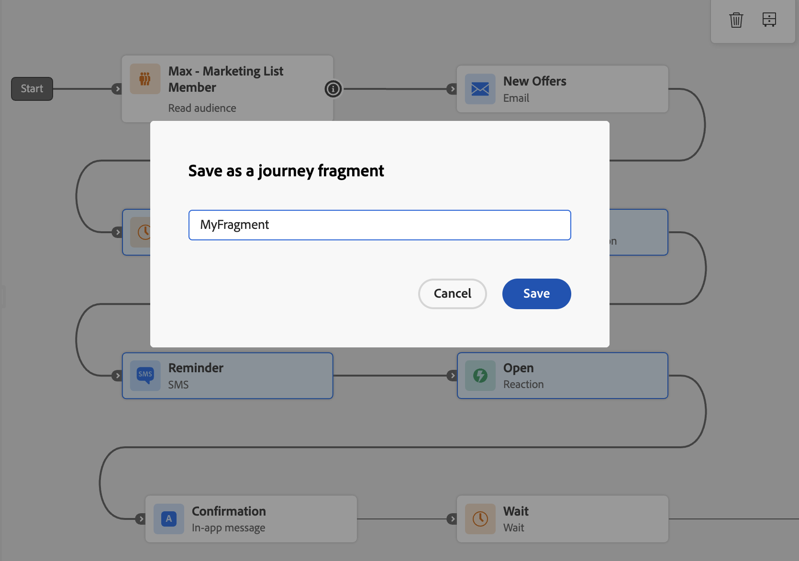

# 여정 조각 {#journey-fragments}

>[!AVAILABILITY]
>이 기능은 현재 제한된 가용성입니다. 액세스 권한을 요청하려면 Adobe 담당자에게 문의하십시오.

여정 조각 은 한 번 빌드하고 샌드박스 전체의 여정에 드롭할 수 있는 재사용 가능한 여정 노드 세트입니다. 자격 확인, 기본 채널 라우팅 논리 또는 환영 시퀀스 중 어느 것이든 조각은 팀이 더 빨리 이동하고 일관성을 유지하는 데 도움이 됩니다. 매번 처음부터 동일한 논리를 다시 작성하지 않아도 됩니다. [사용 사례 예제를 참조하십시오.](#examples)

조각이 만들어지면 전용 **[!UICONTROL 조각 인벤토리]**&#x200B;에 저장되고 **[!UICONTROL 여정 조각]** 활동을 사용하여 모든 여정에 삽입할 수 있습니다.

>[!NOTE]
>여정 조각에서 **복사 동작**&#x200B;을 사용합니다. 여정에 조각을 삽입하면 원본 노드의 정적 복사본이 만들어집니다. 원래 조각에 대한 모든 업데이트는 이미 사용한 여정에 반영되지 않습니다.

## 권한 {#journey-fragments-permissions}

여정 조각으로 작업하려면 다음 [권한](../administration/permissions.md)이 필요합니다.

* **여정 관리** — 조각을 만들고 편집하고 삭제하는 데 필요합니다.
* **여정 게시** — 조각을 활성화하는 데 필요합니다.

## 조각 인벤토리 액세스 {#journey-fragments-inventory}

여정 조각은 **[!UICONTROL 여정]** 섹션에서 액세스할 수 있습니다. 샌드박스에서 사용 가능한 모든 조각을 찾아보려면 **[!UICONTROL 조각]** 탭을 여십시오.

조각 이름, 상태, 생성 날짜, 작성자, 마지막 수정 날짜 또는 태그로 목록을 필터링할 수 있습니다.

## 여정 조각 만들기 {#create-journey-fragment}

>[!CONTEXTUALHELP]
>id="ajo_journey_fragment_create_canvas"
>title="여정 조각으로 저장"
>abstract="조각의 고유 이름을 입력하고 저장을 클릭합니다. 선택한 노드는 조각 인벤토리에서 사용할 수 있는 재사용 가능한 조각으로 저장됩니다."

여정 캔버스(권장)에서 직접 만들거나 조각 인벤토리에서 만드는 두 가지 방법으로 여정 조각을 만들 수 있습니다.

>[!BEGINTABS]

>[!TAB 여정 캔버스에서]

여정 노드를 여정 캔버스에서 직접 조각으로 저장하려면 다음을 수행합니다.

1. 여정을 열고 캔버스에서 하나 이상의 연결된 노드를 선택합니다.
1. 도구 모음에서 **[!UICONTROL 조각으로 저장]** 아이콘을 클릭합니다.

   

1. 샌드박스 내에서 조각의 고유 이름을 입력합니다.

   

1. **[!UICONTROL 저장]**&#x200B;을 클릭합니다. 조각은 초안으로 저장됩니다.

>[!TIP]
>
>여정에서 조각을 만드는 경우 [여정을 테스트하거나 시뮬레이션](testing-the-journey.md) **이전**&#x200B;하여 선택한 노드가 예상대로 작동하도록 조각을 저장합니다.

>[!TAB 조각 인벤토리에서]

인벤토리에서 직접 조각을 생성하려면 다음을 수행합니다.

1. **[!UICONTROL 여정]** > **[!UICONTROL 조각]** 탭으로 이동합니다.
1. **[!UICONTROL 조각 만들기]**&#x200B;를 클릭합니다.
1. 조각 작성 캔버스에서 여정 활동을 추가하고 구성합니다.
1. 완료되면 **[!UICONTROL 저장]**&#x200B;을 클릭하여 조각을 초안으로 저장합니다.

>[!CAUTION]
>
>조각 편집기에서 테스트 모드 및 시뮬레이션을 사용할 수 없습니다. 즉, 조각이 활성화되고 여정에 삽입되기 전에 구성된 활동의 동작을 확인할 수 없습니다. 논리 정확도가 중요한 조각의 경우 먼저 [전체 여정에서 노드를 빌드하고 테스트하거나 시뮬레이션](testing-the-journey.md)한 다음 위의 캔버스 탭에서 조각으로 저장하는 것이 좋습니다.

>[!ENDTABS]

## 조각 편집 {#edit-journey-fragment}

>[!CONTEXTUALHELP]
>id="ajo_journey_fragment_properties"
>title="여정 조각 속성"
>abstract="인벤토리에서 조각을 열어 노드, 속성, 태그 또는 레이블을 수정합니다. 활성 조각을 편집하려면 먼저 비활성화해야 합니다."

조각을 편집하려면 해당 이름을 클릭하여 **[!UICONTROL 조각 인벤토리]**&#x200B;에서 여십시오. 조각 작성 UI에서 다음을 수행할 수 있습니다.

* 활동을 추가, 제거 또는 수정합니다.
* 조각 속성(이름, 태그 및 레이블)을 설정하거나 업데이트합니다.

>[!NOTE]
>
>* **[!UICONTROL 초안]** 조각만 편집할 수 있습니다. **[!UICONTROL Active]** 조각을 수정하려면 먼저 해당 조각을 비활성화하십시오.
>
>* 조각 편집기에서 테스트 모드 및 시뮬레이션을 사용할 수 없습니다. 노드를 조각으로 저장하기 전에 전체 여정에서 여정 수준 논리를 테스트하거나 시뮬레이트합니다.
>
>* 조각 내에서는 [이동](jump.md) 활동을 사용할 수 없습니다.

## 조각 관리 {#manage-journey-fragments}

### 조각 상태 {#fragment-statuses}

여정 조각은 다음 상태의 라이프사이클을 따릅니다.

| 상태 | 설명 |
|---|---|
| **[!UICONTROL 초안]** | 조각을 작성 중이며 아직 여정에서 사용할 수 없습니다. |
| **[!UICONTROL 활성]** | 조각을 여정에서 사용할 준비가 되었습니다. |
| **[!UICONTROL 보관됨]** | 조각이 보관되어 더 이상 여정에서 사용할 수 없습니다. |

조각 상태 전환에는 다음 규칙이 적용됩니다.

* **[!UICONTROL 초안]** 조각만 활성화할 수 있습니다. 초안 조각을 열고 **[!UICONTROL 활성화]** 아이콘을 사용하십시오.
* **[!UICONTROL 활성]** 조각만 비활성화하거나 보관할 수 있습니다.
* **[!UICONTROL 보관된]** 조각만 보관 해제할 수 있습니다. 조각을 보관 해제하면 **[!UICONTROL 초안]** 상태로 돌아갑니다.
* **[!UICONTROL 초안]** 조각만 삭제할 수 있습니다.

>[!NOTE]
>조각을 활성화할 때 여정 게시 중에 실행되는 동일한 유효성 검사 대부분이 적용됩니다. 그러나 여정 시 **컨텍스트 특성이 확인되지 않습니다** 및 **거버넌스 정책이 적용되지 않습니다**. 둘 다 조각이 삽입되어 활성화될 때 평가됩니다.

### 조각 작업 {#fragment-actions}

조각 인벤토리에서 조각에 대해 다음 작업을 수행할 수 있습니다.

* **[!UICONTROL 열기]**: 해당 이름을 클릭하여 조각을 편집합니다.
* **[!UICONTROL 복제]**: **[!UICONTROL 추가 작업]**&#x200B;에서 조각의 복사본을 만듭니다(...) 아이콘.
* **[!UICONTROL 보관]**: **[!UICONTROL 추가 작업]**(...)에서 조각 보관(**[!UICONTROL Active]** 조각에만 사용 가능) 아이콘. 보관된 조각은 조각 선택기에서 더 이상 사용할 수 없습니다.
* **[!UICONTROL 보관 해제]**: **[!UICONTROL 추가 작업]**&#x200B;에서 보관된 조각(**[!UICONTROL 보관된]** 조각에만 사용 가능)을 복원합니다(...). 아이콘. 조각이 **[!UICONTROL 초안]** 상태로 돌아갑니다.
* **[!UICONTROL 삭제]**: **[!UICONTROL 추가 작업]**(...)에서 조각(**[!UICONTROL 초안]** 조각에만 사용 가능)을 영구적으로 삭제합니다. 아이콘.
* **[!UICONTROL 태그 편집]**: **[!UICONTROL 추가 작업]**&#x200B;에서 조각의 태그를 추가하거나 제거합니다(...). 아이콘.

## 여정에서 조각 사용 {#use-journey-fragment}

>[!CONTEXTUALHELP]
>id="ajo_journey_fragment_add"
>title="여정 조각 추가"
>abstract="선택기에서 **[!UICONTROL 활성]** 조각만 사용할 수 있습니다. 조각을 삽입하면 해당 노드의 **정적 복사본**&#x200B;이 만들어집니다. 원본 조각에 대한 업데이트는 여정에 반영되지 않습니다."

여정에 조각을 삽입하려면 다음 작업을 수행하십시오.

1. 여정을 열고 왼쪽 레일에서 **[!UICONTROL 여정 조각]** 활동을 드래그합니다.
1. 기존 분기 또는 빈 캔버스에 드롭합니다. 조각 선택기가 나타납니다.
1. 사용할 조각을 찾아보거나 검색합니다. 조각을 삽입하기 전에 미리 보거나 다른 탭에서 열 수 있습니다.
1. 조각을 선택합니다. 해당 노드는 드롭 지점에서 캔버스에 복사됩니다.

>[!NOTE]
>선택기에서 **[!UICONTROL 활성]** 조각만 사용할 수 있습니다. 조각을 삽입하면 해당 노드의 **정적 사본**&#x200B;이 만들어집니다. 원본 조각에 대한 이후의 모든 업데이트는 여정에 반영되지 않습니다.
>
>빈 캔버스에 조각을 놓을 때 조각은 **[!UICONTROL 대상자 읽기]**, **[!UICONTROL 대상자 자격]** 또는 **[!UICONTROL 이벤트]** 노드로 시작해야 합니다(여정을 시작할 때와 동일한 규칙).

## 가드레일 및 제한 사항 {#guardrails}

여정 조각에는 다음과 같은 보호 기능이 적용됩니다.

**조각 만들기**

* 조각 이름은 **샌드박스당 고유**&#x200B;이어야 합니다.
* 조각에는 **하나의 시작 경로**&#x200B;만 있을 수 있습니다. 둘 이상의 진입점이 있는 선택 항목은 조각으로 저장할 수 없습니다.
* **연결된 노드**&#x200B;만 조각으로 함께 저장할 수 있습니다.
* 조각 **에는 [Jump](jump.md) 활동**&#x200B;을 포함할 수 없습니다.
* 조각은 **최대 20개 노드**&#x200B;를 포함할 수 있습니다.
* 샌드박스에는 **최대 200개의 활성 조각**&#x200B;이 있을 수 있습니다.

**조각 사용**

* **[!UICONTROL Active]** 조각만 여정에 삽입할 수 있습니다.
* 조각을 삽입하면 해당 노드의 **정적 복사본**&#x200B;이 만들어집니다. 원래 조각에 대한 업데이트는 해당 조각이 사용된 여정에 전파되지 않습니다.
* 기존 분기 또는 빈 캔버스에 조각을 놓을 수 있습니다. 빈 캔버스에 놓을 때 조각은 **[!UICONTROL 대상자 읽기]**, **[!UICONTROL 대상자 자격]** 또는 **[!UICONTROL 이벤트]** 노드로 시작해야 합니다.

**일반**

* 조각은 **[!UICONTROL 여정 조각]** 범주 아래의 [통합 검색](../start/search-filter-categorize.md) 막대를 사용하여 찾을 수 있습니다.
* [태그](tags.md) 및 **레이블**&#x200B;은(는) 조각에서 지원됩니다.
* [감사 로그](../privacy/audit-logs.md)가 지원됩니다.
* 이전 스택에서 실행 중인 여정(인라인 캠페인 사용)는 여정 조각을 지원하지 않습니다. 이 기능을 사용하기 전에 이러한 여정을 복제하여 새 스택으로 이동합니다.

## 사용 사례 예 {#examples}

다음 예제는 여정 조각으로 저장 및 재사용할 수 있는 일반적인 여정 패턴을 보여 줍니다.

**자격 확인**

[대상자 읽기](read-audience.md) 노드 및 자격 필터와 같은 표준 시작 패턴은 조각으로 캡슐화할 수 있습니다. 따라서 팀은 설정 시간을 줄이면서 프로필이 여정에 진입하는 방식에서 일관성을 유지할 수 있습니다. 조각은 [최적화](optimize.md) 활동만 될 수도 있고 대상 읽기 및 최적화 활동을 함께 할 수도 있습니다.

**기본 채널**

조각은 프로필의 기본 통신 채널(이메일, 푸시 또는 SMS)을 평가하고 그에 따라 프로필을 라우팅할 수 있습니다. 이 논리는 아웃바운드 메시징과 관련된 모든 여정에서 재사용할 수 있으므로 일관된 채널 환경 설정을 관리할 수 있습니다. 조각에는 [최적화](optimize.md) 활동 및 세 개의 채널 분기가 모두 포함될 수 있습니다.

**시작 시퀀스 온보딩**

제품이나 서비스를 도입하는 일련의 세 개의 메시지와 같이 시간이 지정된 시작 시퀀스를 조각으로 저장할 수 있습니다. 이 기능은 다양한 대상 세그먼트 또는 제품 라인에서 새 사용자를 온보딩하는 데 유용합니다. 조각에는 [대기](wait-activity.md) 활동 및 메시지 노드가 포함될 수 있습니다.

**반응 기반 대기 및 알림 메시지**

조각은 이메일 활동 뒤에 [반응](reaction-events.md)을 캡슐화하고 프로필이 설정된 일수 내에 이메일을 열 때까지 기다렸다가 열지 않은 경우 미리 알림을 전송할 수 있습니다. 이 논리는 일반적으로 여정 및 체험판 전환 흐름 양성에서 재사용됩니다. 조각에는 이메일 및 반응 활동이 포함될 수 있습니다.

