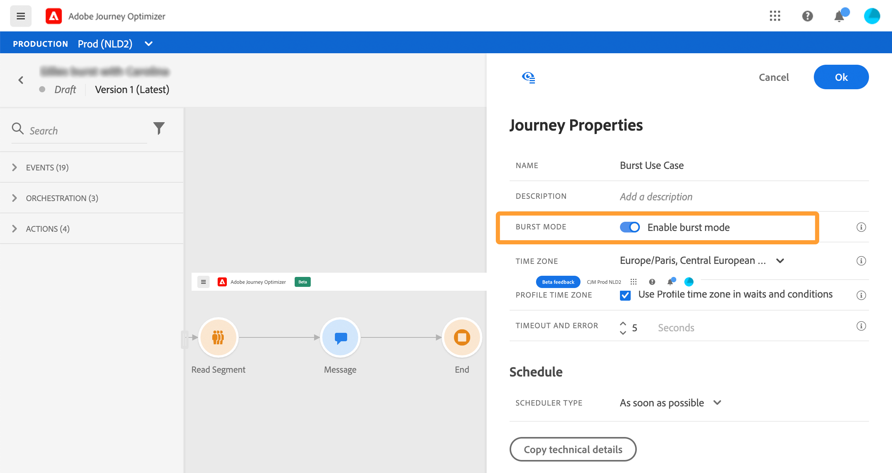

# 여정 시작{#jo-quick-start}

## 사전 요구 사항

여정과 함께 메시지를 전송하려면 다음 구성이 필요합니다.

1. **이벤트 구성**:여정이 수신될 때까지 트리거하려면 이벤트를 구성해야 합니다. 필요한 정보와 정보를 처리하는 방법을 정의합니다. **기술 사용자**&#x200B;가 이 단계를 수행해야 합니다. [자세히 보기](../event/about-events.md).

   

1. **세그먼트 만들기**:여정이 Adobe Experience Platform 세그먼트를 수신하여 메시지를 지정된 프로필 세트에 일괄 전송할 수도 있습니다. 이를 위해 세그먼트를 만들어야 합니다. [자세히 보기](../segment/about-segments.md).

   

1. **데이터 소스를 구성합니다**.여정에 사용할 조건 등의 추가 정보를 검색하는 시스템에 대한 연결을 정의할 수 있습니다. 기본 제공 Adobe Experience Platform 데이터 소스도 프로비저닝 시에 구성됩니다. 여정 내 이벤트의 데이터만 활용하는 경우에는 이 단계를 수행할 필요가 없습니다. **기술 사용자**&#x200B;가 이 단계를 수행해야 합니다. [자세히 보기](../datasource/about-data-sources.md)

   

1. **작업 구성**:Journey Optimizer 메시지 기능이 내장되어 있으므로 컨텐츠를 디자인하고 메시지를 게시하기만 하면 됩니다. [이 섹션](../get-started-content.md)을 참조하십시오. 서드파티 시스템을 사용하여 메시지를 전송하는 경우 사용자 지정 작업을 만들 수 있습니다. 자세한 내용은 이 [섹션](../action/action.md)을 참조하십시오. **기술 사용자**&#x200B;가 이 단계를 수행해야 합니다.

   

## 여정 구축{#jo-build}

이 단계는 **비즈니스 사용자**&#x200B;에 의해 수행됩니다. 여기에서 여정을 만듭니다. 다양한 이벤트, 오케스트레이션 및 작업 활동을 조합하여 여러 단계로 구성된 크로스 채널 시나리오를 작성할 수 있습니다.

여정을 통해 메시지를 보내는 주요 단계는 다음과 같습니다.

1. 여정 관리 메뉴 섹션에서 **[!UICONTROL Journeys]** 을 클릭합니다. 여정 목록이 표시됩니다.

   

1. **[!UICONTROL Create Journey]** 을 클릭하여 새 여정을 만듭니다.

1. 오른쪽에 표시되는 구성 창에서 여정의 속성을 편집합니다. 자세한 내용은 이 [섹션](journey-gs.md#change-properties)을 참조하십시오.

   

1. 먼저 팔레트에서 이벤트 또는 **세그먼트 읽기** 활동을 캔버스로 끌어다 놓습니다. 여정 디자인에 대한 자세한 내용은 [이 섹션](using-the-journey-designer.md)을 참조하십시오.

   

1. 개인이 수행할 다음 단계를 끌어서 놓습니다. 예를 들어 조건 뒤에 메시지를 추가할 수 있습니다. 활동에 대한 자세한 내용은 [이 섹션](using-the-journey-designer.md)을 참조하십시오.

1. 테스트 프로필을 사용하여 여정을 테스트합니다. 자세한 내용은 이 [섹션](testing-the-journey.md)을 참조하십시오

1. 여정을 게시하여 활성화합니다. 자세한 내용은 이 [섹션](publishing-the-journey.md)을 참조하십시오.

   

1. 전용 보고 도구를 사용하여 여정을 모니터링하여 여정의 효과를 측정합니다. 자세한 내용은 이 [섹션](../reports/live-report.md)을 참조하십시오.

   

## 속성 변경 {#change-properties}

오른쪽 상단에 있는 연필 아이콘을 클릭하여 여정 속성에 액세스합니다.

관리자는 여정 이름을 변경하고, 설명을 추가하고, 다시 시작하고, 시작 날짜와 종료 날짜를 선택하고, **[!UICONTROL Timeout and error]** 기간을 정의할 수 있습니다.

라이브 여정의 경우 이 화면에는 여정을 게시한 사용자의 게시 날짜와 이름이 표시됩니다.

**기술 정보 복사**&#x200B;를 사용하면 지원 팀이 문제를 해결하는 데 사용할 수 있는 여정에 대한 기술 정보를 복사할 수 있습니다. 다음 정보가 복사됩니다.JourneyVersion UID, OrgID, orgName, sandboxName, lastDeployedBy, lastDeployedAt.

### 입구{#entrance}

기본적으로 새 여정은 다시 입력할 수 있습니다. &quot;일회성&quot; 여정에 대한 옵션의 선택을 취소할 수 있습니다. 예를 들어, 사용자가 상점에 들어올 때 일회성 선물을 제공하려는 경우입니다. 이러한 경우 고객이 여정을 다시 입력하고 오퍼를 다시 받을 수 없도록 합니다.

여정 &quot;종료&quot;가 되면 상태는 **[!UICONTROL Closed]**&#x200B;입니다. 여정은 새 개인이 여정에 들어가는 것을 중지합니다. 여정에 이미 있는 사람은 여정을 정상적으로 완료합니다.

기본 글로벌 시간 초과 30일 이후에는 여정이 **Finished** 상태로 전환됩니다. 이 [섹션](../building-journeys/journey-gs.md#global_timeout)을 참조하십시오.

### 여정 활동의 시간 제한 및 오류 {#timeout_and_error}

작업 또는 조건 활동을 편집할 때 오류 또는 시간 제한 시 대체 경로를 정의할 수 있습니다. 타사 시스템을 심문하는 활동 처리 시간이 여정 속성(**[!UICONTROL Timeout and  error]** 필드)에 정의된 시간 초과 기간을 초과하는 경우 두 번째 경로가 선택되어 잠재적인 대체 작업을 수행합니다.

허용된 값은 1초에서 30초 사이입니다.

여정이 시간에 민감한 경우 매우 짧은 **[!UICONTROL Timeout and error]** 값을 정의하는 것이 좋습니다(예:몇 초 이상 작업을 지연할 수 없으므로 실시간 위치에 응답합니다. 여정에 시간이 덜 민감한 경우, 더 긴 값을 사용하여 유효한 응답을 보내기 위해 라는 시스템에 더 많은 시간을 줄 수 있습니다.

여정은 글로벌 시간 초과도 사용합니다. [다음 섹션](#global_timeout)을 참조하십시오.

### 글로벌 여정 시간 초과 {#global_timeout}

여정 활동에 사용되는 [시간 초과](#timeout_and_error) 외에도 인터페이스에 표시되지 않고 변경할 수 없는 글로벌 여정 시간 초과가 있습니다. 이 시간 제한은 여정이 입력한 후 30일 후에 개인 진행 상태를 중지합니다. 이는 개인의 여정이 30일 이상 지속될 수 없음을 의미합니다. 30일 시간 제한 기간 후 개인의 데이터가 삭제됩니다. 시간 제한 기간이 끝날 때 여전히 여정에 흐르는 개인은 중지되며 보고 오류로 고려됩니다.

>[!NOTE]
>
>여정은 개인 정보 보호 옵트아웃, 액세스 또는 삭제 요청에 직접 대응하지 않습니다. 그러나 글로벌 시간 제한은 개인이 여정에서 30일 이상 머무르지 않도록 합니다.

30일 여정 제한 시간 때문에 여정 재입력이 허용되지 않는 경우 30일 이상, 재입력 차단 기능이 있는지 확인할 수 없습니다. 실제로 입국한 지 30일이 지난 뒤 여정에 들어온 사람에 대한 모든 정보를 제거하므로 30일 이상 전에 입국한 사람을 알 수 없습니다.

### 표준 시간대 및 프로필 시간대 {#timezone}

시간대는 여정 수준에서 정의됩니다.

고정 시간대를 입력하거나 Adobe Experience Platform 프로필을 사용하여 여정 시간대를 정의할 수 있습니다.

시간대 관리에 대한 자세한 내용은 [이 페이지](../building-journeys/timezone-management.md)를 참조하십시오.

### 버스트 모드 {#burst}

버스트 모드는 대량 볼륨에서 매우 빠른 푸시 메시지를 전송할 수 있는 유료 추가 기능입니다. 읽기 세그먼트와 간단한 푸시 메시지를 포함하는 간단한 여정에 사용됩니다. 버스트는 휴대폰에 긴급 푸시 알림을 전송하려는 경우, 예를 들어 뉴스 채널 앱을 설치한 사용자에게 최신 뉴스를 전송하려는 경우 메시지 전달 지연이 비즈니스 크리티컬 상태일 때 사용됩니다.

제한 사항:

* 여정은 읽기 세그먼트로 시작해야 합니다. 이벤트는 허용되지 않습니다.
* 다음 단계는 푸시 메시지여야 합니다. 다른 활동 또는 단계가 허용되지 않습니다(선택적 종료 활동 제외).
   * 푸시 채널만
   * 메시지에 개인화가 허용되지 않습니다
   * 메시지는 작아야 합니다(&lt;2KB).

중요 참고:

요구 사항 중 하나라도 충족하지 않는 경우 여정에서 버스트 모드를 사용할 수 없습니다.

버스트 모드를 활성화하려면 여정을 열고 오른쪽 상단의 연필 아이콘을 클릭하여 여정 속성에 액세스합니다. 그런 다음 **버스트 모드 활성화** 전환을 활성화합니다.

버스트 여정을 수정하고 버스트와 호환되지 않는 활동(메시지, 다른 작업, 이벤트 등)을 추가하는 경우 버스트 모드는 비활성화됩니다. 메시지가 표시됩니다.

그런 다음 여정을 정상적으로 테스트하고 게시합니다. 테스트 모드 메시지는 버스트 모드를 통해 전송되지 않습니다.

## 여정 종료

여정은 다음 두 가지 이유로 인해 개인에 대해 종료될 수 있습니다.

* 사람이 경로의 마지막 활동에 도달합니다. 마지막 활동은 종료 활동이나 다른 활동일 수 있습니다. 종료 활동으로 경로를 종료해야 하는 의무는 없습니다. [이 페이지](../building-journeys/end-activity.md)를 참조하십시오.
* 해당 사람이 조건 활동(또는 조건이 있는 대기 활동)에 도착하고 해당 조건과 일치하지 않습니다.

그런 다음 본인이 다시 입장할 수 있는 경우 여정을 다시 입력할 수 있습니다. [이 페이지](../building-journeys/journey-gs.md#change-properties)를 참조하십시오

다음 이유로 인해 여정을 닫을 수 있습니다.

* 여정은 **[!UICONTROL Close to new entrances]** 버튼을 통해 수동으로 닫힙니다.
* 실행이 완료된 원샷 세그먼트 기반 여정.
* 반복 세그먼트 기반 여정이 마지막으로 발생한 이후.

여정을 닫으면(위의 이유 중 하나) 상태가 **[!UICONTROL Closed]**&#x200B;입니다. 여정은 새 개인이 여정에 들어가는 것을 중지합니다. 여정에 이미 있는 사람은 여정을 정상적으로 완료합니다. 기본 글로벌 시간 초과 30일 이후에는 여정이 **Finished** 상태로 전환됩니다. 이 [섹션](../building-journeys/journey-gs.md#global_timeout)을 참조하십시오.

여정에 있는 모든 개인의 진행 상태를 중지해야 하는 경우 중지할 수 있습니다. 여정을 중지하면 여정의 모든 개인이 시간 초과됩니다.

다음은 여정을 수동으로 닫거나 중지하는 방법입니다.

**[!UICONTROL Stop]** 및 **[!UICONTROL Close to new entrances]** 옵션을 사용하면 **live** 여정을 종료할 수 있습니다. 여정을 닫으면 **여정에 신규 고객이 도착한 것이 차단되었으며, 여정에 이미 입력한 고객이 경험을 끝까지 경험할 수 있게 됩니다.** 고객에게 최상의 경험을 제공하므로 여정을 종료하려면 가장 권장되는 방법입니다. 여정 중지 에는 이미 여정에 입력한 사람이 모두 진행 중에 중지된다는 작업이 포함됩니다. 여정은 기본적으로 꺼져 있습니다.

>[!NOTE]
>
>닫힘 또는 정지된 여정은 다시 시작할 수 없습니다.

### 여정 닫기

여정을 수동으로 닫고 여정에 이미 입력한 고객이 경로를 완료할 수 있지만 새 사용자가 여정에 들어갈 수 없도록 할 수 있습니다.

닫히면 여정 상태가 **[!UICONTROL Closed]**&#x200B;입니다. 기본 글로벌 시간 초과 30일 이후에는 여정이 **Finished** 상태로 전환됩니다. 이 [섹션](../building-journeys/journey-gs.md#global_timeout)을 참조하십시오.

닫힌 여정 버전은 다시 시작하거나 삭제할 수 없습니다. 새 버전을 만들거나 복제할 수 있습니다. 완료된 여정만 삭제할 수 있습니다.

여정 목록에서 여정을 닫으려면 여정 이름의 오른쪽에 있는 **[!UICONTROL Ellipsis]** 버튼을 클릭하고 **[!UICONTROL Close to new entrances]** 을 선택합니다.

다음 작업도 수행할 수 있습니다.

1. **[!UICONTROL Journeys]** 목록에서 닫을 여정을 클릭합니다.
1. 오른쪽 상단에서 아래쪽 화살표를 클릭합니다.

   

1. **[!UICONTROL Close to new entrances]**&#x200B;을(를) 클릭합니다. 대화 상자가 나타납니다.
1. **[!UICONTROL Close to new entrances]** 을 클릭하여 확인합니다.

### 여정 중지

여정이 긴급하게 발생했을 때 여정을 중지할 수 있으며, 모든 처리를에서 즉시 종료해야 합니다.

중지된 여정 버전을 다시 시작할 수 없습니다.

중지되면 여정의 상태는 **[!UICONTROL Stopped]**&#x200B;입니다.

예를 들어, 마케터가 여정이 잘못된 대상을 타깃팅하거나 메시지를 전달해야 하는 사용자 지정 작업이 제대로 작동하지 않는다는 것을 알고 있으면 여정을 중지할 수 있습니다. 여정 목록에서 여정을 중지하려면 여정 이름의 오른쪽에 있는 **[!UICONTROL Ellipsis]** 단추를 클릭하고 **[!UICONTROL Stop]** 을 선택합니다.

다음 작업도 수행할 수 있습니다.

1. **[!UICONTROL Journeys]** 목록에서 중지할 여정을 클릭합니다.
1. 오른쪽 상단에서 아래쪽 화살표를 클릭합니다.

1. **[!UICONTROL Stop]**&#x200B;을(를) 클릭합니다. 대화 상자가 나타납니다.
1. **[!UICONTROL Stop]** 을 클릭하여 확인합니다.
