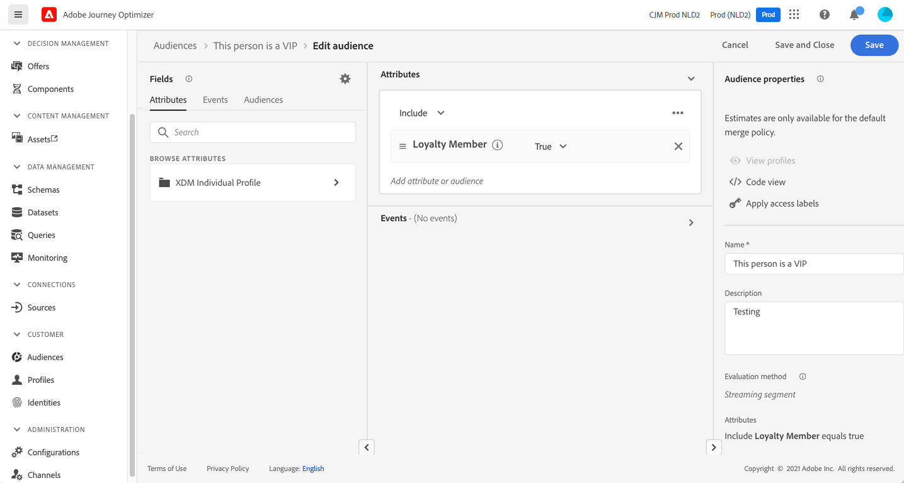
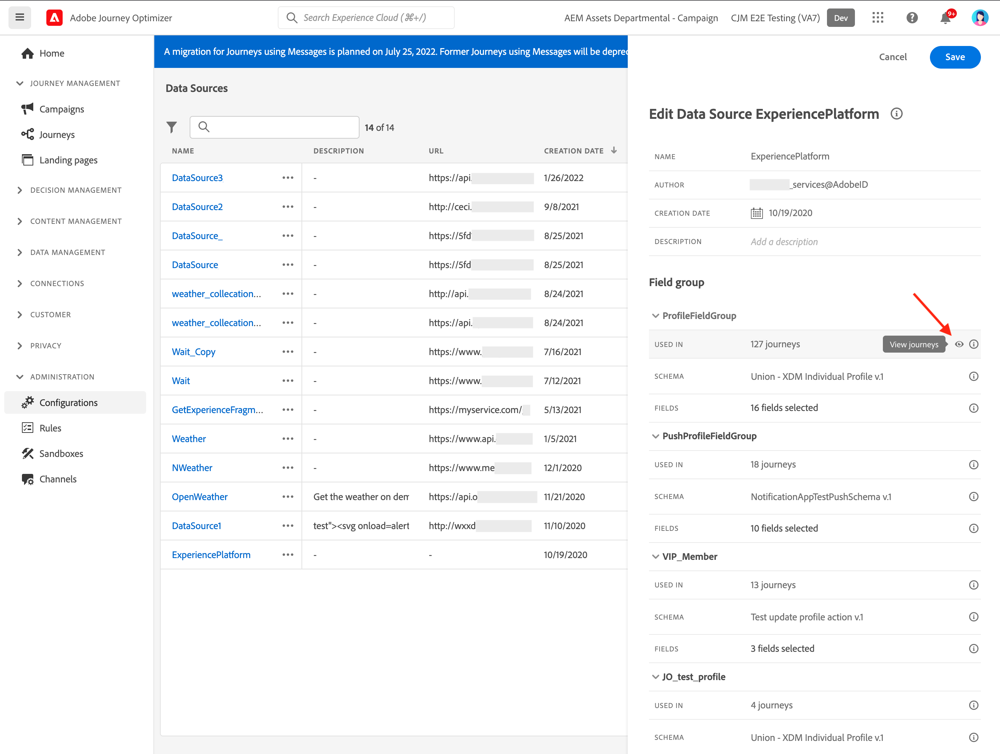

# 첫 여정 만들기{#jo-quick-start}

## 사전 요구 사항{#start-prerequisites}

여정이 있는 메시지를 보내려면 다음 구성이 필요합니다.

1. **이벤트 구성**: 이벤트가 수신될 때 여정을 통합적으로 트리거하려면 이벤트를 구성해야 합니다. 예상 정보와 처리 방법을 정의합니다. **기술 사용자**&#x200B;가 이 단계를 수행해야 합니다. [자세히 보기](../event/about-events.md).

   

1. **세그먼트 만들기**: 여정은 지정된 프로필 세트로 메시지를 일괄적으로 보내기 위해 Adobe Experience Platform 세그먼트를 수신할 수도 있습니다. 이를 위해 세그먼트를 만들어야 합니다. [자세히 보기](../segment/about-segments.md).

   

1. **데이터 소스 구성**: 시스템에 대한 연결을 정의하여 여정에 사용할 조건 등의 추가 정보를 검색할 수 있습니다. 기본 제공 Adobe Experience Platform 데이터 소스도 프로비저닝 시에 구성됩니다. 여정 내 이벤트의 데이터만 활용하는 경우에는 이 단계를 수행할 필요가 없습니다. **기술 사용자**&#x200B;가 이 단계를 수행해야 합니다. [자세히 보기](../datasource/about-data-sources.md)

   

1. **작업 구성**: 서드파티 시스템을 사용하여 메시지를 전송하는 경우 사용자 지정 작업을 만들 수 있습니다. 자세히 알아보기 [섹션](../action/action.md). **기술 사용자**&#x200B;가 이 단계를 수행해야 합니다. Journey Optimizer 기본 메시지 기능을 사용하는 경우 여정에 채널 작업을 추가하고 콘텐츠를 디자인하기만 하면 됩니다.

   

## 액세스 여정 {#journey-access}

여정 관리 메뉴 섹션에서 **[!UICONTROL 여정]**. 사용 가능한 두 가지 탭은 다음과 같습니다.

**개요**: 이 탭에는 여정과 관련된 주요 지표가 있는 대시보드가 표시됩니다.

* **처리된 프로필**: 지난 24시간 동안 처리된 총 프로필 수
* **라이브 여정**: 지난 24시간 동안 트래픽이 발생한 총 라이브 여정 수입니다. 라이브 여정은 다음과 같습니다 **단일 여정** (이벤트 기반) 및 **일괄 처리 여정** (세그먼트 읽기).
* **오류율**: 지난 24시간 동안 입력한 총 프로필 수와 비교한 오류가 있는 모든 프로필의 비율입니다.
* **삭제율**: 지난 24시간 동안 입력한 총 프로필 수와 비교하여 삭제된 모든 프로필의 비율입니다. 삭제된 프로필은 예를 들어 잘못된 네임스페이스 또는 재입력 규칙으로 인해 여정에 들어갈 자격이 없는 사람을 나타냅니다.

>[!NOTE]
>
>이 대시보드는 지난 24시간 동안 트래픽이 있는 여정을 고려합니다. 액세스 권한이 있는 여정만 표시됩니다.

**찾아보기**: 이 탭에는 기존 여정 목록이 표시됩니다. 여정을 검색하고 필터를 사용하며 각 요소에 대한 기본 작업을 수행할 수 있습니다. 예를 들어 항목을 복제하거나 삭제할 수 있습니다. 자세한 정보는 [이 섹션](../start/user-interface.md#filter-lists)을 참조하십시오.

여정 목록의 **[!UICONTROL 상태 및 버전 필터]**&#x200B;에서 상태, 유형 및 버전에 따라 여정을 필터링할 수 있습니다. 유형은 다음과 같습니다. **[!UICONTROL 단일 이벤트]**, **[!UICONTROL 세그먼트 선별]**, **[!UICONTROL 세그먼트 읽기]** 또는 **[!UICONTROL 비즈니스 이벤트]**.

**[!UICONTROL 활동 필터]** 및 **[!UICONTROL 데이터 필터]**&#x200B;에서 특정 이벤트, 필드 그룹 또는 작업을 사용하는 여정만 표시하도록 선택할 수 있습니다. 또한 **[!UICONTROL 게시 필터]** 발행 날짜 또는 사용자를 선택할 수 있습니다. 예를 들어 어제 게시된 라이브 경로의 최신 버전만 표시하도록 선택할 수 있습니다. [자세히 알아보기](../building-journeys/using-the-journey-designer.md).

**[!UICONTROL 마지막 업데이트]** 및 열별 **[!UICONTROL 마지막 업데이트]**&#x200B;를 사용하여 여정의 마지막 업데이트 및 저장한 사용자를 확인합니다.

이벤트, 데이터 소스 및 작업 구성 창에서 **[!UICONTROL 사용 위치]** 필드를 적용하면 특정 이벤트, 필드 그룹 또는 작업을 사용하는 경로 수가 표시됩니다. **[!UICONTROL 여정 보기]** 버튼을 클릭하여 해당 여정의 목록을 표시할 수 있습니다.

## 여정 빌드{#jo-build}

>[!CONTEXTUALHELP]
>id="ajo_journey_create"
>title="여정 빌드"
>abstract="이 화면에 기존 여정 목록이 표시됩니다. 여정을 열거나 “여정 만들기”를 클릭하고, 다양한 이벤트, 오케스트레이션 및 작업 활동을 결합하여 다단계 크로스 채널 시나리오를 작성합니다."

이 단계는 **비즈니스 사용자**. 여기에서 여정을 만들 수 있습니다. 다양한 이벤트, 오케스트레이션 및 작업 활동을 조합하여 여러 단계로 구성된 크로스 채널 시나리오를 작성할 수 있습니다.

여정을 통해 메시지를 보내는 주요 단계는 다음과 같습니다.

1. 다음에서 **찾아보기** 탭을 클릭하고 **[!UICONTROL 여정 만들기]** 새 여정 만들기

1. 오른쪽에 표시되는 구성 창에서 여정의 속성을 편집합니다. 자세히 알아보기 [섹션](journey-gs.md#change-properties).

   

1. 이벤트 또는 을(를) 끌어서 놓는 것으로 시작 **세그먼트 읽기** 팔레트에서 캔버스로의 활동. 여정 디자인에 대한 자세한 내용은 다음을 참조하십시오. [이 섹션](using-the-journey-designer.md).

   

1. 개인이 수행할 다음 단계를 드래그 앤 드롭합니다. 예를 들어 채널 작업 뒤에 조건을 추가할 수 있습니다. 활동에 대한 자세한 내용은 다음을 참조하십시오. [이 섹션](using-the-journey-designer.md).

1. 테스트 프로필을 사용하여 여정을 테스트합니다. 자세히 알아보기 [섹션](testing-the-journey.md)

1. 여정을 게시하여 활성화하십시오. 자세히 알아보기 [섹션](publishing-the-journey.md).

   

1. 전용 보고 도구를 사용하여 여정을 모니터링하여 여정의 효율성을 측정합니다. 자세히 알아보기 [섹션](../reports/live-report.md).

   

## 여정 속성 정의 {#change-properties}

>[!CONTEXTUALHELP]
>id="ajo_journey_properties"
>title="여정 속성"
>abstract="이 섹션은 여정 속성을 보여 줍니다. 기본적으로 읽기 전용 매개변수는 숨겨져 있습니다. 사용 가능한 설정은 여정 상태, 권한 및 제품 구성에 따라 다릅니다."

오른쪽 상단의 연필 아이콘을 클릭하여 여정 속성에 액세스합니다.

여정 이름을 변경하고, 설명을 추가하고, 재입력을 허용하고, 시작 및 종료 날짜를 선택하고, 관리자 권한으로 **[!UICONTROL 시간 제한 및 오류]** 기간. 여정에 Adobe Experience Platform 통합 태그를 할당할 수도 있습니다. 태그를 할당하면 캠페인을 간단히 분류하고 캠페인 목록에서 편하게 검색할 수 있습니다. [태그 작업 방법 알아보기](../start/search-filter-categorize.md#tags)

라이브 여정의 경우 이 화면에는 게시 날짜와 여정을 게시한 사용자의 이름이 표시됩니다.

다음 **기술 세부 정보 복사** 지원 팀이 문제를 해결하는 데 사용할 수 있는 여정에 대한 기술 정보를 복사할 수 있습니다. JourneyVersion UID, OrgID, orgName, sandboxName, lastDeployedBy, lastDeployedAt 정보가 복사됩니다.

### 입구{#entrance}

기본적으로 새 여정은 다시 입력할 수 있습니다. 다음을 선택 취소할 수 있습니다. **재등록 허용** 예를 들어 한 사람이 상점에 들어갈 때 일회성 선물을 제공하려는 경우 &quot;한 방&quot; 여정에 대한 옵션을 선택합니다.

다음의 경우 **재등록 허용** 옵션이 활성화되고 **재등록 대기 기간** 필드가 표시됩니다. 이 필드에서는 단일 여정(이벤트 또는 세그먼트 검증으로 시작)에서 프로필이 다시 여정에 들어오려면 기다려야 하는 시간을 정의할 수 있습니다. 이를 통해 동일한 이벤트에 대해 여정을 여러 번 트리거하는 오류를 방지할 수 있습니다. 이 필드는 기본적으로 5분으로 설정되어 있습니다.

에서 프로필 시작 관리에 대해 자세히 알아봅니다. [이 섹션](entry-management.md).

### 액세스 관리 {#access}

여정에 사용자 지정 또는 핵심 데이터 사용 레이블을 할당하려면 **[!UICONTROL 액세스 관리]** 단추를 클릭합니다. [OLA(Object Level Access Control)에 대해 자세히 알아보기](../administration/object-based-access.md)

### 시간대 및 프로필 시간대 {#timezone}

시간대는 여정 수준에서 정의됩니다.

고정 시간대를 입력하거나 Adobe Experience Platform 프로필을 사용하여 여정 시간대를 정의할 수 있습니다.

Adobe Experience Platform 프로필에 시간대가 정의된 경우 여정에서 검색할 수 있습니다.

시간대 관리에 대한 자세한 내용은 [이 페이지](../building-journeys/timezone-management.md).

### 시작 및 종료 날짜 {#dates}

다음을 정의할 수 있습니다. **시작일**. 지정하지 않은 경우 게시 시 자동으로 정의됩니다.

다음을 추가할 수도 있습니다. **종료일**. 이렇게 하면 해당 일자가 되었을 때 프로필이 자동으로 종료됩니다. 종료 날짜를 지정하지 않으면 기본 여정 시간 초과(일반적으로 30일, Healthcare Shield 추가 기능 제공 시 7일)까지 프로필을 유지할 수 있습니다. 유일한 예외는 다음과 같은 반복 읽기 세그먼트 여정입니다. **재발 시 강제 재진입** 활성화됨, 다음 발생의 시작 날짜에 종료.

### 여정 활동의 시간 제한 및 오류 {#timeout_and_error}

작업 또는 조건 활동을 편집할 때 오류나 시간 초과 시 대체 경로를 지정할 수 있는 옵션이 있습니다. 서드파티 시스템 쿼리와 관련된 활동 처리가 시간 제한 및 오류 처리를 위해 여정 속성에 지정된 기간을 초과하는 경우(**[!UICONTROL 시간 제한 및 오류]** 필수 필드인 경우 두 번째 경로를 선택하여 폴백 작업을 실행합니다.

승인된 값은 1초에서 30초 사이입니다.

매우 짧게 정의하는 것이 좋습니다. **[!UICONTROL 시간 제한 및 오류]** 몇 초 이상 동작을 지연시킬 수 없으므로 여정이 시간에 민감한 경우(예: 사람의 실시간 위치에 반응하는 경우) 값을 구합니다. 여정에서 시간에 덜 민감한 경우, 더 긴 값을 사용하여 유효한 응답을 보내기 위해 호출된 시스템에 더 많은 시간을 제공할 수 있습니다.

여정은 전역 시간 초과도 사용합니다. 다음을 참조하십시오. [다음 섹션](#global_timeout).

### 전역 여정 시간 제한 {#global_timeout}

이외에도 [timeout](#timeout_and_error) 또한 여정 활동에 사용되며, 인터페이스에 표시되지 않고 변경할 수 없는 글로벌 여정 시간 초과가 있습니다. 이 시간 제한은 여정에 들어온 후 30일 후에 개인 사용자의 진행을 중지합니다. 이는 개인의 여정이 30일을 초과할 수 없음을 의미합니다. 30일 제한 시간이 지나면 개인의 데이터가 삭제됩니다. 시간 제한 기간이 끝날 때 여정에 계속 유입되는 개인은 중지되며, 보고에서 오류로 처리됩니다.

>[!NOTE]
>
>여정은 개인 정보 옵트아웃, 액세스 또는 삭제 요청에 직접 반응하지 않습니다. 그러나 전역 시간 제한은 개인이 어떤 여정에서 30일 이상 머무르지 않도록 합니다.

30일 여정 시간 제한으로 인해 여정 재입력이 허용되지 않는 경우 재입력 차단이 30일 이상 작동하도록 할 수 없습니다. 실제로 여정에 입장한 후 30일이 지난 사람에 대한 정보를 모두 삭제하기 때문에 30일 이상 전에 입력한 사람을 알 수 없습니다.

